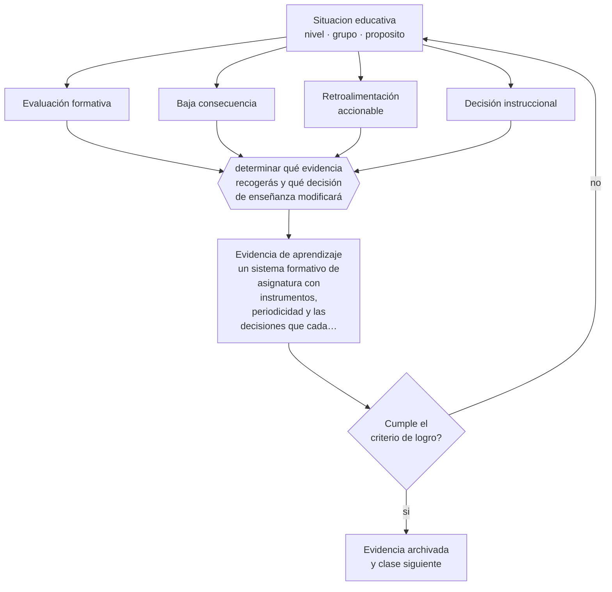

# Clase 134 — Evaluación formativa

> **Parte 11 · Evaluación y psicometría** — clase 2 de 12

**Estado de evidencia:** `ROBUSTA` · **Etapa:** 🟣 Etapa C — Núcleo profesional docente · **Población de referencia:** transversal, con foco en instrumentos y decisiones 
**Decisión que habilita:** determinar qué evidencia recogerás y qué decisión de enseñanza modificará 
**Evidencia de aprendizaje:** un sistema formativo de asignatura con instrumentos, periodicidad y las decisiones que cada resultado activa

## 🎯 Propósito

Dominar la evaluación formativa en su definición técnica: recogida de evidencia que efectivamente modifica la enseñanza o el aprendizaje, con instrumentos proporcionales y sin consecuencia calificatoria.

## 📚 Resultados de aprendizaje

Al finalizar esta clase podrás:

1. **Definir** con precisión los cuatro conceptos centrales de la clase y reconocerlos en una situación educativa real, no solo en su enunciado.
2. **Explicar** qué distingue técnicamente la evaluación formativa de una prueba corta con nota baja.
3. **Decidir** —qué evidencia recogerás y qué decisión de enseñanza modificará— y sostener la decisión con un fundamento escrito.
4. **Producir** la evidencia de la clase —un sistema formativo de asignatura con instrumentos, periodicidad y las decisiones que cada resultado activa— y contrastarla contra el criterio de logro.
5. **Distinguir** lo que la evidencia sostiene de lo que es práctica instalada, preferencia personal o costumbre de la institución.

## 🧩 Conceptos centrales

| Concepto | Comprensión verificable |
|---|---|
| **Evaluación formativa** | proceso en que la evidencia recogida se usa para adaptar la enseñanza o el aprendizaje |
| **Baja consecuencia** | condición de que el instrumento no afecte la calificación, para que revele el estado real |
| **Retroalimentación accionable** | información que el estudiante puede usar en un trabajo posterior |
| **Decisión instruccional** | cambio concreto en la enseñanza derivado de la evidencia |

## 🗺️ Flujo de razonamiento

## 📖 Desarrollo

### 1. El fondo del asunto

La definición técnica de evaluación formativa incluye el uso: si la evidencia no modifica nada, la evaluación no fue formativa aunque se haya llamado así. Esa precisión importa porque la mayor parte de lo que se rotula como formativo en las instituciones son pruebas cortas calificadas, que no cumplen la condición y además distorsionan la información al activar la conducta estratégica del estudiante.

### 2. Cómo se traduce en decisiones de enseñanza

Un sistema formativo define pocos instrumentos —verificación en clase, tareas breves con retroalimentación, tarjetas de salida—, su periodicidad y qué decisión activa cada resultado. La ausencia de calificación es lo que permite que el estudiante muestre lo que realmente no entiende, y es también lo primero que las instituciones piden eliminar.

### 3. Qué sostiene la evidencia y qué no

Los efectos reportados para la evaluación formativa varían mucho y algunas cifras muy citadas provienen de síntesis con problemas metodológicos. El efecto es real y depende de la calidad de las decisiones docentes: la evidencia recogida no enseña por sí sola. Y su implementación consume tiempo de clase que hay que planificar.

> **Cómo leer el estado de evidencia `ROBUSTA`.** Hay evidencia convergente de varios equipos, países y diseños de investigación, incluidos estudios experimentales o cuasiexperimentales, y el efecto se sostiene al replicarlo. Puedes apoyar una decisión profesional en ella, sin olvidar que ningún efecto promedio describe a un estudiante concreto.

## 🧪 Taller guiado

Aplica la clase a **uno** de los contextos siguientes y repite después el ejercicio en un
contexto de exigencia distinta. Cambiar de contexto es parte del aprendizaje: lo que funciona
con un grupo no se traslada intacto a otro.

| Contexto | Rasgo que cambia la decisión |
|---|---|
| Evaluación de aula de baja consecuencia | prioriza información para enseñar |
| Evaluación sumativa que decide promoción | la exigencia técnica sube con la consecuencia |
| Evaluación de desempeño en taller o práctica | la rúbrica y el calibrado son el instrumento |
| Evaluación estandarizada externa | hay que leer el informe técnico, no el titular |
| Evaluación en línea | seguridad, integridad y equivalencia de condiciones |
| Evaluación con estudiantes con NEE | adecuación sin invalidar la inferencia |

**Secuencia de trabajo:**

1. Delimita el contexto: nivel, edad, tamaño del grupo, asignatura o experiencia y tiempo real disponible.
2. Declara qué saben ya los estudiantes y **cómo lo comprobaste**, no cómo lo supones.
3. Formula la decisión pedagógica que esta clase habilita y escribe su fundamento.
4. Anticipa qué observarías si la decisión funciona y qué observarías si no funciona.
5. Diseña de antemano la alternativa que aplicarás si la primera estrategia falla.
6. Ejecuta o simula, y registra lo observado con fecha, contexto y evidencia concreta.
7. Produce la evidencia de aprendizaje de la clase.
8. Contrástala contra el criterio de logro, corrige y recién entonces avanza.

### 📦 Evidencia de aprendizaje

Un sistema formativo de asignatura con instrumentos, periodicidad y las decisiones que cada resultado activa.

Debe incluir contexto, decisión, fundamento, fuentes consultadas con su fecha, indicador de
logro observable, riesgos previstos y qué harías distinto en la siguiente iteración.

## 🏆 Reto verificable

Implementa tu sistema formativo durante un mes registrando cada decisión que produjo. Analiza cuántas veces la evidencia contradijo tu impresión.

## ✅ Criterio de logro

- [ ] cada instrumento tiene una decisión instruccional asociada y documentada;
- [ ] los instrumentos formativos no tienen consecuencia calificatoria;
- [ ] cada afirmación sobre «lo que funciona» está atribuida a una fuente identificable, con autor y fecha;
- [ ] la decisión es ejecutable con el tiempo, el espacio, el número de estudiantes y los recursos que realmente tienes;
- [ ] la evidencia queda archivada de forma reproducible: otra persona podría revisarla sin que tú se la expliques.

## ⚠️ Errores frecuentes

**Propios de esta clase:**

- Calificar los instrumentos formativos y perder la información que buscaban obtener.
- Recoger evidencia sistemáticamente sin que ninguna decisión de enseñanza cambie.

**Característicos de la parte 11:**

- Atribuir validez al instrumento en vez de a la interpretación y al uso.
- Usar el alfa de Cronbach como sello de calidad sin revisar sus supuestos.

## ♿ Diversidad, accesibilidad y ética

La evaluación sin consecuencia permite a los estudiantes con más ansiedad evaluativa mostrar lo que saben, y al docente detectar dificultades que la evaluación calificada oculta tras el bloqueo.

Antes de aplicar cualquier decisión de esta clase con estudiantes reales, revisa el
[protocolo de práctica responsable](../../../docs/ETICA_Y_PRACTICA_RESPONSABLE.md):
consentimiento, resguardo de datos personales, proporcionalidad de la intervención y derecho
de cada estudiante a no ser objeto de un ensayo que no le reporta beneficio.

## ❓ Preguntas de comprobación

1. ¿Qué decisión tomaste el mes pasado a partir de evidencia formativa?
2. ¿Qué te impide dejar sin nota los instrumentos formativos?
3. ¿Qué muestran tus estudiantes cuando saben que no hay nota en juego?

## 📕 Lecturas base

**Black, P. & Wiliam, D. (1998). *Assessment and Classroom Learning*.**  
*Qué aporta a esta clase:* la revisión que instaló el concepto con evidencia; conviene leer también sus críticas metodológicas.

**Wiliam, D. (2011). *Embedded Formative Assessment*.**  
*Qué aporta a esta clase:* define la evaluación formativa por su uso y aporta técnicas concretas de aula.

Catálogo completo: [bibliografía del programa](../../../docs/BIBLIOGRAFIA.md) ·
[glosario](../../../docs/GLOSARIO.md) ·
[fuentes oficiales y cómo leerlas](../../../docs/FUENTES.md).

## 🔗 Conexión con el resto del programa

Es la versión técnica de la clase 058 y sostiene la lógica de las clases 139 y 144.

> [!IMPORTANT]
> Material de formación profesional. No reemplaza un título de pedagogía, una habilitación
> legal para ejercer, ni el juicio de un equipo educativo que conoce a sus estudiantes.

---

| Anterior | Índice | Siguiente |
|---|---|---|
| [← 133 · Evaluación diagnóstica](../class-01-evaluacion-diagnostica/README.md) | [Parte 11](../README.md) · [Programa](../../../README.md) | [135 · Evaluación sumativa →](../class-03-evaluacion-sumativa/README.md) |
