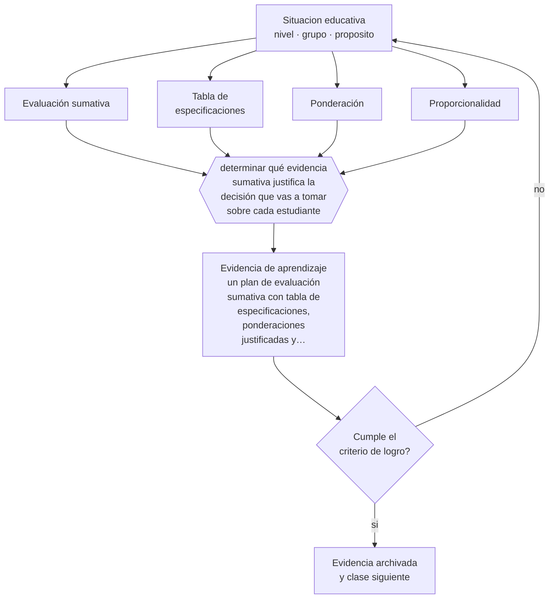

# Clase 135 — Evaluación sumativa

> **Parte 11 · Evaluación y psicometría** — clase 3 de 12

**Estado de evidencia:** `CONSISTENTE` · **Etapa:** 🟣 Etapa C — Núcleo profesional docente · **Población de referencia:** transversal, con foco en instrumentos y decisiones 
**Decisión que habilita:** determinar qué evidencia sumativa justifica la decisión que vas a tomar sobre cada estudiante 
**Evidencia de aprendizaje:** un plan de evaluación sumativa con tabla de especificaciones, ponderaciones justificadas y política de recuperación

## 🎯 Propósito

Diseñar evaluación sumativa defendible: representatividad del contenido, condiciones equivalentes, criterios públicos y decisiones proporcionales a la calidad de la evidencia.

## 📚 Resultados de aprendizaje

Al finalizar esta clase podrás:

1. **Definir** con precisión los cuatro conceptos centrales de la clase y reconocerlos en una situación educativa real, no solo en su enunciado.
2. **Explicar** qué exigencias técnicas aparecen cuando una evaluación tiene consecuencias para la persona.
3. **Decidir** —qué evidencia sumativa justifica la decisión que vas a tomar sobre cada estudiante— y sostener la decisión con un fundamento escrito.
4. **Producir** la evidencia de la clase —un plan de evaluación sumativa con tabla de especificaciones, ponderaciones justificadas y política de recuperación— y contrastarla contra el criterio de logro.
5. **Distinguir** lo que la evidencia sostiene de lo que es práctica instalada, preferencia personal o costumbre de la institución.

## 🧩 Conceptos centrales

| Concepto | Comprensión verificable |
|---|---|
| **Evaluación sumativa** | valoración del logro al final de un período, con consecuencias para el estudiante |
| **Tabla de especificaciones** | matriz que asegura que la evaluación representa el contenido y los niveles enseñados |
| **Ponderación** | peso relativo de cada evaluación en la calificación final y su justificación |
| **Proporcionalidad** | correspondencia entre la consecuencia de la decisión y la calidad de la evidencia disponible |

## 🗺️ Flujo de razonamiento

## 📖 Desarrollo

### 1. El fondo del asunto

Cuanto mayor es la consecuencia de una evaluación, mayor es la exigencia técnica que debe cumplir. Una decisión de promoción basada en una sola prueba de una hora es desproporcionada respecto de la evidencia que sostiene: el error de medida de un instrumento único es alto y las condiciones de aplicación afectan el resultado. La tabla de especificaciones es el instrumento básico que asegura que se evalúa lo enseñado y en la proporción en que se enseñó.

### 2. Cómo se traduce en decisiones de enseñanza

El plan define qué se evalúa, con qué peso, con qué instrumento y en qué momento, y declara la política de recuperación por adelantado. Las ponderaciones deben justificarse por importancia del aprendizaje y no por costumbre. Y las condiciones de aplicación deben ser equivalentes para todos, incluidas las adecuaciones que no alteran la inferencia.

### 3. Qué sostiene la evidencia y qué no

Ninguna evaluación sumativa mide todo lo aprendido: mide una muestra, en un momento y en un formato. Reconocerlo obliga a tomar decisiones de alto impacto con más de una fuente de evidencia y a resistir la tentación de tratar la calificación como una propiedad del estudiante.

> **Cómo leer el estado de evidencia `CONSISTENTE`.** La evidencia es amplia y coherente, pero proviene sobre todo de estudios correlacionales, de síntesis con heterogeneidad alta o de contextos distintos al tuyo. Sirve para orientar la decisión y exige que compruebes el efecto en tu propio grupo.

## 🧪 Taller guiado

Aplica la clase a **uno** de los contextos siguientes y repite después el ejercicio en un
contexto de exigencia distinta. Cambiar de contexto es parte del aprendizaje: lo que funciona
con un grupo no se traslada intacto a otro.

| Contexto | Rasgo que cambia la decisión |
|---|---|
| Evaluación de aula de baja consecuencia | prioriza información para enseñar |
| Evaluación sumativa que decide promoción | la exigencia técnica sube con la consecuencia |
| Evaluación de desempeño en taller o práctica | la rúbrica y el calibrado son el instrumento |
| Evaluación estandarizada externa | hay que leer el informe técnico, no el titular |
| Evaluación en línea | seguridad, integridad y equivalencia de condiciones |
| Evaluación con estudiantes con NEE | adecuación sin invalidar la inferencia |

**Secuencia de trabajo:**

1. Delimita el contexto: nivel, edad, tamaño del grupo, asignatura o experiencia y tiempo real disponible.
2. Declara qué saben ya los estudiantes y **cómo lo comprobaste**, no cómo lo supones.
3. Formula la decisión pedagógica que esta clase habilita y escribe su fundamento.
4. Anticipa qué observarías si la decisión funciona y qué observarías si no funciona.
5. Diseña de antemano la alternativa que aplicarás si la primera estrategia falla.
6. Ejecuta o simula, y registra lo observado con fecha, contexto y evidencia concreta.
7. Produce la evidencia de aprendizaje de la clase.
8. Contrástala contra el criterio de logro, corrige y recién entonces avanza.

### 📦 Evidencia de aprendizaje

Un plan de evaluación sumativa con tabla de especificaciones, ponderaciones justificadas y política de recuperación.

Debe incluir contexto, decisión, fundamento, fuentes consultadas con su fecha, indicador de
logro observable, riesgos previstos y qué harías distinto en la siguiente iteración.

## 🏆 Reto verificable

Construye la tabla de especificaciones de tu evaluación final y compárala con lo efectivamente enseñado. Corrige los desequilibrios que encuentres.

## ✅ Criterio de logro

- [ ] existe tabla de especificaciones que muestra representatividad del contenido enseñado;
- [ ] las ponderaciones y la política de recuperación están justificadas y publicadas antes;
- [ ] cada afirmación sobre «lo que funciona» está atribuida a una fuente identificable, con autor y fecha;
- [ ] la decisión es ejecutable con el tiempo, el espacio, el número de estudiantes y los recursos que realmente tienes;
- [ ] la evidencia queda archivada de forma reproducible: otra persona podría revisarla sin que tú se la expliques.

## ⚠️ Errores frecuentes

**Propios de esta clase:**

- Tomar decisiones de promoción con una sola medición.
- Ponderar por costumbre institucional y no por importancia del aprendizaje evaluado.

**Característicos de la parte 11:**

- Atribuir validez al instrumento en vez de a la interpretación y al uso.
- Usar el alfa de Cronbach como sello de calidad sin revisar sus supuestos.

## ♿ Diversidad, accesibilidad y ética

Las adecuaciones de acceso en evaluación sumativa —tiempo adicional, formato alternativo, apoyo técnico— no invalidan la inferencia cuando no alteran el constructo evaluado. Negarlas por temor a la injusticia produce exactamente la injusticia que se quería evitar.

Antes de aplicar cualquier decisión de esta clase con estudiantes reales, revisa el
[protocolo de práctica responsable](../../../docs/ETICA_Y_PRACTICA_RESPONSABLE.md):
consentimiento, resguardo de datos personales, proporcionalidad de la intervención y derecho
de cada estudiante a no ser objeto de un ensayo que no le reporta beneficio.

## ❓ Preguntas de comprobación

1. ¿Qué proporción de lo enseñado representa tu evaluación final?
2. ¿Qué decisión estás tomando con qué cantidad de evidencia?
3. ¿Por qué esa ponderación y no otra?

## 📕 Lecturas base

**AERA, APA & NCME (2014). *Standards for Educational and Psychological Testing*.**  
*Qué aporta a esta clase:* fija el estándar técnico según la consecuencia de la decisión.

**Brookhart, S. (2013). *Grading and Group Work*.**  
*Qué aporta a esta clase:* analiza problemas frecuentes de calificación y sus soluciones técnicas.

Catálogo completo: [bibliografía del programa](../../../docs/BIBLIOGRAFIA.md) ·
[glosario](../../../docs/GLOSARIO.md) ·
[fuentes oficiales y cómo leerlas](../../../docs/FUENTES.md).

## 🔗 Conexión con el resto del programa

Se apoya en la clase 117 y su exigencia técnica se desarrolla en las clases 140 a 143.

> [!IMPORTANT]
> Material de formación profesional. No reemplaza un título de pedagogía, una habilitación
> legal para ejercer, ni el juicio de un equipo educativo que conoce a sus estudiantes.

---

| Anterior | Índice | Siguiente |
|---|---|---|
| [← 134 · Evaluación formativa](../class-02-evaluacion-formativa/README.md) | [Parte 11](../README.md) · [Programa](../../../README.md) | [136 · Evaluación auténtica →](../class-04-evaluacion-autentica/README.md) |
