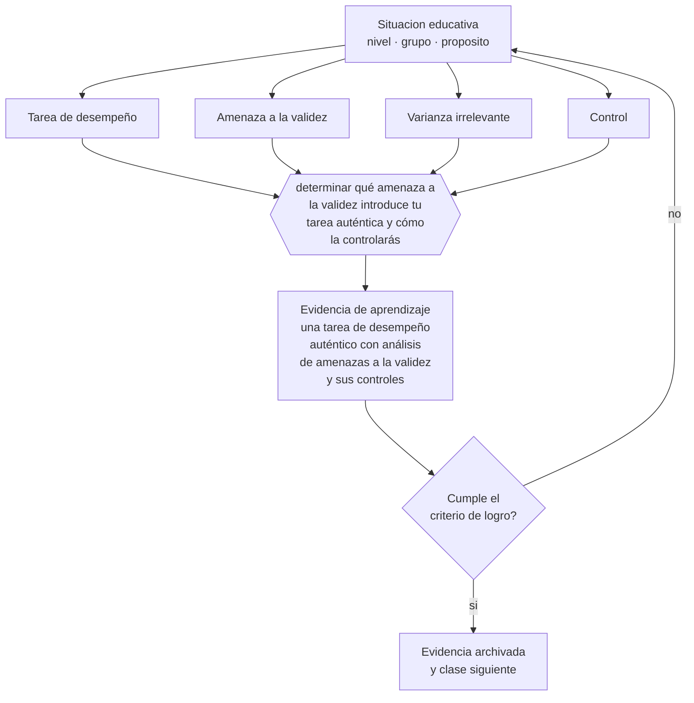

# Clase 136 — Evaluación auténtica

> **Parte 11 · Evaluación y psicometría** — clase 4 de 12

**Estado de evidencia:** `CONSISTENTE` · **Etapa:** 🟣 Etapa C — Núcleo profesional docente · **Población de referencia:** transversal, con foco en instrumentos y decisiones 
**Decisión que habilita:** determinar qué amenaza a la validez introduce tu tarea auténtica y cómo la controlarás 
**Evidencia de aprendizaje:** una tarea de desempeño auténtico con análisis de amenazas a la validez y sus controles

## 🎯 Propósito

Diseñar evaluación de desempeño auténtico con control de las amenazas a la validez: dependencia de recursos, apoyo externo no declarado, variabilidad del evaluador y condiciones desiguales.

## 📚 Resultados de aprendizaje

Al finalizar esta clase podrás:

1. **Definir** con precisión los cuatro conceptos centrales de la clase y reconocerlos en una situación educativa real, no solo en su enunciado.
2. **Explicar** cómo mantener la validez cuando la tarea de evaluación se parece al mundo real.
3. **Decidir** —qué amenaza a la validez introduce tu tarea auténtica y cómo la controlarás— y sostener la decisión con un fundamento escrito.
4. **Producir** la evidencia de la clase —una tarea de desempeño auténtico con análisis de amenazas a la validez y sus controles— y contrastarla contra el criterio de logro.
5. **Distinguir** lo que la evidencia sostiene de lo que es práctica instalada, preferencia personal o costumbre de la institución.

## 🧩 Conceptos centrales

| Concepto | Comprensión verificable |
|---|---|
| **Tarea de desempeño** | actividad compleja que exige integrar conocimientos en un producto o ejecución |
| **Amenaza a la validez** | factor que hace que la tarea mida algo distinto de lo que se pretende |
| **Varianza irrelevante** | diferencias en el resultado producidas por factores ajenos al aprendizaje evaluado |
| **Control** | medida que reduce el efecto de una amenaza sin destruir la autenticidad de la tarea |

## 🗺️ Flujo de razonamiento

## 📖 Desarrollo

### 1. El fondo del asunto

La evaluación auténtica gana relevancia y arriesga validez. Las amenazas son conocidas: la tarea puede medir los recursos del hogar, el tiempo disponible, el apoyo de terceros o la habilidad de presentación, más que el aprendizaje. Y con la disponibilidad de herramientas generativas, la autoría del producto entregado dejó de poder suponerse.

### 2. Cómo se traduce en decisiones de enseñanza

Los controles son concretos: producir partes del trabajo en clase, exigir defensa oral breve, evaluar el proceso además del producto, calibrar entre evaluadores y declarar de antemano qué apoyos son admisibles. Ninguno elimina la amenaza, pero en conjunto permiten sostener la inferencia con razonable confianza.

### 3. Qué sostiene la evidencia y qué no

Cada control tiene costo: en tiempo, en trabajo docente y a veces en autenticidad. La decisión razonable depende de la consecuencia de la evaluación: para una tarea formativa, controles ligeros; para una que decide titulación, controles fuertes. Aplicar controles máximos a todo es inviable.

> **Cómo leer el estado de evidencia `CONSISTENTE`.** La evidencia es amplia y coherente, pero proviene sobre todo de estudios correlacionales, de síntesis con heterogeneidad alta o de contextos distintos al tuyo. Sirve para orientar la decisión y exige que compruebes el efecto en tu propio grupo.

## 🧪 Taller guiado

Aplica la clase a **uno** de los contextos siguientes y repite después el ejercicio en un
contexto de exigencia distinta. Cambiar de contexto es parte del aprendizaje: lo que funciona
con un grupo no se traslada intacto a otro.

| Contexto | Rasgo que cambia la decisión |
|---|---|
| Evaluación de aula de baja consecuencia | prioriza información para enseñar |
| Evaluación sumativa que decide promoción | la exigencia técnica sube con la consecuencia |
| Evaluación de desempeño en taller o práctica | la rúbrica y el calibrado son el instrumento |
| Evaluación estandarizada externa | hay que leer el informe técnico, no el titular |
| Evaluación en línea | seguridad, integridad y equivalencia de condiciones |
| Evaluación con estudiantes con NEE | adecuación sin invalidar la inferencia |

**Secuencia de trabajo:**

1. Delimita el contexto: nivel, edad, tamaño del grupo, asignatura o experiencia y tiempo real disponible.
2. Declara qué saben ya los estudiantes y **cómo lo comprobaste**, no cómo lo supones.
3. Formula la decisión pedagógica que esta clase habilita y escribe su fundamento.
4. Anticipa qué observarías si la decisión funciona y qué observarías si no funciona.
5. Diseña de antemano la alternativa que aplicarás si la primera estrategia falla.
6. Ejecuta o simula, y registra lo observado con fecha, contexto y evidencia concreta.
7. Produce la evidencia de aprendizaje de la clase.
8. Contrástala contra el criterio de logro, corrige y recién entonces avanza.

### 📦 Evidencia de aprendizaje

Una tarea de desempeño auténtico con análisis de amenazas a la validez y sus controles.

Debe incluir contexto, decisión, fundamento, fuentes consultadas con su fecha, indicador de
logro observable, riesgos previstos y qué harías distinto en la siguiente iteración.

## 🏆 Reto verificable

Analiza una tarea auténtica tuya e identifica qué mide además del aprendizaje. Aplica un control y compara la distribución de resultados.

## ✅ Criterio de logro

- [ ] el análisis identifica al menos dos amenazas concretas con su control;
- [ ] existe evidencia de proceso o de autoría además del producto final;
- [ ] cada afirmación sobre «lo que funciona» está atribuida a una fuente identificable, con autor y fecha;
- [ ] la decisión es ejecutable con el tiempo, el espacio, el número de estudiantes y los recursos que realmente tienes;
- [ ] la evidencia queda archivada de forma reproducible: otra persona podría revisarla sin que tú se la expliques.

## ⚠️ Errores frecuentes

**Propios de esta clase:**

- Evaluar un producto extenso sin ninguna evidencia de proceso ni de autoría.
- Eliminar la autenticidad para asegurar el control, con lo que se pierde el propósito de la tarea.

**Característicos de la parte 11:**

- Atribuir validez al instrumento en vez de a la interpretación y al uso.
- Usar el alfa de Cronbach como sello de calidad sin revisar sus supuestos.

## ♿ Diversidad, accesibilidad y ética

La dependencia de recursos es la amenaza con mayor impacto en equidad: tareas que exigen materiales, conectividad o apoyo familiar miden origen social. Producir en clase y ofrecer materiales elimina buena parte de esa varianza.

Antes de aplicar cualquier decisión de esta clase con estudiantes reales, revisa el
[protocolo de práctica responsable](../../../docs/ETICA_Y_PRACTICA_RESPONSABLE.md):
consentimiento, resguardo de datos personales, proporcionalidad de la intervención y derecho
de cada estudiante a no ser objeto de un ensayo que no le reporta beneficio.

## ❓ Preguntas de comprobación

1. ¿Qué está midiendo tu tarea además del aprendizaje?
2. ¿Cómo sabes que el trabajo es del estudiante?
3. ¿Qué control puedes aplicar sin destruir la autenticidad?

## 📕 Lecturas base

**Messick, S. (1994). *The Interplay of Evidence and Consequences in the Validation of Performance Assessments*.**  
*Qué aporta a esta clase:* analiza validez y varianza irrelevante en evaluación de desempeño.

**Wiggins, G. (1998). *Educative Assessment*.**  
*Qué aporta a esta clase:* criterios de diseño de tareas auténticas defendibles.

Catálogo completo: [bibliografía del programa](../../../docs/BIBLIOGRAFIA.md) ·
[glosario](../../../docs/GLOSARIO.md) ·
[fuentes oficiales y cómo leerlas](../../../docs/FUENTES.md).

## 🔗 Conexión con el resto del programa

Profundiza la clase 071 y se apoya en la clase 140.

> [!IMPORTANT]
> Material de formación profesional. No reemplaza un título de pedagogía, una habilitación
> legal para ejercer, ni el juicio de un equipo educativo que conoce a sus estudiantes.

---

| Anterior | Índice | Siguiente |
|---|---|---|
| [← 135 · Evaluación sumativa](../class-03-evaluacion-sumativa/README.md) | [Parte 11](../README.md) · [Programa](../../../README.md) | [137 · Construcción de ítems →](../class-05-construccion-de-items/README.md) |
