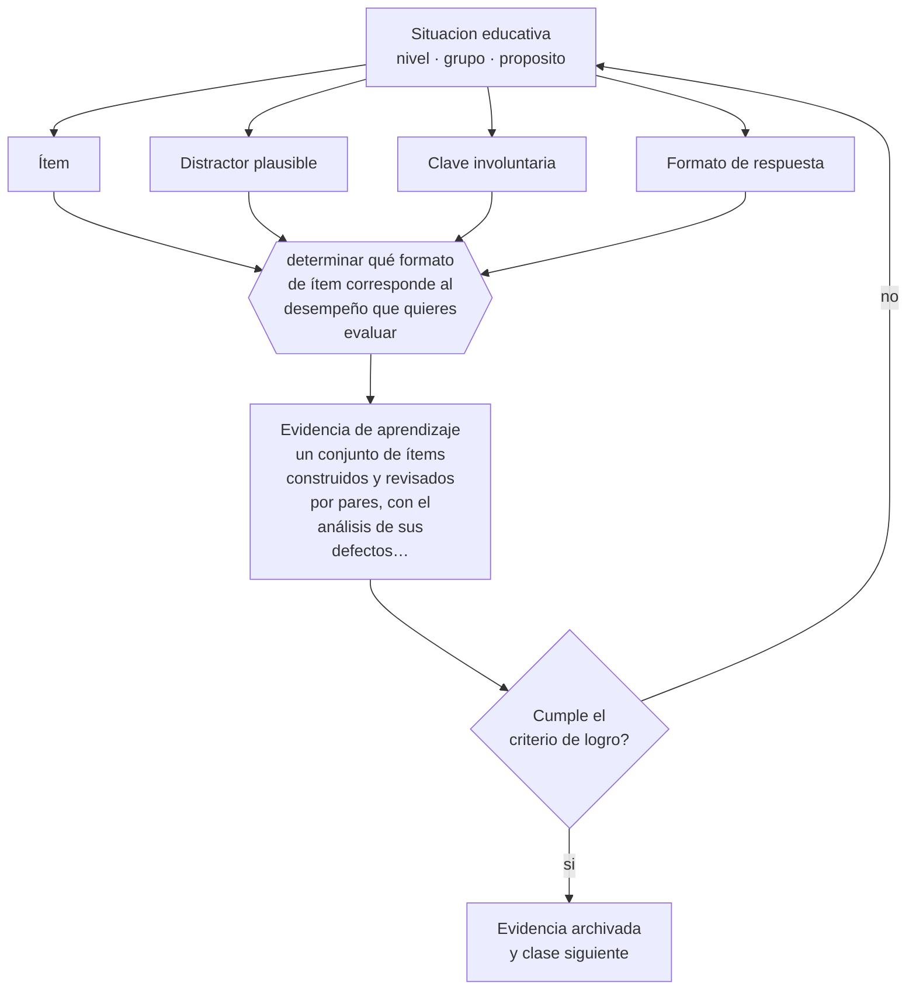

# Clase 137 — Construcción de ítems

> **Parte 11 · Evaluación y psicometría** — clase 5 de 12

**Estado de evidencia:** `CONSISTENTE` · **Etapa:** 🟣 Etapa C — Núcleo profesional docente · **Población de referencia:** transversal, con foco en instrumentos y decisiones 
**Decisión que habilita:** determinar qué formato de ítem corresponde al desempeño que quieres evaluar 
**Evidencia de aprendizaje:** un conjunto de ítems construidos y revisados por pares, con el análisis de sus defectos corregidos

## 🎯 Propósito

Construir ítems técnicamente correctos: enunciado claro, una sola respuesta defendible, distractores plausibles y ausencia de claves involuntarias.

## 📚 Resultados de aprendizaje

Al finalizar esta clase podrás:

1. **Definir** con precisión los cuatro conceptos centrales de la clase y reconocerlos en una situación educativa real, no solo en su enunciado.
2. **Explicar** cómo se escribe un ítem que discrimine comprensión y no habilidad para resolver pruebas.
3. **Decidir** —qué formato de ítem corresponde al desempeño que quieres evaluar— y sostener la decisión con un fundamento escrito.
4. **Producir** la evidencia de la clase —un conjunto de ítems construidos y revisados por pares, con el análisis de sus defectos corregidos— y contrastarla contra el criterio de logro.
5. **Distinguir** lo que la evidencia sostiene de lo que es práctica instalada, preferencia personal o costumbre de la institución.

## 🧩 Conceptos centrales

| Concepto | Comprensión verificable |
|---|---|
| **Ítem** | unidad mínima de una prueba: enunciado, tarea y criterio de corrección |
| **Distractor plausible** | alternativa incorrecta que resulta atractiva para quien tiene un error conceptual específico |
| **Clave involuntaria** | rasgo del ítem que permite acertar sin saber el contenido |
| **Formato de respuesta** | selección, respuesta corta, desarrollo o desempeño; cada uno mide cosas distintas |

## 🗺️ Flujo de razonamiento

## 📖 Desarrollo

### 1. El fondo del asunto

Un ítem defectuoso mide otra cosa: la longitud de la alternativa correcta, la concordancia gramatical, la exclusión por absurdo o la simple habilidad de rendir pruebas. Los defectos son conocidos y evitables: alternativas de longitud desigual, uso de «todas las anteriores», negaciones no señaladas, enunciados ambiguos y distractores que nadie elegiría. Revisar contra esa lista mejora cualquier instrumento en una hora de trabajo.

### 2. Cómo se traduce en decisiones de enseñanza

La construcción parte del desempeño: si el objetivo es explicar, un ítem de selección múltiple no sirve. Los distractores se construyen a partir de errores reales observados en los estudiantes, no inventados, y por eso las evaluaciones mejoran cuando se construyen después de haber enseñado y registrado los errores del curso.

### 3. Qué sostiene la evidencia y qué no

Ningún formato es superior en abstracto: la selección múltiple mide bien reconocimiento y aplicación acotada y mal producción y argumentación; el desarrollo mide producción y tiene baja consistencia entre correctores. La elección del formato es una decisión de validez, no de comodidad.

> **Cómo leer el estado de evidencia `CONSISTENTE`.** La evidencia es amplia y coherente, pero proviene sobre todo de estudios correlacionales, de síntesis con heterogeneidad alta o de contextos distintos al tuyo. Sirve para orientar la decisión y exige que compruebes el efecto en tu propio grupo.

## 🧪 Taller guiado

Aplica la clase a **uno** de los contextos siguientes y repite después el ejercicio en un
contexto de exigencia distinta. Cambiar de contexto es parte del aprendizaje: lo que funciona
con un grupo no se traslada intacto a otro.

| Contexto | Rasgo que cambia la decisión |
|---|---|
| Evaluación de aula de baja consecuencia | prioriza información para enseñar |
| Evaluación sumativa que decide promoción | la exigencia técnica sube con la consecuencia |
| Evaluación de desempeño en taller o práctica | la rúbrica y el calibrado son el instrumento |
| Evaluación estandarizada externa | hay que leer el informe técnico, no el titular |
| Evaluación en línea | seguridad, integridad y equivalencia de condiciones |
| Evaluación con estudiantes con NEE | adecuación sin invalidar la inferencia |

**Secuencia de trabajo:**

1. Delimita el contexto: nivel, edad, tamaño del grupo, asignatura o experiencia y tiempo real disponible.
2. Declara qué saben ya los estudiantes y **cómo lo comprobaste**, no cómo lo supones.
3. Formula la decisión pedagógica que esta clase habilita y escribe su fundamento.
4. Anticipa qué observarías si la decisión funciona y qué observarías si no funciona.
5. Diseña de antemano la alternativa que aplicarás si la primera estrategia falla.
6. Ejecuta o simula, y registra lo observado con fecha, contexto y evidencia concreta.
7. Produce la evidencia de aprendizaje de la clase.
8. Contrástala contra el criterio de logro, corrige y recién entonces avanza.

### 📦 Evidencia de aprendizaje

Un conjunto de ítems construidos y revisados por pares, con el análisis de sus defectos corregidos.

Debe incluir contexto, decisión, fundamento, fuentes consultadas con su fecha, indicador de
logro observable, riesgos previstos y qué harías distinto en la siguiente iteración.

## 🏆 Reto verificable

Revisa una prueba tuya contra la lista de defectos frecuentes. Corrige los ítems defectuosos y compara los resultados con la versión anterior.

## ✅ Criterio de logro

- [ ] los distractores corresponden a errores conceptuales observados;
- [ ] el conjunto fue revisado por otra persona contra una lista de defectos frecuentes;
- [ ] cada afirmación sobre «lo que funciona» está atribuida a una fuente identificable, con autor y fecha;
- [ ] la decisión es ejecutable con el tiempo, el espacio, el número de estudiantes y los recursos que realmente tienes;
- [ ] la evidencia queda archivada de forma reproducible: otra persona podría revisarla sin que tú se la expliques.

## ⚠️ Errores frecuentes

**Propios de esta clase:**

- Construir distractores inventados en vez de basarlos en errores reales del curso.
- Elegir el formato por facilidad de corrección y no por el desempeño que se quiere evaluar.

**Característicos de la parte 11:**

- Atribuir validez al instrumento en vez de a la interpretación y al uso.
- Usar el alfa de Cronbach como sello de calidad sin revisar sus supuestos.

## ♿ Diversidad, accesibilidad y ética

Los ítems con lenguaje innecesariamente complejo o con contextos culturalmente específicos introducen varianza irrelevante que perjudica a estudiantes que aprenden en segunda lengua o de otros contextos. Simplificar el lenguaje sin simplificar el contenido es una corrección de validez.

Antes de aplicar cualquier decisión de esta clase con estudiantes reales, revisa el
[protocolo de práctica responsable](../../../docs/ETICA_Y_PRACTICA_RESPONSABLE.md):
consentimiento, resguardo de datos personales, proporcionalidad de la intervención y derecho
de cada estudiante a no ser objeto de un ensayo que no le reporta beneficio.

## ❓ Preguntas de comprobación

1. ¿Qué error revelaría cada distractor de tu ítem?
2. ¿Podría alguien acertar sin saber el contenido?
3. ¿El formato elegido mide el desempeño que declaraste?

## 📕 Lecturas base

**Haladyna, T., Downing, S. & Rodriguez, M. (2002). *A Review of Multiple-Choice Item-Writing Guidelines*.**  
*Qué aporta a esta clase:* la lista de verificación estándar para construcción de ítems.

**AERA, APA & NCME (2014). *Standards*.**  
*Qué aporta a esta clase:* fija los requisitos técnicos según el uso previsto del instrumento.

Catálogo completo: [bibliografía del programa](../../../docs/BIBLIOGRAFIA.md) ·
[glosario](../../../docs/GLOSARIO.md) ·
[fuentes oficiales y cómo leerlas](../../../docs/FUENTES.md).

## 🔗 Conexión con el resto del programa

Alimenta la clase 142, donde los ítems se analizan con datos reales de aplicación.

> [!IMPORTANT]
> Material de formación profesional. No reemplaza un título de pedagogía, una habilitación
> legal para ejercer, ni el juicio de un equipo educativo que conoce a sus estudiantes.

---

| Anterior | Índice | Siguiente |
|---|---|---|
| [← 136 · Evaluación auténtica](../class-04-evaluacion-autentica/README.md) | [Parte 11](../README.md) · [Programa](../../../README.md) | [138 · Rúbricas y escalas →](../class-06-rubricas-y-escalas/README.md) |
