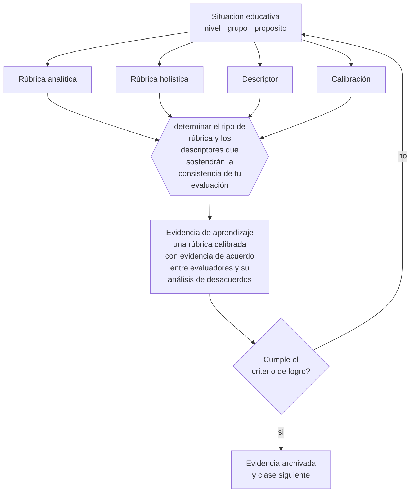

# Clase 138 — Rúbricas y escalas

> **Parte 11 · Evaluación y psicometría** — clase 6 de 12

**Estado de evidencia:** `CONSISTENTE` · **Etapa:** 🟣 Etapa C — Núcleo profesional docente · **Población de referencia:** transversal, con foco en instrumentos y decisiones 
**Decisión que habilita:** determinar el tipo de rúbrica y los descriptores que sostendrán la consistencia de tu evaluación 
**Evidencia de aprendizaje:** una rúbrica calibrada con evidencia de acuerdo entre evaluadores y su análisis de desacuerdos

## 🎯 Propósito

Construir rúbricas y escalas técnicamente sólidas, calibrar su uso entre evaluadores y decidir cuándo conviene una rúbrica analítica y cuándo una holística.

## 📚 Resultados de aprendizaje

Al finalizar esta clase podrás:

1. **Definir** con precisión los cuatro conceptos centrales de la clase y reconocerlos en una situación educativa real, no solo en su enunciado.
2. **Explicar** qué hace que una rúbrica mejore la consistencia y qué la convierte en decoración.
3. **Decidir** —el tipo de rúbrica y los descriptores que sostendrán la consistencia de tu evaluación— y sostener la decisión con un fundamento escrito.
4. **Producir** la evidencia de la clase —una rúbrica calibrada con evidencia de acuerdo entre evaluadores y su análisis de desacuerdos— y contrastarla contra el criterio de logro.
5. **Distinguir** lo que la evidencia sostiene de lo que es práctica instalada, preferencia personal o costumbre de la institución.

## 🧩 Conceptos centrales

| Concepto | Comprensión verificable |
|---|---|
| **Rúbrica analítica** | instrumento que evalúa criterios por separado; útil para retroalimentar |
| **Rúbrica holística** | juicio global por niveles; más rápida y menos informativa para el estudiante |
| **Descriptor** | descripción del desempeño en un nivel; debe ser observable y no comparativo |
| **Calibración** | proceso de acuerdo entre evaluadores sobre la aplicación de los descriptores |

## 🗺️ Flujo de razonamiento

## 📖 Desarrollo

### 1. El fondo del asunto

Las rúbricas mejoran la consistencia solo si sus descriptores son observables. Los niveles definidos por adverbios —«excelente», «adecuado», «insuficiente»— trasladan el juicio al evaluador y producen una apariencia de objetividad sin ganancia real. La calibración es el procedimiento que revela el problema: si dos evaluadores discrepan sistemáticamente en un criterio, ese descriptor está mal escrito.

### 2. Cómo se traduce en decisiones de enseñanza

El procedimiento incluye construir la rúbrica antes, entregarla al estudiante, calibrar con trabajos reales y reescribir los descriptores conflictivos. La elección entre analítica y holística depende del uso: para retroalimentar, analítica; para calificar rápido un volumen alto con criterios bien internalizados, holística.

### 3. Qué sostiene la evidencia y qué no

Una rúbrica muy detallada puede convertir un desempeño complejo en una lista de verificación y premiar el cumplimiento formal sobre la calidad global. Y ningún instrumento elimina el juicio profesional: la rúbrica lo estructura y lo hace comunicable, no lo sustituye.

> **Cómo leer el estado de evidencia `CONSISTENTE`.** La evidencia es amplia y coherente, pero proviene sobre todo de estudios correlacionales, de síntesis con heterogeneidad alta o de contextos distintos al tuyo. Sirve para orientar la decisión y exige que compruebes el efecto en tu propio grupo.

## 🧪 Taller guiado

Aplica la clase a **uno** de los contextos siguientes y repite después el ejercicio en un
contexto de exigencia distinta. Cambiar de contexto es parte del aprendizaje: lo que funciona
con un grupo no se traslada intacto a otro.

| Contexto | Rasgo que cambia la decisión |
|---|---|
| Evaluación de aula de baja consecuencia | prioriza información para enseñar |
| Evaluación sumativa que decide promoción | la exigencia técnica sube con la consecuencia |
| Evaluación de desempeño en taller o práctica | la rúbrica y el calibrado son el instrumento |
| Evaluación estandarizada externa | hay que leer el informe técnico, no el titular |
| Evaluación en línea | seguridad, integridad y equivalencia de condiciones |
| Evaluación con estudiantes con NEE | adecuación sin invalidar la inferencia |

**Secuencia de trabajo:**

1. Delimita el contexto: nivel, edad, tamaño del grupo, asignatura o experiencia y tiempo real disponible.
2. Declara qué saben ya los estudiantes y **cómo lo comprobaste**, no cómo lo supones.
3. Formula la decisión pedagógica que esta clase habilita y escribe su fundamento.
4. Anticipa qué observarías si la decisión funciona y qué observarías si no funciona.
5. Diseña de antemano la alternativa que aplicarás si la primera estrategia falla.
6. Ejecuta o simula, y registra lo observado con fecha, contexto y evidencia concreta.
7. Produce la evidencia de aprendizaje de la clase.
8. Contrástala contra el criterio de logro, corrige y recién entonces avanza.

### 📦 Evidencia de aprendizaje

Una rúbrica calibrada con evidencia de acuerdo entre evaluadores y su análisis de desacuerdos.

Debe incluir contexto, decisión, fundamento, fuentes consultadas con su fecha, indicador de
logro observable, riesgos previstos y qué harías distinto en la siguiente iteración.

## 🏆 Reto verificable

Calibra tu rúbrica con un colega sobre cinco trabajos. Reescribe los descriptores que produjeron desacuerdo y vuelve a calibrar.

## ✅ Criterio de logro

- [ ] los descriptores son observables y no comparativos entre estudiantes;
- [ ] hay evidencia de calibración con análisis de los desacuerdos;
- [ ] cada afirmación sobre «lo que funciona» está atribuida a una fuente identificable, con autor y fecha;
- [ ] la decisión es ejecutable con el tiempo, el espacio, el número de estudiantes y los recursos que realmente tienes;
- [ ] la evidencia queda archivada de forma reproducible: otra persona podría revisarla sin que tú se la expliques.

## ⚠️ Errores frecuentes

**Propios de esta clase:**

- Definir niveles con adverbios en vez de con desempeños observables.
- Aplicar una rúbrica sin calibrar y atribuir a los estudiantes la variación entre correctores.

**Característicos de la parte 11:**

- Atribuir validez al instrumento en vez de a la interpretación y al uso.
- Usar el alfa de Cronbach como sello de calidad sin revisar sus supuestos.

## ♿ Diversidad, accesibilidad y ética

Las rúbricas explícitas y entregadas antes reducen la ventaja de quienes conocen los códigos implícitos del trabajo académico, y permiten a cualquier estudiante autoevaluarse antes de entregar.

Antes de aplicar cualquier decisión de esta clase con estudiantes reales, revisa el
[protocolo de práctica responsable](../../../docs/ETICA_Y_PRACTICA_RESPONSABLE.md):
consentimiento, resguardo de datos personales, proporcionalidad de la intervención y derecho
de cada estudiante a no ser objeto de un ensayo que no le reporta beneficio.

## ❓ Preguntas de comprobación

1. ¿Qué diferencia observable hay entre el nivel 3 y el nivel 4 de tu rúbrica?
2. ¿En qué criterio discrepan más dos correctores?
3. ¿Tu rúbrica premia calidad o cumplimiento de una lista?

## 📕 Lecturas base

**Jonsson, A. & Svingby, G. (2007). *The Use of Scoring Rubrics*.**  
*Qué aporta a esta clase:* evidencia sobre consistencia, validez y consecuencias del uso de rúbricas.

**Brookhart, S. (2013). *How to Create and Use Rubrics*.**  
*Qué aporta a esta clase:* guía práctica de construcción con ejemplos de descriptores observables.

Catálogo completo: [bibliografía del programa](../../../docs/BIBLIOGRAFIA.md) ·
[glosario](../../../docs/GLOSARIO.md) ·
[fuentes oficiales y cómo leerlas](../../../docs/FUENTES.md).

## 🔗 Conexión con el resto del programa

Profundiza la clase 077 y sostiene la evaluación de desempeño de la clase 136.

> [!IMPORTANT]
> Material de formación profesional. No reemplaza un título de pedagogía, una habilitación
> legal para ejercer, ni el juicio de un equipo educativo que conoce a sus estudiantes.

---

| Anterior | Índice | Siguiente |
|---|---|---|
| [← 137 · Construcción de ítems](../class-05-construccion-de-items/README.md) | [Parte 11](../README.md) · [Programa](../../../README.md) | [139 · Retroalimentación efectiva →](../class-07-retroalimentacion-efectiva/README.md) |
