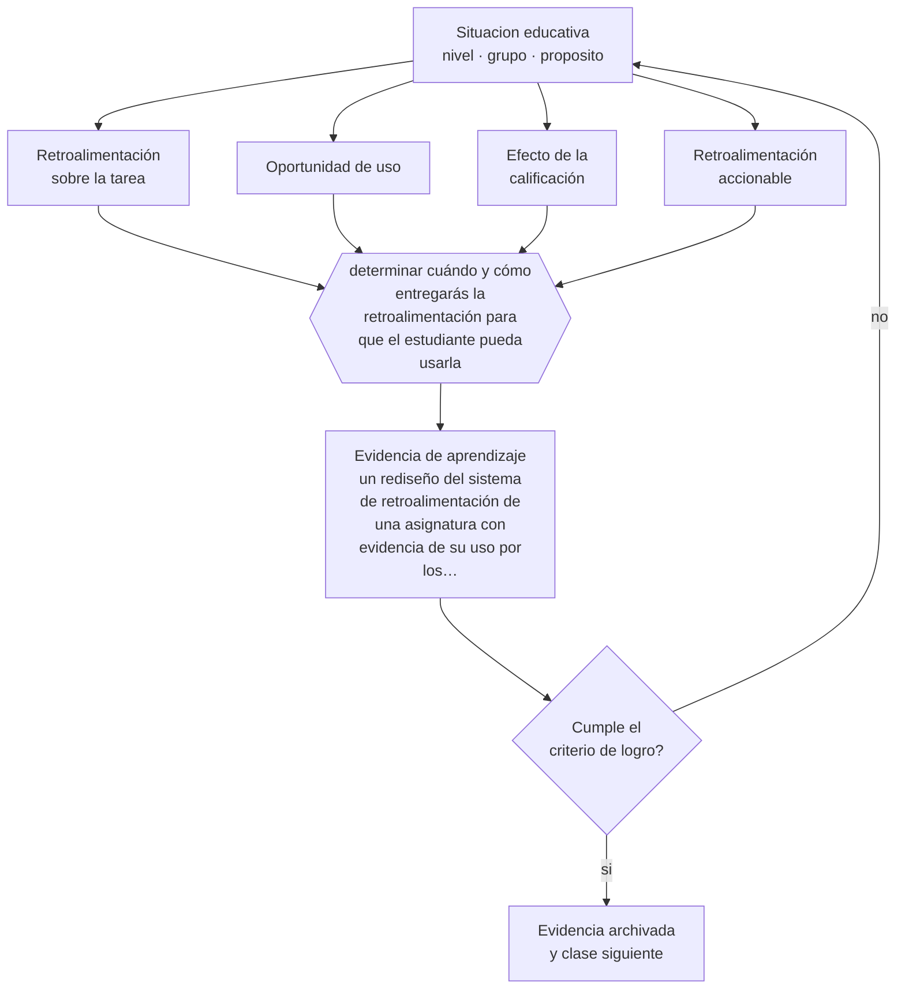

# Clase 139 — Retroalimentación efectiva

> **Parte 11 · Evaluación y psicometría** — clase 7 de 12

**Estado de evidencia:** `ROBUSTA` · **Etapa:** 🟣 Etapa C — Núcleo profesional docente · **Población de referencia:** transversal, con foco en instrumentos y decisiones 
**Decisión que habilita:** determinar cuándo y cómo entregarás la retroalimentación para que el estudiante pueda usarla 
**Evidencia de aprendizaje:** un rediseño del sistema de retroalimentación de una asignatura con evidencia de su uso por los estudiantes

## 🎯 Propósito

Diseñar retroalimentación efectiva: dirigida a la tarea y no a la persona, entregada a tiempo, específica, accionable y con oportunidad real de usarla.

## 📚 Resultados de aprendizaje

Al finalizar esta clase podrás:

1. **Definir** con precisión los cuatro conceptos centrales de la clase y reconocerlos en una situación educativa real, no solo en su enunciado.
2. **Explicar** por qué buena parte de la retroalimentación no produce ningún efecto y alguna incluso empeora el desempeño.
3. **Decidir** —cuándo y cómo entregarás la retroalimentación para que el estudiante pueda usarla— y sostener la decisión con un fundamento escrito.
4. **Producir** la evidencia de la clase —un rediseño del sistema de retroalimentación de una asignatura con evidencia de su uso por los estudiantes— y contrastarla contra el criterio de logro.
5. **Distinguir** lo que la evidencia sostiene de lo que es práctica instalada, preferencia personal o costumbre de la institución.

## 🧩 Conceptos centrales

| Concepto | Comprensión verificable |
|---|---|
| **Retroalimentación sobre la tarea** | información sobre el trabajo y cómo mejorarlo, distinta del juicio sobre la persona |
| **Oportunidad de uso** | instancia posterior donde el estudiante puede aplicar lo señalado |
| **Efecto de la calificación** | fenómeno por el que la nota anula la atención al comentario |
| **Retroalimentación accionable** | indicación concreta que el estudiante sabe cómo ejecutar |

## 🗺️ Flujo de razonamiento

## 📖 Desarrollo

### 1. El fondo del asunto

La investigación sobre retroalimentación muestra efectos promedio positivos y una variabilidad enorme, incluidos casos de efecto negativo. Dos hallazgos son de aplicación inmediata: la retroalimentación dirigida a la persona —elogio o crítica sobre su capacidad— no mejora y puede perjudicar; y entregar nota y comentario juntos anula el efecto del comentario, porque la atención va a la nota.

### 2. Cómo se traduce en decisiones de enseñanza

El rediseño más simple y más eficaz consiste en separar en el tiempo el comentario de la calificación, y exigir una acción con el comentario antes de entregar la nota. Además, la retroalimentación debe ser específica y accionable: «mejora la coherencia» no orienta; «cada párrafo debe empezar con la idea y seguir con el ejemplo» sí.

### 3. Qué sostiene la evidencia y qué no

La retroalimentación abundante no es mejor: sobrecarga y produce abandono. Y su efecto depende de que el estudiante tenga el conocimiento para interpretarla y una oportunidad real de aplicarla; sin trabajo posterior, el mejor comentario del mundo no cambia nada.

> **Cómo leer el estado de evidencia `ROBUSTA`.** Hay evidencia convergente de varios equipos, países y diseños de investigación, incluidos estudios experimentales o cuasiexperimentales, y el efecto se sostiene al replicarlo. Puedes apoyar una decisión profesional en ella, sin olvidar que ningún efecto promedio describe a un estudiante concreto.

## 🧪 Taller guiado

Aplica la clase a **uno** de los contextos siguientes y repite después el ejercicio en un
contexto de exigencia distinta. Cambiar de contexto es parte del aprendizaje: lo que funciona
con un grupo no se traslada intacto a otro.

| Contexto | Rasgo que cambia la decisión |
|---|---|
| Evaluación de aula de baja consecuencia | prioriza información para enseñar |
| Evaluación sumativa que decide promoción | la exigencia técnica sube con la consecuencia |
| Evaluación de desempeño en taller o práctica | la rúbrica y el calibrado son el instrumento |
| Evaluación estandarizada externa | hay que leer el informe técnico, no el titular |
| Evaluación en línea | seguridad, integridad y equivalencia de condiciones |
| Evaluación con estudiantes con NEE | adecuación sin invalidar la inferencia |

**Secuencia de trabajo:**

1. Delimita el contexto: nivel, edad, tamaño del grupo, asignatura o experiencia y tiempo real disponible.
2. Declara qué saben ya los estudiantes y **cómo lo comprobaste**, no cómo lo supones.
3. Formula la decisión pedagógica que esta clase habilita y escribe su fundamento.
4. Anticipa qué observarías si la decisión funciona y qué observarías si no funciona.
5. Diseña de antemano la alternativa que aplicarás si la primera estrategia falla.
6. Ejecuta o simula, y registra lo observado con fecha, contexto y evidencia concreta.
7. Produce la evidencia de aprendizaje de la clase.
8. Contrástala contra el criterio de logro, corrige y recién entonces avanza.

### 📦 Evidencia de aprendizaje

Un rediseño del sistema de retroalimentación de una asignatura con evidencia de su uso por los estudiantes.

Debe incluir contexto, decisión, fundamento, fuentes consultadas con su fecha, indicador de
logro observable, riesgos previstos y qué harías distinto en la siguiente iteración.

## 🏆 Reto verificable

Separa comentario y nota durante una unidad, con una entrega intermedia obligatoria. Compara la calidad de la versión final con la de la unidad anterior.

## ✅ Criterio de logro

- [ ] existe una oportunidad real de usar la retroalimentación antes de la calificación final;
- [ ] hay evidencia de que los estudiantes efectivamente la usaron;
- [ ] cada afirmación sobre «lo que funciona» está atribuida a una fuente identificable, con autor y fecha;
- [ ] la decisión es ejecutable con el tiempo, el espacio, el número de estudiantes y los recursos que realmente tienes;
- [ ] la evidencia queda archivada de forma reproducible: otra persona podría revisarla sin que tú se la expliques.

## ⚠️ Errores frecuentes

**Propios de esta clase:**

- Entregar comentario y calificación al mismo tiempo.
- Dirigir la retroalimentación a la persona —«eres desordenado»— en vez de a la tarea.

**Característicos de la parte 11:**

- Atribuir validez al instrumento en vez de a la interpretación y al uso.
- Usar el alfa de Cronbach como sello de calidad sin revisar sus supuestos.

## ♿ Diversidad, accesibilidad y ética

La retroalimentación específica y accionable es especialmente decisiva para estudiantes sin apoyo académico externo: es la única guía que reciben sobre cómo mejorar, mientras otros la obtienen en casa.

Antes de aplicar cualquier decisión de esta clase con estudiantes reales, revisa el
[protocolo de práctica responsable](../../../docs/ETICA_Y_PRACTICA_RESPONSABLE.md):
consentimiento, resguardo de datos personales, proporcionalidad de la intervención y derecho
de cada estudiante a no ser objeto de un ensayo que no le reporta beneficio.

## ❓ Preguntas de comprobación

1. ¿Qué hicieron tus estudiantes con tu último comentario?
2. ¿Cuánto tiempo dedicas a corregir y cuánto de eso cambia algo?
3. ¿Tu comentario habla de la tarea o de la persona?

## 📕 Lecturas base

**Hattie, J. & Timperley, H. (2007). *The Power of Feedback*.**  
*Qué aporta a esta clase:* modelo por niveles de retroalimentación y evidencia sobre cuáles funcionan.

**Kluger, A. & DeNisi, A. (1996). *The Effects of Feedback Interventions on Performance*.**  
*Qué aporta a esta clase:* documenta que una proporción relevante de intervenciones de retroalimentación empeora el desempeño.

Catálogo completo: [bibliografía del programa](../../../docs/BIBLIOGRAFIA.md) ·
[glosario](../../../docs/GLOSARIO.md) ·
[fuentes oficiales y cómo leerlas](../../../docs/FUENTES.md).

## 🔗 Conexión con el resto del programa

Se apoya en la clase 134 y es la práctica que hace efectiva la evaluación formativa.

> [!IMPORTANT]
> Material de formación profesional. No reemplaza un título de pedagogía, una habilitación
> legal para ejercer, ni el juicio de un equipo educativo que conoce a sus estudiantes.

---

| Anterior | Índice | Siguiente |
|---|---|---|
| [← 138 · Rúbricas y escalas](../class-06-rubricas-y-escalas/README.md) | [Parte 11](../README.md) · [Programa](../../../README.md) | [140 · Validez →](../class-08-validez/README.md) |
