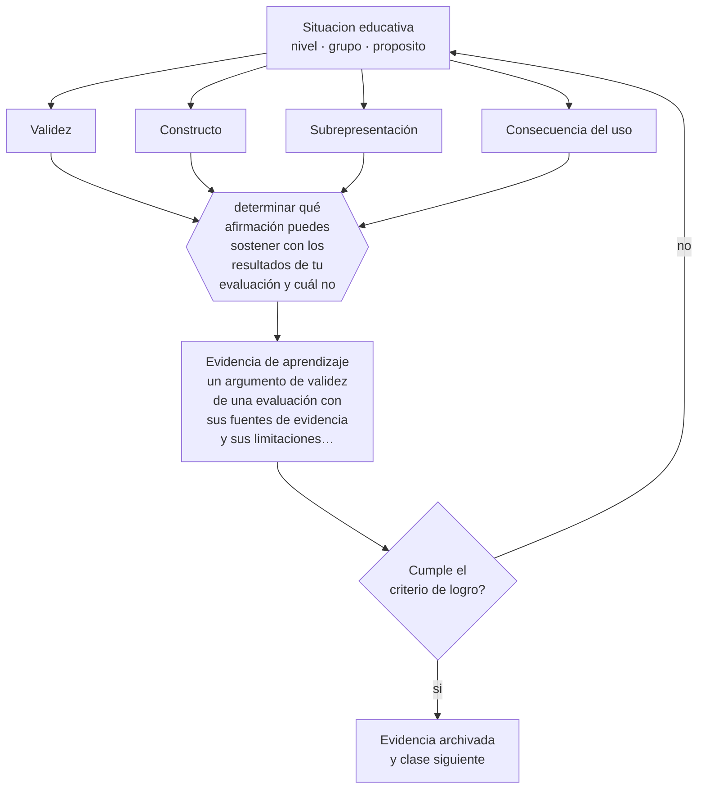

# Clase 140 — Validez

> **Parte 11 · Evaluación y psicometría** — clase 8 de 12

**Estado de evidencia:** `ROBUSTA` · **Etapa:** 🟣 Etapa C — Núcleo profesional docente · **Población de referencia:** transversal, con foco en instrumentos y decisiones 
**Decisión que habilita:** determinar qué afirmación puedes sostener con los resultados de tu evaluación y cuál no 
**Evidencia de aprendizaje:** un argumento de validez de una evaluación con sus fuentes de evidencia y sus limitaciones declaradas

## 🎯 Propósito

Construir un argumento de validez para una evaluación: qué se pretende inferir, qué evidencia lo respalda, qué amenazas existen y qué consecuencias tiene su uso.

## 📚 Resultados de aprendizaje

Al finalizar esta clase podrás:

1. **Definir** con precisión los cuatro conceptos centrales de la clase y reconocerlos en una situación educativa real, no solo en su enunciado.
2. **Explicar** por qué la validez no es una propiedad del instrumento sino de lo que se afirma con sus resultados.
3. **Decidir** —qué afirmación puedes sostener con los resultados de tu evaluación y cuál no— y sostener la decisión con un fundamento escrito.
4. **Producir** la evidencia de la clase —un argumento de validez de una evaluación con sus fuentes de evidencia y sus limitaciones declaradas— y contrastarla contra el criterio de logro.
5. **Distinguir** lo que la evidencia sostiene de lo que es práctica instalada, preferencia personal o costumbre de la institución.

## 🧩 Conceptos centrales

| Concepto | Comprensión verificable |
|---|---|
| **Validez** | grado en que la evidencia respalda la interpretación y el uso propuestos de los puntajes |
| **Constructo** | aquello que se pretende medir; casi nunca es directamente observable |
| **Subrepresentación** | situación en que la evaluación cubre solo parte del constructo declarado |
| **Consecuencia del uso** | efectos del uso de los resultados, que forman parte del juicio de validez |

## 🗺️ Flujo de razonamiento

## 📖 Desarrollo

### 1. El fondo del asunto

Decir que una prueba «es válida» es un error conceptual: lo que puede ser válido es la interpretación que se hace de sus resultados para un uso determinado. La misma prueba puede sostener una inferencia y no otra. El argumento de validez consiste en explicitar qué se quiere afirmar, reunir evidencia que lo respalde —contenido, procesos, relaciones, consecuencias— y reconocer las amenazas que quedan sin controlar.

### 2. Cómo se traduce en decisiones de enseñanza

El ejercicio práctico es escribir la afirmación completa: «los resultados de esta evaluación permiten afirmar que el estudiante puede resolver problemas de este tipo, en estas condiciones, con este nivel de exigencia». Formulada así, la mayoría de las afirmaciones habituales resulta excesiva, y esa constatación cambia el uso que se les da.

### 3. Qué sostiene la evidencia y qué no

La validación es un proceso continuo y nunca concluye: siempre hay evidencia adicional que podría reunirse. En el contexto escolar, el nivel de exigencia debe ser proporcional a la consecuencia: no se pide el mismo respaldo a un control de lectura que a una evaluación que decide la titulación.

> **Cómo leer el estado de evidencia `ROBUSTA`.** Hay evidencia convergente de varios equipos, países y diseños de investigación, incluidos estudios experimentales o cuasiexperimentales, y el efecto se sostiene al replicarlo. Puedes apoyar una decisión profesional en ella, sin olvidar que ningún efecto promedio describe a un estudiante concreto.

## 🧪 Taller guiado

Aplica la clase a **uno** de los contextos siguientes y repite después el ejercicio en un
contexto de exigencia distinta. Cambiar de contexto es parte del aprendizaje: lo que funciona
con un grupo no se traslada intacto a otro.

| Contexto | Rasgo que cambia la decisión |
|---|---|
| Evaluación de aula de baja consecuencia | prioriza información para enseñar |
| Evaluación sumativa que decide promoción | la exigencia técnica sube con la consecuencia |
| Evaluación de desempeño en taller o práctica | la rúbrica y el calibrado son el instrumento |
| Evaluación estandarizada externa | hay que leer el informe técnico, no el titular |
| Evaluación en línea | seguridad, integridad y equivalencia de condiciones |
| Evaluación con estudiantes con NEE | adecuación sin invalidar la inferencia |

**Secuencia de trabajo:**

1. Delimita el contexto: nivel, edad, tamaño del grupo, asignatura o experiencia y tiempo real disponible.
2. Declara qué saben ya los estudiantes y **cómo lo comprobaste**, no cómo lo supones.
3. Formula la decisión pedagógica que esta clase habilita y escribe su fundamento.
4. Anticipa qué observarías si la decisión funciona y qué observarías si no funciona.
5. Diseña de antemano la alternativa que aplicarás si la primera estrategia falla.
6. Ejecuta o simula, y registra lo observado con fecha, contexto y evidencia concreta.
7. Produce la evidencia de aprendizaje de la clase.
8. Contrástala contra el criterio de logro, corrige y recién entonces avanza.

### 📦 Evidencia de aprendizaje

Un argumento de validez de una evaluación con sus fuentes de evidencia y sus limitaciones declaradas.

Debe incluir contexto, decisión, fundamento, fuentes consultadas con su fecha, indicador de
logro observable, riesgos previstos y qué harías distinto en la siguiente iteración.

## 🏆 Reto verificable

Escribe el argumento de validez de tu evaluación más importante. Identifica la afirmación que hoy haces y que la evidencia no sostiene.

## ✅ Criterio de logro

- [ ] el argumento declara la afirmación exacta que se pretende sostener;
- [ ] las amenazas no controladas están explicitadas junto con sus consecuencias;
- [ ] cada afirmación sobre «lo que funciona» está atribuida a una fuente identificable, con autor y fecha;
- [ ] la decisión es ejecutable con el tiempo, el espacio, el número de estudiantes y los recursos que realmente tienes;
- [ ] la evidencia queda archivada de forma reproducible: otra persona podría revisarla sin que tú se la expliques.

## ⚠️ Errores frecuentes

**Propios de esta clase:**

- Afirmar que un instrumento es válido en abstracto, sin referencia a interpretación ni uso.
- Ignorar la subrepresentación: evaluar una parte del constructo y afirmar sobre el todo.

**Característicos de la parte 11:**

- Atribuir validez al instrumento en vez de a la interpretación y al uso.
- Usar el alfa de Cronbach como sello de calidad sin revisar sus supuestos.

## ♿ Diversidad, accesibilidad y ética

El análisis de validez incluye preguntar si el instrumento mide lo mismo en todos los grupos. Cuando un ítem funciona distinto para estudiantes con la misma capacidad pero distinto origen, la inferencia deja de ser válida para ellos.

Antes de aplicar cualquier decisión de esta clase con estudiantes reales, revisa el
[protocolo de práctica responsable](../../../docs/ETICA_Y_PRACTICA_RESPONSABLE.md):
consentimiento, resguardo de datos personales, proporcionalidad de la intervención y derecho
de cada estudiante a no ser objeto de un ensayo que no le reporta beneficio.

## ❓ Preguntas de comprobación

1. ¿Qué afirmas exactamente sobre un estudiante con este resultado?
2. ¿Qué parte del constructo declarado no evalúa tu instrumento?
3. ¿Qué consecuencia tiene el uso que le das a estos puntajes?

## 📕 Lecturas base

**Messick, S. (1989). *Validity*.**  
*Qué aporta a esta clase:* el capítulo que integra interpretación, uso y consecuencias en un solo concepto de validez.

**Kane, M. (2013). *Validating the Interpretations and Uses of Test Scores*. Journal of Educational Measurement, 50(1).**  
*Qué aporta a esta clase:* desarrolla el enfoque de argumento de validez, directamente aplicable a evaluaciones propias.

Catálogo completo: [bibliografía del programa](../../../docs/BIBLIOGRAFIA.md) ·
[glosario](../../../docs/GLOSARIO.md) ·
[fuentes oficiales y cómo leerlas](../../../docs/FUENTES.md).

## 🔗 Conexión con el resto del programa

Es el concepto central de la parte 11 y condiciona las clases 135, 136 y 144.

> [!IMPORTANT]
> Material de formación profesional. No reemplaza un título de pedagogía, una habilitación
> legal para ejercer, ni el juicio de un equipo educativo que conoce a sus estudiantes.

---

| Anterior | Índice | Siguiente |
|---|---|---|
| [← 139 · Retroalimentación efectiva](../class-07-retroalimentacion-efectiva/README.md) | [Parte 11](../README.md) · [Programa](../../../README.md) | [141 · Confiabilidad →](../class-09-confiabilidad/README.md) |
