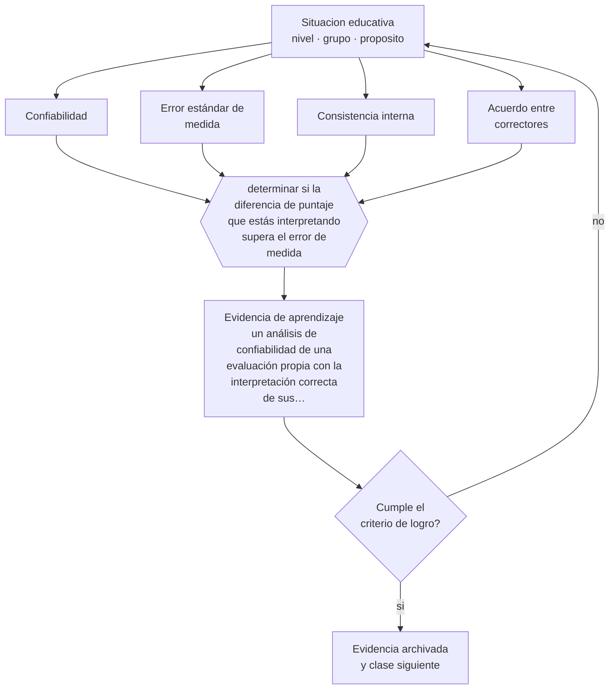

# Clase 141 — Confiabilidad

> **Parte 11 · Evaluación y psicometría** — clase 9 de 12

**Estado de evidencia:** `ROBUSTA` · **Etapa:** 🟣 Etapa C — Núcleo profesional docente · **Población de referencia:** transversal, con foco en instrumentos y decisiones 
**Decisión que habilita:** determinar si la diferencia de puntaje que estás interpretando supera el error de medida 
**Evidencia de aprendizaje:** un análisis de confiabilidad de una evaluación propia con la interpretación correcta de sus diferencias

## 🎯 Propósito

Comprender la confiabilidad y el error de medida, y su consecuencia práctica: qué diferencias entre puntajes son interpretables y cuáles están dentro del ruido.

## 📚 Resultados de aprendizaje

Al finalizar esta clase podrás:

1. **Definir** con precisión los cuatro conceptos centrales de la clase y reconocerlos en una situación educativa real, no solo en su enunciado.
2. **Explicar** cuánto de la diferencia entre dos calificaciones es aprendizaje y cuánto es error de medida.
3. **Decidir** —si la diferencia de puntaje que estás interpretando supera el error de medida— y sostener la decisión con un fundamento escrito.
4. **Producir** la evidencia de la clase —un análisis de confiabilidad de una evaluación propia con la interpretación correcta de sus diferencias— y contrastarla contra el criterio de logro.
5. **Distinguir** lo que la evidencia sostiene de lo que es práctica instalada, preferencia personal o costumbre de la institución.

## 🧩 Conceptos centrales

| Concepto | Comprensión verificable |
|---|---|
| **Confiabilidad** | consistencia de la medición; grado en que el resultado se repetiría en condiciones equivalentes |
| **Error estándar de medida** | margen de incertidumbre asociado a un puntaje individual |
| **Consistencia interna** | grado en que los ítems de una prueba miden lo mismo; se estima con coeficientes |
| **Acuerdo entre correctores** | consistencia entre personas que evalúan el mismo desempeño |

## 🗺️ Flujo de razonamiento

## 📖 Desarrollo

### 1. El fondo del asunto

Todo puntaje incluye error. La consecuencia práctica es incómoda: diferencias pequeñas entre estudiantes, o entre dos aplicaciones al mismo estudiante, pueden no significar nada. Interpretar una diferencia de dos décimas como progreso o como superioridad es un error técnico común y con consecuencias reales, porque sobre esas diferencias se toman decisiones de selección, agrupamiento y promoción.

### 2. Cómo se traduce en decisiones de enseñanza

El trabajo consiste en estimar la consistencia del instrumento y el acuerdo entre correctores cuando hay juicio humano, y usar esa información para decidir. La regla operativa: no interpretar diferencias menores que el error de medida, y no tomar decisiones importantes con una sola aplicación.

### 3. Qué sostiene la evidencia y qué no

Los coeficientes de consistencia interna se usan mal con frecuencia: dependen del número de ítems y de la homogeneidad del contenido, y un valor alto no prueba que la prueba mida una sola cosa ni que mida lo correcto. Existen alternativas más adecuadas, y en cualquier caso la confiabilidad es condición necesaria y no suficiente de la validez.

> **Cómo leer el estado de evidencia `ROBUSTA`.** Hay evidencia convergente de varios equipos, países y diseños de investigación, incluidos estudios experimentales o cuasiexperimentales, y el efecto se sostiene al replicarlo. Puedes apoyar una decisión profesional en ella, sin olvidar que ningún efecto promedio describe a un estudiante concreto.

## 🧪 Taller guiado

Aplica la clase a **uno** de los contextos siguientes y repite después el ejercicio en un
contexto de exigencia distinta. Cambiar de contexto es parte del aprendizaje: lo que funciona
con un grupo no se traslada intacto a otro.

| Contexto | Rasgo que cambia la decisión |
|---|---|
| Evaluación de aula de baja consecuencia | prioriza información para enseñar |
| Evaluación sumativa que decide promoción | la exigencia técnica sube con la consecuencia |
| Evaluación de desempeño en taller o práctica | la rúbrica y el calibrado son el instrumento |
| Evaluación estandarizada externa | hay que leer el informe técnico, no el titular |
| Evaluación en línea | seguridad, integridad y equivalencia de condiciones |
| Evaluación con estudiantes con NEE | adecuación sin invalidar la inferencia |

**Secuencia de trabajo:**

1. Delimita el contexto: nivel, edad, tamaño del grupo, asignatura o experiencia y tiempo real disponible.
2. Declara qué saben ya los estudiantes y **cómo lo comprobaste**, no cómo lo supones.
3. Formula la decisión pedagógica que esta clase habilita y escribe su fundamento.
4. Anticipa qué observarías si la decisión funciona y qué observarías si no funciona.
5. Diseña de antemano la alternativa que aplicarás si la primera estrategia falla.
6. Ejecuta o simula, y registra lo observado con fecha, contexto y evidencia concreta.
7. Produce la evidencia de aprendizaje de la clase.
8. Contrástala contra el criterio de logro, corrige y recién entonces avanza.

### 📦 Evidencia de aprendizaje

Un análisis de confiabilidad de una evaluación propia con la interpretación correcta de sus diferencias.

Debe incluir contexto, decisión, fundamento, fuentes consultadas con su fecha, indicador de
logro observable, riesgos previstos y qué harías distinto en la siguiente iteración.

## 🏆 Reto verificable

Estima el acuerdo entre correctores de una evaluación con juicio humano. Analiza qué decisiones tomabas con diferencias que están dentro del error.

## ✅ Criterio de logro

- [ ] el análisis reporta una estimación de consistencia y su interpretación correcta;
- [ ] las decisiones propuestas consideran el error de medida;
- [ ] cada afirmación sobre «lo que funciona» está atribuida a una fuente identificable, con autor y fecha;
- [ ] la decisión es ejecutable con el tiempo, el espacio, el número de estudiantes y los recursos que realmente tienes;
- [ ] la evidencia queda archivada de forma reproducible: otra persona podría revisarla sin que tú se la expliques.

## ⚠️ Errores frecuentes

**Propios de esta clase:**

- Interpretar diferencias de puntaje menores que el error de medida.
- Usar un coeficiente de consistencia interna como prueba de calidad del instrumento.

**Característicos de la parte 11:**

- Atribuir validez al instrumento en vez de a la interpretación y al uso.
- Usar el alfa de Cronbach como sello de calidad sin revisar sus supuestos.

## ♿ Diversidad, accesibilidad y ética

Las decisiones de selección basadas en diferencias mínimas afectan de forma desproporcionada a quienes están cerca del punto de corte, que suelen ser estudiantes en desventaja. Reconocer el error de medida es una exigencia de justicia además de técnica.

Antes de aplicar cualquier decisión de esta clase con estudiantes reales, revisa el
[protocolo de práctica responsable](../../../docs/ETICA_Y_PRACTICA_RESPONSABLE.md):
consentimiento, resguardo de datos personales, proporcionalidad de la intervención y derecho
de cada estudiante a no ser objeto de un ensayo que no le reporta beneficio.

## ❓ Preguntas de comprobación

1. ¿Qué diferencia de puntaje estás tratando como significativa?
2. ¿Cuánto varía la nota del mismo trabajo entre dos correctores?
3. ¿Qué decisión estás tomando con una sola medición?

## 📕 Lecturas base

**AERA, APA & NCME (2014). *Standards for Educational and Psychological Testing*.**  
*Qué aporta a esta clase:* define confiabilidad y error de medida y su relación con el uso de los puntajes.

**McNeish, D. (2018). *Thanks Coefficient Alpha, We'll Take It From Here*. Psychological Methods, 23(3).**  
*Qué aporta a esta clase:* expone los problemas del alfa y las alternativas disponibles.

Catálogo completo: [bibliografía del programa](../../../docs/BIBLIOGRAFIA.md) ·
[glosario](../../../docs/GLOSARIO.md) ·
[fuentes oficiales y cómo leerlas](../../../docs/FUENTES.md).

## 🔗 Conexión con el resto del programa

Complementa la clase 140 y sostiene la interpretación técnica de la clase 143.

> [!IMPORTANT]
> Material de formación profesional. No reemplaza un título de pedagogía, una habilitación
> legal para ejercer, ni el juicio de un equipo educativo que conoce a sus estudiantes.

---

| Anterior | Índice | Siguiente |
|---|---|---|
| [← 140 · Validez](../class-08-validez/README.md) | [Parte 11](../README.md) · [Programa](../../../README.md) | [142 · Análisis de dificultad y discriminación →](../class-10-analisis-de-dificultad-y-discriminacion/README.md) |
