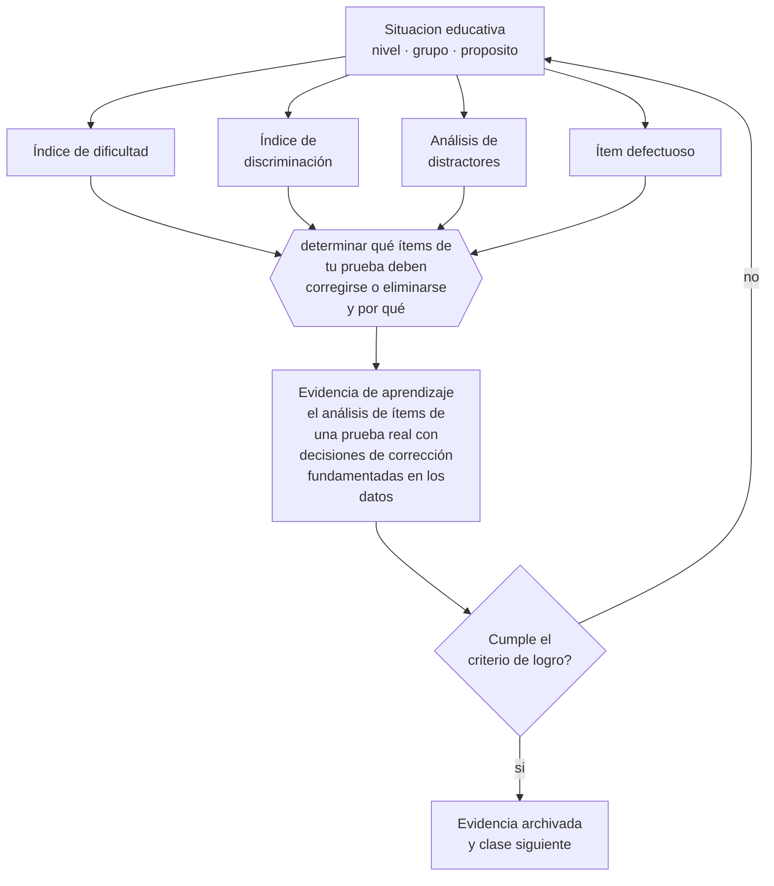

# Clase 142 — Análisis de dificultad y discriminación

> **Parte 11 · Evaluación y psicometría** — clase 10 de 12

**Estado de evidencia:** `ROBUSTA` · **Etapa:** 🟣 Etapa C — Núcleo profesional docente · **Población de referencia:** transversal, con foco en instrumentos y decisiones 
**Decisión que habilita:** determinar qué ítems de tu prueba deben corregirse o eliminarse y por qué 
**Evidencia de aprendizaje:** el análisis de ítems de una prueba real con decisiones de corrección fundamentadas en los datos

## 🎯 Propósito

Analizar técnicamente una prueba aplicada: dificultad, discriminación, comportamiento de distractores y detección de ítems defectuosos, para corregir el instrumento.

## 📚 Resultados de aprendizaje

Al finalizar esta clase podrás:

1. **Definir** con precisión los cuatro conceptos centrales de la clase y reconocerlos en una situación educativa real, no solo en su enunciado.
2. **Explicar** qué te dicen los datos de una prueba aplicada sobre la calidad de sus preguntas.
3. **Decidir** —qué ítems de tu prueba deben corregirse o eliminarse y por qué— y sostener la decisión con un fundamento escrito.
4. **Producir** la evidencia de la clase —el análisis de ítems de una prueba real con decisiones de corrección fundamentadas en los datos— y contrastarla contra el criterio de logro.
5. **Distinguir** lo que la evidencia sostiene de lo que es práctica instalada, preferencia personal o costumbre de la institución.

## 🧩 Conceptos centrales

| Concepto | Comprensión verificable |
|---|---|
| **Índice de dificultad** | proporción de estudiantes que responde correctamente un ítem |
| **Índice de discriminación** | capacidad del ítem de diferenciar entre quienes dominan y quienes no el contenido |
| **Análisis de distractores** | revisión de qué alternativas incorrectas fueron elegidas y por quiénes |
| **Ítem defectuoso** | pregunta con discriminación nula o negativa, que introduce ruido en el puntaje |

## 🗺️ Flujo de razonamiento

## 📖 Desarrollo

### 1. El fondo del asunto

Una prueba aplicada contiene información valiosa sobre sí misma. Un ítem que casi todos responden bien aporta poca información; uno que casi nadie responde bien puede estar mal formulado o evaluar algo no enseñado; y uno con discriminación negativa —que los mejores fallan más que los peores— casi siempre está mal construido o tiene clave incorrecta. Detectar esos casos toma minutos y mejora el instrumento de inmediato.

### 2. Cómo se traduce en decisiones de enseñanza

El análisis se puede hacer con una planilla: proporción de aciertos por ítem, comparación entre el tercio superior y el inferior, y frecuencia de elección de cada distractor. Los distractores que nadie elige no aportan nada; los que atraen a los estudiantes de mejor desempeño indican ambigüedad. Con esa información se corrige la prueba para su próxima aplicación.

### 3. Qué sostiene la evidencia y qué no

Con grupos pequeños los índices son inestables y deben interpretarse con cautela: en un curso de treinta, las diferencias entre tercios son muy sensibles a pocos casos. Además, la dificultad óptima depende del propósito: una prueba de dominio puede y debe tener ítems fáciles si el criterio es que todos los logren.

> **Cómo leer el estado de evidencia `ROBUSTA`.** Hay evidencia convergente de varios equipos, países y diseños de investigación, incluidos estudios experimentales o cuasiexperimentales, y el efecto se sostiene al replicarlo. Puedes apoyar una decisión profesional en ella, sin olvidar que ningún efecto promedio describe a un estudiante concreto.

## 🧪 Taller guiado

Aplica la clase a **uno** de los contextos siguientes y repite después el ejercicio en un
contexto de exigencia distinta. Cambiar de contexto es parte del aprendizaje: lo que funciona
con un grupo no se traslada intacto a otro.

| Contexto | Rasgo que cambia la decisión |
|---|---|
| Evaluación de aula de baja consecuencia | prioriza información para enseñar |
| Evaluación sumativa que decide promoción | la exigencia técnica sube con la consecuencia |
| Evaluación de desempeño en taller o práctica | la rúbrica y el calibrado son el instrumento |
| Evaluación estandarizada externa | hay que leer el informe técnico, no el titular |
| Evaluación en línea | seguridad, integridad y equivalencia de condiciones |
| Evaluación con estudiantes con NEE | adecuación sin invalidar la inferencia |

**Secuencia de trabajo:**

1. Delimita el contexto: nivel, edad, tamaño del grupo, asignatura o experiencia y tiempo real disponible.
2. Declara qué saben ya los estudiantes y **cómo lo comprobaste**, no cómo lo supones.
3. Formula la decisión pedagógica que esta clase habilita y escribe su fundamento.
4. Anticipa qué observarías si la decisión funciona y qué observarías si no funciona.
5. Diseña de antemano la alternativa que aplicarás si la primera estrategia falla.
6. Ejecuta o simula, y registra lo observado con fecha, contexto y evidencia concreta.
7. Produce la evidencia de aprendizaje de la clase.
8. Contrástala contra el criterio de logro, corrige y recién entonces avanza.

### 📦 Evidencia de aprendizaje

El análisis de ítems de una prueba real con decisiones de corrección fundamentadas en los datos.

Debe incluir contexto, decisión, fundamento, fuentes consultadas con su fecha, indicador de
logro observable, riesgos previstos y qué harías distinto en la siguiente iteración.

## 🏆 Reto verificable

Analiza los ítems de una prueba aplicada. Corrige los defectuosos y compara los índices en la siguiente aplicación.

## ✅ Criterio de logro

- [ ] el análisis reporta dificultad, discriminación y comportamiento de distractores;
- [ ] cada decisión de corrección está fundamentada en los datos y no en la impresión;
- [ ] cada afirmación sobre «lo que funciona» está atribuida a una fuente identificable, con autor y fecha;
- [ ] la decisión es ejecutable con el tiempo, el espacio, el número de estudiantes y los recursos que realmente tienes;
- [ ] la evidencia queda archivada de forma reproducible: otra persona podría revisarla sin que tú se la expliques.

## ⚠️ Errores frecuentes

**Propios de esta clase:**

- Eliminar un ítem difícil sin revisar si el problema fue de enseñanza y no de construcción.
- Interpretar índices de un curso pequeño como si fueran estables.

**Característicos de la parte 11:**

- Atribuir validez al instrumento en vez de a la interpretación y al uso.
- Usar el alfa de Cronbach como sello de calidad sin revisar sus supuestos.

## ♿ Diversidad, accesibilidad y ética

El análisis por subgrupos permite detectar ítems que funcionan distinto para estudiantes con la misma competencia pero distinto origen o lengua. Revisarlo es parte del control de sesgo en cualquier instrumento con consecuencias.

Antes de aplicar cualquier decisión de esta clase con estudiantes reales, revisa el
[protocolo de práctica responsable](../../../docs/ETICA_Y_PRACTICA_RESPONSABLE.md):
consentimiento, resguardo de datos personales, proporcionalidad de la intervención y derecho
de cada estudiante a no ser objeto de un ensayo que no le reporta beneficio.

## ❓ Preguntas de comprobación

1. ¿Qué ítem tuyo tiene discriminación negativa y por qué?
2. ¿Qué distractor no eligió nadie y qué dice eso del ítem?
3. ¿Un ítem que casi todos fallaron estaba mal hecho o mal enseñado?

## 📕 Lecturas base

**Crocker, L. & Algina (1986). *Introduction to Classical and Modern Test Theory*.**  
*Qué aporta a esta clase:* tratamiento estándar del análisis de ítems en teoría clásica.

**Haladyna, T. (2004). *Developing and Validating Multiple-Choice Test Items*.**  
*Qué aporta a esta clase:* conecta construcción y análisis de ítems con criterios prácticos.

Catálogo completo: [bibliografía del programa](../../../docs/BIBLIOGRAFIA.md) ·
[glosario](../../../docs/GLOSARIO.md) ·
[fuentes oficiales y cómo leerlas](../../../docs/FUENTES.md).

## 🔗 Conexión con el resto del programa

Cierra el ciclo de la clase 137 y prepara los conceptos de la clase 143.

> [!IMPORTANT]
> Material de formación profesional. No reemplaza un título de pedagogía, una habilitación
> legal para ejercer, ni el juicio de un equipo educativo que conoce a sus estudiantes.

---

| Anterior | Índice | Siguiente |
|---|---|---|
| [← 141 · Confiabilidad](../class-09-confiabilidad/README.md) | [Parte 11](../README.md) · [Programa](../../../README.md) | [143 · Introducción a teoría clásica e IRT →](../class-11-introduccion-a-teoria-clasica-e-irt/README.md) |
