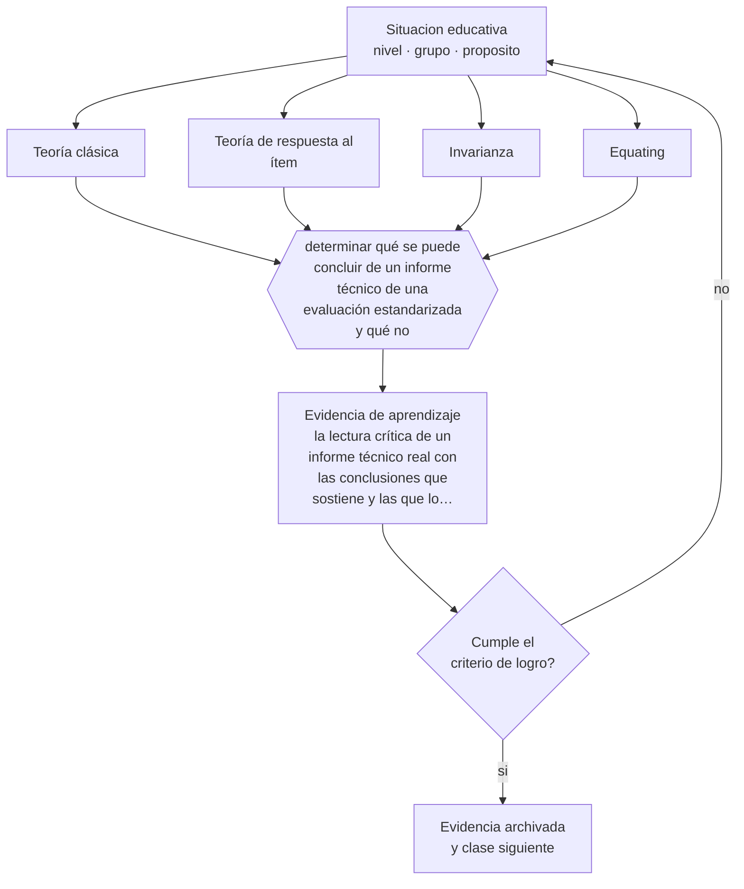

# Clase 143 — Introducción a teoría clásica e IRT

> **Parte 11 · Evaluación y psicometría** — clase 11 de 12

**Estado de evidencia:** `ROBUSTA` · **Etapa:** 🟣 Etapa C — Núcleo profesional docente · **Población de referencia:** transversal, con foco en instrumentos y decisiones 
**Decisión que habilita:** determinar qué se puede concluir de un informe técnico de una evaluación estandarizada y qué no 
**Evidencia de aprendizaje:** la lectura crítica de un informe técnico real con las conclusiones que sostiene y las que lo exceden

## 🎯 Propósito

Comprender los fundamentos de la teoría clásica y de la teoría de respuesta al ítem para leer críticamente informes técnicos de evaluaciones estandarizadas nacionales e internacionales.

## 📚 Resultados de aprendizaje

Al finalizar esta clase podrás:

1. **Definir** con precisión los cuatro conceptos centrales de la clase y reconocerlos en una situación educativa real, no solo en su enunciado.
2. **Explicar** qué permite hacer la teoría de respuesta al ítem que la teoría clásica no puede.
3. **Decidir** —qué se puede concluir de un informe técnico de una evaluación estandarizada y qué no— y sostener la decisión con un fundamento escrito.
4. **Producir** la evidencia de la clase —la lectura crítica de un informe técnico real con las conclusiones que sostiene y las que lo exceden— y contrastarla contra el criterio de logro.
5. **Distinguir** lo que la evidencia sostiene de lo que es práctica instalada, preferencia personal o costumbre de la institución.

## 🧩 Conceptos centrales

| Concepto | Comprensión verificable |
|---|---|
| **Teoría clásica** | modelo en que el puntaje observado es la suma de puntaje verdadero y error; sus índices dependen de la muestra |
| **Teoría de respuesta al ítem** | modelo que estima habilidad de la persona y parámetros del ítem en una misma escala |
| **Invarianza** | propiedad por la cual los parámetros no dependen de la muestra particular usada |
| **Equating** | procedimiento que hace comparables puntajes de formas distintas de una prueba |

## 🗺️ Flujo de razonamiento

## 📖 Desarrollo

### 1. El fondo del asunto

La teoría clásica es simple y suficiente para el trabajo de aula, con una limitación importante: sus índices dependen de la muestra, de modo que la dificultad de un ítem cambia según a quién se aplicó. La teoría de respuesta al ítem sitúa habilidad y dificultad en una misma escala y permite comparar entre formas distintas y entre años, que es lo que hace posible afirmar que un sistema mejoró.

### 2. Cómo se traduce en decisiones de enseñanza

El uso profesional para la mayoría de los docentes no es aplicar estos modelos sino leer informes que los usan. Saber qué significa un puntaje en escala, qué es el equating y qué supone la invarianza permite interpretar los resultados nacionales sin comprar la lectura simplificada del titular ni descartarlos por desconfianza.

### 3. Qué sostiene la evidencia y qué no

Los modelos tienen supuestos fuertes —unidimensionalidad, independencia local— que rara vez se cumplen del todo, y su violación afecta las conclusiones. Además, la sofisticación técnica no corrige problemas de validez: una prueba técnicamente impecable puede estar midiendo un constructo mal definido.

> **Cómo leer el estado de evidencia `ROBUSTA`.** Hay evidencia convergente de varios equipos, países y diseños de investigación, incluidos estudios experimentales o cuasiexperimentales, y el efecto se sostiene al replicarlo. Puedes apoyar una decisión profesional en ella, sin olvidar que ningún efecto promedio describe a un estudiante concreto.

## 🧪 Taller guiado

Aplica la clase a **uno** de los contextos siguientes y repite después el ejercicio en un
contexto de exigencia distinta. Cambiar de contexto es parte del aprendizaje: lo que funciona
con un grupo no se traslada intacto a otro.

| Contexto | Rasgo que cambia la decisión |
|---|---|
| Evaluación de aula de baja consecuencia | prioriza información para enseñar |
| Evaluación sumativa que decide promoción | la exigencia técnica sube con la consecuencia |
| Evaluación de desempeño en taller o práctica | la rúbrica y el calibrado son el instrumento |
| Evaluación estandarizada externa | hay que leer el informe técnico, no el titular |
| Evaluación en línea | seguridad, integridad y equivalencia de condiciones |
| Evaluación con estudiantes con NEE | adecuación sin invalidar la inferencia |

**Secuencia de trabajo:**

1. Delimita el contexto: nivel, edad, tamaño del grupo, asignatura o experiencia y tiempo real disponible.
2. Declara qué saben ya los estudiantes y **cómo lo comprobaste**, no cómo lo supones.
3. Formula la decisión pedagógica que esta clase habilita y escribe su fundamento.
4. Anticipa qué observarías si la decisión funciona y qué observarías si no funciona.
5. Diseña de antemano la alternativa que aplicarás si la primera estrategia falla.
6. Ejecuta o simula, y registra lo observado con fecha, contexto y evidencia concreta.
7. Produce la evidencia de aprendizaje de la clase.
8. Contrástala contra el criterio de logro, corrige y recién entonces avanza.

### 📦 Evidencia de aprendizaje

La lectura crítica de un informe técnico real con las conclusiones que sostiene y las que lo exceden.

Debe incluir contexto, decisión, fundamento, fuentes consultadas con su fecha, indicador de
logro observable, riesgos previstos y qué harías distinto en la siguiente iteración.

## 🏆 Reto verificable

Lee el informe técnico de una evaluación nacional y contrasta sus conclusiones con la cobertura de prensa. Documenta las tres afirmaciones que la prensa no puede sostener.

## ✅ Criterio de logro

- [ ] la lectura distingue conclusiones respaldadas por el informe de interpretaciones que lo exceden;
- [ ] identifica al menos un supuesto del modelo y su posible incumplimiento;
- [ ] cada afirmación sobre «lo que funciona» está atribuida a una fuente identificable, con autor y fecha;
- [ ] la decisión es ejecutable con el tiempo, el espacio, el número de estudiantes y los recursos que realmente tienes;
- [ ] la evidencia queda archivada de forma reproducible: otra persona podría revisarla sin que tú se la expliques.

## ⚠️ Errores frecuentes

**Propios de esta clase:**

- Interpretar puntajes en escala como si fueran porcentajes de logro.
- Suponer que la sofisticación técnica del modelo garantiza la validez del constructo.

**Característicos de la parte 11:**

- Atribuir validez al instrumento en vez de a la interpretación y al uso.
- Usar el alfa de Cronbach como sello de calidad sin revisar sus supuestos.

## ♿ Diversidad, accesibilidad y ética

Los análisis de funcionamiento diferencial de ítems son la herramienta técnica para detectar sesgo cultural o lingüístico en pruebas de gran escala. Saber que existen permite exigir su reporte en cualquier evaluación con consecuencias.

Antes de aplicar cualquier decisión de esta clase con estudiantes reales, revisa el
[protocolo de práctica responsable](../../../docs/ETICA_Y_PRACTICA_RESPONSABLE.md):
consentimiento, resguardo de datos personales, proporcionalidad de la intervención y derecho
de cada estudiante a no ser objeto de un ensayo que no le reporta beneficio.

## ❓ Preguntas de comprobación

1. ¿Qué significa realmente el puntaje que están comparando entre años?
2. ¿Qué supuesto del modelo podría no cumplirse en esta población?
3. ¿Qué afirmación del informe de prensa no está en el informe técnico?

## 📕 Lecturas base

**Embretson, S. & Reise, S. (2000). *Item Response Theory for Psychologists*.**  
*Qué aporta a esta clase:* introducción accesible y rigurosa a los modelos y sus supuestos.

**Agencia de Calidad de la Educación (Chile). *Informes técnicos de las evaluaciones nacionales*.**  
*Qué aporta a esta clase:* material real para practicar la lectura crítica con datos del propio sistema.

Catálogo completo: [bibliografía del programa](../../../docs/BIBLIOGRAFIA.md) ·
[glosario](../../../docs/GLOSARIO.md) ·
[fuentes oficiales y cómo leerlas](../../../docs/FUENTES.md).

## 🔗 Conexión con el resto del programa

Cierra la formación técnica de la parte y se conecta con la clase 011 sobre indicadores de calidad.

> [!IMPORTANT]
> Material de formación profesional. No reemplaza un título de pedagogía, una habilitación
> legal para ejercer, ni el juicio de un equipo educativo que conoce a sus estudiantes.

---

| Anterior | Índice | Siguiente |
|---|---|---|
| [← 142 · Análisis de dificultad y discriminación](../class-10-analisis-de-dificultad-y-discriminacion/README.md) | [Parte 11](../README.md) · [Programa](../../../README.md) | [144 · Proyecto integrador: sistema de evaluación →](../class-12-proyecto-integrador-sistema-de-evaluacion/README.md) |
