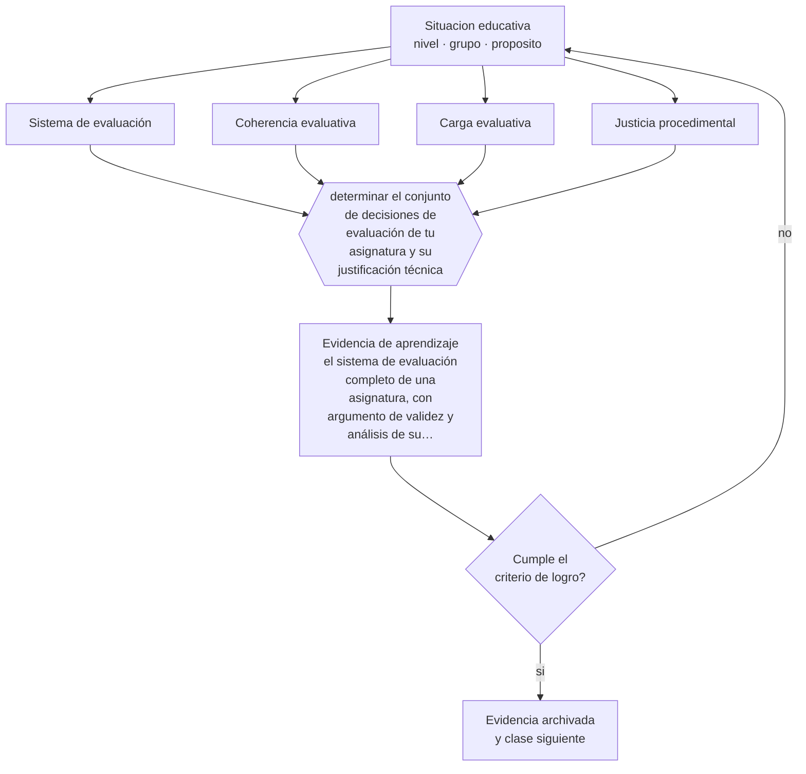

# Clase 144 — Proyecto integrador: sistema de evaluación

> **Parte 11 · Evaluación y psicometría** — clase 12 de 12

**Estado de evidencia:** `CONSISTENTE` · **Etapa:** 🟣 Etapa C — Núcleo profesional docente · **Población de referencia:** transversal, con foco en instrumentos y decisiones 
**Decisión que habilita:** determinar el conjunto de decisiones de evaluación de tu asignatura y su justificación técnica 
**Evidencia de aprendizaje:** el sistema de evaluación completo de una asignatura, con argumento de validez y análisis de su primera aplicación

## 🎯 Propósito

Integrar la parte diseñando el sistema de evaluación completo de una asignatura: propósitos, instrumentos, calendario, criterios, retroalimentación y argumento de validez.

## 📚 Resultados de aprendizaje

Al finalizar esta clase podrás:

1. **Definir** con precisión los cuatro conceptos centrales de la clase y reconocerlos en una situación educativa real, no solo en su enunciado.
2. **Explicar** cómo se construye un sistema de evaluación coherente en vez de una colección de instrumentos.
3. **Decidir** —el conjunto de decisiones de evaluación de tu asignatura y su justificación técnica— y sostener la decisión con un fundamento escrito.
4. **Producir** la evidencia de la clase —el sistema de evaluación completo de una asignatura, con argumento de validez y análisis de su primera aplicación— y contrastarla contra el criterio de logro.
5. **Distinguir** lo que la evidencia sostiene de lo que es práctica instalada, preferencia personal o costumbre de la institución.

## 🧩 Conceptos centrales

| Concepto | Comprensión verificable |
|---|---|
| **Sistema de evaluación** | conjunto articulado de propósitos, instrumentos y decisiones a lo largo de un curso |
| **Coherencia evaluativa** | correspondencia entre resultados declarados, instrumentos y decisiones tomadas |
| **Carga evaluativa** | tiempo total que la evaluación consume al estudiante y al docente |
| **Justicia procedimental** | condiciones —criterios públicos, reglas conocidas, vías de revisión— que hacen defendible el sistema |

## 🗺️ Flujo de razonamiento

## 📖 Desarrollo

### 1. El fondo del asunto

Un sistema de evaluación no es la suma de sus instrumentos: es una decisión sobre qué se mide, cuándo, con qué consecuencia y qué información devuelve a quién. Los sistemas mal diseñados concentran todo al final, evalúan lo mismo tres veces, dejan aprendizajes declarados sin medir y consumen más tiempo del que aportan. La coherencia se comprueba recorriendo la asignatura completa.

### 2. Cómo se traduce en decisiones de enseñanza

El diseño articula lo diagnóstico, lo formativo y lo sumativo con propósitos distintos y sin confundirlos; calendariza para que la retroalimentación llegue a tiempo de ser usada; y declara criterios y vías de revisión. La carga evaluativa debe calcularse: en muchos programas la evaluación consume más tiempo del estudiante que el estudio.

### 3. Qué sostiene la evidencia y qué no

Un sistema bien diseñado mejora la calidad de la información y no garantiza aprendizaje. Y toda evaluación tiene efectos secundarios: orienta el estudio, define lo que se considera importante y produce ansiedad. Diseñar es también decidir qué efectos secundarios se está dispuesto a aceptar.

> **Cómo leer el estado de evidencia `CONSISTENTE`.** La evidencia es amplia y coherente, pero proviene sobre todo de estudios correlacionales, de síntesis con heterogeneidad alta o de contextos distintos al tuyo. Sirve para orientar la decisión y exige que compruebes el efecto en tu propio grupo.

## 🧪 Taller guiado

Aplica la clase a **uno** de los contextos siguientes y repite después el ejercicio en un
contexto de exigencia distinta. Cambiar de contexto es parte del aprendizaje: lo que funciona
con un grupo no se traslada intacto a otro.

| Contexto | Rasgo que cambia la decisión |
|---|---|
| Evaluación de aula de baja consecuencia | prioriza información para enseñar |
| Evaluación sumativa que decide promoción | la exigencia técnica sube con la consecuencia |
| Evaluación de desempeño en taller o práctica | la rúbrica y el calibrado son el instrumento |
| Evaluación estandarizada externa | hay que leer el informe técnico, no el titular |
| Evaluación en línea | seguridad, integridad y equivalencia de condiciones |
| Evaluación con estudiantes con NEE | adecuación sin invalidar la inferencia |

**Secuencia de trabajo:**

1. Delimita el contexto: nivel, edad, tamaño del grupo, asignatura o experiencia y tiempo real disponible.
2. Declara qué saben ya los estudiantes y **cómo lo comprobaste**, no cómo lo supones.
3. Formula la decisión pedagógica que esta clase habilita y escribe su fundamento.
4. Anticipa qué observarías si la decisión funciona y qué observarías si no funciona.
5. Diseña de antemano la alternativa que aplicarás si la primera estrategia falla.
6. Ejecuta o simula, y registra lo observado con fecha, contexto y evidencia concreta.
7. Produce la evidencia de aprendizaje de la clase.
8. Contrástala contra el criterio de logro, corrige y recién entonces avanza.

### 📦 Evidencia de aprendizaje

El sistema de evaluación completo de una asignatura, con argumento de validez y análisis de su primera aplicación.

Debe incluir contexto, decisión, fundamento, fuentes consultadas con su fecha, indicador de
logro observable, riesgos previstos y qué harías distinto en la siguiente iteración.

## 🏆 Reto verificable

Diseña el sistema completo, aplícalo un semestre y analiza su primera aplicación: cobertura, carga, uso de la retroalimentación y decisiones tomadas.

## ✅ Criterio de logro

- [ ] el sistema cubre todos los resultados declarados sin redundancia innecesaria;
- [ ] incluye argumento de validez para las evaluaciones con mayor consecuencia;
- [ ] cada afirmación sobre «lo que funciona» está atribuida a una fuente identificable, con autor y fecha;
- [ ] la decisión es ejecutable con el tiempo, el espacio, el número de estudiantes y los recursos que realmente tienes;
- [ ] la evidencia queda archivada de forma reproducible: otra persona podría revisarla sin que tú se la expliques.

## ⚠️ Errores frecuentes

**Propios de esta clase:**

- Acumular instrumentos sin revisar la carga total ni la redundancia entre ellos.
- Diseñar el sistema sin declarar criterios públicos ni vías de revisión.

**Característicos de la parte 11:**

- Atribuir validez al instrumento en vez de a la interpretación y al uso.
- Usar el alfa de Cronbach como sello de calidad sin revisar sus supuestos.

## ♿ Diversidad, accesibilidad y ética

Un sistema justo declara de antemano las adecuaciones disponibles, sus condiciones y su procedimiento, de modo que el estudiante no dependa de la buena voluntad del docente de turno para acceder a ellas.

Antes de aplicar cualquier decisión de esta clase con estudiantes reales, revisa el
[protocolo de práctica responsable](../../../docs/ETICA_Y_PRACTICA_RESPONSABLE.md):
consentimiento, resguardo de datos personales, proporcionalidad de la intervención y derecho
de cada estudiante a no ser objeto de un ensayo que no le reporta beneficio.

## ❓ Preguntas de comprobación

1. ¿Qué resultado de tu asignatura no se evalúa nunca?
2. ¿Cuánto tiempo del estudiante consume tu sistema de evaluación?
3. ¿Qué vía tiene un estudiante para impugnar una calificación en tu curso?

## 📕 Lecturas base

**AERA, APA & NCME (2014). *Standards for Educational and Psychological Testing*.**  
*Qué aporta a esta clase:* referencia técnica para sostener el sistema en sus componentes de mayor consecuencia.

**Boud, D. & Molloy, E. (2013). *Rethinking Models of Feedback for Learning*.**  
*Qué aporta a esta clase:* articula evaluación y retroalimentación como sistema y no como eventos separados.

Catálogo completo: [bibliografía del programa](../../../docs/BIBLIOGRAFIA.md) ·
[glosario](../../../docs/GLOSARIO.md) ·
[fuentes oficiales y cómo leerlas](../../../docs/FUENTES.md).

## 🔗 Conexión con el resto del programa

Cierra la parte 11 integrando sus once clases previas y se conecta con las partes 09, 14 y 15.

> [!IMPORTANT]
> Material de formación profesional. No reemplaza un título de pedagogía, una habilitación
> legal para ejercer, ni el juicio de un equipo educativo que conoce a sus estudiantes.

---

| Anterior | Índice | Siguiente |
|---|---|---|
| [← 143 · Introducción a teoría clásica e IRT](../class-11-introduccion-a-teoria-clasica-e-irt/README.md) | [Parte 11](../README.md) · [Programa](../../../README.md) | [Programa completo →](../../../README.md) |
