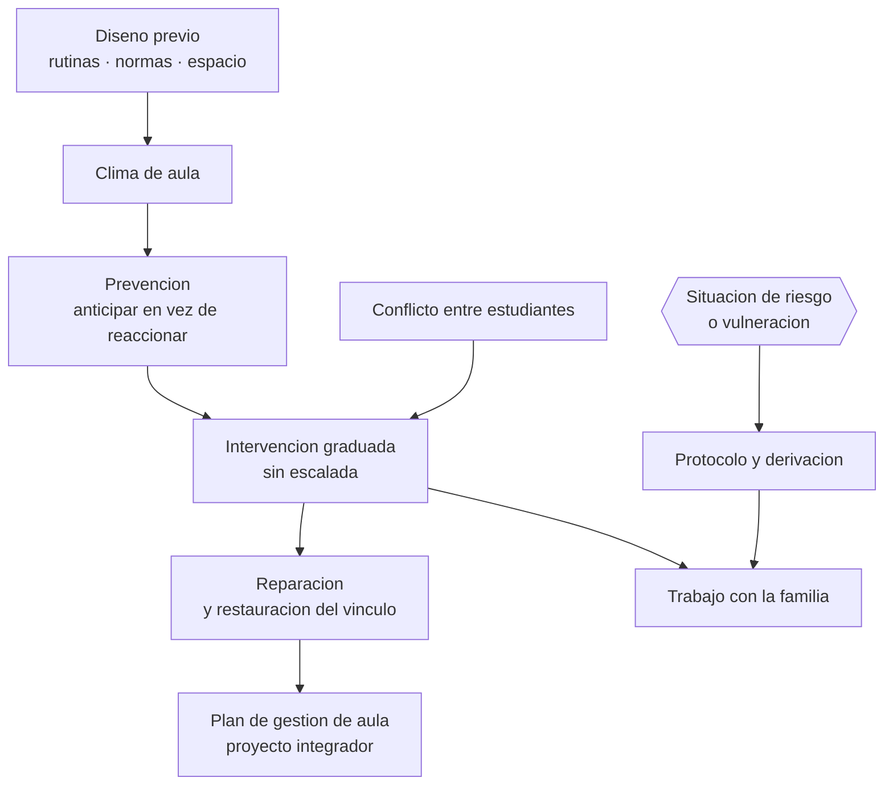

# Parte 12 — Gestión del aula y convivencia

> *El orden no se impone al inicio: se diseña antes y se sostiene todos los días*

🟣 **Etapa C — Núcleo profesional docente** · salida de la etapa: diseñar, enseñar, evaluar y gestionar un curso completo con evidencia

**Clases:** 12 (145–156) · **Población de referencia:** transversal, con foco escolar · **Conceptos operacionales:** 48 · **Señales observables:** 36 
**Contenido central:** Clima de aula, normas y rutinas, prevención de conducta, refuerzo y consecuencias, comunicación docente, conflictos, desmotivación, integridad académica, celulares, trabajo con apoderados y crisis

## 🎯 De qué trata esta parte

La investigación sobre gestión de aula converge en un hallazgo poco intuitivo: los docentes con menos problemas de conducta no son los que reaccionan mejor, sino los que previenen más. La diferencia se juega en decisiones tomadas antes de que ocurra nada —cómo se entra a la sala, qué se hace en los primeros dos minutos, cómo se piden los materiales, cómo se transita entre actividades— y en la capacidad de percibir lo que pasa en toda la sala mientras se atiende a una persona.

El segundo eje es la distinción entre norma, límite y sanción. Una norma se enseña como se enseña cualquier contenido: se explica, se modela, se practica y se corrige. Un límite se sostiene sin escalada emocional. Una sanción, cuando corresponde, debe ser proporcional, previsible y reparadora. Los establecimientos que confunden estos tres niveles terminan con reglamentos extensos y prácticas arbitrarias, que es la combinación que más deteriora el clima.

En Chile la convivencia escolar está regulada: hay obligación de contar con reglamento interno, protocolos de actuación ante situaciones específicas, encargado de convivencia y procedimientos con debido proceso. Conocer ese marco no es burocracia defensiva: es lo que permite actuar rápido sin vulnerar derechos, y lo que protege tanto al estudiante como al docente cuando una situación se vuelve grave.

## 🏫 Caso de la parte

Las doce clases trabajan sobre la misma realidad, para que puedas ver cómo cambia tu diagnóstico
a medida que avanzas:

> En 8.º básico se registran 23 anotaciones en un mes, casi todas en los mismos cuatro estudiantes y casi todas en los primeros diez minutos de clase. El reglamento se aplica con criterios distintos según el docente.

**Artefacto que produces al terminar:** plan de gestión de aula con rutinas enseñadas, escala de intervención graduada, protocolos y indicadores de clima.

## 📚 Resultados de la parte

Al terminar esta parte podrás:

1. **Diseñar el sistema de rutinas y normas de un curso antes de que empiece el año**.
2. **Intervenir una conducta disruptiva sin escalada y sin dañar el vínculo**.
3. **Distinguir conflicto, falta y situación de riesgo, y activar la respuesta correspondiente**.
4. **Conducir una entrevista difícil con un apoderado con registro y acuerdos verificables**.

## 🗺️ Mapa de la parte

## 🧠 Marco de referencia

- prevención y organización del aula como determinantes del clima
- prácticas restaurativas y sistemas de apoyo conductual positivo
- comunicación docente y manejo de conflictos sin escalada
- normativa chilena de convivencia escolar, reglamento interno y protocolos

**Autoras y autores que conviene conocer:** Jacob Kounin, Carolyn Evertson y Edmund Emmer, Robert Marzano, equipos de prácticas restaurativas, Superintendencia de Educación y Política Nacional de Convivencia Educativa

## 📋 Las 12 clases

| # | Clase | Decisión que habilita | Evidencia |
|---:|---|---|---|
| 145 | [Clima de aula](class-01-clima-de-aula/README.md) | determinar qué decisión concreta vas a modificar para mejorar el clima de tu curso | `CONSISTENTE` |
| 146 | [Normas y rutinas](class-02-normas-y-rutinas/README.md) | determinar qué normas y rutinas vas a enseñar explícitamente y cómo verificarás su instalación | `CONSISTENTE` |
| 147 | [Prevención de problemas de conducta](class-03-prevencion-de-problemas-de-conducta/README.md) | determinar qué momento de tu clase concentra los problemas y qué decisión previa lo eliminaría | `CONSISTENTE` |
| 148 | [Refuerzo y consecuencias](class-04-refuerzo-y-consecuencias/README.md) | determinar qué consecuencia corresponde a una conducta y cómo evitarás depender de ella | `CONSISTENTE` |
| 149 | [Comunicación docente](class-05-comunicacion-docente/README.md) | determinar el guion que usarás en las tres situaciones de tensión más frecuentes de tu práctica | `PRACTICA-PROFESIONAL` |
| 150 | [Conflictos entre estudiantes](class-06-conflictos-entre-estudiantes/README.md) | determinar si la situación es un conflicto mediable, un caso de hostigamiento o una vulneración que exige protocolo | `EMERGENTE` |
| 151 | [Desmotivación y resistencia](class-07-desmotivacion-y-resistencia/README.md) | determinar qué está protegiendo la resistencia de tu estudiante y qué condición debe cambiar primero | `CONSISTENTE` |
| 152 | [Copias, plagio e integridad](class-08-copias-plagio-e-integridad/README.md) | determinar qué evaluaciones de tu curso son insostenibles hoy y con qué las reemplazas | `EN-DEBATE` |
| 153 | [Uso de celulares y distracciones](class-09-uso-de-celulares-y-distracciones/README.md) | determinar qué política de dispositivos aplicarás y cómo la sostendrás sin desgastar la relación | `EN-DEBATE` |
| 154 | [Trabajo con apoderados](class-10-trabajo-con-apoderados/README.md) | determinar qué acuerdo concreto necesitas de esta entrevista y cómo lo verificarás | `CONSISTENTE` |
| 155 | [Crisis y derivación responsable](class-11-crisis-y-derivacion-responsable/README.md) | determinar qué corresponde hacer, en qué orden y con quién, ante una situación de riesgo | `MARCO-NORMATIVO` |
| 156 | [Proyecto integrador: plan de gestión de aula](class-12-proyecto-integrador-plan-de-gestion-de-aula/README.md) | determinar el plan completo de gestión y qué indicadores mostrarán si está funcionando | `CONSISTENTE` |

## ⚠️ Riesgos característicos

- Gestionar por reacción y llamar disciplina a la escalada.
- Aplicar sanciones sin debido proceso ni proporcionalidad.
- Confundir un conflicto entre pares con una situación de vulneración que exige protocolo.
- Delegar en la familia la gestión de lo que ocurre dentro del aula.

## 📕 Lecturas de referencia de la parte

- **Kounin, J. (1970). *Discipline and Group Management in Classrooms*.** — origen del hallazgo sobre prevención y percepción simultánea del grupo; sigue siendo la mejor descripción del mecanismo.
- **Evertson, C. & Emmer, E. *Classroom Management for Elementary/Secondary Teachers* (edición vigente).** — el manual operativo más completo: rutinas, transiciones y comienzo del año escolar.
- **Mineduc / Superintendencia de Educación. *Política Nacional de Convivencia Educativa* y normativa sobre reglamentos internos (edición vigente).** — marco chileno vigente: obligaciones, protocolos y debido proceso.
- **Ley 20.536 sobre violencia escolar y su normativa asociada (edición vigente).** — define responsabilidades del establecimiento; verifica su versión consolidada antes de aplicarla.

## ✅ Evidencia mínima para dar la parte por cerrada

- [ ] el sistema de rutinas del curso escrito y enseñable;
- [ ] el registro de una intervención conductual con análisis posterior;
- [ ] un protocolo propio de derivación con actores, plazos y registro;
- [ ] el plan de gestión de aula completo, con indicadores de clima.

## 🧭 Práctica y evaluación de la parte

- [Rúbrica maestra e instrumentos de autoevaluación](../../assessments/README.md)
- [Casos profesionales para resolver con este marco](../../cases/README.md)
- [Laboratorios de decisión](../../labs/README.md)
- [Dónde se archiva la evidencia](../../evidence/README.md)

---

| Anterior | Índice | Siguiente |
|---|---|---|
| [← Parte 11 · Evaluación y psicometría](../part-11-evaluacion-y-psicometria/README.md) | [Programa](../../README.md) · [Currículo](../../CURRICULUM.md) | [Parte 13 · Tecnología e IA educativa →](../part-13-tecnologia-e-ia-educativa/README.md) |
