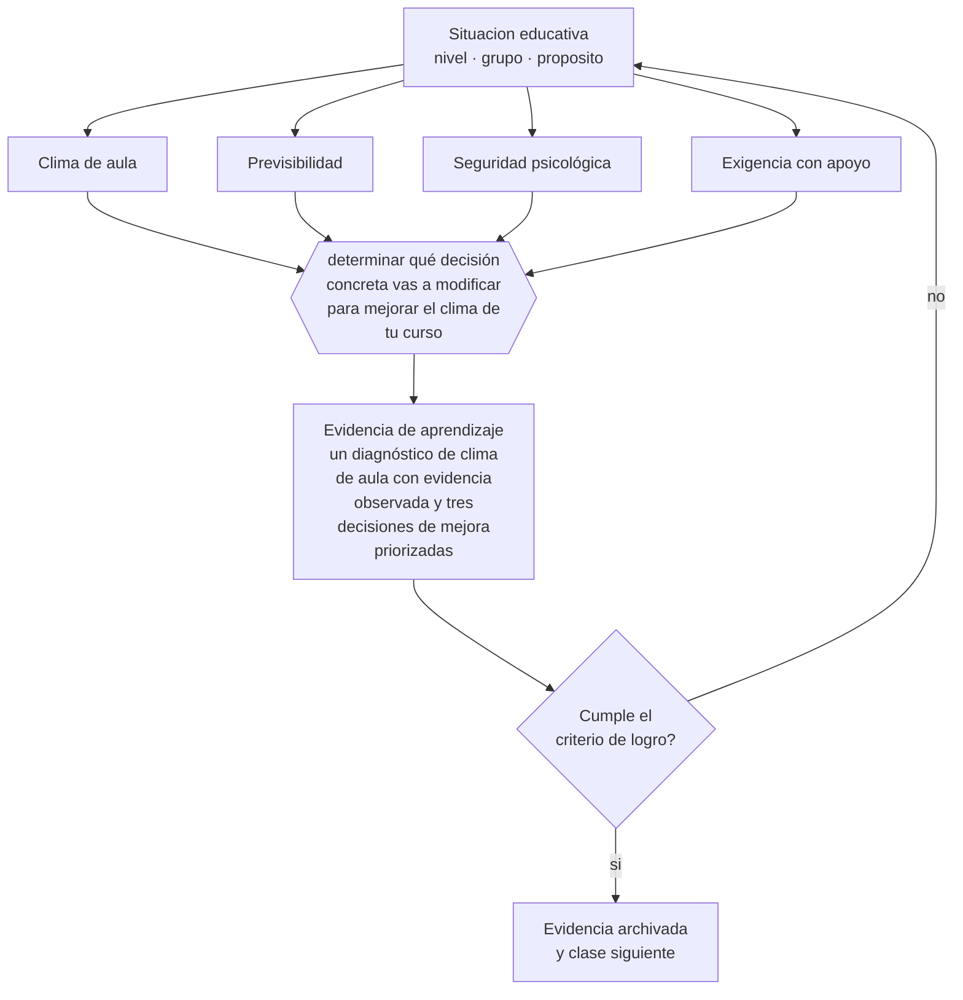

# Clase 145 — Clima de aula

> **Parte 12 · Gestión del aula y convivencia** — clase 1 de 12

**Estado de evidencia:** `CONSISTENTE` · **Etapa:** 🟣 Etapa C — Núcleo profesional docente · **Población de referencia:** transversal, con foco escolar 
**Decisión que habilita:** determinar qué decisión concreta vas a modificar para mejorar el clima de tu curso 
**Evidencia de aprendizaje:** un diagnóstico de clima de aula con evidencia observada y tres decisiones de mejora priorizadas

## 🎯 Propósito

Comprender el clima de aula como resultado de decisiones observables —previsibilidad, trato, exigencia, seguridad— y no como un rasgo del grupo o del profesor.

## 📚 Resultados de aprendizaje

Al finalizar esta clase podrás:

1. **Definir** con precisión los cuatro conceptos centrales de la clase y reconocerlos en una situación educativa real, no solo en su enunciado.
2. **Explicar** qué produce un buen clima de aula, además de la personalidad del docente.
3. **Decidir** —qué decisión concreta vas a modificar para mejorar el clima de tu curso— y sostener la decisión con un fundamento escrito.
4. **Producir** la evidencia de la clase —un diagnóstico de clima de aula con evidencia observada y tres decisiones de mejora priorizadas— y contrastarla contra el criterio de logro.
5. **Distinguir** lo que la evidencia sostiene de lo que es práctica instalada, preferencia personal o costumbre de la institución.

## 🧩 Conceptos centrales

| Concepto | Comprensión verificable |
|---|---|
| **Clima de aula** | calidad percibida de las relaciones, la seguridad y las condiciones de trabajo en la sala |
| **Previsibilidad** | grado en que el estudiante puede anticipar lo que ocurrirá y qué se espera de él |
| **Seguridad psicológica** | condición que permite equivocarse, preguntar y participar sin costo social |
| **Exigencia con apoyo** | combinación de expectativas altas con andamiaje suficiente para alcanzarlas |

## 🗺️ Flujo de razonamiento

## 📖 Desarrollo

### 1. El fondo del asunto

El clima no es un ambiente que se produce solo: es el resultado acumulado de decisiones. La previsibilidad de la rutina, la equidad del trato, la forma de corregir el error y el nivel de exigencia sostenido con apoyo explican más del clima que cualquier característica personal. Y el clima importa porque condiciona la disposición a arriesgarse: en un curso donde equivocarse tiene costo social, nadie pregunta.

### 2. Cómo se traduce en decisiones de enseñanza

El diagnóstico se hace con evidencia observable y no solo con encuestas: quién participa, qué ocurre cuando alguien se equivoca, cuánto tiempo pasa entre la entrada y el inicio del trabajo, cómo se corrige. A partir de ahí se priorizan pocas decisiones y se sostienen: el clima cambia por consistencia y no por intervenciones puntuales.

### 3. Qué sostiene la evidencia y qué no

El clima medido por encuestas y el clima real no siempre coinciden, y los instrumentos de percepción son sensibles al momento y al deseo de agradar. Además, el clima de un curso está condicionado por el clima institucional: un docente puede mejorar su sala y no puede compensar un establecimiento deteriorado.

> **Cómo leer el estado de evidencia `CONSISTENTE`.** La evidencia es amplia y coherente, pero proviene sobre todo de estudios correlacionales, de síntesis con heterogeneidad alta o de contextos distintos al tuyo. Sirve para orientar la decisión y exige que compruebes el efecto en tu propio grupo.

## 🧪 Taller guiado

Aplica la clase a **uno** de los contextos siguientes y repite después el ejercicio en un
contexto de exigencia distinta. Cambiar de contexto es parte del aprendizaje: lo que funciona
con un grupo no se traslada intacto a otro.

| Contexto | Rasgo que cambia la decisión |
|---|---|
| Curso de primer ciclo básico | las rutinas se enseñan explícitamente y se practican |
| Curso de educación media | la legitimidad y la justicia percibida deciden el clima |
| Curso con conflictos frecuentes | hay que estabilizar antes de exigir contenido |
| Taller o laboratorio | el riesgo físico cambia la gestión del grupo |
| Clase con docente de reemplazo | no hay historia compartida en la que apoyarse |
| Contexto de vulneración de derechos | el protocolo manda sobre el criterio individual |

**Secuencia de trabajo:**

1. Delimita el contexto: nivel, edad, tamaño del grupo, asignatura o experiencia y tiempo real disponible.
2. Declara qué saben ya los estudiantes y **cómo lo comprobaste**, no cómo lo supones.
3. Formula la decisión pedagógica que esta clase habilita y escribe su fundamento.
4. Anticipa qué observarías si la decisión funciona y qué observarías si no funciona.
5. Diseña de antemano la alternativa que aplicarás si la primera estrategia falla.
6. Ejecuta o simula, y registra lo observado con fecha, contexto y evidencia concreta.
7. Produce la evidencia de aprendizaje de la clase.
8. Contrástala contra el criterio de logro, corrige y recién entonces avanza.

### 📦 Evidencia de aprendizaje

Un diagnóstico de clima de aula con evidencia observada y tres decisiones de mejora priorizadas.

Debe incluir contexto, decisión, fundamento, fuentes consultadas con su fecha, indicador de
logro observable, riesgos previstos y qué harías distinto en la siguiente iteración.

## 🏆 Reto verificable

Observa tu propia clase con foco en tres indicadores de clima durante una semana. Cambia una decisión, sostenla un mes y vuelve a observar.

## ✅ Criterio de logro

- [ ] el diagnóstico se apoya en conductas observadas y no solo en percepciones declaradas;
- [ ] las decisiones de mejora son pocas, concretas y sostenibles en el tiempo;
- [ ] cada afirmación sobre «lo que funciona» está atribuida a una fuente identificable, con autor y fecha;
- [ ] la decisión es ejecutable con el tiempo, el espacio, el número de estudiantes y los recursos que realmente tienes;
- [ ] la evidencia queda archivada de forma reproducible: otra persona podría revisarla sin que tú se la expliques.

## ⚠️ Errores frecuentes

**Propios de esta clase:**

- Atribuir el clima al carácter del grupo y no revisar las decisiones que lo producen.
- Intentar mejorar el clima con actividades puntuales en vez de con consistencia sostenida.

**Característicos de la parte 12:**

- Gestionar por reacción y llamar disciplina a la escalada.
- Aplicar sanciones sin debido proceso ni proporcionalidad.

## ♿ Diversidad, accesibilidad y ética

El clima se experimenta de forma distinta según la posición de cada estudiante en el grupo. Un curso que el docente percibe como cordial puede ser hostil para quien es objeto de burlas sutiles que el adulto no ve.

Antes de aplicar cualquier decisión de esta clase con estudiantes reales, revisa el
[protocolo de práctica responsable](../../../docs/ETICA_Y_PRACTICA_RESPONSABLE.md):
consentimiento, resguardo de datos personales, proporcionalidad de la intervención y derecho
de cada estudiante a no ser objeto de un ensayo que no le reporta beneficio.

## ❓ Preguntas de comprobación

1. ¿Qué pasa en tu sala cuando un estudiante da una respuesta equivocada?
2. ¿Quién no ha hablado en tu clase en las últimas dos semanas?
3. ¿Qué puede anticipar un estudiante nuevo sobre cómo funciona tu clase?

## 📕 Lecturas base

**Wang, M.-T. & Degol, J. (2016). *School Climate: A Review of the Construct, Measurement, and Impact*.**  
*Qué aporta a esta clase:* sistematiza qué es el clima, cómo se mide y qué efectos tiene documentados.

**Pianta, R. et al. *Classroom Assessment Scoring System (CLASS)*.**  
*Qué aporta a esta clase:* instrumento observacional que operacionaliza el clima en interacciones concretas.

Catálogo completo: [bibliografía del programa](../../../docs/BIBLIOGRAFIA.md) ·
[glosario](../../../docs/GLOSARIO.md) ·
[fuentes oficiales y cómo leerlas](../../../docs/FUENTES.md).

## 🔗 Conexión con el resto del programa

Abre la parte 12 y se apoya en las clases 010 y 063.

> [!IMPORTANT]
> Material de formación profesional. No reemplaza un título de pedagogía, una habilitación
> legal para ejercer, ni el juicio de un equipo educativo que conoce a sus estudiantes.

---

| Anterior | Índice | Siguiente |
|---|---|---|
| [← Parte 12](../README.md) | [Parte 12](../README.md) · [Programa](../../../README.md) | [146 · Normas y rutinas →](../class-02-normas-y-rutinas/README.md) |
