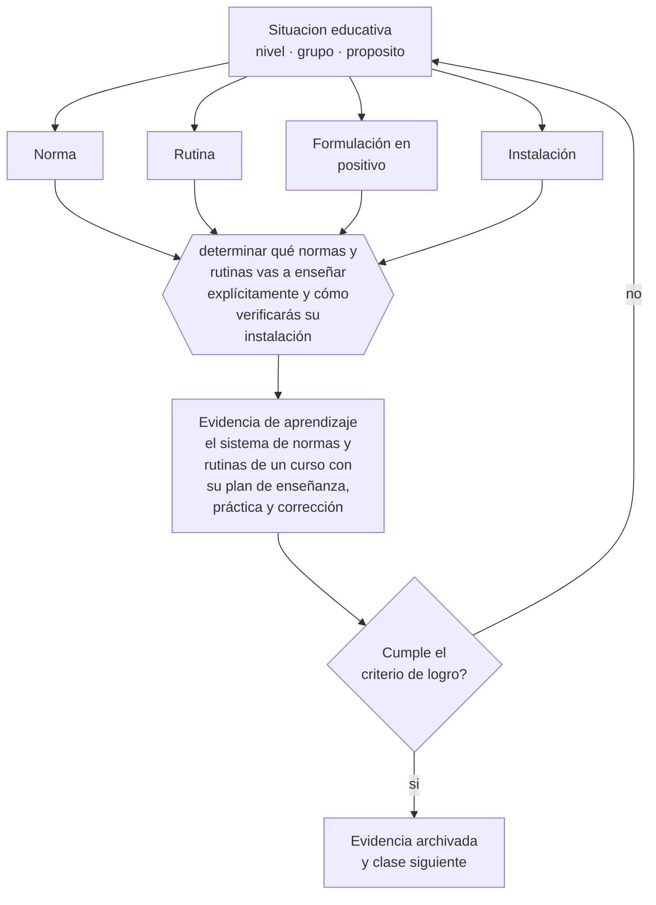

# Clase 146 — Normas y rutinas

> **Parte 12 · Gestión del aula y convivencia** — clase 2 de 12

**Estado de evidencia:** `CONSISTENTE` · **Etapa:** 🟣 Etapa C — Núcleo profesional docente · **Población de referencia:** transversal, con foco escolar 
**Decisión que habilita:** determinar qué normas y rutinas vas a enseñar explícitamente y cómo verificarás su instalación 
**Evidencia de aprendizaje:** el sistema de normas y rutinas de un curso con su plan de enseñanza, práctica y corrección

## 🎯 Propósito

Diseñar y enseñar normas y rutinas como se enseña cualquier contenido: pocas, formuladas en positivo, modeladas, practicadas y corregidas hasta que se automatizan.

## 📚 Resultados de aprendizaje

Al finalizar esta clase podrás:

1. **Definir** con precisión los cuatro conceptos centrales de la clase y reconocerlos en una situación educativa real, no solo en su enunciado.
2. **Explicar** por qué las normas anunciadas y no enseñadas se incumplen todos los años.
3. **Decidir** —qué normas y rutinas vas a enseñar explícitamente y cómo verificarás su instalación— y sostener la decisión con un fundamento escrito.
4. **Producir** la evidencia de la clase —el sistema de normas y rutinas de un curso con su plan de enseñanza, práctica y corrección— y contrastarla contra el criterio de logro.
5. **Distinguir** lo que la evidencia sostiene de lo que es práctica instalada, preferencia personal o costumbre de la institución.

## 🧩 Conceptos centrales

| Concepto | Comprensión verificable |
|---|---|
| **Norma** | regla de convivencia que define qué es aceptable; se enseña y se sostiene, no solo se publica |
| **Rutina** | procedimiento estable para una situación recurrente; se automatiza con práctica |
| **Formulación en positivo** | enunciado que describe la conducta esperada en vez de la prohibida |
| **Instalación** | estado en que la rutina se ejecuta sin necesidad de recordarla |

## 🗺️ Flujo de razonamiento

## 📖 Desarrollo

### 1. El fondo del asunto

Las normas publicadas al inicio y nunca practicadas se incumplen sistemáticamente, y su incumplimiento se atribuye a los estudiantes. La alternativa es tratarlas como contenido: pocas normas, formuladas en positivo, explicadas en su razón, modeladas por el docente, practicadas y corregidas con paciencia durante las primeras semanas. El tiempo invertido ahí se recupera con creces durante el año.

### 2. Cómo se traduce en decisiones de enseñanza

La instalación se verifica observando: si hay que recordar la rutina cada vez, aún no está instalada. La corrección durante la fase de enseñanza no es sanción: es enseñanza. Y la participación de los estudiantes en la formulación de las normas aumenta su legitimidad, especialmente en cursos mayores, siempre que la participación sea real y no una consulta decorativa.

### 3. Qué sostiene la evidencia y qué no

Las normas ordenan la convivencia cotidiana y no resuelven conflictos de fondo ni situaciones que requieren protocolo. Además, un sistema demasiado extenso se vuelve inaplicable: pocas normas sostenidas funcionan mejor que muchas enunciadas y aplicadas de forma selectiva, que es lo que más deteriora la legitimidad.

> **Cómo leer el estado de evidencia `CONSISTENTE`.** La evidencia es amplia y coherente, pero proviene sobre todo de estudios correlacionales, de síntesis con heterogeneidad alta o de contextos distintos al tuyo. Sirve para orientar la decisión y exige que compruebes el efecto en tu propio grupo.

## 🧪 Taller guiado

Aplica la clase a **uno** de los contextos siguientes y repite después el ejercicio en un
contexto de exigencia distinta. Cambiar de contexto es parte del aprendizaje: lo que funciona
con un grupo no se traslada intacto a otro.

| Contexto | Rasgo que cambia la decisión |
|---|---|
| Curso de primer ciclo básico | las rutinas se enseñan explícitamente y se practican |
| Curso de educación media | la legitimidad y la justicia percibida deciden el clima |
| Curso con conflictos frecuentes | hay que estabilizar antes de exigir contenido |
| Taller o laboratorio | el riesgo físico cambia la gestión del grupo |
| Clase con docente de reemplazo | no hay historia compartida en la que apoyarse |
| Contexto de vulneración de derechos | el protocolo manda sobre el criterio individual |

**Secuencia de trabajo:**

1. Delimita el contexto: nivel, edad, tamaño del grupo, asignatura o experiencia y tiempo real disponible.
2. Declara qué saben ya los estudiantes y **cómo lo comprobaste**, no cómo lo supones.
3. Formula la decisión pedagógica que esta clase habilita y escribe su fundamento.
4. Anticipa qué observarías si la decisión funciona y qué observarías si no funciona.
5. Diseña de antemano la alternativa que aplicarás si la primera estrategia falla.
6. Ejecuta o simula, y registra lo observado con fecha, contexto y evidencia concreta.
7. Produce la evidencia de aprendizaje de la clase.
8. Contrástala contra el criterio de logro, corrige y recién entonces avanza.

### 📦 Evidencia de aprendizaje

El sistema de normas y rutinas de un curso con su plan de enseñanza, práctica y corrección.

Debe incluir contexto, decisión, fundamento, fuentes consultadas con su fecha, indicador de
logro observable, riesgos previstos y qué harías distinto en la siguiente iteración.

## 🏆 Reto verificable

Enseña explícitamente tres rutinas durante dos semanas con práctica y corrección. Mide el tiempo de ejecución al inicio y al final.

## ✅ Criterio de logro

- [ ] cada norma o rutina tiene su plan de enseñanza, práctica y corrección;
- [ ] existe un criterio observable para dar por instalada cada rutina;
- [ ] cada afirmación sobre «lo que funciona» está atribuida a una fuente identificable, con autor y fecha;
- [ ] la decisión es ejecutable con el tiempo, el espacio, el número de estudiantes y los recursos que realmente tienes;
- [ ] la evidencia queda archivada de forma reproducible: otra persona podría revisarla sin que tú se la expliques.

## ⚠️ Errores frecuentes

**Propios de esta clase:**

- Publicar las normas y suponer que quedaron enseñadas.
- Aplicar las normas de forma selectiva según el estudiante, con lo que pierden legitimidad.

**Característicos de la parte 12:**

- Gestionar por reacción y llamar disciplina a la escalada.
- Aplicar sanciones sin debido proceso ni proporcionalidad.

## ♿ Diversidad, accesibilidad y ética

Las rutinas explícitas y visibles benefician especialmente a estudiantes autistas, con TDAH o con trayectorias inestables, para quienes la imprevisibilidad es una barrera real y no una excusa.

Antes de aplicar cualquier decisión de esta clase con estudiantes reales, revisa el
[protocolo de práctica responsable](../../../docs/ETICA_Y_PRACTICA_RESPONSABLE.md):
consentimiento, resguardo de datos personales, proporcionalidad de la intervención y derecho
de cada estudiante a no ser objeto de un ensayo que no le reporta beneficio.

## ❓ Preguntas de comprobación

1. ¿Qué rutina de tu curso hay que recordar todos los días?
2. ¿Qué norma se aplica con unos estudiantes y no con otros?
3. ¿Cuánto tiempo dedicaste a enseñar rutinas en las primeras dos semanas?

## 📕 Lecturas base

**Evertson, C. & Emmer, E. *Classroom Management for Elementary/Secondary Teachers*.**  
*Qué aporta a esta clase:* protocolos de enseñanza de normas y rutinas para el comienzo del año.

**Simonsen, B. et al. (2008). *Evidence-Based Practices in Classroom Management*.**  
*Qué aporta a esta clase:* revisión de prácticas con respaldo empírico, incluidas normas y rutinas.

Catálogo completo: [bibliografía del programa](../../../docs/BIBLIOGRAFIA.md) ·
[glosario](../../../docs/GLOSARIO.md) ·
[fuentes oficiales y cómo leerlas](../../../docs/FUENTES.md).

## 🔗 Conexión con el resto del programa

Es la base preventiva de la clase 147 y aplica en el nivel escolar lo trabajado en la clase 059.

> [!IMPORTANT]
> Material de formación profesional. No reemplaza un título de pedagogía, una habilitación
> legal para ejercer, ni el juicio de un equipo educativo que conoce a sus estudiantes.

---

| Anterior | Índice | Siguiente |
|---|---|---|
| [← 145 · Clima de aula](../class-01-clima-de-aula/README.md) | [Parte 12](../README.md) · [Programa](../../../README.md) | [147 · Prevención de problemas de conducta →](../class-03-prevencion-de-problemas-de-conducta/README.md) |
