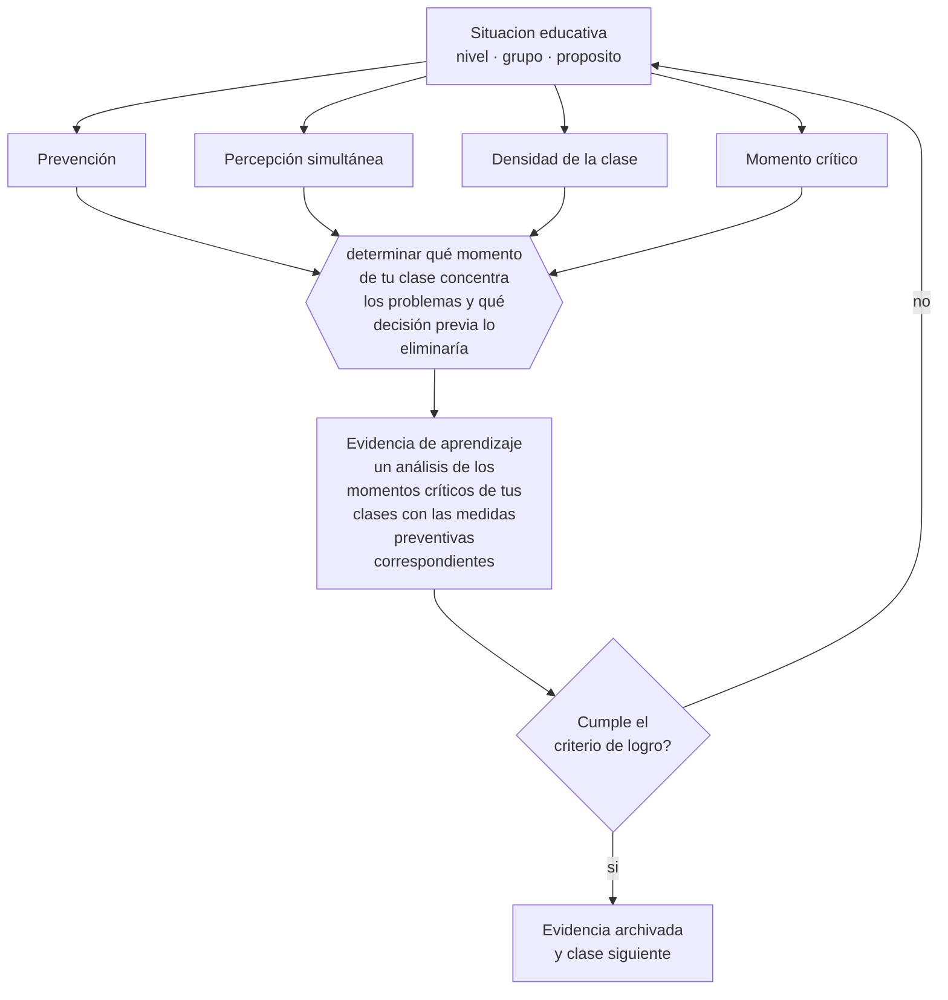

# Clase 147 — Prevención de problemas de conducta

> **Parte 12 · Gestión del aula y convivencia** — clase 3 de 12

**Estado de evidencia:** `CONSISTENTE` · **Etapa:** 🟣 Etapa C — Núcleo profesional docente · **Población de referencia:** transversal, con foco escolar 
**Decisión que habilita:** determinar qué momento de tu clase concentra los problemas y qué decisión previa lo eliminaría 
**Evidencia de aprendizaje:** un análisis de los momentos críticos de tus clases con las medidas preventivas correspondientes

## 🎯 Propósito

Diseñar la prevención como estrategia principal de gestión: organización del espacio y del tiempo, percepción simultánea, densidad de la clase y anticipación de los momentos críticos.

## 📚 Resultados de aprendizaje

Al finalizar esta clase podrás:

1. **Definir** con precisión los cuatro conceptos centrales de la clase y reconocerlos en una situación educativa real, no solo en su enunciado.
2. **Explicar** por qué los docentes con menos problemas de conducta no son los que mejor reaccionan.
3. **Decidir** —qué momento de tu clase concentra los problemas y qué decisión previa lo eliminaría— y sostener la decisión con un fundamento escrito.
4. **Producir** la evidencia de la clase —un análisis de los momentos críticos de tus clases con las medidas preventivas correspondientes— y contrastarla contra el criterio de logro.
5. **Distinguir** lo que la evidencia sostiene de lo que es práctica instalada, preferencia personal o costumbre de la institución.

## 🧩 Conceptos centrales

| Concepto | Comprensión verificable |
|---|---|
| **Prevención** | conjunto de decisiones tomadas antes del problema que reducen su probabilidad |
| **Percepción simultánea** | capacidad de saber qué ocurre en toda la sala mientras se atiende a una parte |
| **Densidad de la clase** | proporción del tiempo en que los estudiantes están efectivamente ocupados en algo con sentido |
| **Momento crítico** | instante recurrente —inicio, transiciones, entrega de material, cierre— donde se concentran los problemas |

## 🗺️ Flujo de razonamiento

## 📖 Desarrollo

### 1. El fondo del asunto

El hallazgo clásico de la investigación sobre gestión de aula sigue vigente: la diferencia entre docentes con muchos y pocos problemas no está en cómo responden sino en qué hacen antes. Percepción simultánea, ritmo sostenido, transiciones breves y ausencia de tiempos muertos eliminan la mayor parte de las oportunidades de disrupción. La conducta problemática aparece, sobre todo, en el vacío.

### 2. Cómo se traduce en decisiones de enseñanza

El análisis de momentos críticos es directo: registrar cuándo ocurren los problemas durante una semana. El patrón aparece rápido —los primeros minutos, las transiciones, el momento en que unos terminan antes— y cada momento tiene una solución de diseño: una tarea al entrar, una señal de transición ensayada, trabajo previsto para quien termina antes.

### 3. Qué sostiene la evidencia y qué no

La prevención reduce la disrupción ordinaria y no resuelve situaciones que tienen causas fuera del aula: violencia, vulneración, salud mental o conflicto sostenido entre estudiantes requieren otra respuesta. Confundirlas produce docentes que intentan resolver con técnica lo que necesita intervención institucional.

> **Cómo leer el estado de evidencia `CONSISTENTE`.** La evidencia es amplia y coherente, pero proviene sobre todo de estudios correlacionales, de síntesis con heterogeneidad alta o de contextos distintos al tuyo. Sirve para orientar la decisión y exige que compruebes el efecto en tu propio grupo.

## 🧪 Taller guiado

Aplica la clase a **uno** de los contextos siguientes y repite después el ejercicio en un
contexto de exigencia distinta. Cambiar de contexto es parte del aprendizaje: lo que funciona
con un grupo no se traslada intacto a otro.

| Contexto | Rasgo que cambia la decisión |
|---|---|
| Curso de primer ciclo básico | las rutinas se enseñan explícitamente y se practican |
| Curso de educación media | la legitimidad y la justicia percibida deciden el clima |
| Curso con conflictos frecuentes | hay que estabilizar antes de exigir contenido |
| Taller o laboratorio | el riesgo físico cambia la gestión del grupo |
| Clase con docente de reemplazo | no hay historia compartida en la que apoyarse |
| Contexto de vulneración de derechos | el protocolo manda sobre el criterio individual |

**Secuencia de trabajo:**

1. Delimita el contexto: nivel, edad, tamaño del grupo, asignatura o experiencia y tiempo real disponible.
2. Declara qué saben ya los estudiantes y **cómo lo comprobaste**, no cómo lo supones.
3. Formula la decisión pedagógica que esta clase habilita y escribe su fundamento.
4. Anticipa qué observarías si la decisión funciona y qué observarías si no funciona.
5. Diseña de antemano la alternativa que aplicarás si la primera estrategia falla.
6. Ejecuta o simula, y registra lo observado con fecha, contexto y evidencia concreta.
7. Produce la evidencia de aprendizaje de la clase.
8. Contrástala contra el criterio de logro, corrige y recién entonces avanza.

### 📦 Evidencia de aprendizaje

Un análisis de los momentos críticos de tus clases con las medidas preventivas correspondientes.

Debe incluir contexto, decisión, fundamento, fuentes consultadas con su fecha, indicador de
logro observable, riesgos previstos y qué harías distinto en la siguiente iteración.

## 🏆 Reto verificable

Registra una semana el momento exacto de cada disrupción. Corrige el momento crítico principal con una medida de diseño y vuelve a registrar.

## ✅ Criterio de logro

- [ ] el análisis identifica los momentos críticos con evidencia registrada;
- [ ] cada medida preventiva es una decisión de diseño y no una respuesta reactiva;
- [ ] cada afirmación sobre «lo que funciona» está atribuida a una fuente identificable, con autor y fecha;
- [ ] la decisión es ejecutable con el tiempo, el espacio, el número de estudiantes y los recursos que realmente tienes;
- [ ] la evidencia queda archivada de forma reproducible: otra persona podría revisarla sin que tú se la expliques.

## ⚠️ Errores frecuentes

**Propios de esta clase:**

- Diseñar la clase sin previsión para quienes terminan antes.
- Atribuir a la conducta de los estudiantes problemas que se originan en tiempos muertos del diseño.

**Característicos de la parte 12:**

- Gestionar por reacción y llamar disciplina a la escalada.
- Aplicar sanciones sin debido proceso ni proporcionalidad.

## ♿ Diversidad, accesibilidad y ética

Los tiempos muertos afectan más a estudiantes con dificultades de autorregulación, que son los primeros en desconectarse y los primeros en ser sancionados por ello. Reducir el vacío es una medida de equidad conductual.

Antes de aplicar cualquier decisión de esta clase con estudiantes reales, revisa el
[protocolo de práctica responsable](../../../docs/ETICA_Y_PRACTICA_RESPONSABLE.md):
consentimiento, resguardo de datos personales, proporcionalidad de la intervención y derecho
de cada estudiante a no ser objeto de un ensayo que no le reporta beneficio.

## ❓ Preguntas de comprobación

1. ¿En qué minuto de tu clase se concentran los problemas?
2. ¿Qué hace un estudiante que termina cinco minutos antes que el resto?
3. ¿Qué ves y qué no ves mientras atiendes a un estudiante en su puesto?

## 📕 Lecturas base

**Kounin, J. (1970). *Discipline and Group Management in Classrooms*.**  
*Qué aporta a esta clase:* establece percepción simultánea, ritmo y solapamiento como factores decisivos.

**Simonsen, B. et al. (2008). *Evidence-Based Practices in Classroom Management*.**  
*Qué aporta a esta clase:* sistematiza prácticas preventivas con respaldo empírico.

Catálogo completo: [bibliografía del programa](../../../docs/BIBLIOGRAFIA.md) ·
[glosario](../../../docs/GLOSARIO.md) ·
[fuentes oficiales y cómo leerlas](../../../docs/FUENTES.md).

## 🔗 Conexión con el resto del programa

Se apoya en la clase 146 y reduce la necesidad de aplicar la clase 148.

> [!IMPORTANT]
> Material de formación profesional. No reemplaza un título de pedagogía, una habilitación
> legal para ejercer, ni el juicio de un equipo educativo que conoce a sus estudiantes.

---

| Anterior | Índice | Siguiente |
|---|---|---|
| [← 146 · Normas y rutinas](../class-02-normas-y-rutinas/README.md) | [Parte 12](../README.md) · [Programa](../../../README.md) | [148 · Refuerzo y consecuencias →](../class-04-refuerzo-y-consecuencias/README.md) |
