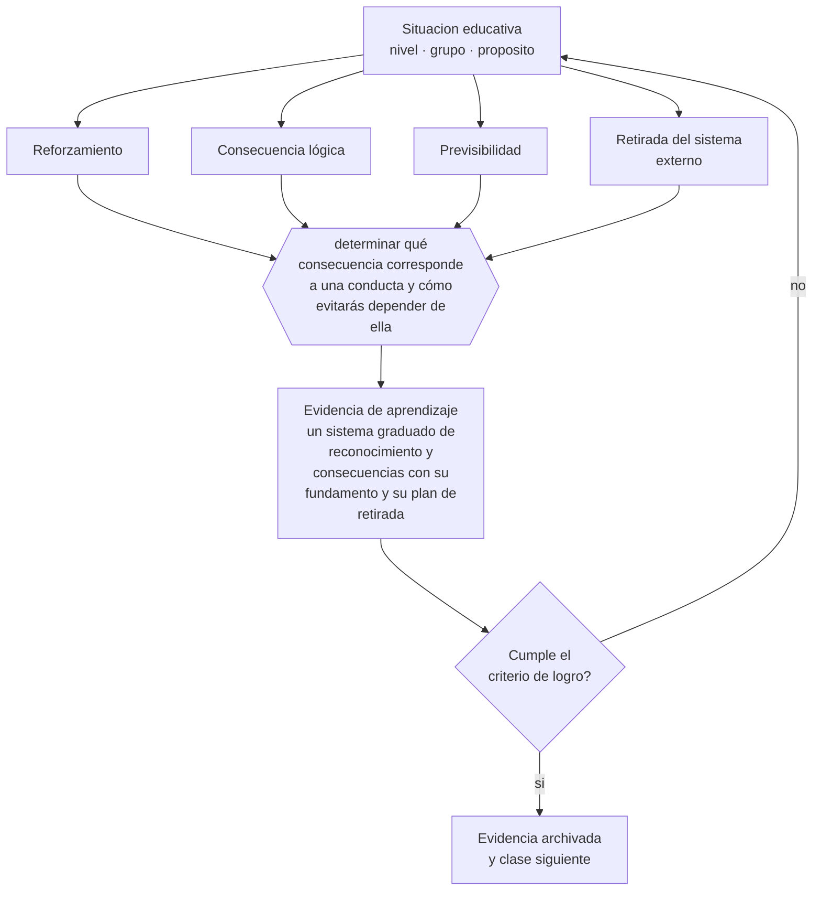

# Clase 148 — Refuerzo y consecuencias

> **Parte 12 · Gestión del aula y convivencia** — clase 4 de 12

**Estado de evidencia:** `CONSISTENTE` · **Etapa:** 🟣 Etapa C — Núcleo profesional docente · **Población de referencia:** transversal, con foco escolar 
**Decisión que habilita:** determinar qué consecuencia corresponde a una conducta y cómo evitarás depender de ella 
**Evidencia de aprendizaje:** un sistema graduado de reconocimiento y consecuencias con su fundamento y su plan de retirada

## 🎯 Propósito

Aplicar reforzamiento y consecuencias con criterio técnico: proporcionalidad, previsibilidad, foco en la conducta y no en la persona, y plan de retirada de los sistemas externos.

## 📚 Resultados de aprendizaje

Al finalizar esta clase podrás:

1. **Definir** con precisión los cuatro conceptos centrales de la clase y reconocerlos en una situación educativa real, no solo en su enunciado.
2. **Explicar** cómo usar consecuencias sin instalar un sistema de premios y castigos que después no se puede sostener.
3. **Decidir** —qué consecuencia corresponde a una conducta y cómo evitarás depender de ella— y sostener la decisión con un fundamento escrito.
4. **Producir** la evidencia de la clase —un sistema graduado de reconocimiento y consecuencias con su fundamento y su plan de retirada— y contrastarla contra el criterio de logro.
5. **Distinguir** lo que la evidencia sostiene de lo que es práctica instalada, preferencia personal o costumbre de la institución.

## 🧩 Conceptos centrales

| Concepto | Comprensión verificable |
|---|---|
| **Reforzamiento** | consecuencia que aumenta la probabilidad de una conducta deseada |
| **Consecuencia lógica** | respuesta relacionada con la conducta y proporcional a su gravedad |
| **Previsibilidad** | condición de que la consecuencia sea conocida de antemano y se aplique con consistencia |
| **Retirada del sistema externo** | plan para que la conducta se sostenga sin depender del refuerzo aplicado |

## 🗺️ Flujo de razonamiento

## 📖 Desarrollo

### 1. El fondo del asunto

Las consecuencias funcionan cuando son previsibles, proporcionales y se aplican con consistencia; fallan cuando son arbitrarias, desproporcionadas o dependen del ánimo del adulto. El reconocimiento tiene el mismo requisito: reconocer conductas específicas —«completaste el procedimiento sin saltarte la verificación»— enseña; elogiar la persona no. Y todo sistema externo necesita plan de retirada, porque su objetivo es volverse innecesario.

### 2. Cómo se traduce en decisiones de enseñanza

El sistema graduado se decide antes: qué se hace ante una conducta menor, ante su repetición y ante una falta seria. Escrito y conocido, elimina la negociación en el momento. La retirada se planifica desde el inicio: espaciar el reconocimiento, trasladar el foco al progreso propio y hacer explícito el criterio interno de la conducta.

### 3. Qué sostiene la evidencia y qué no

Los sistemas de puntos y premios producen efectos a corto plazo y riesgos conocidos: pueden reducir la motivación en tareas que ya interesaban y crear dependencia del refuerzo. Además, en conductas cuya causa es una dificultad de regulación, el castigo no enseña la conducta faltante: solo la sanciona.

> **Cómo leer el estado de evidencia `CONSISTENTE`.** La evidencia es amplia y coherente, pero proviene sobre todo de estudios correlacionales, de síntesis con heterogeneidad alta o de contextos distintos al tuyo. Sirve para orientar la decisión y exige que compruebes el efecto en tu propio grupo.

## 🧪 Taller guiado

Aplica la clase a **uno** de los contextos siguientes y repite después el ejercicio en un
contexto de exigencia distinta. Cambiar de contexto es parte del aprendizaje: lo que funciona
con un grupo no se traslada intacto a otro.

| Contexto | Rasgo que cambia la decisión |
|---|---|
| Curso de primer ciclo básico | las rutinas se enseñan explícitamente y se practican |
| Curso de educación media | la legitimidad y la justicia percibida deciden el clima |
| Curso con conflictos frecuentes | hay que estabilizar antes de exigir contenido |
| Taller o laboratorio | el riesgo físico cambia la gestión del grupo |
| Clase con docente de reemplazo | no hay historia compartida en la que apoyarse |
| Contexto de vulneración de derechos | el protocolo manda sobre el criterio individual |

**Secuencia de trabajo:**

1. Delimita el contexto: nivel, edad, tamaño del grupo, asignatura o experiencia y tiempo real disponible.
2. Declara qué saben ya los estudiantes y **cómo lo comprobaste**, no cómo lo supones.
3. Formula la decisión pedagógica que esta clase habilita y escribe su fundamento.
4. Anticipa qué observarías si la decisión funciona y qué observarías si no funciona.
5. Diseña de antemano la alternativa que aplicarás si la primera estrategia falla.
6. Ejecuta o simula, y registra lo observado con fecha, contexto y evidencia concreta.
7. Produce la evidencia de aprendizaje de la clase.
8. Contrástala contra el criterio de logro, corrige y recién entonces avanza.

### 📦 Evidencia de aprendizaje

Un sistema graduado de reconocimiento y consecuencias con su fundamento y su plan de retirada.

Debe incluir contexto, decisión, fundamento, fuentes consultadas con su fecha, indicador de
logro observable, riesgos previstos y qué harías distinto en la siguiente iteración.

## 🏆 Reto verificable

Revisa las consecuencias que aplicaste en un mes y verifica su proporcionalidad y consistencia. Ajusta el sistema y comunícalo al curso.

## ✅ Criterio de logro

- [ ] el sistema es previsible, proporcional y conocido de antemano;
- [ ] existe un plan explícito de retirada del refuerzo externo;
- [ ] cada afirmación sobre «lo que funciona» está atribuida a una fuente identificable, con autor y fecha;
- [ ] la decisión es ejecutable con el tiempo, el espacio, el número de estudiantes y los recursos que realmente tienes;
- [ ] la evidencia queda archivada de forma reproducible: otra persona podría revisarla sin que tú se la expliques.

## ⚠️ Errores frecuentes

**Propios de esta clase:**

- Instalar sistemas de premios sin plan de retirada.
- Sancionar una conducta que el estudiante todavía no puede ejecutar de otro modo.

**Característicos de la parte 12:**

- Gestionar por reacción y llamar disciplina a la escalada.
- Aplicar sanciones sin debido proceso ni proporcionalidad.

## ♿ Diversidad, accesibilidad y ética

Los sistemas conductuales aplicados sin ajuste castigan más a estudiantes con TDAH, autismo o historias de trauma. Antes de aplicar consecuencias hay que verificar que la conducta esperada esté al alcance del estudiante con los apoyos disponibles.

Antes de aplicar cualquier decisión de esta clase con estudiantes reales, revisa el
[protocolo de práctica responsable](../../../docs/ETICA_Y_PRACTICA_RESPONSABLE.md):
consentimiento, resguardo de datos personales, proporcionalidad de la intervención y derecho
de cada estudiante a no ser objeto de un ensayo que no le reporta beneficio.

## ❓ Preguntas de comprobación

1. ¿Qué consecuencia aplicas hoy que depende de tu ánimo?
2. ¿Qué conducta estás sancionando que el estudiante aún no sabe ejecutar?
3. ¿Cómo se sostendrá esta conducta cuando retires el sistema?

## 📕 Lecturas base

**Deci, E., Koestner, R. & Ryan, R. (1999). *Meta-Analytic Review of Extrinsic Rewards*.**  
*Qué aporta a esta clase:* documenta los riesgos del refuerzo externo sobre la motivación intrínseca.

**Sugai, G. & Horner, R. *School-Wide Positive Behavior Support*.**  
*Qué aporta a esta clase:* modelo de sistemas graduados de apoyo conductual con evidencia de implementación.

Catálogo completo: [bibliografía del programa](../../../docs/BIBLIOGRAFIA.md) ·
[glosario](../../../docs/GLOSARIO.md) ·
[fuentes oficiales y cómo leerlas](../../../docs/FUENTES.md).

## 🔗 Conexión con el resto del programa

Aplica la clase 013 y depende de la prevención de la clase 147.

> [!IMPORTANT]
> Material de formación profesional. No reemplaza un título de pedagogía, una habilitación
> legal para ejercer, ni el juicio de un equipo educativo que conoce a sus estudiantes.

---

| Anterior | Índice | Siguiente |
|---|---|---|
| [← 147 · Prevención de problemas de conducta](../class-03-prevencion-de-problemas-de-conducta/README.md) | [Parte 12](../README.md) · [Programa](../../../README.md) | [149 · Comunicación docente →](../class-05-comunicacion-docente/README.md) |
