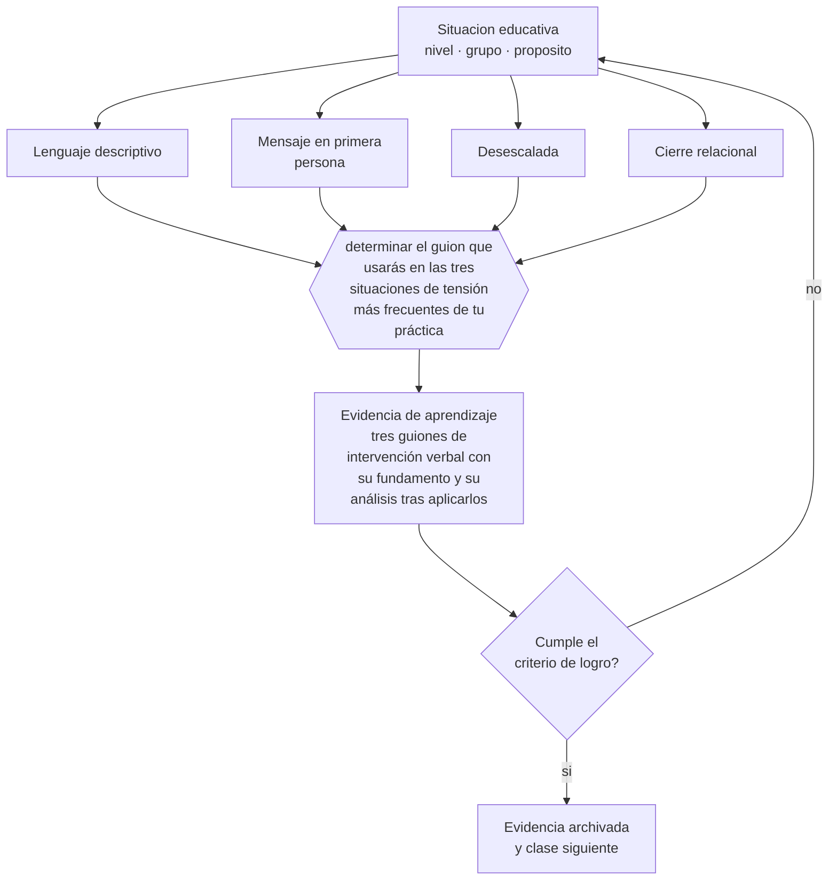

# Clase 149 — Comunicación docente

> **Parte 12 · Gestión del aula y convivencia** — clase 5 de 12

**Estado de evidencia:** `PRACTICA-PROFESIONAL` · **Etapa:** 🟣 Etapa C — Núcleo profesional docente · **Población de referencia:** transversal, con foco escolar 
**Decisión que habilita:** determinar el guion que usarás en las tres situaciones de tensión más frecuentes de tu práctica 
**Evidencia de aprendizaje:** tres guiones de intervención verbal con su fundamento y su análisis tras aplicarlos

## 🎯 Propósito

Desarrollar comunicación docente eficaz en situaciones de tensión: lenguaje descriptivo, foco en la conducta, tono y postura, y cierre que preserva la relación.

## 📚 Resultados de aprendizaje

Al finalizar esta clase podrás:

1. **Definir** con precisión los cuatro conceptos centrales de la clase y reconocerlos en una situación educativa real, no solo en su enunciado.
2. **Explicar** qué decir exactamente en los momentos donde la conversación puede escalar o resolver.
3. **Decidir** —el guion que usarás en las tres situaciones de tensión más frecuentes de tu práctica— y sostener la decisión con un fundamento escrito.
4. **Producir** la evidencia de la clase —tres guiones de intervención verbal con su fundamento y su análisis tras aplicarlos— y contrastarla contra el criterio de logro.
5. **Distinguir** lo que la evidencia sostiene de lo que es práctica instalada, preferencia personal o costumbre de la institución.

## 🧩 Conceptos centrales

| Concepto | Comprensión verificable |
|---|---|
| **Lenguaje descriptivo** | descripción de la conducta observada sin juicio sobre la persona |
| **Mensaje en primera persona** | formulación que expresa el efecto de la conducta sin acusar |
| **Desescalada** | conjunto de conductas verbales y no verbales que reducen la intensidad del conflicto |
| **Cierre relacional** | acción final que restablece la relación de trabajo después de la corrección |

## 🗺️ Flujo de razonamiento

## 📖 Desarrollo

### 1. El fondo del asunto

En una situación tensa, la elección de palabras decide el resultado. Describir la conducta —«estás hablando mientras explico»— permite corregir; calificar a la persona —«eres un desordenado»— obliga al estudiante a defenderse ante sus pares y garantiza la escalada. El tono y la postura pesan tanto como las palabras: acercarse, bajar la voz y no exigir contacto visual reducen la confrontación.

### 2. Cómo se traduce en decisiones de enseñanza

Tener guiones preparados para las situaciones frecuentes evita improvisar bajo presión. Un guion incluye la frase inicial, la respuesta prevista del estudiante, la segunda intervención y el cierre. Y siempre termina con un cierre relacional posterior: una interacción normal a los pocos minutos que muestre que la corrección terminó con la conducta y no con la relación.

### 3. Qué sostiene la evidencia y qué no

No hay evidencia experimental robusta sobre fórmulas verbales específicas: es conocimiento profesional acumulado y sensible al contexto cultural. Lo que sí está documentado es el efecto de la corrección pública sobre el estatus en la adolescencia, y de la consistencia sobre la legitimidad.

> **Cómo leer el estado de evidencia `PRACTICA-PROFESIONAL`.** Es conocimiento práctico acumulado del oficio, útil y transferible, pero no probado con diseños de investigación. Trátalo como un buen punto de partida sujeto a comprobación en tu contexto.

## 🧪 Taller guiado

Aplica la clase a **uno** de los contextos siguientes y repite después el ejercicio en un
contexto de exigencia distinta. Cambiar de contexto es parte del aprendizaje: lo que funciona
con un grupo no se traslada intacto a otro.

| Contexto | Rasgo que cambia la decisión |
|---|---|
| Curso de primer ciclo básico | las rutinas se enseñan explícitamente y se practican |
| Curso de educación media | la legitimidad y la justicia percibida deciden el clima |
| Curso con conflictos frecuentes | hay que estabilizar antes de exigir contenido |
| Taller o laboratorio | el riesgo físico cambia la gestión del grupo |
| Clase con docente de reemplazo | no hay historia compartida en la que apoyarse |
| Contexto de vulneración de derechos | el protocolo manda sobre el criterio individual |

**Secuencia de trabajo:**

1. Delimita el contexto: nivel, edad, tamaño del grupo, asignatura o experiencia y tiempo real disponible.
2. Declara qué saben ya los estudiantes y **cómo lo comprobaste**, no cómo lo supones.
3. Formula la decisión pedagógica que esta clase habilita y escribe su fundamento.
4. Anticipa qué observarías si la decisión funciona y qué observarías si no funciona.
5. Diseña de antemano la alternativa que aplicarás si la primera estrategia falla.
6. Ejecuta o simula, y registra lo observado con fecha, contexto y evidencia concreta.
7. Produce la evidencia de aprendizaje de la clase.
8. Contrástala contra el criterio de logro, corrige y recién entonces avanza.

### 📦 Evidencia de aprendizaje

Tres guiones de intervención verbal con su fundamento y su análisis tras aplicarlos.

Debe incluir contexto, decisión, fundamento, fuentes consultadas con su fecha, indicador de
logro observable, riesgos previstos y qué harías distinto en la siguiente iteración.

## 🏆 Reto verificable

Escribe tres guiones y aplícalos durante dos semanas. Registra qué situaciones escalaron igualmente y ajusta el guion correspondiente.

## ✅ Criterio de logro

- [ ] los guiones describen conducta observable y prevén la respuesta del estudiante;
- [ ] cada guion incluye un cierre relacional posterior;
- [ ] cada afirmación sobre «lo que funciona» está atribuida a una fuente identificable, con autor y fecha;
- [ ] la decisión es ejecutable con el tiempo, el espacio, el número de estudiantes y los recursos que realmente tienes;
- [ ] la evidencia queda archivada de forma reproducible: otra persona podría revisarla sin que tú se la expliques.

## ⚠️ Errores frecuentes

**Propios de esta clase:**

- Calificar a la persona en vez de describir la conducta.
- Terminar la corrección sin ninguna interacción posterior que restablezca la relación.

**Característicos de la parte 12:**

- Gestionar por reacción y llamar disciplina a la escalada.
- Aplicar sanciones sin debido proceso ni proporcionalidad.

## ♿ Diversidad, accesibilidad y ética

La corrección pública tiene un costo mayor para estudiantes que ya están en posición vulnerable en el grupo. Corregir en privado siempre que sea posible es una decisión técnica antes que una cortesía.

Antes de aplicar cualquier decisión de esta clase con estudiantes reales, revisa el
[protocolo de práctica responsable](../../../docs/ETICA_Y_PRACTICA_RESPONSABLE.md):
consentimiento, resguardo de datos personales, proporcionalidad de la intervención y derecho
de cada estudiante a no ser objeto de un ensayo que no le reporta beneficio.

## ❓ Preguntas de comprobación

1. ¿Qué dices en los primeros cinco segundos de una situación tensa?
2. ¿Qué frase tuya obliga al estudiante a defenderse ante el curso?
3. ¿Cuándo vuelves a hablarle normalmente después de corregir?

## 📕 Lecturas base

**Ginott, H. (1972). *Teacher and Child*.**  
*Qué aporta a esta clase:* origen del lenguaje descriptivo aplicado a la relación educativa.

**Marzano, R. (2003). *Classroom Management That Works*.**  
*Qué aporta a esta clase:* sistematiza prácticas de comunicación y relación con evidencia observacional.

Catálogo completo: [bibliografía del programa](../../../docs/BIBLIOGRAFIA.md) ·
[glosario](../../../docs/GLOSARIO.md) ·
[fuentes oficiales y cómo leerlas](../../../docs/FUENTES.md).

## 🔗 Conexión con el resto del programa

Sostiene las clases 150 y 151 y aplica la clase 063.

> [!IMPORTANT]
> Material de formación profesional. No reemplaza un título de pedagogía, una habilitación
> legal para ejercer, ni el juicio de un equipo educativo que conoce a sus estudiantes.

---

| Anterior | Índice | Siguiente |
|---|---|---|
| [← 148 · Refuerzo y consecuencias](../class-04-refuerzo-y-consecuencias/README.md) | [Parte 12](../README.md) · [Programa](../../../README.md) | [150 · Conflictos entre estudiantes →](../class-06-conflictos-entre-estudiantes/README.md) |
