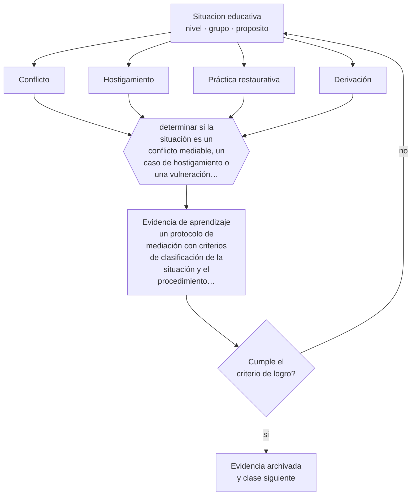

# Clase 150 — Conflictos entre estudiantes

> **Parte 12 · Gestión del aula y convivencia** — clase 6 de 12

**Estado de evidencia:** `EMERGENTE` · **Etapa:** 🟣 Etapa C — Núcleo profesional docente · **Población de referencia:** transversal, con foco escolar 
**Decisión que habilita:** determinar si la situación es un conflicto mediable, un caso de hostigamiento o una vulneración que exige protocolo 
**Evidencia de aprendizaje:** un protocolo de mediación con criterios de clasificación de la situación y el procedimiento para cada caso

## 🎯 Propósito

Mediar conflictos entre pares con un procedimiento estructurado y distinguir conflicto, agresión sostenida y situación que requiere protocolo institucional.

## 📚 Resultados de aprendizaje

Al finalizar esta clase podrás:

1. **Definir** con precisión los cuatro conceptos centrales de la clase y reconocerlos en una situación educativa real, no solo en su enunciado.
2. **Explicar** cómo intervenir un conflicto entre estudiantes de modo que ambos aprendan y el problema no vuelva.
3. **Decidir** —si la situación es un conflicto mediable, un caso de hostigamiento o una vulneración que exige protocolo— y sostener la decisión con un fundamento escrito.
4. **Producir** la evidencia de la clase —un protocolo de mediación con criterios de clasificación de la situación y el procedimiento para cada caso— y contrastarla contra el criterio de logro.
5. **Distinguir** lo que la evidencia sostiene de lo que es práctica instalada, preferencia personal o costumbre de la institución.

## 🧩 Conceptos centrales

| Concepto | Comprensión verificable |
|---|---|
| **Conflicto** | desacuerdo entre partes con poder relativamente equivalente; es mediable |
| **Hostigamiento** | agresión sostenida con asimetría de poder; no es mediable y requiere intervención específica |
| **Práctica restaurativa** | enfoque centrado en reparar el daño y restablecer relaciones, con evidencia emergente |
| **Derivación** | traspaso a la instancia competente cuando la situación excede la mediación pedagógica |

## 🗺️ Flujo de razonamiento

## 📖 Desarrollo

### 1. El fondo del asunto

La primera decisión es de clasificación y determina todo lo demás: un conflicto entre pares con poder equivalente se puede mediar; una situación de hostigamiento sostenido no, porque la mediación expone a quien es agredido y legitima una equivalencia que no existe. Confundir ambas es el error más grave y más frecuente en la gestión de convivencia escolar.

### 2. Cómo se traduce en decisiones de enseñanza

El protocolo define primero los criterios de clasificación —asimetría, repetición, intención, efecto— y después el procedimiento para cada caso. Para el conflicto mediable, un procedimiento restaurativo con preguntas estructuradas y acuerdo verificable. Para el hostigamiento, protección de la víctima, intervención sobre el agresor y activación del protocolo institucional.

### 3. Qué sostiene la evidencia y qué no

La evidencia sobre prácticas restaurativas en escuelas es prometedora y todavía limitada: los estudios muestran efectos en clima y en reducción de sanciones, con alta variabilidad según implementación. No sustituyen los protocolos obligatorios ante situaciones que la norma tipifica.

> **Cómo leer el estado de evidencia `EMERGENTE`.** El cuerpo de estudios es reciente, escaso o poco replicado. Úsala como hipótesis de trabajo con seguimiento explícito, nunca como argumento de autoridad ni como base para una política de establecimiento.

## 🧪 Taller guiado

Aplica la clase a **uno** de los contextos siguientes y repite después el ejercicio en un
contexto de exigencia distinta. Cambiar de contexto es parte del aprendizaje: lo que funciona
con un grupo no se traslada intacto a otro.

| Contexto | Rasgo que cambia la decisión |
|---|---|
| Curso de primer ciclo básico | las rutinas se enseñan explícitamente y se practican |
| Curso de educación media | la legitimidad y la justicia percibida deciden el clima |
| Curso con conflictos frecuentes | hay que estabilizar antes de exigir contenido |
| Taller o laboratorio | el riesgo físico cambia la gestión del grupo |
| Clase con docente de reemplazo | no hay historia compartida en la que apoyarse |
| Contexto de vulneración de derechos | el protocolo manda sobre el criterio individual |

**Secuencia de trabajo:**

1. Delimita el contexto: nivel, edad, tamaño del grupo, asignatura o experiencia y tiempo real disponible.
2. Declara qué saben ya los estudiantes y **cómo lo comprobaste**, no cómo lo supones.
3. Formula la decisión pedagógica que esta clase habilita y escribe su fundamento.
4. Anticipa qué observarías si la decisión funciona y qué observarías si no funciona.
5. Diseña de antemano la alternativa que aplicarás si la primera estrategia falla.
6. Ejecuta o simula, y registra lo observado con fecha, contexto y evidencia concreta.
7. Produce la evidencia de aprendizaje de la clase.
8. Contrástala contra el criterio de logro, corrige y recién entonces avanza.

### 📦 Evidencia de aprendizaje

Un protocolo de mediación con criterios de clasificación de la situación y el procedimiento para cada caso.

Debe incluir contexto, decisión, fundamento, fuentes consultadas con su fecha, indicador de
logro observable, riesgos previstos y qué harías distinto en la siguiente iteración.

## 🏆 Reto verificable

Aplica tu protocolo a una situación real y documenta la clasificación, el procedimiento y el seguimiento. Revisa a las dos semanas si el acuerdo se sostuvo.

## ✅ Criterio de logro

- [ ] el protocolo declara criterios explícitos para clasificar la situación;
- [ ] cada procedimiento termina con acuerdo verificable y seguimiento con fecha;
- [ ] cada afirmación sobre «lo que funciona» está atribuida a una fuente identificable, con autor y fecha;
- [ ] la decisión es ejecutable con el tiempo, el espacio, el número de estudiantes y los recursos que realmente tienes;
- [ ] la evidencia queda archivada de forma reproducible: otra persona podría revisarla sin que tú se la expliques.

## ⚠️ Errores frecuentes

**Propios de esta clase:**

- Mediar una situación de hostigamiento como si fuera un conflicto entre iguales.
- Cerrar la intervención sin acuerdo verificable ni seguimiento posterior.

**Característicos de la parte 12:**

- Gestionar por reacción y llamar disciplina a la escalada.
- Aplicar sanciones sin debido proceso ni proporcionalidad.

## ♿ Diversidad, accesibilidad y ética

Los estudiantes con discapacidad, migrantes o con identidades minorizadas son objeto de hostigamiento con mayor frecuencia y lo reportan menos. Un sistema que depende de la denuncia espontánea los deja fuera; se requiere detección activa.

Antes de aplicar cualquier decisión de esta clase con estudiantes reales, revisa el
[protocolo de práctica responsable](../../../docs/ETICA_Y_PRACTICA_RESPONSABLE.md):
consentimiento, resguardo de datos personales, proporcionalidad de la intervención y derecho
de cada estudiante a no ser objeto de un ensayo que no le reporta beneficio.

## ❓ Preguntas de comprobación

1. ¿Hay asimetría de poder entre las partes?
2. ¿Es la primera vez o es un patrón sostenido?
3. ¿Quién verifica en dos semanas si el acuerdo se cumplió?

## 📕 Lecturas base

**Olweus, D. *Bullying at School* y programas derivados.**  
*Qué aporta a esta clase:* distingue hostigamiento de conflicto y aporta criterios operativos de identificación.

**Mineduc / Superintendencia de Educación. *Orientaciones y protocolos de convivencia escolar*.**  
*Qué aporta a esta clase:* define el procedimiento obligatorio en Chile ante situaciones tipificadas.

Catálogo completo: [bibliografía del programa](../../../docs/BIBLIOGRAFIA.md) ·
[glosario](../../../docs/GLOSARIO.md) ·
[fuentes oficiales y cómo leerlas](../../../docs/FUENTES.md).

## 🔗 Conexión con el resto del programa

Se apoya en las clases 045 y 149 y se conecta con la clase 155 cuando la situación escala.

> [!IMPORTANT]
> Material de formación profesional. No reemplaza un título de pedagogía, una habilitación
> legal para ejercer, ni el juicio de un equipo educativo que conoce a sus estudiantes.

---

| Anterior | Índice | Siguiente |
|---|---|---|
| [← 149 · Comunicación docente](../class-05-comunicacion-docente/README.md) | [Parte 12](../README.md) · [Programa](../../../README.md) | [151 · Desmotivación y resistencia →](../class-07-desmotivacion-y-resistencia/README.md) |
