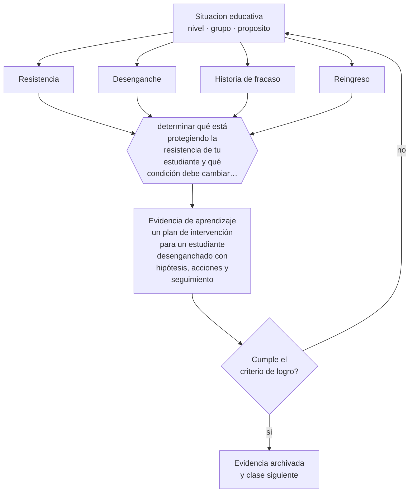

# Clase 151 — Desmotivación y resistencia

> **Parte 12 · Gestión del aula y convivencia** — clase 7 de 12

**Estado de evidencia:** `CONSISTENTE` · **Etapa:** 🟣 Etapa C — Núcleo profesional docente · **Población de referencia:** transversal, con foco escolar 
**Decisión que habilita:** determinar qué está protegiendo la resistencia de tu estudiante y qué condición debe cambiar primero 
**Evidencia de aprendizaje:** un plan de intervención para un estudiante desenganchado con hipótesis, acciones y seguimiento

## 🎯 Propósito

Intervenir la desmotivación y la resistencia entendiendo su función: casi siempre protegen de una experiencia repetida de fracaso o de una relación deteriorada.

## 📚 Resultados de aprendizaje

Al finalizar esta clase podrás:

1. **Definir** con precisión los cuatro conceptos centrales de la clase y reconocerlos en una situación educativa real, no solo en su enunciado.
2. **Explicar** qué hacer con el estudiante que ya decidió que su asignatura no le interesa.
3. **Decidir** —qué está protegiendo la resistencia de tu estudiante y qué condición debe cambiar primero— y sostener la decisión con un fundamento escrito.
4. **Producir** la evidencia de la clase —un plan de intervención para un estudiante desenganchado con hipótesis, acciones y seguimiento— y contrastarla contra el criterio de logro.
5. **Distinguir** lo que la evidencia sostiene de lo que es práctica instalada, preferencia personal o costumbre de la institución.

## 🧩 Conceptos centrales

| Concepto | Comprensión verificable |
|---|---|
| **Resistencia** | conducta de rechazo activo o pasivo que suele proteger de una amenaza percibida |
| **Desenganche** | retiro progresivo del esfuerzo y de la participación, con frecuencia silencioso |
| **Historia de fracaso** | acumulación de experiencias que hacen racional dejar de intentar |
| **Reingreso** | proceso gradual de recuperación de la participación con logros verificables |

## 🗺️ Flujo de razonamiento

## 📖 Desarrollo

### 1. El fondo del asunto

No esforzarse protege: si nunca lo intentas, el fracaso no informa sobre tu capacidad. Vista así, la desmotivación deja de ser un defecto de carácter y pasa a ser una estrategia comprensible ante una historia de fracaso. La intervención, en consecuencia, no consiste en exigir más esfuerzo sino en cambiar las condiciones que hacen racional no intentarlo.

### 2. Cómo se traduce en decisiones de enseñanza

El plan parte de una hipótesis explícita: qué protege esta conducta. Después, tres acciones con seguimiento: una experiencia temprana de éxito auténtico, una relación con un adulto que note su presencia, y una reducción del costo de intentar —empezar con una tarea acotada, sin exposición pública—. El seguimiento con fechas es lo que distingue un plan de una buena intención.

### 3. Qué sostiene la evidencia y qué no

La desmotivación puede tener causas que exceden la asignatura: situación familiar, salud mental, consumo, vulneración. La intervención pedagógica no las resuelve y puede retrasar la derivación necesaria. La regla es intervenir en lo propio y observar señales que exigen derivar.

> **Cómo leer el estado de evidencia `CONSISTENTE`.** La evidencia es amplia y coherente, pero proviene sobre todo de estudios correlacionales, de síntesis con heterogeneidad alta o de contextos distintos al tuyo. Sirve para orientar la decisión y exige que compruebes el efecto en tu propio grupo.

## 🧪 Taller guiado

Aplica la clase a **uno** de los contextos siguientes y repite después el ejercicio en un
contexto de exigencia distinta. Cambiar de contexto es parte del aprendizaje: lo que funciona
con un grupo no se traslada intacto a otro.

| Contexto | Rasgo que cambia la decisión |
|---|---|
| Curso de primer ciclo básico | las rutinas se enseñan explícitamente y se practican |
| Curso de educación media | la legitimidad y la justicia percibida deciden el clima |
| Curso con conflictos frecuentes | hay que estabilizar antes de exigir contenido |
| Taller o laboratorio | el riesgo físico cambia la gestión del grupo |
| Clase con docente de reemplazo | no hay historia compartida en la que apoyarse |
| Contexto de vulneración de derechos | el protocolo manda sobre el criterio individual |

**Secuencia de trabajo:**

1. Delimita el contexto: nivel, edad, tamaño del grupo, asignatura o experiencia y tiempo real disponible.
2. Declara qué saben ya los estudiantes y **cómo lo comprobaste**, no cómo lo supones.
3. Formula la decisión pedagógica que esta clase habilita y escribe su fundamento.
4. Anticipa qué observarías si la decisión funciona y qué observarías si no funciona.
5. Diseña de antemano la alternativa que aplicarás si la primera estrategia falla.
6. Ejecuta o simula, y registra lo observado con fecha, contexto y evidencia concreta.
7. Produce la evidencia de aprendizaje de la clase.
8. Contrástala contra el criterio de logro, corrige y recién entonces avanza.

### 📦 Evidencia de aprendizaje

Un plan de intervención para un estudiante desenganchado con hipótesis, acciones y seguimiento.

Debe incluir contexto, decisión, fundamento, fuentes consultadas con su fecha, indicador de
logro observable, riesgos previstos y qué harías distinto en la siguiente iteración.

## 🏆 Reto verificable

Escoge al estudiante más desenganchado de tu curso. Ejecuta el plan durante seis semanas con seguimiento semanal y documenta lo que cambió.

## ✅ Criterio de logro

- [ ] el plan declara una hipótesis sobre qué protege la conducta;
- [ ] incluye una experiencia de éxito auténtico y seguimiento con fechas;
- [ ] cada afirmación sobre «lo que funciona» está atribuida a una fuente identificable, con autor y fecha;
- [ ] la decisión es ejecutable con el tiempo, el espacio, el número de estudiantes y los recursos que realmente tienes;
- [ ] la evidencia queda archivada de forma reproducible: otra persona podría revisarla sin que tú se la expliques.

## ⚠️ Errores frecuentes

**Propios de esta clase:**

- Interpretar la resistencia como falta de voluntad y responder con más exigencia.
- Sostener el plan sin fechas de seguimiento, con lo que se disuelve en dos semanas.

**Característicos de la parte 12:**

- Gestionar por reacción y llamar disciplina a la escalada.
- Aplicar sanciones sin debido proceso ni proporcionalidad.

## ♿ Diversidad, accesibilidad y ética

El desenganche silencioso pasa inadvertido cuando la conducta no molesta. Los estudiantes que se retiran sin disrumpir son los que menos intervención reciben y los que con más frecuencia abandonan.

Antes de aplicar cualquier decisión de esta clase con estudiantes reales, revisa el
[protocolo de práctica responsable](../../../docs/ETICA_Y_PRACTICA_RESPONSABLE.md):
consentimiento, resguardo de datos personales, proporcionalidad de la intervención y derecho
de cada estudiante a no ser objeto de un ensayo que no le reporta beneficio.

## ❓ Preguntas de comprobación

1. ¿De qué protege a este estudiante no intentarlo?
2. ¿Cuándo fue la última vez que tuvo una experiencia real de logro en tu asignatura?
3. ¿Qué adulto de la institución nota si él falta?

## 📕 Lecturas base

**Covington, M. (1992). *Making the Grade: A Self-Worth Perspective on Motivation and School Reform*.**  
*Qué aporta a esta clase:* explica la evitación del esfuerzo como protección del valor propio.

**Wlodkowski, R. (2008). *Enhancing Adult Motivation to Learn*.**  
*Qué aporta a esta clase:* estrategias de reenganche aplicables también a adolescentes y adultos jóvenes.

Catálogo completo: [bibliografía del programa](../../../docs/BIBLIOGRAFIA.md) ·
[glosario](../../../docs/GLOSARIO.md) ·
[fuentes oficiales y cómo leerlas](../../../docs/FUENTES.md).

## 🔗 Conexión con el resto del programa

Aplica las clases 022 y 062 y se conecta con la clase 155 si aparecen señales de riesgo.

> [!IMPORTANT]
> Material de formación profesional. No reemplaza un título de pedagogía, una habilitación
> legal para ejercer, ni el juicio de un equipo educativo que conoce a sus estudiantes.

---

| Anterior | Índice | Siguiente |
|---|---|---|
| [← 150 · Conflictos entre estudiantes](../class-06-conflictos-entre-estudiantes/README.md) | [Parte 12](../README.md) · [Programa](../../../README.md) | [152 · Copias, plagio e integridad →](../class-08-copias-plagio-e-integridad/README.md) |
