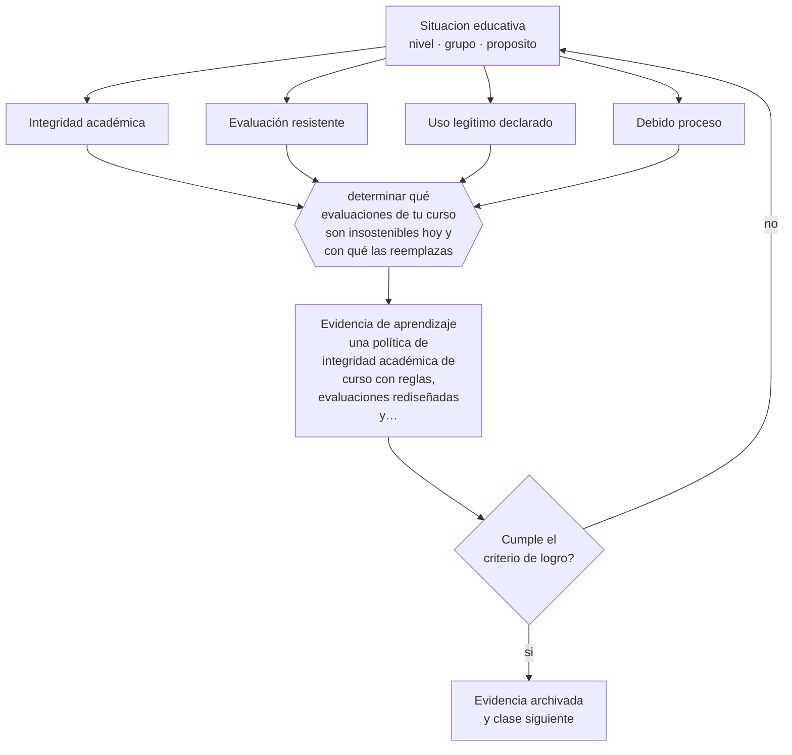

# Clase 152 — Copias, plagio e integridad

> **Parte 12 · Gestión del aula y convivencia** — clase 8 de 12

**Estado de evidencia:** `EN-DEBATE` · **Etapa:** 🟣 Etapa C — Núcleo profesional docente · **Población de referencia:** transversal, con foco escolar 
**Decisión que habilita:** determinar qué evaluaciones de tu curso son insostenibles hoy y con qué las reemplazas 
**Evidencia de aprendizaje:** una política de integridad académica de curso con reglas, evaluaciones rediseñadas y procedimiento ante incumplimiento

## 🎯 Propósito

Diseñar un sistema de integridad académica que combine reglas claras, evaluación resistente y formación en criterio, en un contexto donde las herramientas generativas cambiaron el problema.

## 📚 Resultados de aprendizaje

Al finalizar esta clase podrás:

1. **Definir** con precisión los cuatro conceptos centrales de la clase y reconocerlos en una situación educativa real, no solo en su enunciado.
2. **Explicar** cómo sostener la integridad académica cuando la verificación de autoría dejó de ser posible.
3. **Decidir** —qué evaluaciones de tu curso son insostenibles hoy y con qué las reemplazas— y sostener la decisión con un fundamento escrito.
4. **Producir** la evidencia de la clase —una política de integridad académica de curso con reglas, evaluaciones rediseñadas y procedimiento ante incumplimiento— y contrastarla contra el criterio de logro.
5. **Distinguir** lo que la evidencia sostiene de lo que es práctica instalada, preferencia personal o costumbre de la institución.

## 🧩 Conceptos centrales

| Concepto | Comprensión verificable |
|---|---|
| **Integridad académica** | conjunto de normas sobre autoría, honestidad y uso legítimo de fuentes y herramientas |
| **Evaluación resistente** | tarea cuyo resultado no puede producirse sin el aprendizaje que declara evaluar |
| **Uso legítimo declarado** | política explícita sobre qué herramientas se permiten y bajo qué condiciones |
| **Debido proceso** | procedimiento justo ante una acusación de falta de integridad |

## 🗺️ Flujo de razonamiento

## 📖 Desarrollo

### 1. El fondo del asunto

La disponibilidad de herramientas generativas volvió inviable la verificación de autoría por inspección del texto, y los detectores automáticos tienen tasas de error que no permiten sostener una acusación. El desplazamiento razonable es doble: hacia evaluaciones donde el producto no se pueda generar sin aprendizaje —defensa oral, producción en clase, trabajo sobre datos propios— y hacia reglas explícitas sobre uso legítimo.

### 2. Cómo se traduce en decisiones de enseñanza

La política de curso debe declarar qué está permitido, qué debe declararse y qué está prohibido, con ejemplos concretos. Y el procedimiento ante un incumplimiento debe respetar debido proceso: evidencia, oportunidad de explicar, proporcionalidad y registro. Acusar a partir de un detector automático es técnicamente insostenible y produce daños graves e injustos.

### 3. Qué sostiene la evidencia y qué no

Hay desacuerdo genuino sobre qué usos son legítimos y sobre cómo evaluar en este contexto: el campo está cambiando y las políticas institucionales van detrás. Cualquier posición debe declararse como decisión provisional y revisable, y comunicarse con anticipación a los estudiantes.

> **Cómo leer el estado de evidencia `EN-DEBATE`.** Hay desacuerdo activo y publicado entre especialistas competentes. La clase presenta las posiciones y sus argumentos; tu tarea no es escoger un bando, sino saber qué evidencia te haría cambiar de posición.

## 🧪 Taller guiado

Aplica la clase a **uno** de los contextos siguientes y repite después el ejercicio en un
contexto de exigencia distinta. Cambiar de contexto es parte del aprendizaje: lo que funciona
con un grupo no se traslada intacto a otro.

| Contexto | Rasgo que cambia la decisión |
|---|---|
| Curso de primer ciclo básico | las rutinas se enseñan explícitamente y se practican |
| Curso de educación media | la legitimidad y la justicia percibida deciden el clima |
| Curso con conflictos frecuentes | hay que estabilizar antes de exigir contenido |
| Taller o laboratorio | el riesgo físico cambia la gestión del grupo |
| Clase con docente de reemplazo | no hay historia compartida en la que apoyarse |
| Contexto de vulneración de derechos | el protocolo manda sobre el criterio individual |

**Secuencia de trabajo:**

1. Delimita el contexto: nivel, edad, tamaño del grupo, asignatura o experiencia y tiempo real disponible.
2. Declara qué saben ya los estudiantes y **cómo lo comprobaste**, no cómo lo supones.
3. Formula la decisión pedagógica que esta clase habilita y escribe su fundamento.
4. Anticipa qué observarías si la decisión funciona y qué observarías si no funciona.
5. Diseña de antemano la alternativa que aplicarás si la primera estrategia falla.
6. Ejecuta o simula, y registra lo observado con fecha, contexto y evidencia concreta.
7. Produce la evidencia de aprendizaje de la clase.
8. Contrástala contra el criterio de logro, corrige y recién entonces avanza.

### 📦 Evidencia de aprendizaje

Una política de integridad académica de curso con reglas, evaluaciones rediseñadas y procedimiento ante incumplimiento.

Debe incluir contexto, decisión, fundamento, fuentes consultadas con su fecha, indicador de
logro observable, riesgos previstos y qué harías distinto en la siguiente iteración.

## 🏆 Reto verificable

Identifica la evaluación más vulnerable de tu curso y rediséñala para que exija aprendizaje verificable. Comunica la política antes de aplicarla.

## ✅ Criterio de logro

- [ ] la política declara usos permitidos, condicionados y prohibidos con ejemplos;
- [ ] el procedimiento ante incumplimiento respeta debido proceso y proporcionalidad;
- [ ] cada afirmación sobre «lo que funciona» está atribuida a una fuente identificable, con autor y fecha;
- [ ] la decisión es ejecutable con el tiempo, el espacio, el número de estudiantes y los recursos que realmente tienes;
- [ ] la evidencia queda archivada de forma reproducible: otra persona podría revisarla sin que tú se la expliques.

## ⚠️ Errores frecuentes

**Propios de esta clase:**

- Acusar de plagio a partir del resultado de un detector automático.
- Prohibir sin definir usos legítimos, con lo que la regla se vuelve inaplicable y arbitraria.

**Característicos de la parte 12:**

- Gestionar por reacción y llamar disciplina a la escalada.
- Aplicar sanciones sin debido proceso ni proporcionalidad.

## ♿ Diversidad, accesibilidad y ética

Las acusaciones basadas en detectores afectan de forma desproporcionada a estudiantes que escriben en segunda lengua, cuyos textos son marcados con más frecuencia. Es una razón técnica adicional para no usarlos como evidencia.

Antes de aplicar cualquier decisión de esta clase con estudiantes reales, revisa el
[protocolo de práctica responsable](../../../docs/ETICA_Y_PRACTICA_RESPONSABLE.md):
consentimiento, resguardo de datos personales, proporcionalidad de la intervención y derecho
de cada estudiante a no ser objeto de un ensayo que no le reporta beneficio.

## ❓ Preguntas de comprobación

1. ¿Qué evaluación tuya podría resolverse íntegramente sin haber aprendido nada?
2. ¿Qué uso de herramientas permites y lo dijiste por escrito?
3. ¿Qué evidencia sostendría una acusación en tu curso?

## 📕 Lecturas base

**International Center for Academic Integrity. *Fundamental Values of Academic Integrity*.**  
*Qué aporta a esta clase:* marco de referencia sobre valores y políticas institucionales.

**UNESCO (2023). *Guidance for Generative AI in Education and Research*.**  
*Qué aporta a esta clase:* orientaciones internacionales para políticas institucionales de uso de IA.

Catálogo completo: [bibliografía del programa](../../../docs/BIBLIOGRAFIA.md) ·
[glosario](../../../docs/GLOSARIO.md) ·
[fuentes oficiales y cómo leerlas](../../../docs/FUENTES.md).

## 🔗 Conexión con el resto del programa

Se conecta con las clases 136 y 164 y anticipa el tratamiento de la parte 13.

> [!IMPORTANT]
> Material de formación profesional. No reemplaza un título de pedagogía, una habilitación
> legal para ejercer, ni el juicio de un equipo educativo que conoce a sus estudiantes.

---

| Anterior | Índice | Siguiente |
|---|---|---|
| [← 151 · Desmotivación y resistencia](../class-07-desmotivacion-y-resistencia/README.md) | [Parte 12](../README.md) · [Programa](../../../README.md) | [153 · Uso de celulares y distracciones →](../class-09-uso-de-celulares-y-distracciones/README.md) |
