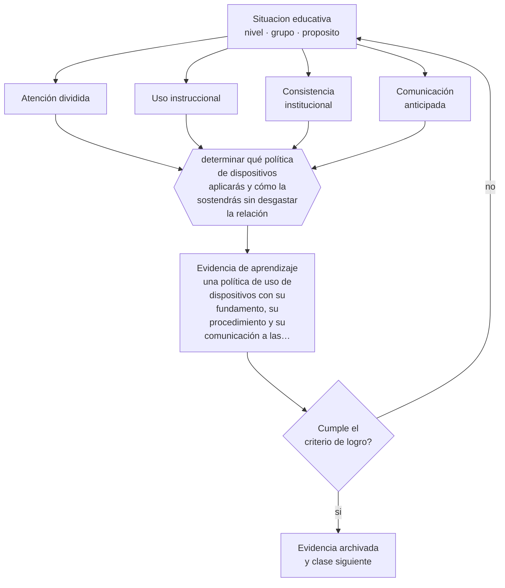

# Clase 153 — Uso de celulares y distracciones

> **Parte 12 · Gestión del aula y convivencia** — clase 9 de 12

**Estado de evidencia:** `EN-DEBATE` · **Etapa:** 🟣 Etapa C — Núcleo profesional docente · **Población de referencia:** transversal, con foco escolar 
**Decisión que habilita:** determinar qué política de dispositivos aplicarás y cómo la sostendrás sin desgastar la relación 
**Evidencia de aprendizaje:** una política de uso de dispositivos con su fundamento, su procedimiento y su comunicación a las familias

## 🎯 Propósito

Definir una política de uso de dispositivos fundada en el efecto sobre la atención y el aprendizaje, aplicable de forma consistente y comunicada a estudiantes y familias.

## 📚 Resultados de aprendizaje

Al finalizar esta clase podrás:

1. **Definir** con precisión los cuatro conceptos centrales de la clase y reconocerlos en una situación educativa real, no solo en su enunciado.
2. **Explicar** qué política sobre dispositivos sostiene el aprendizaje sin convertirse en una guerra permanente.
3. **Decidir** —qué política de dispositivos aplicarás y cómo la sostendrás sin desgastar la relación— y sostener la decisión con un fundamento escrito.
4. **Producir** la evidencia de la clase —una política de uso de dispositivos con su fundamento, su procedimiento y su comunicación a las familias— y contrastarla contra el criterio de logro.
5. **Distinguir** lo que la evidencia sostiene de lo que es práctica instalada, preferencia personal o costumbre de la institución.

## 🧩 Conceptos centrales

| Concepto | Comprensión verificable |
|---|---|
| **Atención dividida** | alternancia entre tareas con costo de rendimiento; no es procesamiento simultáneo |
| **Uso instruccional** | empleo del dispositivo para una tarea de aprendizaje definida y acotada |
| **Consistencia institucional** | aplicación uniforme de la política en todo el establecimiento |
| **Comunicación anticipada** | información a estudiantes y familias antes de aplicar la regla |

## 🗺️ Flujo de razonamiento

## 📖 Desarrollo

### 1. El fondo del asunto

La evidencia sobre uso de dispositivos en clase muestra efectos negativos sobre la atención y el desempeño cuando el uso no está vinculado a la tarea, incluidos efectos sobre quienes están alrededor. También muestra que la mera presencia visible del teléfono puede afectar el rendimiento en tareas exigentes. Al mismo tiempo, la prohibición total desaprovecha usos instruccionales legítimos y es difícil de sostener sin respaldo institucional.

### 2. Cómo se traduce en decisiones de enseñanza

Una política aplicable define momentos y usos: guardado por defecto, uso autorizado y acotado para tareas específicas, y procedimiento claro ante el incumplimiento. La condición decisiva es la consistencia institucional: si cada docente aplica una regla distinta, la política se negocia clase a clase y desgasta la relación.

### 3. Qué sostiene la evidencia y qué no

La evidencia sobre prohibiciones a nivel de establecimiento es mixta y los estudios disponibles tienen limitaciones de diseño. Además, hay estudiantes que requieren el dispositivo como tecnología de apoyo, y cualquier política debe contemplarlo explícitamente para no producir exclusión.

> **Cómo leer el estado de evidencia `EN-DEBATE`.** Hay desacuerdo activo y publicado entre especialistas competentes. La clase presenta las posiciones y sus argumentos; tu tarea no es escoger un bando, sino saber qué evidencia te haría cambiar de posición.

## 🧪 Taller guiado

Aplica la clase a **uno** de los contextos siguientes y repite después el ejercicio en un
contexto de exigencia distinta. Cambiar de contexto es parte del aprendizaje: lo que funciona
con un grupo no se traslada intacto a otro.

| Contexto | Rasgo que cambia la decisión |
|---|---|
| Curso de primer ciclo básico | las rutinas se enseñan explícitamente y se practican |
| Curso de educación media | la legitimidad y la justicia percibida deciden el clima |
| Curso con conflictos frecuentes | hay que estabilizar antes de exigir contenido |
| Taller o laboratorio | el riesgo físico cambia la gestión del grupo |
| Clase con docente de reemplazo | no hay historia compartida en la que apoyarse |
| Contexto de vulneración de derechos | el protocolo manda sobre el criterio individual |

**Secuencia de trabajo:**

1. Delimita el contexto: nivel, edad, tamaño del grupo, asignatura o experiencia y tiempo real disponible.
2. Declara qué saben ya los estudiantes y **cómo lo comprobaste**, no cómo lo supones.
3. Formula la decisión pedagógica que esta clase habilita y escribe su fundamento.
4. Anticipa qué observarías si la decisión funciona y qué observarías si no funciona.
5. Diseña de antemano la alternativa que aplicarás si la primera estrategia falla.
6. Ejecuta o simula, y registra lo observado con fecha, contexto y evidencia concreta.
7. Produce la evidencia de aprendizaje de la clase.
8. Contrástala contra el criterio de logro, corrige y recién entonces avanza.

### 📦 Evidencia de aprendizaje

Una política de uso de dispositivos con su fundamento, su procedimiento y su comunicación a las familias.

Debe incluir contexto, decisión, fundamento, fuentes consultadas con su fecha, indicador de
logro observable, riesgos previstos y qué harías distinto en la siguiente iteración.

## 🏆 Reto verificable

Revisa la política de tu establecimiento y su aplicación real durante una semana. Propón una versión consistente y comunicable a las familias.

## ✅ Criterio de logro

- [ ] la política declara momentos, usos autorizados y procedimiento ante incumplimiento;
- [ ] contempla explícitamente las excepciones por tecnología de apoyo;
- [ ] cada afirmación sobre «lo que funciona» está atribuida a una fuente identificable, con autor y fecha;
- [ ] la decisión es ejecutable con el tiempo, el espacio, el número de estudiantes y los recursos que realmente tienes;
- [ ] la evidencia queda archivada de forma reproducible: otra persona podría revisarla sin que tú se la expliques.

## ⚠️ Errores frecuentes

**Propios de esta clase:**

- Aplicar una política individual distinta de la institucional y negociarla clase a clase.
- Prohibir sin contemplar los usos como tecnología de apoyo para estudiantes que la requieren.

**Característicos de la parte 12:**

- Gestionar por reacción y llamar disciplina a la escalada.
- Aplicar sanciones sin debido proceso ni proporcionalidad.

## ♿ Diversidad, accesibilidad y ética

Las políticas restrictivas mal diseñadas pueden privar de tecnología de apoyo a estudiantes con discapacidad. La excepción debe estar escrita y no depender de que cada docente la conceda.

Antes de aplicar cualquier decisión de esta clase con estudiantes reales, revisa el
[protocolo de práctica responsable](../../../docs/ETICA_Y_PRACTICA_RESPONSABLE.md):
consentimiento, resguardo de datos personales, proporcionalidad de la intervención y derecho
de cada estudiante a no ser objeto de un ensayo que no le reporta beneficio.

## ❓ Preguntas de comprobación

1. ¿Qué regla aplica realmente en tu establecimiento y quién la sostiene?
2. ¿Qué uso instruccional justifica el dispositivo en tu asignatura?
3. ¿Qué estudiante lo necesita como apoyo y cómo lo resolviste?

## 📕 Lecturas base

**Ward, A. et al. (2017). *Brain Drain: The Mere Presence of One's Own Smartphone Reduces Available Cognitive Capacity*.**  
*Qué aporta a esta clase:* evidencia experimental sobre el costo atencional de la presencia del dispositivo.

**UNESCO (2023). *Informe de Seguimiento de la Educación en el Mundo: tecnología en la educación*.**  
*Qué aporta a esta clase:* revisa la evidencia sobre uso de tecnología y políticas de dispositivos en escuelas.

Catálogo completo: [bibliografía del programa](../../../docs/BIBLIOGRAFIA.md) ·
[glosario](../../../docs/GLOSARIO.md) ·
[fuentes oficiales y cómo leerlas](../../../docs/FUENTES.md).

## 🔗 Conexión con el resto del programa

Se apoya en la clase 018 y se articula con la parte 13 sobre uso pedagógico de la tecnología.

> [!IMPORTANT]
> Material de formación profesional. No reemplaza un título de pedagogía, una habilitación
> legal para ejercer, ni el juicio de un equipo educativo que conoce a sus estudiantes.

---

| Anterior | Índice | Siguiente |
|---|---|---|
| [← 152 · Copias, plagio e integridad](../class-08-copias-plagio-e-integridad/README.md) | [Parte 12](../README.md) · [Programa](../../../README.md) | [154 · Trabajo con apoderados →](../class-10-trabajo-con-apoderados/README.md) |
