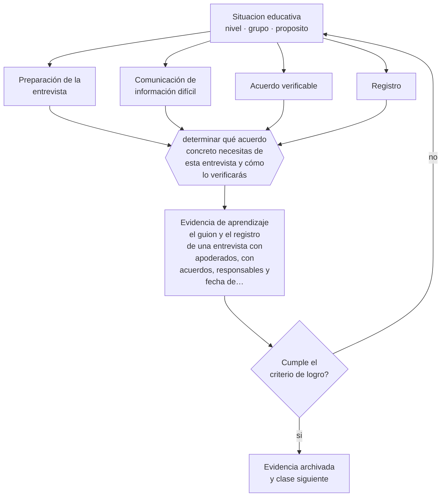

# Clase 154 — Trabajo con apoderados

> **Parte 12 · Gestión del aula y convivencia** — clase 10 de 12

**Estado de evidencia:** `CONSISTENTE` · **Etapa:** 🟣 Etapa C — Núcleo profesional docente · **Población de referencia:** transversal, con foco escolar 
**Decisión que habilita:** determinar qué acuerdo concreto necesitas de esta entrevista y cómo lo verificarás 
**Evidencia de aprendizaje:** el guion y el registro de una entrevista con apoderados, con acuerdos, responsables y fecha de seguimiento

## 🎯 Propósito

Trabajar con apoderados de forma profesional: preparación de la entrevista, comunicación de información difícil, construcción de acuerdos y registro verificable.

## 📚 Resultados de aprendizaje

Al finalizar esta clase podrás:

1. **Definir** con precisión los cuatro conceptos centrales de la clase y reconocerlos en una situación educativa real, no solo en su enunciado.
2. **Explicar** cómo conducir una entrevista difícil con una familia sin perder el foco en el estudiante.
3. **Decidir** —qué acuerdo concreto necesitas de esta entrevista y cómo lo verificarás— y sostener la decisión con un fundamento escrito.
4. **Producir** la evidencia de la clase —el guion y el registro de una entrevista con apoderados, con acuerdos, responsables y fecha de seguimiento— y contrastarla contra el criterio de logro.
5. **Distinguir** lo que la evidencia sostiene de lo que es práctica instalada, preferencia personal o costumbre de la institución.

## 🧩 Conceptos centrales

| Concepto | Comprensión verificable |
|---|---|
| **Preparación de la entrevista** | definición previa del objetivo, la evidencia y el acuerdo buscado |
| **Comunicación de información difícil** | entrega de información sensible con evidencia, sin juicio y con vía de salida |
| **Acuerdo verificable** | compromiso concreto con responsable, plazo y forma de comprobación |
| **Registro** | documentación de lo conversado y acordado, firmada o confirmada por ambas partes |

## 🗺️ Flujo de razonamiento

## 📖 Desarrollo

### 1. El fondo del asunto

Las entrevistas con apoderados fallan por falta de preparación: se convocan sin objetivo claro, se entrega información sin evidencia y se termina sin acuerdo. Una entrevista profesional define antes qué se busca lograr, reúne evidencia concreta de lo que se afirmará, anticipa la reacción probable y termina con un acuerdo verificable y registrado.

### 2. Cómo se traduce en decisiones de enseñanza

La comunicación de información difícil se sostiene en evidencia y no en interpretaciones: mostrar el trabajo del estudiante, los registros de asistencia o las observaciones fechadas evita la discusión sobre percepciones. Y el acuerdo debe ser realista para la familia: comprometer lo imposible garantiza el incumplimiento y deteriora la relación para las próximas conversaciones.

### 3. Qué sostiene la evidencia y qué no

Hay situaciones donde el acuerdo con la familia no es posible o donde la familia es parte del problema. En esos casos la entrevista tiene otro propósito —informar, derivar, activar protocolo— y conviene tenerlo claro antes de convocar. Y toda información sensible del estudiante tiene resguardos que hay que respetar.

> **Cómo leer el estado de evidencia `CONSISTENTE`.** La evidencia es amplia y coherente, pero proviene sobre todo de estudios correlacionales, de síntesis con heterogeneidad alta o de contextos distintos al tuyo. Sirve para orientar la decisión y exige que compruebes el efecto en tu propio grupo.

## 🧪 Taller guiado

Aplica la clase a **uno** de los contextos siguientes y repite después el ejercicio en un
contexto de exigencia distinta. Cambiar de contexto es parte del aprendizaje: lo que funciona
con un grupo no se traslada intacto a otro.

| Contexto | Rasgo que cambia la decisión |
|---|---|
| Curso de primer ciclo básico | las rutinas se enseñan explícitamente y se practican |
| Curso de educación media | la legitimidad y la justicia percibida deciden el clima |
| Curso con conflictos frecuentes | hay que estabilizar antes de exigir contenido |
| Taller o laboratorio | el riesgo físico cambia la gestión del grupo |
| Clase con docente de reemplazo | no hay historia compartida en la que apoyarse |
| Contexto de vulneración de derechos | el protocolo manda sobre el criterio individual |

**Secuencia de trabajo:**

1. Delimita el contexto: nivel, edad, tamaño del grupo, asignatura o experiencia y tiempo real disponible.
2. Declara qué saben ya los estudiantes y **cómo lo comprobaste**, no cómo lo supones.
3. Formula la decisión pedagógica que esta clase habilita y escribe su fundamento.
4. Anticipa qué observarías si la decisión funciona y qué observarías si no funciona.
5. Diseña de antemano la alternativa que aplicarás si la primera estrategia falla.
6. Ejecuta o simula, y registra lo observado con fecha, contexto y evidencia concreta.
7. Produce la evidencia de aprendizaje de la clase.
8. Contrástala contra el criterio de logro, corrige y recién entonces avanza.

### 📦 Evidencia de aprendizaje

El guion y el registro de una entrevista con apoderados, con acuerdos, responsables y fecha de seguimiento.

Debe incluir contexto, decisión, fundamento, fuentes consultadas con su fecha, indicador de
logro observable, riesgos previstos y qué harías distinto en la siguiente iteración.

## 🏆 Reto verificable

Prepara y conduce una entrevista con guion y registro. Verifica a las tres semanas si el acuerdo se cumplió y qué falló si no ocurrió.

## ✅ Criterio de logro

- [ ] la entrevista se prepara con objetivo, evidencia y acuerdo buscado;
- [ ] el registro contiene acuerdos con responsable, plazo y forma de verificación;
- [ ] cada afirmación sobre «lo que funciona» está atribuida a una fuente identificable, con autor y fecha;
- [ ] la decisión es ejecutable con el tiempo, el espacio, el número de estudiantes y los recursos que realmente tienes;
- [ ] la evidencia queda archivada de forma reproducible: otra persona podría revisarla sin que tú se la expliques.

## ⚠️ Errores frecuentes

**Propios de esta clase:**

- Convocar sin objetivo definido ni evidencia concreta de lo que se afirmará.
- Cerrar la entrevista sin acuerdo verificable ni registro de lo conversado.

**Característicos de la parte 12:**

- Gestionar por reacción y llamar disciplina a la escalada.
- Aplicar sanciones sin debido proceso ni proporcionalidad.

## ♿ Diversidad, accesibilidad y ética

Las familias con menor escolaridad, migrantes o que no hablan español con fluidez participan menos y son más frecuentemente juzgadas como desinteresadas. Ofrecer horarios alternativos, traducción y lenguaje claro cambia esa lectura.

Antes de aplicar cualquier decisión de esta clase con estudiantes reales, revisa el
[protocolo de práctica responsable](../../../docs/ETICA_Y_PRACTICA_RESPONSABLE.md):
consentimiento, resguardo de datos personales, proporcionalidad de la intervención y derecho
de cada estudiante a no ser objeto de un ensayo que no le reporta beneficio.

## ❓ Preguntas de comprobación

1. ¿Qué evidencia concreta llevas a la entrevista?
2. ¿Qué acuerdo necesitas y es realista para esta familia?
3. ¿Quién verifica su cumplimiento y cuándo?

## 📕 Lecturas base

**Epstein, J. (2011). *School, Family, and Community Partnerships*.**  
*Qué aporta a esta clase:* marco de trabajo con familias y tipos de participación con evidencia.

**Superintendencia de Educación (Chile). *Orientaciones sobre comunicación con las familias y resguardo de información*.**  
*Qué aporta a esta clase:* define obligaciones y buenas prácticas aplicables en el sistema chileno.

Catálogo completo: [bibliografía del programa](../../../docs/BIBLIOGRAFIA.md) ·
[glosario](../../../docs/GLOSARIO.md) ·
[fuentes oficiales y cómo leerlas](../../../docs/FUENTES.md).

## 🔗 Conexión con el resto del programa

Se apoya en la clase 047 y se conecta con la clase 155 cuando la situación excede el ámbito pedagógico.

> [!IMPORTANT]
> Material de formación profesional. No reemplaza un título de pedagogía, una habilitación
> legal para ejercer, ni el juicio de un equipo educativo que conoce a sus estudiantes.

---

| Anterior | Índice | Siguiente |
|---|---|---|
| [← 153 · Uso de celulares y distracciones](../class-09-uso-de-celulares-y-distracciones/README.md) | [Parte 12](../README.md) · [Programa](../../../README.md) | [155 · Crisis y derivación responsable →](../class-11-crisis-y-derivacion-responsable/README.md) |
