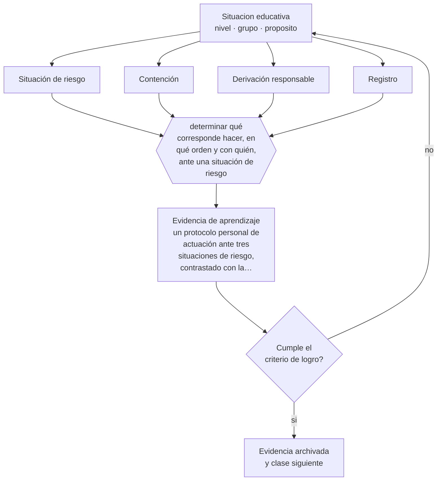

# Clase 155 — Crisis y derivación responsable

> **Parte 12 · Gestión del aula y convivencia** — clase 11 de 12

**Estado de evidencia:** `MARCO-NORMATIVO` · **Etapa:** 🟣 Etapa C — Núcleo profesional docente · **Población de referencia:** transversal, con foco escolar 
**Decisión que habilita:** determinar qué corresponde hacer, en qué orden y con quién, ante una situación de riesgo 
**Evidencia de aprendizaje:** un protocolo personal de actuación ante tres situaciones de riesgo, contrastado con la normativa vigente

## 🎯 Propósito

Actuar ante crisis y situaciones de riesgo con procedimiento: contención inmediata, activación del protocolo, derivación responsable, registro y resguardo de la confidencialidad.

## 📚 Resultados de aprendizaje

Al finalizar esta clase podrás:

1. **Definir** con precisión los cuatro conceptos centrales de la clase y reconocerlos en una situación educativa real, no solo en su enunciado.
2. **Explicar** qué hacer en los primeros minutos de una situación que excede lo pedagógico.
3. **Decidir** —qué corresponde hacer, en qué orden y con quién, ante una situación de riesgo— y sostener la decisión con un fundamento escrito.
4. **Producir** la evidencia de la clase —un protocolo personal de actuación ante tres situaciones de riesgo, contrastado con la normativa vigente— y contrastarla contra el criterio de logro.
5. **Distinguir** lo que la evidencia sostiene de lo que es práctica instalada, preferencia personal o costumbre de la institución.

## 🧩 Conceptos centrales

| Concepto | Comprensión verificable |
|---|---|
| **Situación de riesgo** | circunstancia que compromete la integridad física o psicológica de un estudiante |
| **Contención** | respuesta inmediata que asegura la integridad antes de cualquier otra acción |
| **Derivación responsable** | traspaso a la instancia competente con información suficiente y verificación de recepción |
| **Registro** | documentación fechada de lo observado, lo actuado y lo informado |

## 🗺️ Flujo de razonamiento

## 📖 Desarrollo

### 1. El fondo del asunto

Ante una crisis, el orden importa: primero se asegura la integridad, después se activa el protocolo institucional, luego se informa a quien corresponde y se registra. Improvisar produce dos errores típicos: actuar solo en situaciones que exigen derivación, o derivar sin información suficiente y dar por cerrada la responsabilidad. Ambos dejan al estudiante sin protección real.

### 2. Cómo se traduce en decisiones de enseñanza

El protocolo personal debe conocer el institucional y la normativa: quién es el encargado de convivencia, qué plazos corren, qué situaciones exigen denuncia y ante quién. Tener esa información antes de necesitarla es lo que permite actuar en minutos. Y el registro debe describir hechos observados con fecha, sin interpretaciones ni juicios sobre las personas.

### 3. Qué sostiene la evidencia y qué no

La normativa sobre denuncia, plazos y responsabilidades es específica y cambia; debe verificarse en su versión vigente y con la autoridad competente. Y el rol docente tiene límites claros: contener, derivar y acompañar, no diagnosticar ni tratar. Exceder ese límite perjudica al estudiante y expone al profesional.

> **Cómo leer el estado de evidencia `MARCO-NORMATIVO`.** El contenido no se decide por evidencia empírica sino por norma, política pública o marco institucional vigente. Verifica siempre la versión vigente a la fecha en que vas a aplicarlo: la norma cambia y la clase no se actualiza sola.

## 🧪 Taller guiado

Aplica la clase a **uno** de los contextos siguientes y repite después el ejercicio en un
contexto de exigencia distinta. Cambiar de contexto es parte del aprendizaje: lo que funciona
con un grupo no se traslada intacto a otro.

| Contexto | Rasgo que cambia la decisión |
|---|---|
| Curso de primer ciclo básico | las rutinas se enseñan explícitamente y se practican |
| Curso de educación media | la legitimidad y la justicia percibida deciden el clima |
| Curso con conflictos frecuentes | hay que estabilizar antes de exigir contenido |
| Taller o laboratorio | el riesgo físico cambia la gestión del grupo |
| Clase con docente de reemplazo | no hay historia compartida en la que apoyarse |
| Contexto de vulneración de derechos | el protocolo manda sobre el criterio individual |

**Secuencia de trabajo:**

1. Delimita el contexto: nivel, edad, tamaño del grupo, asignatura o experiencia y tiempo real disponible.
2. Declara qué saben ya los estudiantes y **cómo lo comprobaste**, no cómo lo supones.
3. Formula la decisión pedagógica que esta clase habilita y escribe su fundamento.
4. Anticipa qué observarías si la decisión funciona y qué observarías si no funciona.
5. Diseña de antemano la alternativa que aplicarás si la primera estrategia falla.
6. Ejecuta o simula, y registra lo observado con fecha, contexto y evidencia concreta.
7. Produce la evidencia de aprendizaje de la clase.
8. Contrástala contra el criterio de logro, corrige y recién entonces avanza.

### 📦 Evidencia de aprendizaje

Un protocolo personal de actuación ante tres situaciones de riesgo, contrastado con la normativa vigente.

Debe incluir contexto, decisión, fundamento, fuentes consultadas con su fecha, indicador de
logro observable, riesgos previstos y qué harías distinto en la siguiente iteración.

## 🏆 Reto verificable

Contrasta tu protocolo con la normativa vigente y con el encargado de convivencia. Corrige los puntos donde tu procedimiento no coincide con el institucional.

## ✅ Criterio de logro

- [ ] el protocolo distingue contención, activación, derivación y registro, en orden;
- [ ] cada situación identifica plazo, instancia competente y forma de verificación;
- [ ] cada afirmación sobre «lo que funciona» está atribuida a una fuente identificable, con autor y fecha;
- [ ] la decisión es ejecutable con el tiempo, el espacio, el número de estudiantes y los recursos que realmente tienes;
- [ ] la evidencia queda archivada de forma reproducible: otra persona podría revisarla sin que tú se la expliques.

## ⚠️ Errores frecuentes

**Propios de esta clase:**

- Prometer confidencialidad absoluta antes de conocer la situación.
- Derivar sin información suficiente y sin verificar que la derivación fue recibida.

**Característicos de la parte 12:**

- Gestionar por reacción y llamar disciplina a la escalada.
- Aplicar sanciones sin debido proceso ni proporcionalidad.

## ♿ Diversidad, accesibilidad y ética

Los estudiantes con menos red de apoyo dependen enteramente de que la escuela active el procedimiento correcto. La detección activa, y no la espera de la denuncia espontánea, es lo que los alcanza.

Antes de aplicar cualquier decisión de esta clase con estudiantes reales, revisa el
[protocolo de práctica responsable](../../../docs/ETICA_Y_PRACTICA_RESPONSABLE.md):
consentimiento, resguardo de datos personales, proporcionalidad de la intervención y derecho
de cada estudiante a no ser objeto de un ensayo que no le reporta beneficio.

## ❓ Preguntas de comprobación

1. ¿Qué haces en los primeros cinco minutos de una situación de riesgo?
2. ¿Quién es el encargado de convivencia de tu establecimiento y qué plazo corre?
3. ¿Cómo verificas que tu derivación llegó y fue atendida?

## 📕 Lecturas base

**Mineduc / Superintendencia de Educación. *Protocolos de actuación ante situaciones de vulneración*.**  
*Qué aporta a esta clase:* define el procedimiento obligatorio y los plazos aplicables en Chile.

**Organización Mundial de la Salud. *Orientaciones sobre salud mental en entornos escolares*.**  
*Qué aporta a esta clase:* criterios de detección y derivación desde el rol educativo, con sus límites.

Catálogo completo: [bibliografía del programa](../../../docs/BIBLIOGRAFIA.md) ·
[glosario](../../../docs/GLOSARIO.md) ·
[fuentes oficiales y cómo leerlas](../../../docs/FUENTES.md).

## 🔗 Conexión con el resto del programa

Aplica la clase 004 y cierra la cadena que abren las clases 150 y 151.

> [!IMPORTANT]
> Material de formación profesional. No reemplaza un título de pedagogía, una habilitación
> legal para ejercer, ni el juicio de un equipo educativo que conoce a sus estudiantes.

---

| Anterior | Índice | Siguiente |
|---|---|---|
| [← 154 · Trabajo con apoderados](../class-10-trabajo-con-apoderados/README.md) | [Parte 12](../README.md) · [Programa](../../../README.md) | [156 · Proyecto integrador: plan de gestión de aula →](../class-12-proyecto-integrador-plan-de-gestion-de-aula/README.md) |
