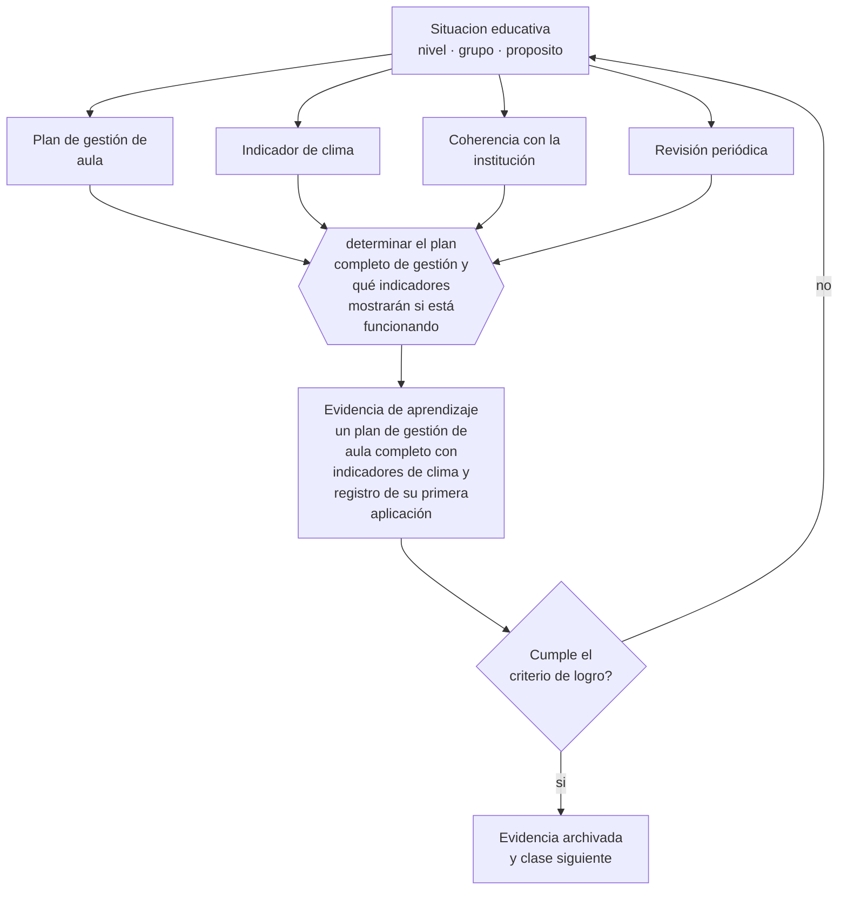

# Clase 156 — Proyecto integrador: plan de gestión de aula

> **Parte 12 · Gestión del aula y convivencia** — clase 12 de 12

**Estado de evidencia:** `CONSISTENTE` · **Etapa:** 🟣 Etapa C — Núcleo profesional docente · **Población de referencia:** transversal, con foco escolar 
**Decisión que habilita:** determinar el plan completo de gestión y qué indicadores mostrarán si está funcionando 
**Evidencia de aprendizaje:** un plan de gestión de aula completo con indicadores de clima y registro de su primera aplicación

## 🎯 Propósito

Integrar la parte construyendo el plan de gestión de aula de un curso: rutinas, normas, prevención, respuesta graduada, comunicación, trabajo con familias y protocolos.

## 📚 Resultados de aprendizaje

Al finalizar esta clase podrás:

1. **Definir** con precisión los cuatro conceptos centrales de la clase y reconocerlos en una situación educativa real, no solo en su enunciado.
2. **Explicar** cómo se articula todo lo anterior en un plan que se pueda ejecutar desde el primer día de clases.
3. **Decidir** —el plan completo de gestión y qué indicadores mostrarán si está funcionando— y sostener la decisión con un fundamento escrito.
4. **Producir** la evidencia de la clase —un plan de gestión de aula completo con indicadores de clima y registro de su primera aplicación— y contrastarla contra el criterio de logro.
5. **Distinguir** lo que la evidencia sostiene de lo que es práctica instalada, preferencia personal o costumbre de la institución.

## 🧩 Conceptos centrales

| Concepto | Comprensión verificable |
|---|---|
| **Plan de gestión de aula** | conjunto articulado de decisiones preventivas y de respuesta para un curso |
| **Indicador de clima** | medida observable —tiempo de inicio, participación, incidentes— que permite seguir el efecto |
| **Coherencia con la institución** | correspondencia entre el plan del docente y el reglamento y los protocolos vigentes |
| **Revisión periódica** | instancia planificada para ajustar el plan con evidencia de su funcionamiento |

## 🗺️ Flujo de razonamiento

## 📖 Desarrollo

### 1. El fondo del asunto

El plan integrador exige coherencia entre lo preventivo y lo reactivo, y entre lo que decide el docente y lo que establece la institución. Un plan que contradice el reglamento interno se cae en el primer caso serio; uno que solo copia el reglamento no aporta las decisiones cotidianas que hacen la diferencia. La articulación de ambos es el trabajo de esta clase.

### 2. Cómo se traduce en decisiones de enseñanza

El plan se organiza en capas: diseño preventivo, sistema de normas y rutinas, escala de respuesta, comunicación y trabajo con familias, y protocolos de derivación. Y define indicadores simples de seguimiento: minutos hasta el inicio efectivo, número de intervenciones por semana, participación distribuida, incidentes registrados.

### 3. Qué sostiene la evidencia y qué no

Ningún plan de aula compensa condiciones institucionales adversas ni situaciones que exceden lo pedagógico. Declarar esos límites protege al docente de asumir responsabilidades que no le corresponden y permite argumentar ante el equipo directivo con evidencia.

> **Cómo leer el estado de evidencia `CONSISTENTE`.** La evidencia es amplia y coherente, pero proviene sobre todo de estudios correlacionales, de síntesis con heterogeneidad alta o de contextos distintos al tuyo. Sirve para orientar la decisión y exige que compruebes el efecto en tu propio grupo.

## 🧪 Taller guiado

Aplica la clase a **uno** de los contextos siguientes y repite después el ejercicio en un
contexto de exigencia distinta. Cambiar de contexto es parte del aprendizaje: lo que funciona
con un grupo no se traslada intacto a otro.

| Contexto | Rasgo que cambia la decisión |
|---|---|
| Curso de primer ciclo básico | las rutinas se enseñan explícitamente y se practican |
| Curso de educación media | la legitimidad y la justicia percibida deciden el clima |
| Curso con conflictos frecuentes | hay que estabilizar antes de exigir contenido |
| Taller o laboratorio | el riesgo físico cambia la gestión del grupo |
| Clase con docente de reemplazo | no hay historia compartida en la que apoyarse |
| Contexto de vulneración de derechos | el protocolo manda sobre el criterio individual |

**Secuencia de trabajo:**

1. Delimita el contexto: nivel, edad, tamaño del grupo, asignatura o experiencia y tiempo real disponible.
2. Declara qué saben ya los estudiantes y **cómo lo comprobaste**, no cómo lo supones.
3. Formula la decisión pedagógica que esta clase habilita y escribe su fundamento.
4. Anticipa qué observarías si la decisión funciona y qué observarías si no funciona.
5. Diseña de antemano la alternativa que aplicarás si la primera estrategia falla.
6. Ejecuta o simula, y registra lo observado con fecha, contexto y evidencia concreta.
7. Produce la evidencia de aprendizaje de la clase.
8. Contrástala contra el criterio de logro, corrige y recién entonces avanza.

### 📦 Evidencia de aprendizaje

Un plan de gestión de aula completo con indicadores de clima y registro de su primera aplicación.

Debe incluir contexto, decisión, fundamento, fuentes consultadas con su fecha, indicador de
logro observable, riesgos previstos y qué harías distinto en la siguiente iteración.

## 🏆 Reto verificable

Ejecuta el plan durante un mes registrando tus indicadores. Presenta los resultados al equipo y propón un ajuste institucional a partir de ellos.

## ✅ Criterio de logro

- [ ] el plan es coherente con el reglamento y los protocolos institucionales;
- [ ] incluye indicadores observables y una fecha de revisión;
- [ ] cada afirmación sobre «lo que funciona» está atribuida a una fuente identificable, con autor y fecha;
- [ ] la decisión es ejecutable con el tiempo, el espacio, el número de estudiantes y los recursos que realmente tienes;
- [ ] la evidencia queda archivada de forma reproducible: otra persona podría revisarla sin que tú se la expliques.

## ⚠️ Errores frecuentes

**Propios de esta clase:**

- Diseñar un plan que contradice el reglamento interno vigente.
- Definir el plan sin indicadores, con lo que no se puede saber si funciona.

**Característicos de la parte 12:**

- Gestionar por reacción y llamar disciplina a la escalada.
- Aplicar sanciones sin debido proceso ni proporcionalidad.

## ♿ Diversidad, accesibilidad y ética

El plan debe declarar cómo se ajusta para estudiantes con necesidades de apoyo conductual, y cómo se evita que reciban de forma desproporcionada las medidas más severas. El registro por estudiante es lo que permite detectarlo.

Antes de aplicar cualquier decisión de esta clase con estudiantes reales, revisa el
[protocolo de práctica responsable](../../../docs/ETICA_Y_PRACTICA_RESPONSABLE.md):
consentimiento, resguardo de datos personales, proporcionalidad de la intervención y derecho
de cada estudiante a no ser objeto de un ensayo que no le reporta beneficio.

## ❓ Preguntas de comprobación

1. ¿Qué parte de tu plan contradice el reglamento de tu establecimiento?
2. ¿Qué indicador te diría en tres semanas que está funcionando?
3. ¿Qué condición institucional impide ejecutar tu plan como lo diseñaste?

## 📕 Lecturas base

**Evertson, C. & Emmer, E. *Classroom Management*.**  
*Qué aporta a esta clase:* modelo completo de planificación de la gestión desde el comienzo del año.

**Mineduc. *Política Nacional de Convivencia Educativa*.**  
*Qué aporta a esta clase:* marco chileno que enmarca el plan del docente en la política institucional.

Catálogo completo: [bibliografía del programa](../../../docs/BIBLIOGRAFIA.md) ·
[glosario](../../../docs/GLOSARIO.md) ·
[fuentes oficiales y cómo leerlas](../../../docs/FUENTES.md).

## 🔗 Conexión con el resto del programa

Cierra la parte 12 integrando sus once clases previas y se conecta con la parte 15.

> [!IMPORTANT]
> Material de formación profesional. No reemplaza un título de pedagogía, una habilitación
> legal para ejercer, ni el juicio de un equipo educativo que conoce a sus estudiantes.

---

| Anterior | Índice | Siguiente |
|---|---|---|
| [← 155 · Crisis y derivación responsable](../class-11-crisis-y-derivacion-responsable/README.md) | [Parte 12](../README.md) · [Programa](../../../README.md) | [Programa completo →](../../../README.md) |
