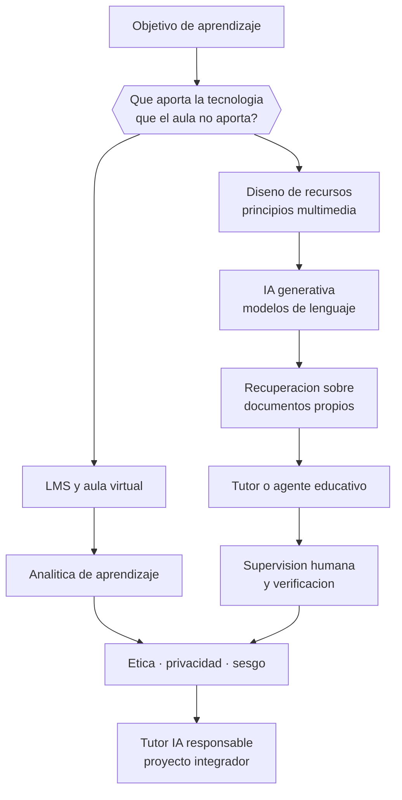

# Parte 13 — Tecnología e IA educativa

> *La tecnología no mejora la enseñanza: amplifica la decisión pedagógica que ya tomaste*

🟣 **Etapa C — Núcleo profesional docente** · salida de la etapa: diseñar, enseñar, evaluar y gestionar un curso completo con evidencia

**Clases:** 12 (157–168) · **Población de referencia:** transversal a niveles y modalidades · **Conceptos con definición operacional:** 48 
**Contenido central:** Competencia digital docente, LMS, diseño de recursos, gamificación, analítica de aprendizaje, adaptatividad, fundamentos de IA, modelos de lenguaje, RAG, agentes educativos y ética, privacidad y sesgos

## 🎯 De qué trata esta parte

El patrón histórico de la tecnología educativa es constante: llega una herramienta, se le atribuye poder transformador, se compra a escala y luego la evidencia muestra efectos pequeños y muy dependientes del uso. Ocurrió con la radio, la televisión educativa, los computadores personales, las pizarras interactivas y los tablets. La lección no es rechazar la tecnología: es exigirle la misma prueba que a cualquier intervención y diseñar el uso, no la compra.

Con la inteligencia artificial generativa el problema cambia de escala, porque afecta a la vez a la enseñanza, a la evaluación y a la integridad académica. Un modelo de lenguaje puede producir material, explicar con paciencia infinita y también fabricar información falsa con tono seguro. El programa toma una posición explícita: la IA se usa con supervisión humana, con verificación del contenido, con resguardo de datos personales y con criterios claros sobre qué tarea deja de ser evaluable cuando la máquina la resuelve.

La parte enseña además la parte técnica sin misticismo: qué es un modelo de lenguaje, por qué alucina, qué agrega la recuperación de información sobre documentos propios, qué es un agente y dónde están sus límites reales. Un docente que entiende el mecanismo puede decidir; uno que lo trata como magia solo puede prohibir o rendirse, y ninguna de las dos es una política educativa.

## 📚 Resultados de la parte

Al terminar esta parte podrás:

1. **Decidir el uso de una herramienta digital a partir del objetivo de aprendizaje y no de su novedad**.
2. **Diseñar recursos digitales que respeten los principios del aprendizaje multimedia**.
3. **Construir un tutor o asistente con IA con verificación, resguardo de datos y supervisión humana**.
4. **Definir la política de uso de IA de un curso, incluida su consecuencia sobre la evaluación**.

## 🗺️ Mapa de la parte

## 🧠 Marco de referencia

- principios del aprendizaje multimedia y diseño de recursos
- integración de tecnología, pedagogía y contenido en la decisión docente
- analítica de aprendizaje y su uso ético en decisiones sobre personas
- orientaciones internacionales sobre IA generativa en educación y protección de datos

**Autoras y autores que conviene conocer:** Richard E. Mayer, Punya Mishra y Matthew Koehler, Neil Selwyn, Rose Luckin, equipos de UNESCO sobre IA en educación, especialistas en protección de datos personales

## 📋 Las 12 clases

| # | Clase | Decisión que habilita | Evidencia |
|---:|---|---|---|
| 157 | [Competencia digital docente](class-01-competencia-digital-docente/README.md) | determinar qué competencia digital necesitas desarrollar para las decisiones que tu contexto te exige | `MARCO-NORMATIVO` |
| 158 | [LMS y aulas virtuales](class-02-lms-y-aulas-virtuales/README.md) | determinar qué estructura y qué presencia docente sostendrán el aprendizaje en tu aula virtual | `CONSISTENTE` |
| 159 | [Diseño de recursos digitales](class-03-diseno-de-recursos-digitales/README.md) | determinar qué elementos de tu recurso están ayudando y cuáles solo aumentan la carga | `ROBUSTA` |
| 160 | [Gamificación](class-04-gamificacion/README.md) | determinar qué mecánica de juego aporta a tu objetivo de aprendizaje y cuál solo agrega ruido | `EN-DEBATE` |
| 161 | [Analítica de aprendizaje](class-05-analitica-de-aprendizaje/README.md) | determinar qué indicador de tu plataforma justifica una intervención pedagógica concreta | `EMERGENTE` |
| 162 | [Aprendizaje adaptativo](class-06-aprendizaje-adaptativo/README.md) | determinar si un sistema adaptativo aporta a tu objetivo o solo automatiza la asignación de ejercicios | `EMERGENTE` |
| 163 | [Fundamentos de IA para docentes](class-07-fundamentos-de-ia-para-docentes/README.md) | determinar qué puede y qué no puede hacer un sistema de IA en la tarea educativa que estás evaluando | `CONSISTENTE` |
| 164 | [LLM y generación de contenidos](class-08-llm-y-generacion-de-contenidos/README.md) | determinar en qué tareas usarás un modelo de lenguaje y qué verificación aplicarás a cada salida | `EMERGENTE` |
| 165 | [RAG y tutores educativos](class-09-rag-y-tutores-educativos/README.md) | determinar qué fuentes alimentarán tu asistente y cómo verificarás la calidad de sus respuestas | `EMERGENTE` |
| 166 | [Agentes educativos](class-10-agentes-educativos/README.md) | determinar qué tarea educativa puede ejecutar un agente y qué control humano debe conservarse | `EMERGENTE` |
| 167 | [Ética, privacidad y sesgos](class-11-etica-privacidad-y-sesgos/README.md) | determinar si el uso de una herramienta cumple con las obligaciones de protección de datos y de trato justo | `MARCO-NORMATIVO` |
| 168 | [Proyecto integrador: tutor IA responsable](class-12-proyecto-integrador-tutor-ia-responsable/README.md) | determinar el diseño completo del tutor y qué evidencia mostrará que aporta al aprendizaje | `EMERGENTE` |

## ⚠️ Riesgos característicos

- Adoptar una herramienta por novedad y buscar después el objetivo que justifica su uso.
- Tratar la salida de un modelo de lenguaje como información verificada.
- Procesar datos personales de estudiantes sin base legal ni resguardo.
- Delegar en un sistema automático decisiones que afectan la trayectoria de una persona.

## 📕 Lecturas de referencia de la parte

- **Mayer, R. (2021). *Multimedia Learning* (3.ª ed.).** — los principios empíricos del diseño de recursos: qué combinación de texto, imagen y audio ayuda y cuál estorba.
- **Mishra, P. & Koehler, M. (2006). *Technological Pedagogical Content Knowledge*. Teachers College Record, 108(6).** — el marco que evita la pregunta equivocada («¿qué herramienta uso?») y plantea la correcta.
- **UNESCO (2023). *Guidance for Generative AI in Education and Research*.** — la referencia internacional más citada para políticas de uso de IA en instituciones educativas.
- **Selwyn, N. (2016). *Is Technology Good for Education?*** — el contrapeso crítico necesario: obliga a preguntar quién gana con cada adopción tecnológica.

## ✅ Evidencia mínima para dar la parte por cerrada

- [ ] un criterio propio y escrito de adopción tecnológica, con casos de rechazo;
- [ ] un recurso digital diseñado con principios multimedia y probado con estudiantes;
- [ ] un asistente o tutor con IA documentado, con sus límites y su verificación;
- [ ] la política de uso de IA del curso, comunicable a estudiantes y familias.

---

| Anterior | Índice | Siguiente |
|---|---|---|
| [← Parte 12 · Gestión del aula y convivencia](../part-12-gestion-del-aula-y-convivencia/README.md) | [Programa](../../README.md) · [Currículo](../../CURRICULUM.md) | [Parte 14 · Docencia universitaria →](../part-14-docencia-universitaria/README.md) |
