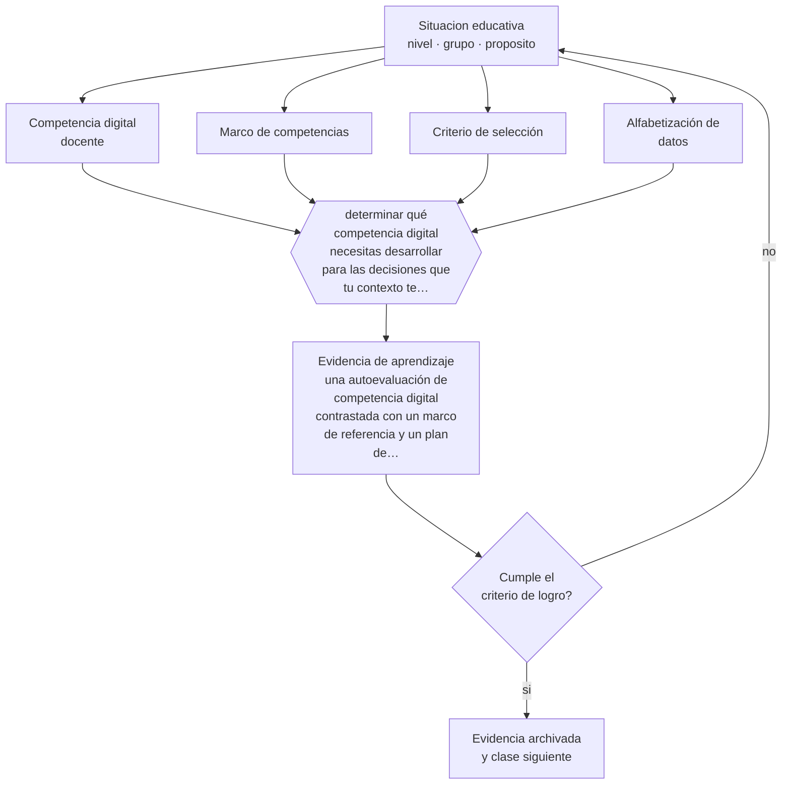

# Clase 157 — Competencia digital docente

> **Parte 13 · Tecnología e IA educativa** — clase 1 de 12

**Estado de evidencia:** `MARCO-NORMATIVO` · **Etapa:** 🟣 Etapa C — Núcleo profesional docente · **Población de referencia:** transversal a niveles y modalidades 
**Decisión que habilita:** determinar qué competencia digital necesitas desarrollar para las decisiones que tu contexto te exige 
**Evidencia de aprendizaje:** una autoevaluación de competencia digital contrastada con un marco de referencia y un plan de desarrollo priorizado

## 🎯 Propósito

Definir la competencia digital docente como capacidad pedagógica: seleccionar, diseñar, evaluar y usar tecnología en función del aprendizaje, con criterio ético y de protección de datos.

## 📚 Resultados de aprendizaje

Al finalizar esta clase podrás:

1. **Definir** con precisión los cuatro conceptos centrales de la clase y reconocerlos en una situación educativa real, no solo en su enunciado.
2. **Explicar** qué significa ser digitalmente competente como docente, más allá de saber usar las herramientas.
3. **Decidir** —qué competencia digital necesitas desarrollar para las decisiones que tu contexto te exige— y sostener la decisión con un fundamento escrito.
4. **Producir** la evidencia de la clase —una autoevaluación de competencia digital contrastada con un marco de referencia y un plan de desarrollo priorizado— y contrastarla contra el criterio de logro.
5. **Distinguir** lo que la evidencia sostiene de lo que es práctica instalada, preferencia personal o costumbre de la institución.

## 🧩 Conceptos centrales

| Concepto | Comprensión verificable |
|---|---|
| **Competencia digital docente** | capacidad de usar tecnología con criterio pedagógico, ético y de seguridad |
| **Marco de competencias** | referencia estructurada que ordena áreas y niveles de desarrollo profesional digital |
| **Criterio de selección** | fundamento para decidir si una herramienta aporta a un objetivo de aprendizaje |
| **Alfabetización de datos** | capacidad de interpretar los datos que las plataformas producen sobre los estudiantes |

## 🗺️ Flujo de razonamiento

## 📖 Desarrollo

### 1. El fondo del asunto

La competencia digital docente no se mide por la cantidad de herramientas que se dominan sino por la calidad de las decisiones que se toman con ellas. Los marcos de referencia internacionales coinciden en un núcleo: uso profesional, selección y creación de recursos, enseñanza y evaluación mediadas, empoderamiento de los estudiantes y desarrollo de su competencia digital. A eso se suma un componente que se volvió urgente: protección de datos y criterio ético.

### 2. Cómo se traduce en decisiones de enseñanza

La autoevaluación contra un marco revela vacíos que la práctica cotidiana oculta. El plan de desarrollo debe priorizar por necesidad real: si tu contexto exige evaluación en línea con resguardo de datos, esa competencia precede a cualquier otra. Aprender herramientas sin necesidad definida produce acumulación de aplicaciones y ninguna mejora del aprendizaje.

### 3. Qué sostiene la evidencia y qué no

Los marcos de competencia son normativos: describen lo deseable sin demostrar que su desarrollo mejore los aprendizajes. Y envejecen rápido, porque la tecnología cambia más rápido que su revisión. Úsalos como estructura para ordenar el desarrollo profesional, no como evidencia de eficacia.

> **Cómo leer el estado de evidencia `MARCO-NORMATIVO`.** El contenido no se decide por evidencia empírica sino por norma, política pública o marco institucional vigente. Verifica siempre la versión vigente a la fecha en que vas a aplicarlo: la norma cambia y la clase no se actualiza sola.

## 🧪 Taller guiado

Aplica la clase a **uno** de los contextos siguientes y repite después el ejercicio en un
contexto de exigencia distinta. Cambiar de contexto es parte del aprendizaje: lo que funciona
con un grupo no se traslada intacto a otro.

| Contexto | Rasgo que cambia la decisión |
|---|---|
| Aula con conectividad limitada | la solución debe funcionar sin ancho de banda |
| Modalidad híbrida | la equivalencia de experiencia es el problema real |
| Curso con evaluación escrita fuerte | la IA obliga a rediseñar la evidencia de logro |
| Formación de adultos en línea | autonomía alta y riesgo de deserción |
| Institución con datos sensibles | la protección de datos precede a la funcionalidad |
| Estudiantes menores de edad | consentimiento, resguardo y supervisión reforzados |

**Secuencia de trabajo:**

1. Delimita el contexto: nivel, edad, tamaño del grupo, asignatura o experiencia y tiempo real disponible.
2. Declara qué saben ya los estudiantes y **cómo lo comprobaste**, no cómo lo supones.
3. Formula la decisión pedagógica que esta clase habilita y escribe su fundamento.
4. Anticipa qué observarías si la decisión funciona y qué observarías si no funciona.
5. Diseña de antemano la alternativa que aplicarás si la primera estrategia falla.
6. Ejecuta o simula, y registra lo observado con fecha, contexto y evidencia concreta.
7. Produce la evidencia de aprendizaje de la clase.
8. Contrástala contra el criterio de logro, corrige y recién entonces avanza.

### 📦 Evidencia de aprendizaje

Una autoevaluación de competencia digital contrastada con un marco de referencia y un plan de desarrollo priorizado.

Debe incluir contexto, decisión, fundamento, fuentes consultadas con su fecha, indicador de
logro observable, riesgos previstos y qué harías distinto en la siguiente iteración.

## 🏆 Reto verificable

Aplica la autoevaluación, escoge la competencia más crítica para tu contexto y desarróllala con una acción concreta durante un mes.

## ✅ Criterio de logro

- [ ] la autoevaluación se contrasta con un marco de referencia identificado;
- [ ] el plan prioriza competencias por necesidad real del contexto y no por novedad;
- [ ] cada afirmación sobre «lo que funciona» está atribuida a una fuente identificable, con autor y fecha;
- [ ] la decisión es ejecutable con el tiempo, el espacio, el número de estudiantes y los recursos que realmente tienes;
- [ ] la evidencia queda archivada de forma reproducible: otra persona podría revisarla sin que tú se la expliques.

## ⚠️ Errores frecuentes

**Propios de esta clase:**

- Confundir dominio de herramientas con competencia digital pedagógica.
- Adoptar herramientas por acumulación y sin necesidad definida por un objetivo de aprendizaje.

**Característicos de la parte 13:**

- Adoptar una herramienta por novedad y buscar después el objetivo que justifica su uso.
- Tratar la salida de un modelo de lenguaje como información verificada.

## ♿ Diversidad, accesibilidad y ética

La competencia digital docente incluye saber producir material accesible: documentos estructurados, subtítulos, contraste y compatibilidad con tecnología de apoyo. Sin eso, la digitalización excluye a los estudiantes que más dependen de ella.

Antes de aplicar cualquier decisión de esta clase con estudiantes reales, revisa el
[protocolo de práctica responsable](../../../docs/ETICA_Y_PRACTICA_RESPONSABLE.md):
consentimiento, resguardo de datos personales, proporcionalidad de la intervención y derecho
de cada estudiante a no ser objeto de un ensayo que no le reporta beneficio.

## ❓ Preguntas de comprobación

1. ¿Qué decisión tecnológica de tu contexto no sabes tomar hoy con fundamento?
2. ¿Cuántas herramientas usas y cuántas aportan a un objetivo verificable?
3. ¿Qué sabes sobre los datos que recogen las plataformas que usas?

## 📕 Lecturas base

**Comisión Europea. *DigCompEdu: Marco Europeo para la Competencia Digital de los Educadores*.**  
*Qué aporta a esta clase:* el marco más usado para estructurar áreas y niveles de competencia digital docente.

**UNESCO. *Marco de competencias en TIC para docentes*.**  
*Qué aporta a esta clase:* referencia internacional complementaria, con foco en política y sistemas educativos.

Catálogo completo: [bibliografía del programa](../../../docs/BIBLIOGRAFIA.md) ·
[glosario](../../../docs/GLOSARIO.md) ·
[fuentes oficiales y cómo leerlas](../../../docs/FUENTES.md).

## 🔗 Conexión con el resto del programa

Abre la parte 13 y condiciona el criterio con que se abordan todas las clases siguientes.

> [!IMPORTANT]
> Material de formación profesional. No reemplaza un título de pedagogía, una habilitación
> legal para ejercer, ni el juicio de un equipo educativo que conoce a sus estudiantes.

---

| Anterior | Índice | Siguiente |
|---|---|---|
| [← Parte 13](../README.md) | [Parte 13](../README.md) · [Programa](../../../README.md) | [158 · LMS y aulas virtuales →](../class-02-lms-y-aulas-virtuales/README.md) |
