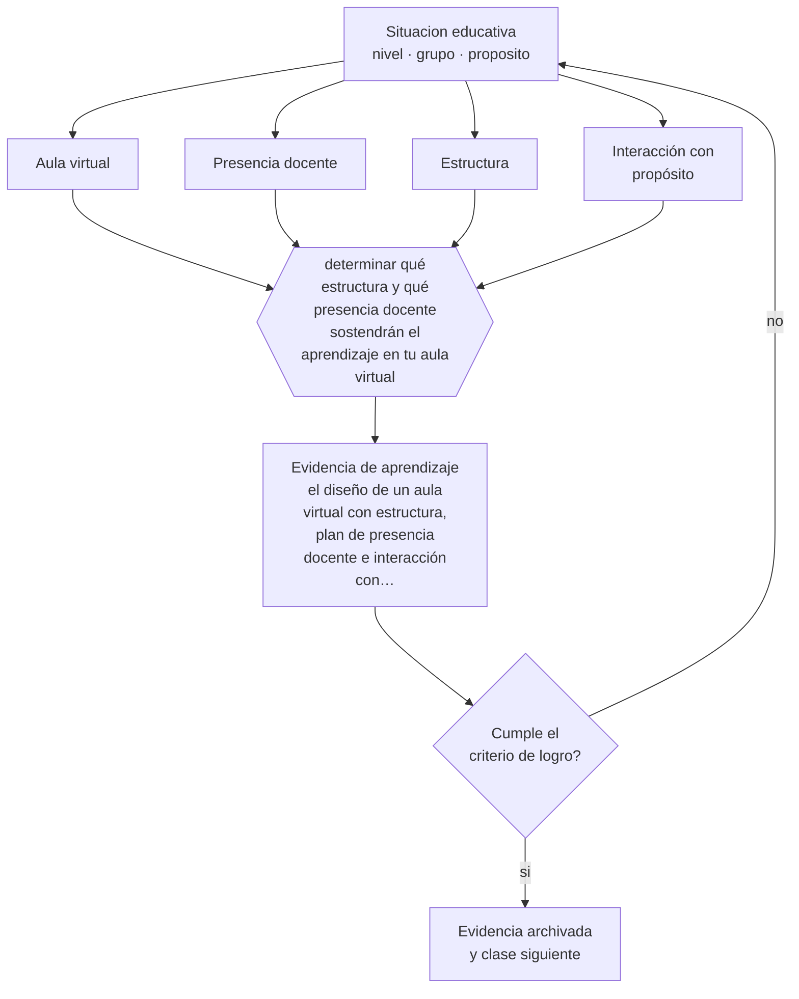

# Clase 158 — LMS y aulas virtuales

> **Parte 13 · Tecnología e IA educativa** — clase 2 de 12

**Estado de evidencia:** `CONSISTENTE` · **Etapa:** 🟣 Etapa C — Núcleo profesional docente · **Población de referencia:** transversal a niveles y modalidades 
**Decisión que habilita:** determinar qué estructura y qué presencia docente sostendrán el aprendizaje en tu aula virtual 
**Evidencia de aprendizaje:** el diseño de un aula virtual con estructura, plan de presencia docente e interacción con propósito

## 🎯 Propósito

Diseñar aulas virtuales que sostengan el aprendizaje: estructura clara, presencia docente, interacción con propósito y evaluación coherente, con independencia de la plataforma elegida.

## 📚 Resultados de aprendizaje

Al finalizar esta clase podrás:

1. **Definir** con precisión los cuatro conceptos centrales de la clase y reconocerlos en una situación educativa real, no solo en su enunciado.
2. **Explicar** qué decide realmente el aprendizaje en un aula virtual, si no es la plataforma.
3. **Decidir** —qué estructura y qué presencia docente sostendrán el aprendizaje en tu aula virtual— y sostener la decisión con un fundamento escrito.
4. **Producir** la evidencia de la clase —el diseño de un aula virtual con estructura, plan de presencia docente e interacción con propósito— y contrastarla contra el criterio de logro.
5. **Distinguir** lo que la evidencia sostiene de lo que es práctica instalada, preferencia personal o costumbre de la institución.

## 🧩 Conceptos centrales

| Concepto | Comprensión verificable |
|---|---|
| **Aula virtual** | espacio digital que organiza materiales, actividades, interacción y evaluación de un curso |
| **Presencia docente** | conjunto de acciones visibles del docente que sostienen el curso y a los estudiantes |
| **Estructura** | organización predecible del espacio que reduce la carga de navegación y de gestión |
| **Interacción con propósito** | actividad de intercambio diseñada para un objetivo y no por sí misma |

## 🗺️ Flujo de razonamiento

## 📖 Desarrollo

### 1. El fondo del asunto

La investigación sobre educación en línea es consistente en un punto: la plataforma explica poco y el diseño explica mucho. Los cursos que funcionan tienen estructura predecible, presencia docente visible y regular, expectativas explícitas y actividades con propósito. Los que fracasan acumulan materiales sin secuencia, delegan la interacción a foros sin función y dejan al estudiante solo con su autorregulación.

### 2. Cómo se traduce en decisiones de enseñanza

El diseño define la estructura semanal —qué encuentra el estudiante y en qué orden—, el plan de presencia docente —cuándo aparece el docente, con qué frecuencia y con qué tipo de intervención— y las actividades de interacción con su objetivo declarado. Un foro sin propósito produce participación obligatoria y vacía; uno con función clara sostiene el aprendizaje.

### 3. Qué sostiene la evidencia y qué no

La comparación entre modalidades presencial y en línea rinde poco: las diferencias observadas se explican mejor por el diseño, el tiempo dedicado y las características de los estudiantes que por el medio. Y la educación en línea amplifica la desigualdad de condiciones: conectividad, dispositivo, espacio y tiempo no están distribuidos por igual.

> **Cómo leer el estado de evidencia `CONSISTENTE`.** La evidencia es amplia y coherente, pero proviene sobre todo de estudios correlacionales, de síntesis con heterogeneidad alta o de contextos distintos al tuyo. Sirve para orientar la decisión y exige que compruebes el efecto en tu propio grupo.

## 🧪 Taller guiado

Aplica la clase a **uno** de los contextos siguientes y repite después el ejercicio en un
contexto de exigencia distinta. Cambiar de contexto es parte del aprendizaje: lo que funciona
con un grupo no se traslada intacto a otro.

| Contexto | Rasgo que cambia la decisión |
|---|---|
| Aula con conectividad limitada | la solución debe funcionar sin ancho de banda |
| Modalidad híbrida | la equivalencia de experiencia es el problema real |
| Curso con evaluación escrita fuerte | la IA obliga a rediseñar la evidencia de logro |
| Formación de adultos en línea | autonomía alta y riesgo de deserción |
| Institución con datos sensibles | la protección de datos precede a la funcionalidad |
| Estudiantes menores de edad | consentimiento, resguardo y supervisión reforzados |

**Secuencia de trabajo:**

1. Delimita el contexto: nivel, edad, tamaño del grupo, asignatura o experiencia y tiempo real disponible.
2. Declara qué saben ya los estudiantes y **cómo lo comprobaste**, no cómo lo supones.
3. Formula la decisión pedagógica que esta clase habilita y escribe su fundamento.
4. Anticipa qué observarías si la decisión funciona y qué observarías si no funciona.
5. Diseña de antemano la alternativa que aplicarás si la primera estrategia falla.
6. Ejecuta o simula, y registra lo observado con fecha, contexto y evidencia concreta.
7. Produce la evidencia de aprendizaje de la clase.
8. Contrástala contra el criterio de logro, corrige y recién entonces avanza.

### 📦 Evidencia de aprendizaje

El diseño de un aula virtual con estructura, plan de presencia docente e interacción con propósito.

Debe incluir contexto, decisión, fundamento, fuentes consultadas con su fecha, indicador de
logro observable, riesgos previstos y qué harías distinto en la siguiente iteración.

## 🏆 Reto verificable

Rediseña la estructura de una unidad en tu aula virtual y aplica un plan de presencia docente. Compara la participación y la entrega con la unidad anterior.

## ✅ Criterio de logro

- [ ] la estructura es predecible y el estudiante sabe qué hacer sin preguntar;
- [ ] el plan de presencia docente declara frecuencia y tipo de intervención;
- [ ] cada afirmación sobre «lo que funciona» está atribuida a una fuente identificable, con autor y fecha;
- [ ] la decisión es ejecutable con el tiempo, el espacio, el número de estudiantes y los recursos que realmente tienes;
- [ ] la evidencia queda archivada de forma reproducible: otra persona podría revisarla sin que tú se la expliques.

## ⚠️ Errores frecuentes

**Propios de esta clase:**

- Trasladar el curso presencial a la plataforma sin rediseñar la secuencia ni la evaluación.
- Exigir participación en foros sin un objetivo de aprendizaje que la justifique.

**Característicos de la parte 13:**

- Adoptar una herramienta por novedad y buscar después el objetivo que justifica su uso.
- Tratar la salida de un modelo de lenguaje como información verificada.

## ♿ Diversidad, accesibilidad y ética

Las condiciones de conectividad, dispositivo y espacio de estudio son muy desiguales. Ofrecer materiales descargables, formatos livianos y alternativas asincrónicas evita que el diseño excluya por infraestructura.

Antes de aplicar cualquier decisión de esta clase con estudiantes reales, revisa el
[protocolo de práctica responsable](../../../docs/ETICA_Y_PRACTICA_RESPONSABLE.md):
consentimiento, resguardo de datos personales, proporcionalidad de la intervención y derecho
de cada estudiante a no ser objeto de un ensayo que no le reporta beneficio.

## ❓ Preguntas de comprobación

1. ¿Puede un estudiante nuevo saber qué hacer sin escribirte?
2. ¿Cada cuánto apareces efectivamente en el aula virtual y para qué?
3. ¿Qué objetivo cumple cada foro de tu curso?

## 📕 Lecturas base

**Garrison, D., Anderson, T. & Archer, W. (2000). *Critical Inquiry in a Text-Based Environment*.**  
*Qué aporta a esta clase:* modelo de presencia docente, social y cognitiva; sigue siendo el marco más usado.

**Means, B. et al. (2013). *The Effectiveness of Online and Blended Learning*. Teachers College Record.**  
*Qué aporta a esta clase:* síntesis que muestra que el diseño y el tiempo explican más que la modalidad.

Catálogo completo: [bibliografía del programa](../../../docs/BIBLIOGRAFIA.md) ·
[glosario](../../../docs/GLOSARIO.md) ·
[fuentes oficiales y cómo leerlas](../../../docs/FUENTES.md).

## 🔗 Conexión con el resto del programa

Se apoya en la clase 118 y sostiene la implementación de las clases 130 y 168.

> [!IMPORTANT]
> Material de formación profesional. No reemplaza un título de pedagogía, una habilitación
> legal para ejercer, ni el juicio de un equipo educativo que conoce a sus estudiantes.

---

| Anterior | Índice | Siguiente |
|---|---|---|
| [← 157 · Competencia digital docente](../class-01-competencia-digital-docente/README.md) | [Parte 13](../README.md) · [Programa](../../../README.md) | [159 · Diseño de recursos digitales →](../class-03-diseno-de-recursos-digitales/README.md) |
