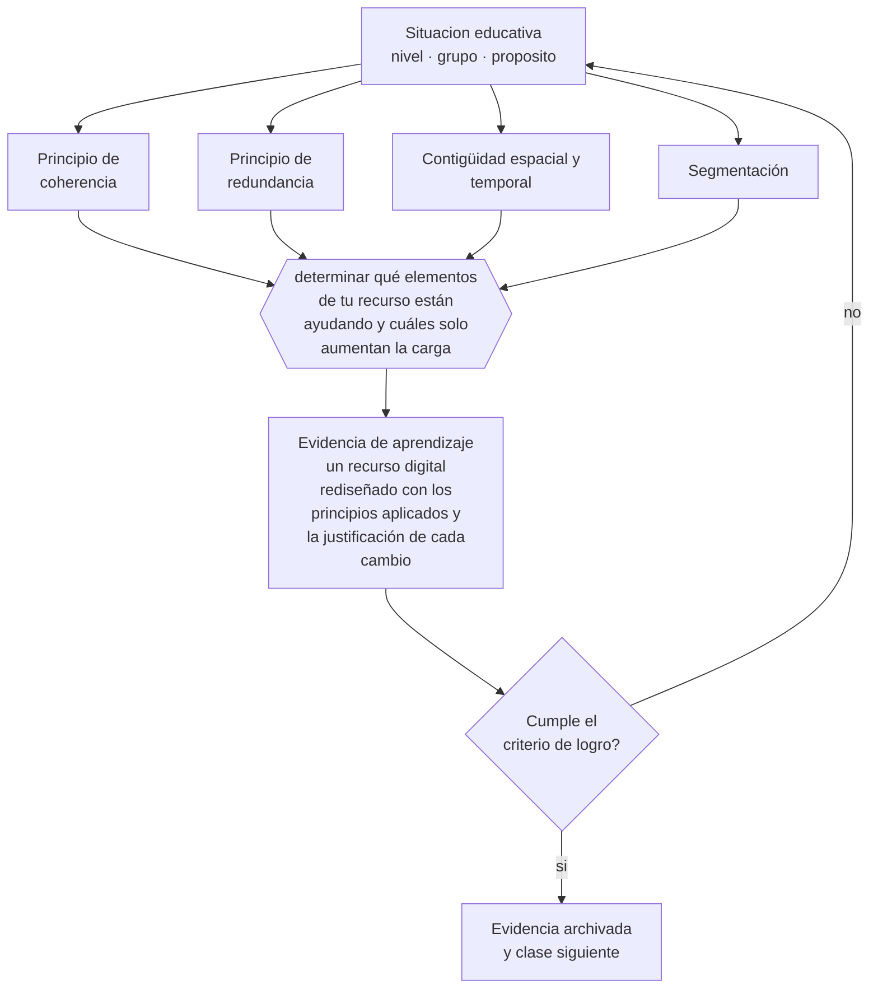

# Clase 159 — Diseño de recursos digitales

> **Parte 13 · Tecnología e IA educativa** — clase 3 de 12

**Estado de evidencia:** `ROBUSTA` · **Etapa:** 🟣 Etapa C — Núcleo profesional docente · **Población de referencia:** transversal a niveles y modalidades 
**Decisión que habilita:** determinar qué elementos de tu recurso están ayudando y cuáles solo aumentan la carga 
**Evidencia de aprendizaje:** un recurso digital rediseñado con los principios aplicados y la justificación de cada cambio

## 🎯 Propósito

Diseñar recursos digitales aplicando los principios empíricos del aprendizaje multimedia: coherencia, señalización, redundancia, contigüidad, segmentación y modalidad.

## 📚 Resultados de aprendizaje

Al finalizar esta clase podrás:

1. **Definir** con precisión los cuatro conceptos centrales de la clase y reconocerlos en una situación educativa real, no solo en su enunciado.
2. **Explicar** qué combinación de texto, imagen y audio ayuda a aprender y cuál estorba.
3. **Decidir** —qué elementos de tu recurso están ayudando y cuáles solo aumentan la carga— y sostener la decisión con un fundamento escrito.
4. **Producir** la evidencia de la clase —un recurso digital rediseñado con los principios aplicados y la justificación de cada cambio— y contrastarla contra el criterio de logro.
5. **Distinguir** lo que la evidencia sostiene de lo que es práctica instalada, preferencia personal o costumbre de la institución.

## 🧩 Conceptos centrales

| Concepto | Comprensión verificable |
|---|---|
| **Principio de coherencia** | eliminar todo elemento que no contribuye al objetivo, aunque resulte atractivo |
| **Principio de redundancia** | evitar presentar el mismo texto por escrito y en audio simultáneamente |
| **Contigüidad espacial y temporal** | situar juntos en el espacio y en el tiempo los elementos que deben integrarse |
| **Segmentación** | dividir la presentación en tramos con control del ritmo por parte del estudiante |

## 🗺️ Flujo de razonamiento

## 📖 Desarrollo

### 1. El fondo del asunto

Los principios del aprendizaje multimedia están entre los hallazgos más replicados de la investigación instruccional, y casi todos son contraintuitivos para quien diseña material: agregar música de fondo, imágenes decorativas o texto que repite el audio empeora el aprendizaje, aunque el material resulte más atractivo. La razón es la capacidad limitada de procesamiento, no el gusto del estudiante.

### 2. Cómo se traduce en decisiones de enseñanza

El rediseño es un ejercicio de eliminación: quitar lo decorativo, integrar la leyenda dentro de la imagen, evitar leer en voz alta el texto en pantalla, dividir la presentación en segmentos con control del estudiante. Cada cambio se justifica por un principio, lo que permite discutir el diseño con criterio y no con preferencias estéticas.

### 3. Qué sostiene la evidencia y qué no

Algunos principios se invierten con la experticia: la información redundante que estorba al novato puede ayudar al experto, y el andamiaje detallado deja de ser útil cuando el esquema ya existe. Además, los estudios se realizaron mayormente en condiciones controladas y con materiales breves.

> **Cómo leer el estado de evidencia `ROBUSTA`.** Hay evidencia convergente de varios equipos, países y diseños de investigación, incluidos estudios experimentales o cuasiexperimentales, y el efecto se sostiene al replicarlo. Puedes apoyar una decisión profesional en ella, sin olvidar que ningún efecto promedio describe a un estudiante concreto.

## 🧪 Taller guiado

Aplica la clase a **uno** de los contextos siguientes y repite después el ejercicio en un
contexto de exigencia distinta. Cambiar de contexto es parte del aprendizaje: lo que funciona
con un grupo no se traslada intacto a otro.

| Contexto | Rasgo que cambia la decisión |
|---|---|
| Aula con conectividad limitada | la solución debe funcionar sin ancho de banda |
| Modalidad híbrida | la equivalencia de experiencia es el problema real |
| Curso con evaluación escrita fuerte | la IA obliga a rediseñar la evidencia de logro |
| Formación de adultos en línea | autonomía alta y riesgo de deserción |
| Institución con datos sensibles | la protección de datos precede a la funcionalidad |
| Estudiantes menores de edad | consentimiento, resguardo y supervisión reforzados |

**Secuencia de trabajo:**

1. Delimita el contexto: nivel, edad, tamaño del grupo, asignatura o experiencia y tiempo real disponible.
2. Declara qué saben ya los estudiantes y **cómo lo comprobaste**, no cómo lo supones.
3. Formula la decisión pedagógica que esta clase habilita y escribe su fundamento.
4. Anticipa qué observarías si la decisión funciona y qué observarías si no funciona.
5. Diseña de antemano la alternativa que aplicarás si la primera estrategia falla.
6. Ejecuta o simula, y registra lo observado con fecha, contexto y evidencia concreta.
7. Produce la evidencia de aprendizaje de la clase.
8. Contrástala contra el criterio de logro, corrige y recién entonces avanza.

### 📦 Evidencia de aprendizaje

Un recurso digital rediseñado con los principios aplicados y la justificación de cada cambio.

Debe incluir contexto, decisión, fundamento, fuentes consultadas con su fecha, indicador de
logro observable, riesgos previstos y qué harías distinto en la siguiente iteración.

## 🏆 Reto verificable

Rediseña un recurso propio aplicando al menos tres principios. Pruébalo con estudiantes y compara la comprensión con la versión anterior.

## ✅ Criterio de logro

- [ ] cada cambio del rediseño se justifica con un principio identificado;
- [ ] el recurso declara para qué nivel de conocimiento previo está optimizado;
- [ ] cada afirmación sobre «lo que funciona» está atribuida a una fuente identificable, con autor y fecha;
- [ ] la decisión es ejecutable con el tiempo, el espacio, el número de estudiantes y los recursos que realmente tienes;
- [ ] la evidencia queda archivada de forma reproducible: otra persona podría revisarla sin que tú se la expliques.

## ⚠️ Errores frecuentes

**Propios de esta clase:**

- Agregar elementos decorativos porque hacen el material más atractivo.
- Leer en voz alta el mismo texto que el estudiante está leyendo en pantalla.

**Característicos de la parte 13:**

- Adoptar una herramienta por novedad y buscar después el objetivo que justifica su uso.
- Tratar la salida de un modelo de lenguaje como información verificada.

## ♿ Diversidad, accesibilidad y ética

Un recurso bien diseñado según estos principios suele ser también más accesible: menos ruido visual, mejor estructura y control del ritmo benefician a estudiantes con dificultades atencionales, sensoriales o de lectura.

Antes de aplicar cualquier decisión de esta clase con estudiantes reales, revisa el
[protocolo de práctica responsable](../../../docs/ETICA_Y_PRACTICA_RESPONSABLE.md):
consentimiento, resguardo de datos personales, proporcionalidad de la intervención y derecho
de cada estudiante a no ser objeto de un ensayo que no le reporta beneficio.

## ❓ Preguntas de comprobación

1. ¿Qué elemento de tu material no contribuye a ningún objetivo?
2. ¿Dónde estás duplicando el mismo contenido en dos canales a la vez?
3. ¿Quién controla el ritmo de tu presentación?

## 📕 Lecturas base

**Mayer, R. (2021). *Multimedia Learning* (3.ª ed.).**  
*Qué aporta a esta clase:* los principios con su evidencia experimental y sus condiciones límite.

**Clark, R. & Mayer, R. (2016). *e-Learning and the Science of Instruction*.**  
*Qué aporta a esta clase:* traduce los principios a decisiones de diseño de material y de cursos en línea.

Catálogo completo: [bibliografía del programa](../../../docs/BIBLIOGRAFIA.md) ·
[glosario](../../../docs/GLOSARIO.md) ·
[fuentes oficiales y cómo leerlas](../../../docs/FUENTES.md).

## 🔗 Conexión con el resto del programa

Aplica las clases 018 y 019 y es la base técnica de los materiales de la clase 168.

> [!IMPORTANT]
> Material de formación profesional. No reemplaza un título de pedagogía, una habilitación
> legal para ejercer, ni el juicio de un equipo educativo que conoce a sus estudiantes.

---

| Anterior | Índice | Siguiente |
|---|---|---|
| [← 158 · LMS y aulas virtuales](../class-02-lms-y-aulas-virtuales/README.md) | [Parte 13](../README.md) · [Programa](../../../README.md) | [160 · Gamificación →](../class-04-gamificacion/README.md) |
