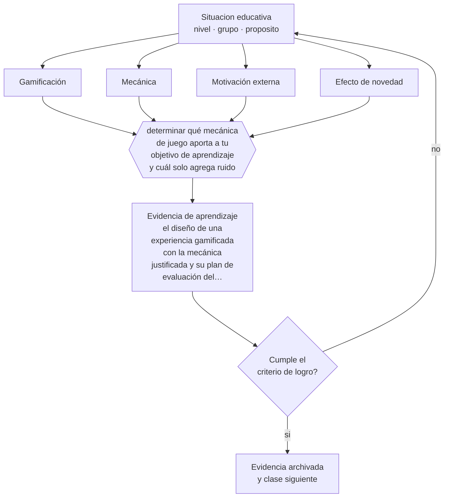

# Clase 160 — Gamificación

> **Parte 13 · Tecnología e IA educativa** — clase 4 de 12

**Estado de evidencia:** `EN-DEBATE` · **Etapa:** 🟣 Etapa C — Núcleo profesional docente · **Población de referencia:** transversal a niveles y modalidades 
**Decisión que habilita:** determinar qué mecánica de juego aporta a tu objetivo de aprendizaje y cuál solo agrega ruido 
**Evidencia de aprendizaje:** el diseño de una experiencia gamificada con la mecánica justificada y su plan de evaluación del efecto

## 🎯 Propósito

Evaluar la gamificación con criterio: distinguir mecánicas que apoyan el aprendizaje de las que solo agregan recompensas externas, y anticipar sus efectos sobre la motivación.

## 📚 Resultados de aprendizaje

Al finalizar esta clase podrás:

1. **Definir** con precisión los cuatro conceptos centrales de la clase y reconocerlos en una situación educativa real, no solo en su enunciado.
2. **Explicar** qué produce realmente la gamificación cuando se retiran los puntos.
3. **Decidir** —qué mecánica de juego aporta a tu objetivo de aprendizaje y cuál solo agrega ruido— y sostener la decisión con un fundamento escrito.
4. **Producir** la evidencia de la clase —el diseño de una experiencia gamificada con la mecánica justificada y su plan de evaluación del efecto— y contrastarla contra el criterio de logro.
5. **Distinguir** lo que la evidencia sostiene de lo que es práctica instalada, preferencia personal o costumbre de la institución.

## 🧩 Conceptos centrales

| Concepto | Comprensión verificable |
|---|---|
| **Gamificación** | uso de elementos de juego en contextos no lúdicos para influir en la conducta |
| **Mecánica** | componente concreto: puntos, niveles, insignias, tablas de posición, narrativa, desafío |
| **Motivación externa** | impulso derivado de la recompensa y no del interés en la tarea |
| **Efecto de novedad** | mejora inicial que desaparece cuando el elemento deja de ser nuevo |

## 🗺️ Flujo de razonamiento

## 📖 Desarrollo

### 1. El fondo del asunto

La evidencia sobre gamificación muestra efectos positivos pequeños, muy heterogéneos y frecuentemente atribuibles al efecto de novedad. Las mecánicas más usadas —puntos, insignias y tablas de posición— son también las más problemáticas: agregan motivación externa a una tarea, pueden reducir el interés propio y las tablas de posición desmotivan sistemáticamente a quienes están en la parte baja.

### 2. Cómo se traduce en decisiones de enseñanza

Las mecánicas con mejor fundamento son las que se conectan con mecanismos de aprendizaje: desafío ajustado al nivel, retroalimentación inmediata, progresión visible del propio avance y posibilidad de reintentar sin costo. Todas ellas se pueden implementar sin puntos ni competencia, y son precisamente las que sostienen el efecto cuando la novedad se agota.

### 3. Qué sostiene la evidencia y qué no

La comparación entre estudios es difícil porque el término abarca intervenciones muy distintas, y muchos trabajos miden satisfacción y no aprendizaje. Además, la duración de los estudios rara vez permite distinguir efecto real de efecto de novedad. Prometer aumentos de aprendizaje por gamificar excede lo que la evidencia sostiene.

> **Cómo leer el estado de evidencia `EN-DEBATE`.** Hay desacuerdo activo y publicado entre especialistas competentes. La clase presenta las posiciones y sus argumentos; tu tarea no es escoger un bando, sino saber qué evidencia te haría cambiar de posición.

## 🧪 Taller guiado

Aplica la clase a **uno** de los contextos siguientes y repite después el ejercicio en un
contexto de exigencia distinta. Cambiar de contexto es parte del aprendizaje: lo que funciona
con un grupo no se traslada intacto a otro.

| Contexto | Rasgo que cambia la decisión |
|---|---|
| Aula con conectividad limitada | la solución debe funcionar sin ancho de banda |
| Modalidad híbrida | la equivalencia de experiencia es el problema real |
| Curso con evaluación escrita fuerte | la IA obliga a rediseñar la evidencia de logro |
| Formación de adultos en línea | autonomía alta y riesgo de deserción |
| Institución con datos sensibles | la protección de datos precede a la funcionalidad |
| Estudiantes menores de edad | consentimiento, resguardo y supervisión reforzados |

**Secuencia de trabajo:**

1. Delimita el contexto: nivel, edad, tamaño del grupo, asignatura o experiencia y tiempo real disponible.
2. Declara qué saben ya los estudiantes y **cómo lo comprobaste**, no cómo lo supones.
3. Formula la decisión pedagógica que esta clase habilita y escribe su fundamento.
4. Anticipa qué observarías si la decisión funciona y qué observarías si no funciona.
5. Diseña de antemano la alternativa que aplicarás si la primera estrategia falla.
6. Ejecuta o simula, y registra lo observado con fecha, contexto y evidencia concreta.
7. Produce la evidencia de aprendizaje de la clase.
8. Contrástala contra el criterio de logro, corrige y recién entonces avanza.

### 📦 Evidencia de aprendizaje

El diseño de una experiencia gamificada con la mecánica justificada y su plan de evaluación del efecto.

Debe incluir contexto, decisión, fundamento, fuentes consultadas con su fecha, indicador de
logro observable, riesgos previstos y qué harías distinto en la siguiente iteración.

## 🏆 Reto verificable

Diseña una experiencia con progresión individual y sin competencia pública. Compara aprendizaje y participación con una versión basada en puntos.

## ✅ Criterio de logro

- [ ] cada mecánica se justifica por el mecanismo de aprendizaje al que apoya;
- [ ] el plan de evaluación mide aprendizaje y no solo participación o satisfacción;
- [ ] cada afirmación sobre «lo que funciona» está atribuida a una fuente identificable, con autor y fecha;
- [ ] la decisión es ejecutable con el tiempo, el espacio, el número de estudiantes y los recursos que realmente tienes;
- [ ] la evidencia queda archivada de forma reproducible: otra persona podría revisarla sin que tú se la expliques.

## ⚠️ Errores frecuentes

**Propios de esta clase:**

- Usar tablas de posición públicas, que desmotivan a quienes más apoyo necesitan.
- Evaluar la gamificación por la satisfacción declarada y no por el aprendizaje verificado.

**Característicos de la parte 13:**

- Adoptar una herramienta por novedad y buscar después el objetivo que justifica su uso.
- Tratar la salida de un modelo de lenguaje como información verificada.

## ♿ Diversidad, accesibilidad y ética

Las mecánicas competitivas y públicas perjudican a los estudiantes con menor desempeño, que son quienes menos margen tienen para perder motivación. La progresión individual visible produce el mismo efecto motivador sin ese costo.

Antes de aplicar cualquier decisión de esta clase con estudiantes reales, revisa el
[protocolo de práctica responsable](../../../docs/ETICA_Y_PRACTICA_RESPONSABLE.md):
consentimiento, resguardo de datos personales, proporcionalidad de la intervención y derecho
de cada estudiante a no ser objeto de un ensayo que no le reporta beneficio.

## ❓ Preguntas de comprobación

1. ¿Qué mecánica de tu diseño sobreviviría a la desaparición de la novedad?
2. ¿A quién desmotiva tu tabla de posiciones?
3. ¿Qué pasa con la conducta cuando retiras los puntos?

## 📕 Lecturas base

**Sailer, M. & Homner, L. (2020). *The Gamification of Learning: A Meta-Analysis*.**  
*Qué aporta a esta clase:* síntesis con efectos, moderadores y limitaciones metodológicas.

**Deci, E., Koestner, R. & Ryan, R. (1999). *Meta-Analytic Review of Extrinsic Rewards*.**  
*Qué aporta a esta clase:* fundamenta el riesgo de sustituir interés propio por recompensa externa.

Catálogo completo: [bibliografía del programa](../../../docs/BIBLIOGRAFIA.md) ·
[glosario](../../../docs/GLOSARIO.md) ·
[fuentes oficiales y cómo leerlas](../../../docs/FUENTES.md).

## 🔗 Conexión con el resto del programa

Se apoya en la clase 022 y comparte criterio de evaluación con la clase 095.

> [!IMPORTANT]
> Material de formación profesional. No reemplaza un título de pedagogía, una habilitación
> legal para ejercer, ni el juicio de un equipo educativo que conoce a sus estudiantes.

---

| Anterior | Índice | Siguiente |
|---|---|---|
| [← 159 · Diseño de recursos digitales](../class-03-diseno-de-recursos-digitales/README.md) | [Parte 13](../README.md) · [Programa](../../../README.md) | [161 · Analítica de aprendizaje →](../class-05-analitica-de-aprendizaje/README.md) |
