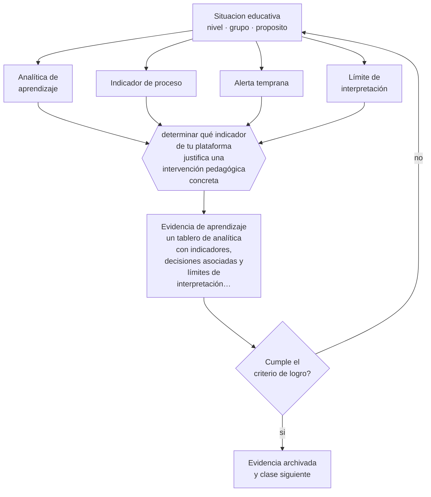

# Clase 161 — Analítica de aprendizaje

> **Parte 13 · Tecnología e IA educativa** — clase 5 de 12

**Estado de evidencia:** `EMERGENTE` · **Etapa:** 🟣 Etapa C — Núcleo profesional docente · **Población de referencia:** transversal a niveles y modalidades 
**Decisión que habilita:** determinar qué indicador de tu plataforma justifica una intervención pedagógica concreta 
**Evidencia de aprendizaje:** un tablero de analítica con indicadores, decisiones asociadas y límites de interpretación declarados

## 🎯 Propósito

Usar analítica de aprendizaje con criterio: qué indicadores tienen valor pedagógico, qué decisiones justifican y qué límites éticos y técnicos tienen.

## 📚 Resultados de aprendizaje

Al finalizar esta clase podrás:

1. **Definir** con precisión los cuatro conceptos centrales de la clase y reconocerlos en una situación educativa real, no solo en su enunciado.
2. **Explicar** qué se puede decidir con los datos que las plataformas producen y qué es sobreinterpretación.
3. **Decidir** —qué indicador de tu plataforma justifica una intervención pedagógica concreta— y sostener la decisión con un fundamento escrito.
4. **Producir** la evidencia de la clase —un tablero de analítica con indicadores, decisiones asociadas y límites de interpretación declarados— y contrastarla contra el criterio de logro.
5. **Distinguir** lo que la evidencia sostiene de lo que es práctica instalada, preferencia personal o costumbre de la institución.

## 🧩 Conceptos centrales

| Concepto | Comprensión verificable |
|---|---|
| **Analítica de aprendizaje** | recolección y análisis de datos sobre estudiantes para comprender y mejorar el aprendizaje |
| **Indicador de proceso** | medida de actividad —accesos, tiempo, entregas— que no equivale a aprendizaje |
| **Alerta temprana** | señal derivada de datos que anticipa riesgo de rezago o de abandono |
| **Límite de interpretación** | frontera entre lo que el dato muestra y lo que se le atribuye |

## 🗺️ Flujo de razonamiento

## 📖 Desarrollo

### 1. El fondo del asunto

Las plataformas producen abundantes datos de actividad y muy pocos de aprendizaje. Tiempo de conexión, número de accesos y clics indican comportamiento, no comprensión: un estudiante puede tener la pestaña abierta sin leer nada, y otro puede aprender fuera de la plataforma. El uso defendible es el de alerta temprana —detectar inactividad prolongada o entregas faltantes— seguido de contacto humano.

### 2. Cómo se traduce en decisiones de enseñanza

El tablero útil incluye pocos indicadores con decisiones asociadas: si un estudiante no entrega dos actividades seguidas, se contacta; si el rendimiento en una actividad cae bajo un umbral en el grupo, se reenseña. Y cada indicador declara su límite de interpretación para evitar que se use como medida de esfuerzo o de compromiso.

### 3. Qué sostiene la evidencia y qué no

La analítica plantea problemas éticos serios: vigilancia, perfilamiento, efectos de expectativa cuando el docente ve una predicción de riesgo, y sesgos de los modelos que la producen. Además, casi toda la evidencia disponible proviene de educación superior en línea y no se traslada sin más a otros contextos.

> **Cómo leer el estado de evidencia `EMERGENTE`.** El cuerpo de estudios es reciente, escaso o poco replicado. Úsala como hipótesis de trabajo con seguimiento explícito, nunca como argumento de autoridad ni como base para una política de establecimiento.

## 🧪 Taller guiado

Aplica la clase a **uno** de los contextos siguientes y repite después el ejercicio en un
contexto de exigencia distinta. Cambiar de contexto es parte del aprendizaje: lo que funciona
con un grupo no se traslada intacto a otro.

| Contexto | Rasgo que cambia la decisión |
|---|---|
| Aula con conectividad limitada | la solución debe funcionar sin ancho de banda |
| Modalidad híbrida | la equivalencia de experiencia es el problema real |
| Curso con evaluación escrita fuerte | la IA obliga a rediseñar la evidencia de logro |
| Formación de adultos en línea | autonomía alta y riesgo de deserción |
| Institución con datos sensibles | la protección de datos precede a la funcionalidad |
| Estudiantes menores de edad | consentimiento, resguardo y supervisión reforzados |

**Secuencia de trabajo:**

1. Delimita el contexto: nivel, edad, tamaño del grupo, asignatura o experiencia y tiempo real disponible.
2. Declara qué saben ya los estudiantes y **cómo lo comprobaste**, no cómo lo supones.
3. Formula la decisión pedagógica que esta clase habilita y escribe su fundamento.
4. Anticipa qué observarías si la decisión funciona y qué observarías si no funciona.
5. Diseña de antemano la alternativa que aplicarás si la primera estrategia falla.
6. Ejecuta o simula, y registra lo observado con fecha, contexto y evidencia concreta.
7. Produce la evidencia de aprendizaje de la clase.
8. Contrástala contra el criterio de logro, corrige y recién entonces avanza.

### 📦 Evidencia de aprendizaje

Un tablero de analítica con indicadores, decisiones asociadas y límites de interpretación declarados.

Debe incluir contexto, decisión, fundamento, fuentes consultadas con su fecha, indicador de
logro observable, riesgos previstos y qué harías distinto en la siguiente iteración.

## 🏆 Reto verificable

Construye tu tablero con tres indicadores y decisiones asociadas. Aplícalo un mes y evalúa cuántas intervenciones produjo y con qué resultado.

## ✅ Criterio de logro

- [ ] cada indicador tiene una decisión pedagógica asociada y un límite de interpretación declarado;
- [ ] el uso de datos declara base legal, resguardo y quién accede;
- [ ] cada afirmación sobre «lo que funciona» está atribuida a una fuente identificable, con autor y fecha;
- [ ] la decisión es ejecutable con el tiempo, el espacio, el número de estudiantes y los recursos que realmente tienes;
- [ ] la evidencia queda archivada de forma reproducible: otra persona podría revisarla sin que tú se la expliques.

## ⚠️ Errores frecuentes

**Propios de esta clase:**

- Interpretar tiempo de conexión o número de accesos como medida de esfuerzo o de aprendizaje.
- Usar predicciones de riesgo sin protocolo de intervención ni resguardo de los datos.

**Característicos de la parte 13:**

- Adoptar una herramienta por novedad y buscar después el objetivo que justifica su uso.
- Tratar la salida de un modelo de lenguaje como información verificada.

## ♿ Diversidad, accesibilidad y ética

Los modelos de riesgo entrenados con datos históricos reproducen las desigualdades que contienen y pueden etiquetar a estudiantes por su origen. Cualquier alerta debe activar apoyo, nunca expectativas más bajas.

Antes de aplicar cualquier decisión de esta clase con estudiantes reales, revisa el
[protocolo de práctica responsable](../../../docs/ETICA_Y_PRACTICA_RESPONSABLE.md):
consentimiento, resguardo de datos personales, proporcionalidad de la intervención y derecho
de cada estudiante a no ser objeto de un ensayo que no le reporta beneficio.

## ❓ Preguntas de comprobación

1. ¿Qué mide realmente el indicador que estás usando?
2. ¿Qué haces cuando el sistema marca a un estudiante en riesgo?
3. ¿Quién puede ver estos datos y con qué justificación?

## 📕 Lecturas base

**Siemens, G. & Gašević, D. *Learning Analytics: fundamentos y aplicaciones*.**  
*Qué aporta a esta clase:* introducción al campo, sus métodos y sus límites.

**Slade, S. & Prinsloo, P. (2013). *Learning Analytics: Ethical Issues and Dilemmas*.**  
*Qué aporta a esta clase:* sistematiza los problemas éticos del uso de datos de estudiantes.

Catálogo completo: [bibliografía del programa](../../../docs/BIBLIOGRAFIA.md) ·
[glosario](../../../docs/GLOSARIO.md) ·
[fuentes oficiales y cómo leerlas](../../../docs/FUENTES.md).

## 🔗 Conexión con el resto del programa

Se conecta con la clase 011 sobre indicadores y con la clase 167 sobre resguardo de datos.

> [!IMPORTANT]
> Material de formación profesional. No reemplaza un título de pedagogía, una habilitación
> legal para ejercer, ni el juicio de un equipo educativo que conoce a sus estudiantes.

---

| Anterior | Índice | Siguiente |
|---|---|---|
| [← 160 · Gamificación](../class-04-gamificacion/README.md) | [Parte 13](../README.md) · [Programa](../../../README.md) | [162 · Aprendizaje adaptativo →](../class-06-aprendizaje-adaptativo/README.md) |
