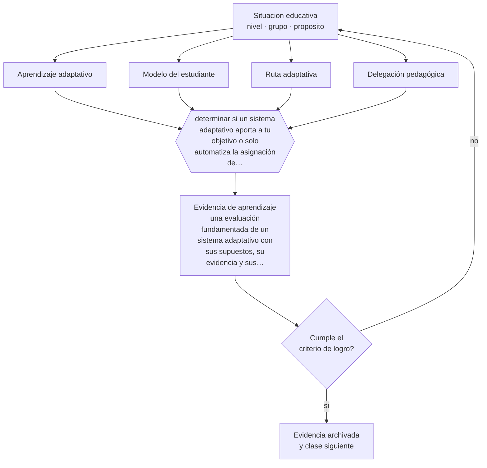

# Clase 162 — Aprendizaje adaptativo

> **Parte 13 · Tecnología e IA educativa** — clase 6 de 12

**Estado de evidencia:** `EMERGENTE` · **Etapa:** 🟣 Etapa C — Núcleo profesional docente · **Población de referencia:** transversal a niveles y modalidades 
**Decisión que habilita:** determinar si un sistema adaptativo aporta a tu objetivo o solo automatiza la asignación de ejercicios 
**Evidencia de aprendizaje:** una evaluación fundamentada de un sistema adaptativo con sus supuestos, su evidencia y sus riesgos

## 🎯 Propósito

Evaluar sistemas de aprendizaje adaptativo con criterio técnico: qué adaptan, con qué modelo, con qué evidencia de efecto y qué decisiones pedagógicas delegan.

## 📚 Resultados de aprendizaje

Al finalizar esta clase podrás:

1. **Definir** con precisión los cuatro conceptos centrales de la clase y reconocerlos en una situación educativa real, no solo en su enunciado.
2. **Explicar** qué hacen realmente los sistemas que prometen adaptarse a cada estudiante.
3. **Decidir** —si un sistema adaptativo aporta a tu objetivo o solo automatiza la asignación de ejercicios— y sostener la decisión con un fundamento escrito.
4. **Producir** la evidencia de la clase —una evaluación fundamentada de un sistema adaptativo con sus supuestos, su evidencia y sus riesgos— y contrastarla contra el criterio de logro.
5. **Distinguir** lo que la evidencia sostiene de lo que es práctica instalada, preferencia personal o costumbre de la institución.

## 🧩 Conceptos centrales

| Concepto | Comprensión verificable |
|---|---|
| **Aprendizaje adaptativo** | sistema que ajusta contenido o dificultad según el desempeño del estudiante |
| **Modelo del estudiante** | representación interna que el sistema construye sobre lo que el estudiante sabe |
| **Ruta adaptativa** | secuencia individualizada que el sistema propone a partir de su modelo |
| **Delegación pedagógica** | decisiones de enseñanza que quedan en manos del sistema y no del docente |

## 🗺️ Flujo de razonamiento

## 📖 Desarrollo

### 1. El fondo del asunto

Los sistemas adaptativos varían enormemente: algunos ajustan solo la dificultad de ejercicios, otros modelan conocimiento con precisión razonable. La evidencia sobre tutores inteligentes en dominios bien estructurados —matemática, programación— es más favorable que la de sistemas generalistas, y en todos los casos los efectos dependen de la calidad del modelo de dominio subyacente.

### 2. Cómo se traduce en decisiones de enseñanza

La evaluación de un sistema debe preguntar qué adapta exactamente, con qué información construye su modelo, qué evidencia de eficacia presenta y qué decisiones deja al docente. Un sistema que solo reordena ejercicios por dificultad no es adaptativo en sentido fuerte, aunque se anuncie así.

### 3. Qué sostiene la evidencia y qué no

Buena parte de la evidencia proviene de los propios proveedores y con diseños débiles. Además, la adaptación puede reducir la exposición a contenido desafiante y consolidar trayectorias divergentes: quien empieza atrás recibe siempre lo más fácil. Esa consecuencia debe vigilarse explícitamente.

> **Cómo leer el estado de evidencia `EMERGENTE`.** El cuerpo de estudios es reciente, escaso o poco replicado. Úsala como hipótesis de trabajo con seguimiento explícito, nunca como argumento de autoridad ni como base para una política de establecimiento.

## 🧪 Taller guiado

Aplica la clase a **uno** de los contextos siguientes y repite después el ejercicio en un
contexto de exigencia distinta. Cambiar de contexto es parte del aprendizaje: lo que funciona
con un grupo no se traslada intacto a otro.

| Contexto | Rasgo que cambia la decisión |
|---|---|
| Aula con conectividad limitada | la solución debe funcionar sin ancho de banda |
| Modalidad híbrida | la equivalencia de experiencia es el problema real |
| Curso con evaluación escrita fuerte | la IA obliga a rediseñar la evidencia de logro |
| Formación de adultos en línea | autonomía alta y riesgo de deserción |
| Institución con datos sensibles | la protección de datos precede a la funcionalidad |
| Estudiantes menores de edad | consentimiento, resguardo y supervisión reforzados |

**Secuencia de trabajo:**

1. Delimita el contexto: nivel, edad, tamaño del grupo, asignatura o experiencia y tiempo real disponible.
2. Declara qué saben ya los estudiantes y **cómo lo comprobaste**, no cómo lo supones.
3. Formula la decisión pedagógica que esta clase habilita y escribe su fundamento.
4. Anticipa qué observarías si la decisión funciona y qué observarías si no funciona.
5. Diseña de antemano la alternativa que aplicarás si la primera estrategia falla.
6. Ejecuta o simula, y registra lo observado con fecha, contexto y evidencia concreta.
7. Produce la evidencia de aprendizaje de la clase.
8. Contrástala contra el criterio de logro, corrige y recién entonces avanza.

### 📦 Evidencia de aprendizaje

Una evaluación fundamentada de un sistema adaptativo con sus supuestos, su evidencia y sus riesgos.

Debe incluir contexto, decisión, fundamento, fuentes consultadas con su fecha, indicador de
logro observable, riesgos previstos y qué harías distinto en la siguiente iteración.

## 🏆 Reto verificable

Evalúa un sistema adaptativo real con tus criterios. Revisa qué contenido recibió cada estudiante durante un mes y si la exigencia se distribuyó de forma justificable.

## ✅ Criterio de logro

- [ ] la evaluación identifica qué adapta el sistema y con qué modelo;
- [ ] declara la evidencia de eficacia disponible y su origen;
- [ ] cada afirmación sobre «lo que funciona» está atribuida a una fuente identificable, con autor y fecha;
- [ ] la decisión es ejecutable con el tiempo, el espacio, el número de estudiantes y los recursos que realmente tienes;
- [ ] la evidencia queda archivada de forma reproducible: otra persona podría revisarla sin que tú se la expliques.

## ⚠️ Errores frecuentes

**Propios de esta clase:**

- Adoptar un sistema por su descripción comercial sin evaluar qué adapta y con qué evidencia.
- Delegar la ruta de aprendizaje sin revisar si el sistema está reduciendo la exigencia a los mismos estudiantes.

**Característicos de la parte 13:**

- Adoptar una herramienta por novedad y buscar después el objetivo que justifica su uso.
- Tratar la salida de un modelo de lenguaje como información verificada.

## ♿ Diversidad, accesibilidad y ética

La adaptación puede convertirse en segregación algorítmica si los estudiantes con menor desempeño quedan permanentemente en rutas de menor exigencia. Vigilar la distribución de contenido por estudiante es parte del uso responsable.

Antes de aplicar cualquier decisión de esta clase con estudiantes reales, revisa el
[protocolo de práctica responsable](../../../docs/ETICA_Y_PRACTICA_RESPONSABLE.md):
consentimiento, resguardo de datos personales, proporcionalidad de la intervención y derecho
de cada estudiante a no ser objeto de un ensayo que no le reporta beneficio.

## ❓ Preguntas de comprobación

1. ¿Qué adapta exactamente el sistema que estás considerando?
2. ¿Qué evidencia independiente respalda sus resultados?
3. ¿A qué estudiantes les está ofreciendo siempre lo más fácil?

## 📕 Lecturas base

**VanLehn, K. (2011). *The Relative Effectiveness of Human Tutoring, Intelligent Tutoring Systems, and Other Tutoring Systems*.**  
*Qué aporta a esta clase:* compara efectos con rigor y ordena expectativas sobre lo que estos sistemas logran.

**Koedinger, K. & Aleven, V. (2007). *Exploring the Assistance Dilemma*.**  
*Qué aporta a esta clase:* analiza cuánta ayuda debe dar un sistema y cuándo la ayuda excesiva perjudica.

Catálogo completo: [bibliografía del programa](../../../docs/BIBLIOGRAFIA.md) ·
[glosario](../../../docs/GLOSARIO.md) ·
[fuentes oficiales y cómo leerlas](../../../docs/FUENTES.md).

## 🔗 Conexión con el resto del programa

Se apoya en la clase 127 y se articula con las clases 165 y 168.

> [!IMPORTANT]
> Material de formación profesional. No reemplaza un título de pedagogía, una habilitación
> legal para ejercer, ni el juicio de un equipo educativo que conoce a sus estudiantes.

---

| Anterior | Índice | Siguiente |
|---|---|---|
| [← 161 · Analítica de aprendizaje](../class-05-analitica-de-aprendizaje/README.md) | [Parte 13](../README.md) · [Programa](../../../README.md) | [163 · Fundamentos de IA para docentes →](../class-07-fundamentos-de-ia-para-docentes/README.md) |
