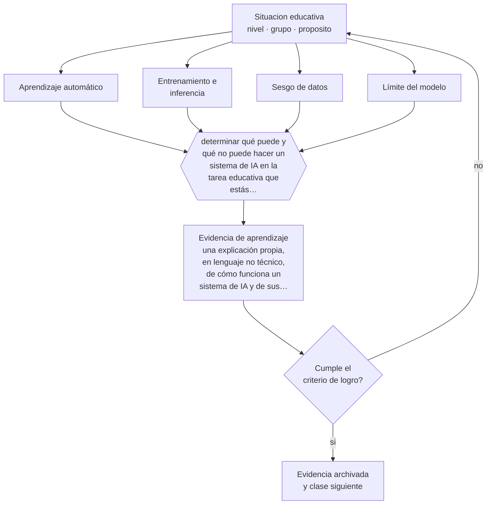

# Clase 163 — Fundamentos de IA para docentes

> **Parte 13 · Tecnología e IA educativa** — clase 7 de 12

**Estado de evidencia:** `CONSISTENTE` · **Etapa:** 🟣 Etapa C — Núcleo profesional docente · **Población de referencia:** transversal a niveles y modalidades 
**Decisión que habilita:** determinar qué puede y qué no puede hacer un sistema de IA en la tarea educativa que estás evaluando 
**Evidencia de aprendizaje:** una explicación propia, en lenguaje no técnico, de cómo funciona un sistema de IA y de sus límites

## 🎯 Propósito

Comprender los fundamentos técnicos de la inteligencia artificial aplicada a educación: aprendizaje a partir de datos, modelos, entrenamiento, inferencia, y por qué los sistemas fallan como fallan.

## 📚 Resultados de aprendizaje

Al finalizar esta clase podrás:

1. **Definir** con precisión los cuatro conceptos centrales de la clase y reconocerlos en una situación educativa real, no solo en su enunciado.
2. **Explicar** qué necesita entender un docente sobre cómo funciona la IA para decidir su uso con criterio.
3. **Decidir** —qué puede y qué no puede hacer un sistema de IA en la tarea educativa que estás evaluando— y sostener la decisión con un fundamento escrito.
4. **Producir** la evidencia de la clase —una explicación propia, en lenguaje no técnico, de cómo funciona un sistema de IA y de sus límites— y contrastarla contra el criterio de logro.
5. **Distinguir** lo que la evidencia sostiene de lo que es práctica instalada, preferencia personal o costumbre de la institución.

## 🧩 Conceptos centrales

| Concepto | Comprensión verificable |
|---|---|
| **Aprendizaje automático** | construcción de modelos a partir de datos en lugar de reglas escritas a mano |
| **Entrenamiento e inferencia** | fase en que el modelo aprende de datos y fase en que responde a una entrada nueva |
| **Sesgo de datos** | distorsión heredada de los datos con que se entrenó el sistema |
| **Límite del modelo** | tipo de tarea o de dato en que el sistema falla de forma predecible |

## 🗺️ Flujo de razonamiento

## 📖 Desarrollo

### 1. El fondo del asunto

Un sistema de aprendizaje automático no razona sobre reglas: ajusta parámetros para reproducir patrones presentes en sus datos. De ahí se derivan casi todas sus propiedades relevantes para educación: funciona bien en tareas parecidas a sus datos, hereda sus sesgos, no distingue verdad de plausibilidad y falla de forma difícil de anticipar en casos poco representados. Entender ese mecanismo permite decidir usos con criterio en vez de con entusiasmo o rechazo.

### 2. Cómo se traduce en decisiones de enseñanza

La prueba de comprensión es poder explicarlo a un colega sin jerga y responder preguntas incómodas: por qué el sistema inventa datos, por qué funciona mejor con unos estudiantes que con otros, por qué su respuesta cambia si se le pregunta distinto. Esa explicación es la base de cualquier decisión institucional informada.

### 3. Qué sostiene la evidencia y qué no

El campo cambia rápido y los detalles técnicos se desactualizan; los principios generales —dependencia de los datos, sesgo, falta de garantía de veracidad, dificultad de explicar decisiones— se sostienen mejor que las descripciones de sistemas específicos. Conviene verificar capacidades actuales antes de afirmar límites concretos.

> **Cómo leer el estado de evidencia `CONSISTENTE`.** La evidencia es amplia y coherente, pero proviene sobre todo de estudios correlacionales, de síntesis con heterogeneidad alta o de contextos distintos al tuyo. Sirve para orientar la decisión y exige que compruebes el efecto en tu propio grupo.

## 🧪 Taller guiado

Aplica la clase a **uno** de los contextos siguientes y repite después el ejercicio en un
contexto de exigencia distinta. Cambiar de contexto es parte del aprendizaje: lo que funciona
con un grupo no se traslada intacto a otro.

| Contexto | Rasgo que cambia la decisión |
|---|---|
| Aula con conectividad limitada | la solución debe funcionar sin ancho de banda |
| Modalidad híbrida | la equivalencia de experiencia es el problema real |
| Curso con evaluación escrita fuerte | la IA obliga a rediseñar la evidencia de logro |
| Formación de adultos en línea | autonomía alta y riesgo de deserción |
| Institución con datos sensibles | la protección de datos precede a la funcionalidad |
| Estudiantes menores de edad | consentimiento, resguardo y supervisión reforzados |

**Secuencia de trabajo:**

1. Delimita el contexto: nivel, edad, tamaño del grupo, asignatura o experiencia y tiempo real disponible.
2. Declara qué saben ya los estudiantes y **cómo lo comprobaste**, no cómo lo supones.
3. Formula la decisión pedagógica que esta clase habilita y escribe su fundamento.
4. Anticipa qué observarías si la decisión funciona y qué observarías si no funciona.
5. Diseña de antemano la alternativa que aplicarás si la primera estrategia falla.
6. Ejecuta o simula, y registra lo observado con fecha, contexto y evidencia concreta.
7. Produce la evidencia de aprendizaje de la clase.
8. Contrástala contra el criterio de logro, corrige y recién entonces avanza.

### 📦 Evidencia de aprendizaje

Una explicación propia, en lenguaje no técnico, de cómo funciona un sistema de IA y de sus límites.

Debe incluir contexto, decisión, fundamento, fuentes consultadas con su fecha, indicador de
logro observable, riesgos previstos y qué harías distinto en la siguiente iteración.

## 🏆 Reto verificable

Escribe tu explicación y preséntala a un colega sin formación técnica. Corrige todo punto donde no pudiste responder su pregunta.

## ✅ Criterio de logro

- [ ] la explicación es correcta y comprensible para un colega sin formación técnica;
- [ ] identifica al menos dos límites del sistema con un ejemplo educativo concreto;
- [ ] cada afirmación sobre «lo que funciona» está atribuida a una fuente identificable, con autor y fecha;
- [ ] la decisión es ejecutable con el tiempo, el espacio, el número de estudiantes y los recursos que realmente tienes;
- [ ] la evidencia queda archivada de forma reproducible: otra persona podría revisarla sin que tú se la expliques.

## ⚠️ Errores frecuentes

**Propios de esta clase:**

- Atribuir comprensión o intención al sistema por la fluidez de sus respuestas.
- Rechazar el uso por principio sin entender qué hace el sistema en la tarea concreta.

**Característicos de la parte 13:**

- Adoptar una herramienta por novedad y buscar después el objetivo que justifica su uso.
- Tratar la salida de un modelo de lenguaje como información verificada.

## ♿ Diversidad, accesibilidad y ética

Los sistemas entrenados con datos no representativos funcionan peor con hablantes de variedades lingüísticas minorizadas y con estudiantes de contextos poco presentes en los datos. Ese desempeño desigual debe verificarse antes de adoptar, no después.

Antes de aplicar cualquier decisión de esta clase con estudiantes reales, revisa el
[protocolo de práctica responsable](../../../docs/ETICA_Y_PRACTICA_RESPONSABLE.md):
consentimiento, resguardo de datos personales, proporcionalidad de la intervención y derecho
de cada estudiante a no ser objeto de un ensayo que no le reporta beneficio.

## ❓ Preguntas de comprobación

1. ¿Por qué un sistema de lenguaje produce información falsa con tono seguro?
2. ¿De qué datos aprendió el sistema que estás evaluando?
3. ¿En qué tarea educativa fallará de forma predecible?

## 📕 Lecturas base

**Russell, S. & Norvig, P. *Artificial Intelligence: A Modern Approach*.**  
*Qué aporta a esta clase:* referencia estándar; útil para los fundamentos conceptuales sin depender de una tecnología concreta.

**UNESCO (2021). *Recomendación sobre la ética de la inteligencia artificial*.**  
*Qué aporta a esta clase:* marco internacional de principios aplicables a decisiones institucionales.

Catálogo completo: [bibliografía del programa](../../../docs/BIBLIOGRAFIA.md) ·
[glosario](../../../docs/GLOSARIO.md) ·
[fuentes oficiales y cómo leerlas](../../../docs/FUENTES.md).

## 🔗 Conexión con el resto del programa

Es la base técnica de las clases 164 a 168 y se apoya en la clase 157.

> [!IMPORTANT]
> Material de formación profesional. No reemplaza un título de pedagogía, una habilitación
> legal para ejercer, ni el juicio de un equipo educativo que conoce a sus estudiantes.

---

| Anterior | Índice | Siguiente |
|---|---|---|
| [← 162 · Aprendizaje adaptativo](../class-06-aprendizaje-adaptativo/README.md) | [Parte 13](../README.md) · [Programa](../../../README.md) | [164 · LLM y generación de contenidos →](../class-08-llm-y-generacion-de-contenidos/README.md) |
