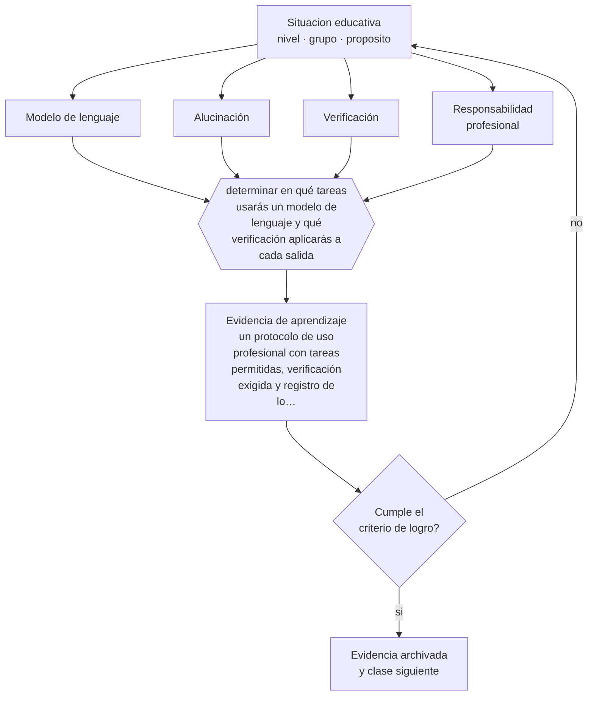

# Clase 164 — LLM y generación de contenidos

> **Parte 13 · Tecnología e IA educativa** — clase 8 de 12

**Estado de evidencia:** `EMERGENTE` · **Etapa:** 🟣 Etapa C — Núcleo profesional docente · **Población de referencia:** transversal a niveles y modalidades 
**Decisión que habilita:** determinar en qué tareas usarás un modelo de lenguaje y qué verificación aplicarás a cada salida 
**Evidencia de aprendizaje:** un protocolo de uso profesional con tareas permitidas, verificación exigida y registro de lo verificado

## 🎯 Propósito

Usar modelos de lenguaje en tareas docentes con criterio profesional: generación de borradores, variantes, ejemplos y retroalimentación, siempre con verificación y responsabilidad humana.

## 📚 Resultados de aprendizaje

Al finalizar esta clase podrás:

1. **Definir** con precisión los cuatro conceptos centrales de la clase y reconocerlos en una situación educativa real, no solo en su enunciado.
2. **Explicar** para qué sirve un modelo de lenguaje en la preparación de clases y dónde empieza el riesgo.
3. **Decidir** —en qué tareas usarás un modelo de lenguaje y qué verificación aplicarás a cada salida— y sostener la decisión con un fundamento escrito.
4. **Producir** la evidencia de la clase —un protocolo de uso profesional con tareas permitidas, verificación exigida y registro de lo verificado— y contrastarla contra el criterio de logro.
5. **Distinguir** lo que la evidencia sostiene de lo que es práctica instalada, preferencia personal o costumbre de la institución.

## 🧩 Conceptos centrales

| Concepto | Comprensión verificable |
|---|---|
| **Modelo de lenguaje** | sistema que produce texto plausible a partir de patrones aprendidos, sin garantía de veracidad |
| **Alucinación** | producción de información falsa presentada con la misma seguridad que la correcta |
| **Verificación** | comprobación humana de la exactitud y la pertinencia de la salida antes de usarla |
| **Responsabilidad profesional** | principio de que quien usa la salida responde por ella, sin importar cómo se generó |

## 🗺️ Flujo de razonamiento

## 📖 Desarrollo

### 1. El fondo del asunto

Los modelos de lenguaje son útiles en tareas donde el docente puede verificar el resultado con rapidez: generar variantes de ejercicios, producir borradores, proponer ejemplos, reformular explicaciones, anticipar errores frecuentes. Son riesgosos en tareas donde la verificación es costosa o donde el error pasa inadvertido: datos históricos, cifras, referencias bibliográficas y normativa, que es precisamente donde más se equivocan.

### 2. Cómo se traduce en decisiones de enseñanza

Un protocolo profesional define qué tareas se delegan, qué verificación exige cada una y qué queda registrado. La regla de fondo es simple: la responsabilidad no se delega. Si un material tiene un error, responde quien lo entregó a sus estudiantes, con independencia de la herramienta usada para producirlo.

### 3. Qué sostiene la evidencia y qué no

Las capacidades cambian rápido y cualquier afirmación específica sobre lo que un modelo puede o no hacer envejece; lo estable es la exigencia de verificación. Además, la evidencia sobre efectos en el aprendizaje de los estudiantes es todavía escasa y de corto plazo, y conviene distinguir el uso docente —mejor documentado en ahorro de tiempo— del uso directo por estudiantes.

> **Cómo leer el estado de evidencia `EMERGENTE`.** El cuerpo de estudios es reciente, escaso o poco replicado. Úsala como hipótesis de trabajo con seguimiento explícito, nunca como argumento de autoridad ni como base para una política de establecimiento.

## 🧪 Taller guiado

Aplica la clase a **uno** de los contextos siguientes y repite después el ejercicio en un
contexto de exigencia distinta. Cambiar de contexto es parte del aprendizaje: lo que funciona
con un grupo no se traslada intacto a otro.

| Contexto | Rasgo que cambia la decisión |
|---|---|
| Aula con conectividad limitada | la solución debe funcionar sin ancho de banda |
| Modalidad híbrida | la equivalencia de experiencia es el problema real |
| Curso con evaluación escrita fuerte | la IA obliga a rediseñar la evidencia de logro |
| Formación de adultos en línea | autonomía alta y riesgo de deserción |
| Institución con datos sensibles | la protección de datos precede a la funcionalidad |
| Estudiantes menores de edad | consentimiento, resguardo y supervisión reforzados |

**Secuencia de trabajo:**

1. Delimita el contexto: nivel, edad, tamaño del grupo, asignatura o experiencia y tiempo real disponible.
2. Declara qué saben ya los estudiantes y **cómo lo comprobaste**, no cómo lo supones.
3. Formula la decisión pedagógica que esta clase habilita y escribe su fundamento.
4. Anticipa qué observarías si la decisión funciona y qué observarías si no funciona.
5. Diseña de antemano la alternativa que aplicarás si la primera estrategia falla.
6. Ejecuta o simula, y registra lo observado con fecha, contexto y evidencia concreta.
7. Produce la evidencia de aprendizaje de la clase.
8. Contrástala contra el criterio de logro, corrige y recién entonces avanza.

### 📦 Evidencia de aprendizaje

Un protocolo de uso profesional con tareas permitidas, verificación exigida y registro de lo verificado.

Debe incluir contexto, decisión, fundamento, fuentes consultadas con su fecha, indicador de
logro observable, riesgos previstos y qué harías distinto en la siguiente iteración.

## 🏆 Reto verificable

Aplica tu protocolo durante dos semanas y registra cuántos errores detectaste en las salidas. Ajusta la verificación donde los errores pasaron más cerca de llegar a los estudiantes.

## ✅ Criterio de logro

- [ ] el protocolo define verificación específica para cada tipo de tarea;
- [ ] declara qué información no se ingresa nunca al sistema por resguardo de datos;
- [ ] cada afirmación sobre «lo que funciona» está atribuida a una fuente identificable, con autor y fecha;
- [ ] la decisión es ejecutable con el tiempo, el espacio, el número de estudiantes y los recursos que realmente tienes;
- [ ] la evidencia queda archivada de forma reproducible: otra persona podría revisarla sin que tú se la expliques.

## ⚠️ Errores frecuentes

**Propios de esta clase:**

- Usar referencias bibliográficas generadas por un modelo sin verificar que existan.
- Entregar a los estudiantes material generado sin revisión, delegando también la responsabilidad.

**Característicos de la parte 13:**

- Adoptar una herramienta por novedad y buscar después el objetivo que justifica su uso.
- Tratar la salida de un modelo de lenguaje como información verificada.

## ♿ Diversidad, accesibilidad y ética

Estas herramientas pueden ampliar el acceso —traducción, simplificación de textos, generación de formatos alternativos— y también amplificar sesgos. Ambas cosas ocurren a la vez y exigen verificación específica cuando el material se dirige a estudiantes con necesidades de apoyo.

Antes de aplicar cualquier decisión de esta clase con estudiantes reales, revisa el
[protocolo de práctica responsable](../../../docs/ETICA_Y_PRACTICA_RESPONSABLE.md):
consentimiento, resguardo de datos personales, proporcionalidad de la intervención y derecho
de cada estudiante a no ser objeto de un ensayo que no le reporta beneficio.

## ❓ Preguntas de comprobación

1. ¿Qué error de un material generado no detectarías al revisarlo?
2. ¿Qué datos de tus estudiantes nunca deberías ingresar a estas herramientas?
3. ¿Quién responde si el material tiene un error?

## 📕 Lecturas base

**UNESCO (2023). *Guidance for Generative AI in Education and Research*.**  
*Qué aporta a esta clase:* la referencia internacional más usada para políticas institucionales de uso.

**Bender, E. et al. (2021). *On the Dangers of Stochastic Parrots*.**  
*Qué aporta a esta clase:* el contrapunto crítico sobre límites, sesgos y costos de estos sistemas.

Catálogo completo: [bibliografía del programa](../../../docs/BIBLIOGRAFIA.md) ·
[glosario](../../../docs/GLOSARIO.md) ·
[fuentes oficiales y cómo leerlas](../../../docs/FUENTES.md).

## 🔗 Conexión con el resto del programa

Se apoya en la clase 163 y es condición de las clases 165, 166 y 168.

> [!IMPORTANT]
> Material de formación profesional. No reemplaza un título de pedagogía, una habilitación
> legal para ejercer, ni el juicio de un equipo educativo que conoce a sus estudiantes.

---

| Anterior | Índice | Siguiente |
|---|---|---|
| [← 163 · Fundamentos de IA para docentes](../class-07-fundamentos-de-ia-para-docentes/README.md) | [Parte 13](../README.md) · [Programa](../../../README.md) | [165 · RAG y tutores educativos →](../class-09-rag-y-tutores-educativos/README.md) |
