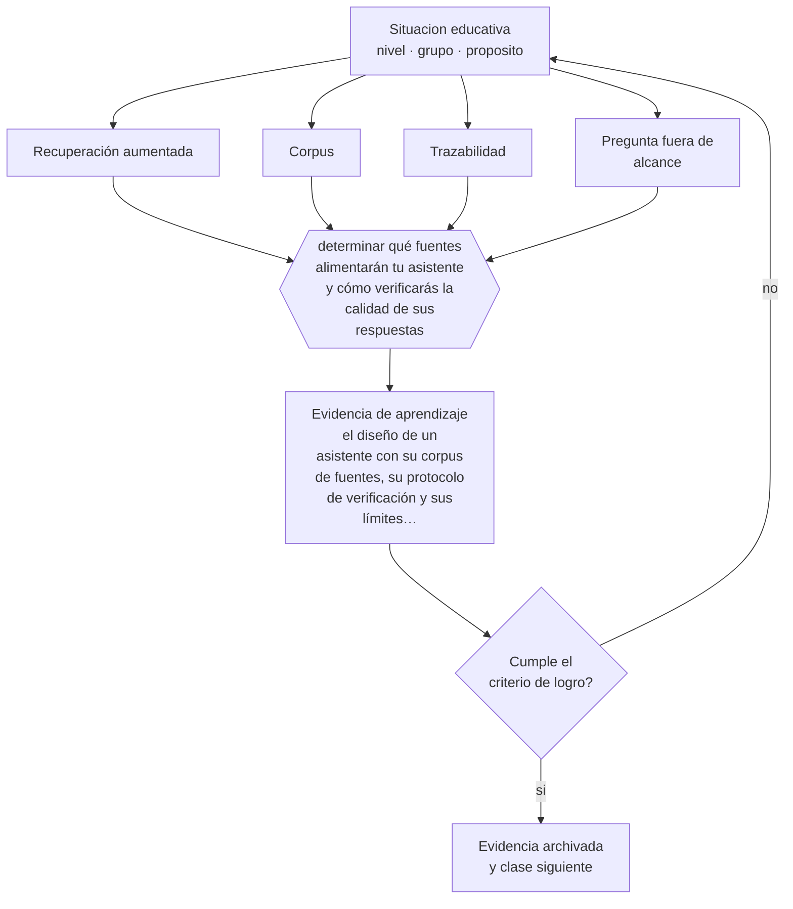

# Clase 165 — RAG y tutores educativos

> **Parte 13 · Tecnología e IA educativa** — clase 9 de 12

**Estado de evidencia:** `EMERGENTE` · **Etapa:** 🟣 Etapa C — Núcleo profesional docente · **Población de referencia:** transversal a niveles y modalidades 
**Decisión que habilita:** determinar qué fuentes alimentarán tu asistente y cómo verificarás la calidad de sus respuestas 
**Evidencia de aprendizaje:** el diseño de un asistente con su corpus de fuentes, su protocolo de verificación y sus límites declarados

## 🎯 Propósito

Diseñar tutores o asistentes basados en recuperación sobre documentos propios, entendiendo qué problema resuelve la recuperación y cuál no.

## 📚 Resultados de aprendizaje

Al finalizar esta clase podrás:

1. **Definir** con precisión los cuatro conceptos centrales de la clase y reconocerlos en una situación educativa real, no solo en su enunciado.
2. **Explicar** cómo se construye un asistente que responda con el material del curso y no con lo que inventa.
3. **Decidir** —qué fuentes alimentarán tu asistente y cómo verificarás la calidad de sus respuestas— y sostener la decisión con un fundamento escrito.
4. **Producir** la evidencia de la clase —el diseño de un asistente con su corpus de fuentes, su protocolo de verificación y sus límites declarados— y contrastarla contra el criterio de logro.
5. **Distinguir** lo que la evidencia sostiene de lo que es práctica instalada, preferencia personal o costumbre de la institución.

## 🧩 Conceptos centrales

| Concepto | Comprensión verificable |
|---|---|
| **Recuperación aumentada** | técnica que busca fragmentos relevantes en documentos propios y los entrega al modelo como contexto |
| **Corpus** | conjunto de documentos que el asistente puede consultar; define lo que puede responder bien |
| **Trazabilidad** | posibilidad de mostrar de qué documento proviene cada afirmación de la respuesta |
| **Pregunta fuera de alcance** | consulta que el corpus no cubre y que el sistema debería declarar como tal |

## 🗺️ Flujo de razonamiento

## 📖 Desarrollo

### 1. El fondo del asunto

La recuperación sobre documentos propios reduce la invención porque obliga al modelo a responder a partir de fragmentos concretos, y permite mostrar la fuente de cada afirmación. No elimina el problema: el sistema puede seleccionar mal el fragmento, combinarlo incorrectamente o responder igualmente cuando el corpus no cubre la pregunta. La trazabilidad es lo que permite detectarlo.

### 2. Cómo se traduce en decisiones de enseñanza

El diseño empieza por el corpus: qué documentos, con qué versión y fecha, revisados por quién. Después, la verificación: un conjunto de preguntas de prueba con respuestas conocidas, incluidas preguntas fuera de alcance que el sistema debe rechazar. Y la declaración de límites, visible para el estudiante: qué puede responder y qué no.

### 3. Qué sostiene la evidencia y qué no

La evidencia sobre efectos de estos asistentes en el aprendizaje es incipiente. Su beneficio más claro es de acceso —disponibilidad permanente, paciencia, repetición— y su riesgo más claro es el desplazamiento del esfuerzo: un estudiante puede obtener respuestas sin realizar el trabajo cognitivo que producía el aprendizaje.

> **Cómo leer el estado de evidencia `EMERGENTE`.** El cuerpo de estudios es reciente, escaso o poco replicado. Úsala como hipótesis de trabajo con seguimiento explícito, nunca como argumento de autoridad ni como base para una política de establecimiento.

## 🧪 Taller guiado

Aplica la clase a **uno** de los contextos siguientes y repite después el ejercicio en un
contexto de exigencia distinta. Cambiar de contexto es parte del aprendizaje: lo que funciona
con un grupo no se traslada intacto a otro.

| Contexto | Rasgo que cambia la decisión |
|---|---|
| Aula con conectividad limitada | la solución debe funcionar sin ancho de banda |
| Modalidad híbrida | la equivalencia de experiencia es el problema real |
| Curso con evaluación escrita fuerte | la IA obliga a rediseñar la evidencia de logro |
| Formación de adultos en línea | autonomía alta y riesgo de deserción |
| Institución con datos sensibles | la protección de datos precede a la funcionalidad |
| Estudiantes menores de edad | consentimiento, resguardo y supervisión reforzados |

**Secuencia de trabajo:**

1. Delimita el contexto: nivel, edad, tamaño del grupo, asignatura o experiencia y tiempo real disponible.
2. Declara qué saben ya los estudiantes y **cómo lo comprobaste**, no cómo lo supones.
3. Formula la decisión pedagógica que esta clase habilita y escribe su fundamento.
4. Anticipa qué observarías si la decisión funciona y qué observarías si no funciona.
5. Diseña de antemano la alternativa que aplicarás si la primera estrategia falla.
6. Ejecuta o simula, y registra lo observado con fecha, contexto y evidencia concreta.
7. Produce la evidencia de aprendizaje de la clase.
8. Contrástala contra el criterio de logro, corrige y recién entonces avanza.

### 📦 Evidencia de aprendizaje

El diseño de un asistente con su corpus de fuentes, su protocolo de verificación y sus límites declarados.

Debe incluir contexto, decisión, fundamento, fuentes consultadas con su fecha, indicador de
logro observable, riesgos previstos y qué harías distinto en la siguiente iteración.

## 🏆 Reto verificable

Construye o evalúa un asistente con corpus propio y aplícale veinte preguntas de prueba, incluidas cinco fuera de alcance. Documenta sus fallas.

## ✅ Criterio de logro

- [ ] el corpus está identificado con versión, fecha y responsable de revisión;
- [ ] existe un conjunto de preguntas de prueba, incluidas preguntas fuera de alcance;
- [ ] cada afirmación sobre «lo que funciona» está atribuida a una fuente identificable, con autor y fecha;
- [ ] la decisión es ejecutable con el tiempo, el espacio, el número de estudiantes y los recursos que realmente tienes;
- [ ] la evidencia queda archivada de forma reproducible: otra persona podría revisarla sin que tú se la expliques.

## ⚠️ Errores frecuentes

**Propios de esta clase:**

- Construir el asistente sin conjunto de preguntas de prueba ni verificación de respuestas.
- Omitir la trazabilidad, con lo que ningún error puede rastrearse hasta su fuente.

**Característicos de la parte 13:**

- Adoptar una herramienta por novedad y buscar después el objetivo que justifica su uso.
- Tratar la salida de un modelo de lenguaje como información verificada.

## ♿ Diversidad, accesibilidad y ética

Un asistente disponible a cualquier hora beneficia a estudiantes que trabajan o que no tienen quién les explique en casa. Requiere, para cumplir esa promesa, funcionar en dispositivos modestos y con conectividad limitada.

Antes de aplicar cualquier decisión de esta clase con estudiantes reales, revisa el
[protocolo de práctica responsable](../../../docs/ETICA_Y_PRACTICA_RESPONSABLE.md):
consentimiento, resguardo de datos personales, proporcionalidad de la intervención y derecho
de cada estudiante a no ser objeto de un ensayo que no le reporta beneficio.

## ❓ Preguntas de comprobación

1. ¿Qué preguntas debería rechazar tu asistente y las rechaza?
2. ¿Puedes rastrear cada afirmación hasta el documento que la respalda?
3. ¿Qué trabajo cognitivo del estudiante está reemplazando tu asistente?

## 📕 Lecturas base

**Lewis, P. et al. (2020). *Retrieval-Augmented Generation for Knowledge-Intensive NLP Tasks*.**  
*Qué aporta a esta clase:* el trabajo que formaliza la técnica y explica qué problema resuelve.

**UNESCO (2023). *Guidance for Generative AI in Education and Research*.**  
*Qué aporta a esta clase:* criterios institucionales para el despliegue de asistentes con estudiantes.

Catálogo completo: [bibliografía del programa](../../../docs/BIBLIOGRAFIA.md) ·
[glosario](../../../docs/GLOSARIO.md) ·
[fuentes oficiales y cómo leerlas](../../../docs/FUENTES.md).

## 🔗 Conexión con el resto del programa

Se apoya en las clases 163 y 164 y es el núcleo técnico del proyecto de la clase 168.

> [!IMPORTANT]
> Material de formación profesional. No reemplaza un título de pedagogía, una habilitación
> legal para ejercer, ni el juicio de un equipo educativo que conoce a sus estudiantes.

---

| Anterior | Índice | Siguiente |
|---|---|---|
| [← 164 · LLM y generación de contenidos](../class-08-llm-y-generacion-de-contenidos/README.md) | [Parte 13](../README.md) · [Programa](../../../README.md) | [166 · Agentes educativos →](../class-10-agentes-educativos/README.md) |
