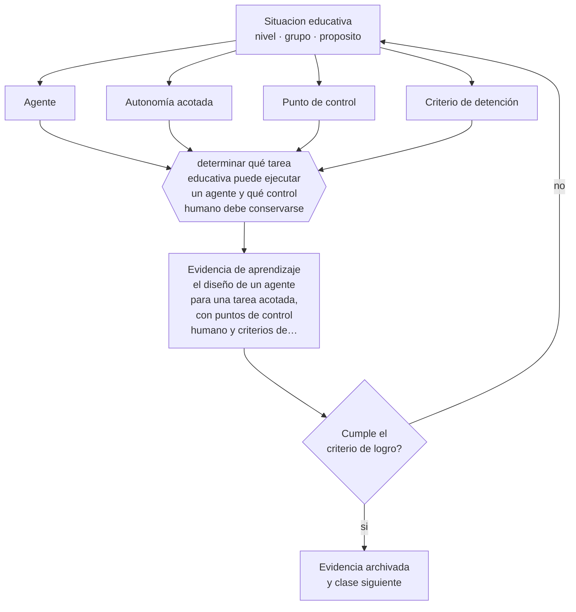

# Clase 166 — Agentes educativos

> **Parte 13 · Tecnología e IA educativa** — clase 10 de 12

**Estado de evidencia:** `EMERGENTE` · **Etapa:** 🟣 Etapa C — Núcleo profesional docente · **Población de referencia:** transversal a niveles y modalidades 
**Decisión que habilita:** determinar qué tarea educativa puede ejecutar un agente y qué control humano debe conservarse 
**Evidencia de aprendizaje:** el diseño de un agente para una tarea acotada, con puntos de control humano y criterios de detención

## 🎯 Propósito

Comprender los agentes educativos —sistemas que planifican y ejecutan acciones— y decidir qué tareas pueden delegarse, con qué supervisión y con qué resguardos.

## 📚 Resultados de aprendizaje

Al finalizar esta clase podrás:

1. **Definir** con precisión los cuatro conceptos centrales de la clase y reconocerlos en una situación educativa real, no solo en su enunciado.
2. **Explicar** qué cambia cuando un sistema no solo responde sino que ejecuta acciones.
3. **Decidir** —qué tarea educativa puede ejecutar un agente y qué control humano debe conservarse— y sostener la decisión con un fundamento escrito.
4. **Producir** la evidencia de la clase —el diseño de un agente para una tarea acotada, con puntos de control humano y criterios de detención— y contrastarla contra el criterio de logro.
5. **Distinguir** lo que la evidencia sostiene de lo que es práctica instalada, preferencia personal o costumbre de la institución.

## 🧩 Conceptos centrales

| Concepto | Comprensión verificable |
|---|---|
| **Agente** | sistema que planifica y ejecuta acciones para cumplir un objetivo, no solo genera texto |
| **Autonomía acotada** | límite explícito de lo que el agente puede hacer sin autorización humana |
| **Punto de control** | instancia en que una persona revisa y autoriza antes de continuar |
| **Criterio de detención** | condición que obliga al agente a detenerse y escalar a una persona |

## 🗺️ Flujo de razonamiento

## 📖 Desarrollo

### 1. El fondo del asunto

Un agente se distingue de un asistente porque actúa: consulta, produce, envía, registra. Esa capacidad amplía la utilidad y multiplica el riesgo, porque un error deja de ser una respuesta equivocada y pasa a ser una acción ejecutada. En contextos educativos, donde las acciones afectan a personas y a sus datos, la autonomía debe acotarse de forma explícita y no por omisión.

### 2. Cómo se traduce en decisiones de enseñanza

El diseño responsable define la tarea con precisión, los límites de lo que el agente puede hacer sin autorización, los puntos de control humano y los criterios que obligan a detenerse. Las tareas candidatas razonables son administrativas y verificables —organizar material, preparar borradores, revisar formato—; las que afectan directamente a estudiantes exigen control humano en cada paso.

### 3. Qué sostiene la evidencia y qué no

Es un campo en desarrollo rápido y con poca evidencia educativa. Los riesgos conocidos incluyen ejecución de acciones erróneas, propagación de errores en cadena y exposición de datos. Ninguna decisión que afecte la trayectoria de un estudiante debería delegarse a un sistema automático sin revisión humana explícita.

> **Cómo leer el estado de evidencia `EMERGENTE`.** El cuerpo de estudios es reciente, escaso o poco replicado. Úsala como hipótesis de trabajo con seguimiento explícito, nunca como argumento de autoridad ni como base para una política de establecimiento.

## 🧪 Taller guiado

Aplica la clase a **uno** de los contextos siguientes y repite después el ejercicio en un
contexto de exigencia distinta. Cambiar de contexto es parte del aprendizaje: lo que funciona
con un grupo no se traslada intacto a otro.

| Contexto | Rasgo que cambia la decisión |
|---|---|
| Aula con conectividad limitada | la solución debe funcionar sin ancho de banda |
| Modalidad híbrida | la equivalencia de experiencia es el problema real |
| Curso con evaluación escrita fuerte | la IA obliga a rediseñar la evidencia de logro |
| Formación de adultos en línea | autonomía alta y riesgo de deserción |
| Institución con datos sensibles | la protección de datos precede a la funcionalidad |
| Estudiantes menores de edad | consentimiento, resguardo y supervisión reforzados |

**Secuencia de trabajo:**

1. Delimita el contexto: nivel, edad, tamaño del grupo, asignatura o experiencia y tiempo real disponible.
2. Declara qué saben ya los estudiantes y **cómo lo comprobaste**, no cómo lo supones.
3. Formula la decisión pedagógica que esta clase habilita y escribe su fundamento.
4. Anticipa qué observarías si la decisión funciona y qué observarías si no funciona.
5. Diseña de antemano la alternativa que aplicarás si la primera estrategia falla.
6. Ejecuta o simula, y registra lo observado con fecha, contexto y evidencia concreta.
7. Produce la evidencia de aprendizaje de la clase.
8. Contrástala contra el criterio de logro, corrige y recién entonces avanza.

### 📦 Evidencia de aprendizaje

El diseño de un agente para una tarea acotada, con puntos de control humano y criterios de detención.

Debe incluir contexto, decisión, fundamento, fuentes consultadas con su fecha, indicador de
logro observable, riesgos previstos y qué harías distinto en la siguiente iteración.

## 🏆 Reto verificable

Diseña un agente para una tarea administrativa acotada con puntos de control. Ejecútalo con supervisión y documenta qué habría ocurrido sin control humano.

## ✅ Criterio de logro

- [ ] el diseño declara autonomía acotada, puntos de control y criterios de detención;
- [ ] ninguna acción que afecte a un estudiante ocurre sin autorización humana;
- [ ] cada afirmación sobre «lo que funciona» está atribuida a una fuente identificable, con autor y fecha;
- [ ] la decisión es ejecutable con el tiempo, el espacio, el número de estudiantes y los recursos que realmente tienes;
- [ ] la evidencia queda archivada de forma reproducible: otra persona podría revisarla sin que tú se la expliques.

## ⚠️ Errores frecuentes

**Propios de esta clase:**

- Delegar a un agente tareas que afectan a estudiantes sin punto de control humano.
- Definir la tarea de forma vaga, con lo que el agente actúa fuera del alcance previsto.

**Característicos de la parte 13:**

- Adoptar una herramienta por novedad y buscar después el objetivo que justifica su uso.
- Tratar la salida de un modelo de lenguaje como información verificada.

## ♿ Diversidad, accesibilidad y ética

Las decisiones automatizadas sobre personas pueden reproducir sesgos con apariencia de objetividad. En educación, cualquier sistema que clasifique, priorice o derive estudiantes debe conservar revisión humana y vía de impugnación.

Antes de aplicar cualquier decisión de esta clase con estudiantes reales, revisa el
[protocolo de práctica responsable](../../../docs/ETICA_Y_PRACTICA_RESPONSABLE.md):
consentimiento, resguardo de datos personales, proporcionalidad de la intervención y derecho
de cada estudiante a no ser objeto de un ensayo que no le reporta beneficio.

## ❓ Preguntas de comprobación

1. ¿Qué acción de tu agente sería irreversible?
2. ¿En qué punto se detiene y pide autorización?
3. ¿Qué dato de estudiantes toca y con qué base legal?

## 📕 Lecturas base

**UNESCO (2021). *Recomendación sobre la ética de la inteligencia artificial*.**  
*Qué aporta a esta clase:* principios de supervisión humana y responsabilidad aplicables a sistemas autónomos.

**OCDE. *Principios sobre inteligencia artificial*.**  
*Qué aporta a esta clase:* marco internacional sobre transparencia, robustez y rendición de cuentas.

Catálogo completo: [bibliografía del programa](../../../docs/BIBLIOGRAFIA.md) ·
[glosario](../../../docs/GLOSARIO.md) ·
[fuentes oficiales y cómo leerlas](../../../docs/FUENTES.md).

## 🔗 Conexión con el resto del programa

Se apoya en las clases 163 a 165 y se rige por los criterios de la clase 167.

> [!IMPORTANT]
> Material de formación profesional. No reemplaza un título de pedagogía, una habilitación
> legal para ejercer, ni el juicio de un equipo educativo que conoce a sus estudiantes.

---

| Anterior | Índice | Siguiente |
|---|---|---|
| [← 165 · RAG y tutores educativos](../class-09-rag-y-tutores-educativos/README.md) | [Parte 13](../README.md) · [Programa](../../../README.md) | [167 · Ética, privacidad y sesgos →](../class-11-etica-privacidad-y-sesgos/README.md) |
