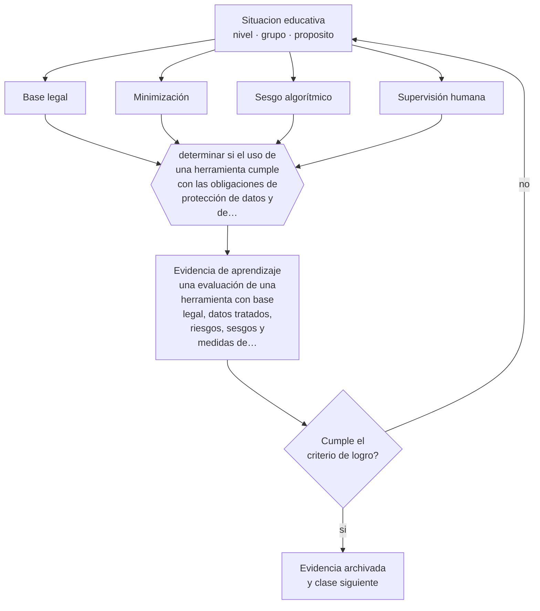

# Clase 167 — Ética, privacidad y sesgos

> **Parte 13 · Tecnología e IA educativa** — clase 11 de 12

**Estado de evidencia:** `MARCO-NORMATIVO` · **Etapa:** 🟣 Etapa C — Núcleo profesional docente · **Población de referencia:** transversal a niveles y modalidades 
**Decisión que habilita:** determinar si el uso de una herramienta cumple con las obligaciones de protección de datos y de trato justo 
**Evidencia de aprendizaje:** una evaluación de una herramienta con base legal, datos tratados, riesgos, sesgos y medidas de mitigación

## 🎯 Propósito

Aplicar criterios de ética, privacidad y sesgo al uso de tecnología educativa: base legal del tratamiento de datos, minimización, transparencia, supervisión humana y evaluación de impacto.

## 📚 Resultados de aprendizaje

Al finalizar esta clase podrás:

1. **Definir** con precisión los cuatro conceptos centrales de la clase y reconocerlos en una situación educativa real, no solo en su enunciado.
2. **Explicar** qué obligaciones concretas asume una institución cuando usa tecnología con datos de estudiantes.
3. **Decidir** —si el uso de una herramienta cumple con las obligaciones de protección de datos y de trato justo— y sostener la decisión con un fundamento escrito.
4. **Producir** la evidencia de la clase —una evaluación de una herramienta con base legal, datos tratados, riesgos, sesgos y medidas de mitigación— y contrastarla contra el criterio de logro.
5. **Distinguir** lo que la evidencia sostiene de lo que es práctica instalada, preferencia personal o costumbre de la institución.

## 🧩 Conceptos centrales

| Concepto | Comprensión verificable |
|---|---|
| **Base legal** | fundamento jurídico que autoriza el tratamiento de datos personales |
| **Minimización** | principio de tratar solo los datos estrictamente necesarios para la finalidad declarada |
| **Sesgo algorítmico** | desempeño sistemáticamente distinto del sistema entre grupos de personas |
| **Supervisión humana** | exigencia de que una persona revise y pueda revertir decisiones que afectan a otras |

## 🗺️ Flujo de razonamiento

## 📖 Desarrollo

### 1. El fondo del asunto

Toda herramienta que procesa datos de estudiantes genera obligaciones: base legal para el tratamiento, información a los titulares, minimización, resguardo, plazos de conservación y, tratándose de menores, protecciones reforzadas. A eso se suma la exigencia ética de verificar que el sistema no funcione peor con determinados grupos, que es un fenómeno documentado y no una hipótesis.

### 2. Cómo se traduce en decisiones de enseñanza

La evaluación de una herramienta debe responder por escrito: qué datos trata, con qué finalidad, con qué base legal, dónde se almacenan, quién accede, cuánto se conservan y qué ocurre si el proveedor cambia sus condiciones. Y para sistemas que clasifican o predicen, cómo se verificará su desempeño entre grupos y qué vía de impugnación existe.

### 3. Qué sostiene la evidencia y qué no

El marco normativo varía por país y está en evolución: en Chile, la normativa de protección de datos personales y su institucionalidad han cambiado, y en otros sistemas existen regulaciones específicas sobre IA. Toda afirmación normativa debe verificarse en su versión vigente antes de fundar una decisión institucional.

> **Cómo leer el estado de evidencia `MARCO-NORMATIVO`.** El contenido no se decide por evidencia empírica sino por norma, política pública o marco institucional vigente. Verifica siempre la versión vigente a la fecha en que vas a aplicarlo: la norma cambia y la clase no se actualiza sola.

## 🧪 Taller guiado

Aplica la clase a **uno** de los contextos siguientes y repite después el ejercicio en un
contexto de exigencia distinta. Cambiar de contexto es parte del aprendizaje: lo que funciona
con un grupo no se traslada intacto a otro.

| Contexto | Rasgo que cambia la decisión |
|---|---|
| Aula con conectividad limitada | la solución debe funcionar sin ancho de banda |
| Modalidad híbrida | la equivalencia de experiencia es el problema real |
| Curso con evaluación escrita fuerte | la IA obliga a rediseñar la evidencia de logro |
| Formación de adultos en línea | autonomía alta y riesgo de deserción |
| Institución con datos sensibles | la protección de datos precede a la funcionalidad |
| Estudiantes menores de edad | consentimiento, resguardo y supervisión reforzados |

**Secuencia de trabajo:**

1. Delimita el contexto: nivel, edad, tamaño del grupo, asignatura o experiencia y tiempo real disponible.
2. Declara qué saben ya los estudiantes y **cómo lo comprobaste**, no cómo lo supones.
3. Formula la decisión pedagógica que esta clase habilita y escribe su fundamento.
4. Anticipa qué observarías si la decisión funciona y qué observarías si no funciona.
5. Diseña de antemano la alternativa que aplicarás si la primera estrategia falla.
6. Ejecuta o simula, y registra lo observado con fecha, contexto y evidencia concreta.
7. Produce la evidencia de aprendizaje de la clase.
8. Contrástala contra el criterio de logro, corrige y recién entonces avanza.

### 📦 Evidencia de aprendizaje

Una evaluación de una herramienta con base legal, datos tratados, riesgos, sesgos y medidas de mitigación.

Debe incluir contexto, decisión, fundamento, fuentes consultadas con su fecha, indicador de
logro observable, riesgos previstos y qué harías distinto en la siguiente iteración.

## 🏆 Reto verificable

Evalúa una herramienta que ya usas con estos criterios. Documenta los incumplimientos y propón su corrección o su reemplazo.

## ✅ Criterio de logro

- [ ] la evaluación declara datos tratados, base legal, resguardo y plazo de conservación;
- [ ] incluye verificación de desempeño por grupo y vía de impugnación para decisiones automatizadas;
- [ ] cada afirmación sobre «lo que funciona» está atribuida a una fuente identificable, con autor y fecha;
- [ ] la decisión es ejecutable con el tiempo, el espacio, el número de estudiantes y los recursos que realmente tienes;
- [ ] la evidencia queda archivada de forma reproducible: otra persona podría revisarla sin que tú se la expliques.

## ⚠️ Errores frecuentes

**Propios de esta clase:**

- Adoptar una herramienta sin verificar qué datos trata ni dónde se almacenan.
- Usar sistemas que clasifican estudiantes sin comprobar su desempeño entre grupos ni ofrecer impugnación.

**Característicos de la parte 13:**

- Adoptar una herramienta por novedad y buscar después el objetivo que justifica su uso.
- Tratar la salida de un modelo de lenguaje como información verificada.

## ♿ Diversidad, accesibilidad y ética

Los sistemas con peor desempeño en variedades lingüísticas minorizadas o con estudiantes poco representados en los datos producen exclusión técnica. Verificarlo antes de adoptar es parte del deber profesional, no una consideración adicional.

Antes de aplicar cualquier decisión de esta clase con estudiantes reales, revisa el
[protocolo de práctica responsable](../../../docs/ETICA_Y_PRACTICA_RESPONSABLE.md):
consentimiento, resguardo de datos personales, proporcionalidad de la intervención y derecho
de cada estudiante a no ser objeto de un ensayo que no le reporta beneficio.

## ❓ Preguntas de comprobación

1. ¿Qué datos de tus estudiantes salen de la institución al usar esta herramienta?
2. ¿Con qué base legal los tratas y quién lo informó a las familias?
3. ¿Funciona igual de bien este sistema con todos tus estudiantes?

## 📕 Lecturas base

**UNESCO (2021). *Recomendación sobre la ética de la inteligencia artificial*.**  
*Qué aporta a esta clase:* principios éticos con desarrollo específico para educación.

**Normativa chilena de protección de datos personales y orientaciones del Mineduc sobre uso de plataformas.**  
*Qué aporta a esta clase:* marco de obligaciones aplicables; verifica su versión vigente antes de decidir.

Catálogo completo: [bibliografía del programa](../../../docs/BIBLIOGRAFIA.md) ·
[glosario](../../../docs/GLOSARIO.md) ·
[fuentes oficiales y cómo leerlas](../../../docs/FUENTES.md).

## 🔗 Conexión con el resto del programa

Rige el uso de todas las clases de la parte 13 y se apoya en la clase 004.

> [!IMPORTANT]
> Material de formación profesional. No reemplaza un título de pedagogía, una habilitación
> legal para ejercer, ni el juicio de un equipo educativo que conoce a sus estudiantes.

---

| Anterior | Índice | Siguiente |
|---|---|---|
| [← 166 · Agentes educativos](../class-10-agentes-educativos/README.md) | [Parte 13](../README.md) · [Programa](../../../README.md) | [168 · Proyecto integrador: tutor IA responsable →](../class-12-proyecto-integrador-tutor-ia-responsable/README.md) |
