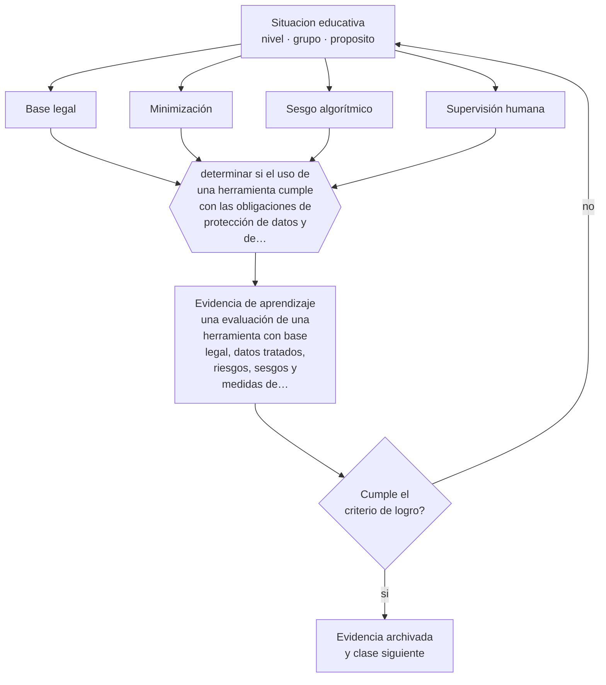

# Clase 167 — Ética, privacidad y sesgos

> **Parte 13 · Tecnología e IA educativa** — clase 11 de 12

**Estado de evidencia:** `MARCO-NORMATIVO` · **Etapa:** 🟣 Etapa C — Núcleo profesional docente · **Población de referencia:** transversal a niveles y modalidades 
**Decisión que habilita:** determinar si el uso de una herramienta cumple con las obligaciones de protección de datos y de trato justo 
**Evidencia de aprendizaje:** una evaluación de una herramienta con base legal, datos tratados, riesgos, sesgos y medidas de mitigación

## 🎯 Propósito

Aplicar criterios de ética, privacidad y sesgo al uso de tecnología educativa: base legal del tratamiento de datos, minimización, transparencia, supervisión humana y evaluación de impacto.

## 📚 Resultados de aprendizaje

Al finalizar esta clase podrás:

1. **Definir** con precisión los cuatro conceptos centrales de la clase y reconocerlos en una situación educativa real, no solo en su enunciado.
2. **Explicar** qué obligaciones concretas asume una institución cuando usa tecnología con datos de estudiantes.
3. **Decidir** —si el uso de una herramienta cumple con las obligaciones de protección de datos y de trato justo— y sostener la decisión con un fundamento escrito.
4. **Producir** la evidencia de la clase —una evaluación de una herramienta con base legal, datos tratados, riesgos, sesgos y medidas de mitigación— y contrastarla contra el criterio de logro.
5. **Distinguir** lo que la evidencia sostiene de lo que es práctica instalada, preferencia personal o costumbre de la institución.

## 🧭 Agenda sugerida (90 minutos)

| Minutos | Bloque | Qué ocurre |
|---:|---|---|
| 0–10 | Activación | Recuperar sin mirar la clase anterior y responder la pregunta de foco. |
| 10–25 | Conceptos | Definir los cuatro conceptos y reconocerlos en un caso real. |
| 25–45 | Modelo mental | Recorrer el método: delimitar el contexto y comprobar —no suponer— qué saben ya los estudiantes. |
| 45–70 | Ejemplo trabajado | Aplicar el método al caso de la parte, paso a paso y con evidencia. |
| 70–85 | Taller | Trasladar la decisión al contexto propio y anticipar su alternativa. |
| 85–90 | Cierre | Fijar responsable, plazo e indicador de la evidencia de aprendizaje. |

Fuera de la sesión, la clase exige aproximadamente **una hora y media** de práctica y de
producción de la evidencia. Si el tiempo se recorta, se recorta el ejemplo trabajado, nunca la
producción de evidencia: es la única parte que prueba el aprendizaje.

## 🧩 Conceptos centrales

| Concepto | Comprensión verificable |
|---|---|
| **Base legal** | fundamento jurídico que autoriza el tratamiento de datos personales |
| **Minimización** | principio de tratar solo los datos estrictamente necesarios para la finalidad declarada |
| **Sesgo algorítmico** | desempeño sistemáticamente distinto del sistema entre grupos de personas |
| **Supervisión humana** | exigencia de que una persona revise y pueda revertir decisiones que afectan a otras |

## 🧠 Modelo mental

El método de esta clase, en cinco pasos que se ejecutan en orden:

1. Delimitar el contexto y comprobar —no suponer— qué saben ya los estudiantes.
2. Clasificar la situación distinguiendo **Base legal** de **Minimización**.
3. Decidir con fundamento, usando **Sesgo algorítmico** como criterio y declarando la fuente.
4. Anticipar qué evidencia confirmaría la decisión y cuál la refutaría, con **Supervisión humana** a la vista.
5. Registrar lo ocurrido y contrastarlo contra el criterio de logro antes de avanzar.

Lo que hace profesional a este método no son los pasos sino la evidencia que exige en cada uno.
Estas son las señales observables con las que se comprueba, y que deben quedar definidas **antes**
de recogerlas:

| Señal observable | Cómo se recoge y qué significa |
|---|---|
| **Evidencia de partida** | qué sabían o podían hacer los estudiantes antes de la decisión, comprobado y no supuesto |
| **Evidencia de proceso** | qué se observó mientras la decisión se aplicaba, con fecha, contexto y responsable del registro |
| **Evidencia de logro** | qué muestra una evaluación de una herramienta con base legal, datos tratados, riesgos, sesgos y medidas de mitigación frente al criterio declarado de antemano |

**Frontera de aplicación.** El método vale mientras las condiciones que lo sostienen se cumplan.
El marco normativo varía por país y está en evolución: Cuando esa condición falla, el paso siguiente no es forzar el método:
es declarar el límite y decidir con menos certeza, dejándolo por escrito.

## 🗺️ Flujo de razonamiento

## 📖 Desarrollo

### 1. El fondo del asunto

Toda herramienta que procesa datos de estudiantes genera obligaciones: base legal para el tratamiento, información a los titulares, minimización, resguardo, plazos de conservación y, tratándose de menores, protecciones reforzadas. A eso se suma la exigencia ética de verificar que el sistema no funcione peor con determinados grupos, que es un fenómeno documentado y no una hipótesis.

### 2. Frontera conceptual: qué es y qué no es

Los cuatro conceptos de esta clase se confunden entre sí con facilidad, y esa confusión no es
inocua: produce decisiones que atacan el problema equivocado. **Base legal** no es lo
mismo que **Minimización** —principio de tratar solo los datos estrictamente necesarios para la finalidad declarada—, y tratarlos como sinónimos hace
que la intervención se dirija al lugar incorrecto. Del mismo modo, **Sesgo algorítmico** y
**Supervisión humana** describen aspectos distintos de la misma situación: el primero
desempeño sistemáticamente distinto del sistema entre grupos de personas, mientras el segundo exigencia de que una persona revise y pueda revertir decisiones que afectan a otras.

La prueba de que la distinción está entendida es operacional, no verbal: dos personas que
observan la misma clase deben poder clasificar el mismo episodio de la misma manera. Si no
coinciden, el problema está en la definición y no en el observador. El error de clasificación más
frecuente en esta materia es el primero de los que se listan más abajo, y conviene anticiparlo
antes de aplicar nada.

### 3. Cómo se observa y se mide

Nada de lo anterior sirve si no se puede observar. Estas son las señales que esta clase usa y
cómo se recogen:

- **Evidencia de partida.** Qué sabían o podían hacer los estudiantes antes de la decisión, comprobado y no supuesto. Se registra con fecha y contexto; sin eso, la señal no distingue una tendencia de una casualidad.
- **Evidencia de proceso.** Qué se observó mientras la decisión se aplicaba, con fecha, contexto y responsable del registro. Se registra con fecha y contexto; sin eso, la señal no distingue una tendencia de una casualidad.
- **Evidencia de logro.** Qué muestra una evaluación de una herramienta con base legal, datos tratados, riesgos, sesgos y medidas de mitigación frente al criterio declarado de antemano. Se registra con fecha y contexto; sin eso, la señal no distingue una tendencia de una casualidad.

Ninguna de estas señales es el aprendizaje: son indicios de él. Confundir el indicio con el
fenómeno es el error clásico de la medición educativa, y por eso cada señal se interpreta junto
con el contexto, el punto de partida del grupo y lo que el propio estudiante puede explicar sobre
su trabajo.

### 4. Cómo se traduce en decisiones de enseñanza

La evaluación de una herramienta debe responder por escrito: qué datos trata, con qué finalidad, con qué base legal, dónde se almacenan, quién accede, cuánto se conservan y qué ocurre si el proveedor cambia sus condiciones. Y para sistemas que clasifican o predicen, cómo se verificará su desempeño entre grupos y qué vía de impugnación existe.

### 5. Qué sostiene la evidencia y qué no

El marco normativo varía por país y está en evolución: en Chile, la normativa de protección de datos personales y su institucionalidad han cambiado, y en otros sistemas existen regulaciones específicas sobre IA. Toda afirmación normativa debe verificarse en su versión vigente antes de fundar una decisión institucional.

> **Cómo leer el estado de evidencia `MARCO-NORMATIVO`.** El contenido no se decide por evidencia empírica sino por norma, política pública o marco institucional vigente. Verifica siempre la versión vigente a la fecha en que vas a aplicarlo: la norma cambia y la clase no se actualiza sola.

### 6. Integración: de los conceptos a una decisión defendible

Una decisión es defendible cuando puede explicarse a alguien que no estuvo presente. Esta clase
te deja en condiciones de si el uso de una herramienta cumple con las obligaciones de protección de datos y de trato justo, y esa decisión se sostiene solo si
declara cuatro cosas: la evidencia que la funda, el supuesto que asume, el indicador que la
comprobaría y la condición que la haría cambiar.

Ese es también el criterio con el que se evalúa la evidencia de aprendizaje de la clase. Un
análisis que podría copiarse a otra clase, a otro curso o a otro establecimiento sin cambiar una
palabra no es una decisión: es una declaración general, y el oficio empieza justo donde las
declaraciones generales terminan.

## 📚 Lectura comparada

Las obras no cumplen el mismo papel. Esta tabla indica qué lente aporta cada una;
después de leer, escribe una discrepancia real entre al menos dos fuentes.

| Fuente | Lente que aporta | Pregunta crítica |
|---|---|---|
| UNESCO (2021). *Recomendación sobre la ética de la inteligencia artificial*. | principios éticos con desarrollo específico para educación. | ¿Qué supuesto de esta clase ayuda a poner a prueba? |
| Normativa chilena de protección de datos personales y orientaciones del Mineduc sobre uso de plataformas. | marco de obligaciones aplicables; verifica su versión vigente antes de decidir. | ¿Qué supuesto de esta clase ayuda a poner a prueba? |

La lectura se evalúa por **uso**, no por cantidad de páginas. Tu nota de lectura debe indicar qué
tesis modifica tu diagnóstico, qué evidencia del caso la tensiona y qué decisión concreta
cambiarías después del contraste. Una nota que solo resume el texto no cumple el criterio.

## 🧮 Ejemplo trabajado

**Situación.** El establecimiento compró licencias de una plataforma adaptativa para toda la básica. Nadie preguntó qué datos de los estudiantes trata, y el uso se concentró en los cursos que ya tenían mejores resultados.

**Paso 1 — Delimitar el contexto y comprobar —no suponer— qué saben ya los estudiantes.** El equipo escribe primero el supuesto asociado a **Base legal** y se prohíbe tratarlo como hecho. Contrasta ese supuesto con **Evidencia de partida** y anota qué parte del dato todavía no existe. Del paso sale un registro fechado y una frase explícita: «cambiaríamos de decisión si…».

**Paso 2 — Clasificar la situación distinguiendo Base legal de Minimización.** El trabajo aquí es separar lo observado de lo interpretado sobre **Minimización**. La evidencia que ordena la conversación es **Evidencia de proceso**; si su definición no está escrita, escribirla es parte del paso. Nada avanza mientras el equipo no acuerde qué contaría como refutación.

**Paso 3 — Decidir con fundamento, usando Sesgo algorítmico como criterio y declarando la fuente.** El riesgo de este paso es cerrar demasiado rápido alrededor de **Sesgo algorítmico**. Antes de concluir, se enumeran dos explicaciones alternativas del mismo patrón y se revisa si **Evidencia de logro** logra distinguirlas. Si no lo logra, hace falta otra evidencia y así debe quedar registrado.

**Paso 4 — Anticipar qué evidencia confirmaría la decisión y cuál la refutaría, con Supervisión humana a la vista.** Con **Supervisión humana** ya delimitado, la pregunta pasa a ser de consecuencia: qué cambia para los estudiantes, para el tiempo de clase y para la carga del equipo. **Evidencia de partida** entrega la lectura observable; el juicio profesional sigue siendo humano y debe quedar firmado por quien lo hace.

**Paso 5 — Registrar lo ocurrido y contrastarlo contra el criterio de logro antes de avanzar.** El cierre exige compromiso: responsable, fecha, indicador de logro y condición de detención. **Evidencia de proceso** se convierte en la señal de seguimiento, y se acuerda con qué frecuencia se revisa y quién puede declarar que no funcionó sin costo político.

**Síntesis.** La recomendación termina con responsable, fecha, evidencia de logro y señal de
detención. Omitir cualquiera de esas cuatro piezas convierte el análisis en una opinión que nadie
podrá auditar dentro de tres meses, y que por lo tanto nadie corregirá.

## 🔀 Comparación de caminos y límites

Ante la misma situación caben varios cursos de acción. La decisión profesional no es
elegir el «correcto», sino saber qué privilegia cada uno y qué arriesga.

| Camino | Qué privilegia | Cuándo elegirlo | Riesgo principal |
|---|---|---|---|
| Intervenir sobre **Base legal** | Fundamento jurídico que autoriza el tratamiento de datos personales | Cuando **Evidencia de partida** es observable y accionable dentro del plazo de la decisión. | Sobrerreaccionar a una señal parcial. |
| Intervenir sobre **Minimización** | Principio de tratar solo los datos estrictamente necesarios para la finalidad declarada | Cuando la primera explicación no distingue mecanismo ni responsable. | Convertir el concepto en etiqueta y no en intervención. |
| Observar antes de decidir | Reducir la incertidumbre antes de comprometer tiempo y credibilidad | Cuando la decisión es reversible y la evidencia disponible no distingue causas. | Observar indefinidamente y no decidir nunca. |
| Derivar o escalar | Poner la decisión donde están la competencia y la responsabilidad | Cuando hay normativa, resguardo de datos, salud o vulneración de derechos en juego. | Delegar hacia arriba lo que sí correspondía decidir en el aula. |

**Frontera de aplicación.** El marco normativo varía por país y está en evolución: Fuera de esa frontera, la comparación
anterior deja de ser válida y la decisión debe tomarse con evidencia distinta.

## 🪜 El mismo tema según el rol

La misma materia cambia de forma según quién decida. Al subir de nivel aumentan las
personas, el tiempo y las consecuencias que quedan dentro de la decisión.

| Nivel | Responsabilidad sobre ética, privacidad y sesgos |
|---|---|
| **Docente de aula** | Aplica, observa y registra la evidencia; declara qué no puede resolver desde su rol. |
| **Equipo de apoyo o educación diferencial** | Verifica que la decisión no deje fuera a quien más barreras enfrenta y aporta los apoyos. |
| **Jefatura técnico-pedagógica** | Convierte la decisión en criterio compartido, tiempo protegido y acompañamiento. |
| **Dirección** | Decide si esto cambia condiciones institucionales, recursos o el plan de mejora. |
| **Formación e investigación** | Pregunta si la decisión es generalizable, con qué evidencia y qué haría falta para probarlo. |

Si trabajas en uno de esos niveles, la [guía de carrera de tu rol](../../../rutas/README.md)
indica en qué orden conviene recorrer el programa y qué artefactos acreditan tu competencia.

## 🧪 Taller guiado

Aplica la clase a **uno** de los contextos siguientes y repite después el ejercicio en un
contexto de exigencia distinta. Cambiar de contexto es parte del aprendizaje: lo que funciona
con un grupo no se traslada intacto a otro.

| Contexto | Rasgo que cambia la decisión |
|---|---|
| Aula con conectividad limitada | la solución debe funcionar sin ancho de banda |
| Modalidad híbrida | la equivalencia de experiencia es el problema real |
| Curso con evaluación escrita fuerte | la IA obliga a rediseñar la evidencia de logro |
| Formación de adultos en línea | autonomía alta y riesgo de deserción |
| Institución con datos sensibles | la protección de datos precede a la funcionalidad |
| Estudiantes menores de edad | consentimiento, resguardo y supervisión reforzados |

**Secuencia de trabajo:**

1. Delimita el contexto: nivel, edad, tamaño del grupo, asignatura o experiencia y tiempo real disponible.
2. Declara qué saben ya los estudiantes y **cómo lo comprobaste**, no cómo lo supones.
3. Formula la decisión pedagógica que esta clase habilita y escribe su fundamento.
4. Anticipa qué observarías si la decisión funciona y qué observarías si no funciona.
5. Diseña de antemano la alternativa que aplicarás si la primera estrategia falla.
6. Ejecuta o simula, y registra lo observado con fecha, contexto y evidencia concreta.
7. Produce la evidencia de aprendizaje de la clase.
8. Contrástala contra el criterio de logro, corrige y recién entonces avanza.

## 🏫 Caso profesional

**Situación.** El establecimiento compró licencias de una plataforma adaptativa para toda la básica. Nadie preguntó qué datos de los estudiantes trata, y el uso se concentró en los cursos que ya tenían mejores resultados.

Entrega un **informe de decisión** de una página que contenga:

1. **Hechos y fuentes** — qué está documentado y con qué evidencia, separado de lo que se supone.
2. **Hipótesis** — la explicación más probable y una alternativa que también encajaría.
3. **Dos opciones defendibles** — no una recomendación y un espantapájaros.
4. **Efecto esperado** — sobre los estudiantes, el tiempo de clase, el equipo y los apoyos.
5. **Recomendación** — con su fundamento y la fuente que la respalda.
6. **Condición de revisión** — qué resultado te haría cambiar de decisión.
7. **Responsable y fecha** — quién ejecuta y cuándo se revisa.

Usa al menos **dos** fuentes de la lectura comparada para desafiar tu primera respuesta. Una
recomendación que ninguna fuente pone en duda casi siempre está poco examinada.

## 📥 Evidencia de aprendizaje

Una evaluación de una herramienta con base legal, datos tratados, riesgos, sesgos y medidas de mitigación.

Guárdala en `evidence/P13-C167-etica-privacidad-y-sesgos/` con estos archivos:

| Archivo | Qué contiene |
|---|---|
| `decision.md` | contexto, decisión, fundamento, fuentes con fecha, indicador de logro y riesgos |
| `senales.md` | definición operacional de las tres señales, cómo se recogieron y qué no distinguen |
| `nota-de-lectura.md` | dos fuentes contrastadas, con edición y páginas consultadas |
| `revision-critica.md` | la objeción más fuerte a tu decisión y qué evidencia la invalidaría |

Esta evidencia alimenta el artefacto de la parte: **tutor o asistente con IA documentado, con corpus verificado, resguardo de datos, límites declarados y plan de evaluación**.

## 🏆 Reto verificable

Evalúa una herramienta que ya usas con estos criterios. Documenta los incumplimientos y propón su corrección o su reemplazo.

## ✅ Evaluación de la clase

| Criterio | Peso | Evidencia esperada |
|---|---:|---|
| Precisión conceptual | 25 % | Distinciones correctas y observables entre los cuatro conceptos, aplicadas a un caso real. |
| Diagnóstico y evidencia | 30 % | Conocimiento previo comprobado, evidencia recogida con fecha y contexto, y límites del dato declarados. |
| Decisión y alternativas | 30 % | Decisión fundada, alternativa prevista si falla, y condición explícita que la haría cambiar. |
| Responsabilidad y comunicación | 15 % | Diversidad y resguardos considerados, fuentes citadas y evidencia archivada de forma reproducible. |

**Aprobación:** 80 de 100 y ningún criterio bajo el 60 %. Una respuesta que podría copiarse sin
cambios a otra clase, a otro curso o a otro establecimiento se considera insuficiente, aunque
esté bien escrita.

**Criterio de logro de la evidencia:**

- [ ] la evaluación declara datos tratados, base legal, resguardo y plazo de conservación;
- [ ] incluye verificación de desempeño por grupo y vía de impugnación para decisiones automatizadas;
- [ ] cada afirmación sobre «lo que funciona» está atribuida a una fuente identificable, con autor y fecha;
- [ ] la decisión es ejecutable con el tiempo, el espacio, el número de estudiantes y los recursos que realmente tienes;
- [ ] la evidencia queda archivada de forma reproducible: otra persona podría revisarla sin que tú se la expliques.

## ⚠️ Errores frecuentes

**Propios de esta clase:**

- Adoptar una herramienta sin verificar qué datos trata ni dónde se almacenan.
- Usar sistemas que clasifican estudiantes sin comprobar su desempeño entre grupos ni ofrecer impugnación.

**Característicos de la parte 13:**

- Adoptar una herramienta por novedad y buscar después el objetivo que justifica su uso.
- Tratar la salida de un modelo de lenguaje como información verificada.

Los cuatro comparten estructura: un síntoma visible, una causa que no se ve y una corrección que
casi siempre es de diseño y no de esfuerzo. Antes de atribuir el problema a los estudiantes o a
ti, comprueba cuál de ellos está operando y qué evidencia lo distinguiría de los otros tres.

## ♿ Diversidad, accesibilidad y ética

Los sistemas con peor desempeño en variedades lingüísticas minorizadas o con estudiantes poco representados en los datos producen exclusión técnica. Verificarlo antes de adoptar es parte del deber profesional, no una consideración adicional.

Antes de aplicar cualquier decisión de esta clase con estudiantes reales, revisa el
[protocolo de práctica responsable](../../../docs/ETICA_Y_PRACTICA_RESPONSABLE.md):
consentimiento, resguardo de datos personales, proporcionalidad de la intervención y derecho
de cada estudiante a no ser objeto de un ensayo que no le reporta beneficio.

## 🇨🇱 Contexto chileno y cumplimiento

Riesgo característico de esta parte: **Adoptar una herramienta por novedad y buscar después el objetivo que justifica su uso.** Antes de aplicar
cualquier decisión de esta clase en un establecimiento real, verifica el marco vigente:

- Marco institucional y normativo: [`docs/MARCO_CHILE.md`](../../../docs/MARCO_CHILE.md).
- Inclusión y apoyos: [`docs/INCLUSION_Y_DUA.md`](../../../docs/INCLUSION_Y_DUA.md).
- Datos personales, IA y resguardos: [`docs/IA_EN_EDUCACION.md`](../../../docs/IA_EN_EDUCACION.md).
- Fuentes oficiales con cómo leerlas: [`docs/FUENTES.md`](../../../docs/FUENTES.md).

La regla del programa es simple: **la fuente oficial manda sobre el material pedagógico**. Si la
norma cambió después de la fecha de esta clase, gana la norma.

## ❓ Preguntas de comprobación

1. ¿Qué datos de tus estudiantes salen de la institución al usar esta herramienta?
2. ¿Con qué base legal los tratas y quién lo informó a las familias?
3. ¿Funciona igual de bien este sistema con todos tus estudiantes?

## 📗 Fuentes y verificación

- UNESCO (2021). *Recomendación sobre la ética de la inteligencia artificial*. **Uso en esta clase:** principios éticos con desarrollo específico para educación. Lectura selectiva: índice y capítulos pertinentes; registra edición y páginas consultadas.
- Normativa chilena de protección de datos personales y orientaciones del Mineduc sobre uso de plataformas. **Uso en esta clase:** marco de obligaciones aplicables; verifica su versión vigente antes de decidir. Lectura selectiva: índice y capítulos pertinentes; registra edición y páginas consultadas.

Catálogo completo: [bibliografía del programa](../../../docs/BIBLIOGRAFIA.md) ·
[glosario](../../../docs/GLOSARIO.md) ·
[fuentes oficiales y cómo leerlas](../../../docs/FUENTES.md).

> **Regla de fuentes.** Las obras anteriores estructuran las perspectivas de esta materia.
> Cualquier norma, decreto, orientación ministerial o política institucional mencionada debe
> comprobarse en su fuente primaria vigente antes de usarse con estudiantes reales. El desarrollo
> de esta clase es original y no reproduce capítulos protegidos por derechos de autor.

## 🔗 Conexión con el resto del programa

Rige el uso de todas las clases de la parte 13 y se apoya en la clase 004.

> [!IMPORTANT]
> Material de formación profesional. No reemplaza un título de pedagogía, una habilitación
> legal para ejercer, ni el juicio de un equipo educativo que conoce a sus estudiantes.

---

| Anterior | Índice | Siguiente |
|---|---|---|
| [← 166 · Agentes educativos](../class-10-agentes-educativos/README.md) | [Parte 13](../README.md) · [Programa](../../../README.md) | [168 · Proyecto integrador: tutor IA responsable →](../class-12-proyecto-integrador-tutor-ia-responsable/README.md) |
