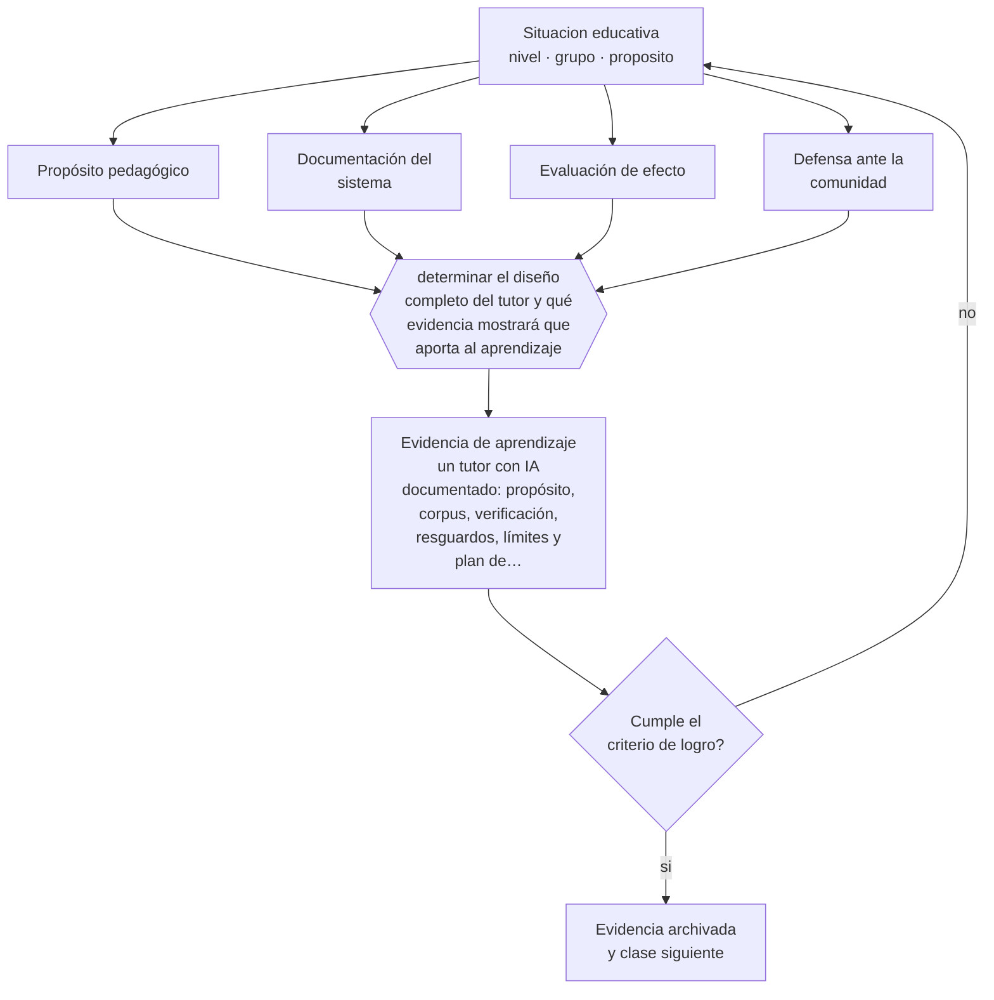

# Clase 168 — Proyecto integrador: tutor IA responsable

> **Parte 13 · Tecnología e IA educativa** — clase 12 de 12

**Estado de evidencia:** `EMERGENTE` · **Etapa:** 🟣 Etapa C — Núcleo profesional docente · **Población de referencia:** transversal a niveles y modalidades 
**Decisión que habilita:** determinar el diseño completo del tutor y qué evidencia mostrará que aporta al aprendizaje 
**Evidencia de aprendizaje:** un tutor con IA documentado: propósito, corpus, verificación, resguardos, límites y plan de evaluación

## 🎯 Propósito

Integrar la parte construyendo un tutor o asistente educativo con IA responsable: propósito pedagógico, corpus verificado, protocolo de verificación, resguardo de datos y evaluación de su efecto.

## 📚 Resultados de aprendizaje

Al finalizar esta clase podrás:

1. **Definir** con precisión los cuatro conceptos centrales de la clase y reconocerlos en una situación educativa real, no solo en su enunciado.
2. **Explicar** cómo se construye y se prueba un tutor con IA que puedas defender ante tu comunidad educativa.
3. **Decidir** —el diseño completo del tutor y qué evidencia mostrará que aporta al aprendizaje— y sostener la decisión con un fundamento escrito.
4. **Producir** la evidencia de la clase —un tutor con IA documentado: propósito, corpus, verificación, resguardos, límites y plan de evaluación— y contrastarla contra el criterio de logro.
5. **Distinguir** lo que la evidencia sostiene de lo que es práctica instalada, preferencia personal o costumbre de la institución.

## 🧩 Conceptos centrales

| Concepto | Comprensión verificable |
|---|---|
| **Propósito pedagógico** | aprendizaje concreto que el tutor apoya; condición previa a cualquier decisión técnica |
| **Documentación del sistema** | registro de fuentes, límites, verificación y responsables |
| **Evaluación de efecto** | comprobación de si el tutor mejora el aprendizaje y no solo la satisfacción |
| **Defensa ante la comunidad** | capacidad de explicar a estudiantes y familias qué hace el sistema y con qué resguardos |

## 🗺️ Flujo de razonamiento

## 📖 Desarrollo

### 1. El fondo del asunto

El proyecto integrador exige articular lo pedagógico, lo técnico y lo ético. Un tutor defendible declara qué aprendizaje apoya, con qué fuentes responde, cómo se verificó, qué datos trata y qué no puede hacer. La prueba práctica es poder presentarlo a una comunidad educativa exigente y responder sus preguntas sin recurrir a promesas.

### 2. Cómo se traduce en decisiones de enseñanza

El desarrollo sigue el orden inverso al habitual: primero el propósito pedagógico y la evidencia de efecto que se buscará, después el diseño técnico. Se prueba con un conjunto de preguntas conocidas, se declara lo que no cubre, se resguardan los datos y se evalúa con estudiantes reales antes de escalar el uso.

### 3. Qué sostiene la evidencia y qué no

La evidencia sobre efectos de tutores con IA en el aprendizaje es incipiente: los estudios disponibles son de corto plazo y con medidas variadas. Un proyecto honesto declara que su evaluación produce evidencia local sobre su propio uso, y no una demostración general de eficacia.

> **Cómo leer el estado de evidencia `EMERGENTE`.** El cuerpo de estudios es reciente, escaso o poco replicado. Úsala como hipótesis de trabajo con seguimiento explícito, nunca como argumento de autoridad ni como base para una política de establecimiento.

## 🧪 Taller guiado

Aplica la clase a **uno** de los contextos siguientes y repite después el ejercicio en un
contexto de exigencia distinta. Cambiar de contexto es parte del aprendizaje: lo que funciona
con un grupo no se traslada intacto a otro.

| Contexto | Rasgo que cambia la decisión |
|---|---|
| Aula con conectividad limitada | la solución debe funcionar sin ancho de banda |
| Modalidad híbrida | la equivalencia de experiencia es el problema real |
| Curso con evaluación escrita fuerte | la IA obliga a rediseñar la evidencia de logro |
| Formación de adultos en línea | autonomía alta y riesgo de deserción |
| Institución con datos sensibles | la protección de datos precede a la funcionalidad |
| Estudiantes menores de edad | consentimiento, resguardo y supervisión reforzados |

**Secuencia de trabajo:**

1. Delimita el contexto: nivel, edad, tamaño del grupo, asignatura o experiencia y tiempo real disponible.
2. Declara qué saben ya los estudiantes y **cómo lo comprobaste**, no cómo lo supones.
3. Formula la decisión pedagógica que esta clase habilita y escribe su fundamento.
4. Anticipa qué observarías si la decisión funciona y qué observarías si no funciona.
5. Diseña de antemano la alternativa que aplicarás si la primera estrategia falla.
6. Ejecuta o simula, y registra lo observado con fecha, contexto y evidencia concreta.
7. Produce la evidencia de aprendizaje de la clase.
8. Contrástala contra el criterio de logro, corrige y recién entonces avanza.

### 📦 Evidencia de aprendizaje

Un tutor con IA documentado: propósito, corpus, verificación, resguardos, límites y plan de evaluación.

Debe incluir contexto, decisión, fundamento, fuentes consultadas con su fecha, indicador de
logro observable, riesgos previstos y qué harías distinto en la siguiente iteración.

## 🏆 Reto verificable

Construye el tutor, pruébalo con un grupo real y evalúa su efecto sobre un aprendizaje concreto. Presenta el resultado con sus límites a tu equipo.

## ✅ Criterio de logro

- [ ] el sistema documenta propósito, corpus, verificación, resguardos y límites;
- [ ] el plan de evaluación mide aprendizaje y declara qué puede y qué no puede concluir;
- [ ] cada afirmación sobre «lo que funciona» está atribuida a una fuente identificable, con autor y fecha;
- [ ] la decisión es ejecutable con el tiempo, el espacio, el número de estudiantes y los recursos que realmente tienes;
- [ ] la evidencia queda archivada de forma reproducible: otra persona podría revisarla sin que tú se la expliques.

## ⚠️ Errores frecuentes

**Propios de esta clase:**

- Construir el sistema primero y buscar después qué aprendizaje apoya.
- Evaluar el tutor por satisfacción de los usuarios y no por aprendizaje verificado.

**Característicos de la parte 13:**

- Adoptar una herramienta por novedad y buscar después el objetivo que justifica su uso.
- Tratar la salida de un modelo de lenguaje como información verificada.

## ♿ Diversidad, accesibilidad y ética

El tutor debe funcionar con dispositivos y conexiones modestas, ser accesible con lectores de pantalla y no penalizar variedades lingüísticas. Si no cumple eso, beneficia a quienes ya tenían ventaja.

Antes de aplicar cualquier decisión de esta clase con estudiantes reales, revisa el
[protocolo de práctica responsable](../../../docs/ETICA_Y_PRACTICA_RESPONSABLE.md):
consentimiento, resguardo de datos personales, proporcionalidad de la intervención y derecho
de cada estudiante a no ser objeto de un ensayo que no le reporta beneficio.

## ❓ Preguntas de comprobación

1. ¿Qué aprendizaje concreto apoya tu tutor, y cómo lo comprobarás?
2. ¿Qué le responderías a una familia que pregunta qué datos recoge?
3. ¿Qué hace tu tutor que un buen material bien diseñado no haría?

## 📕 Lecturas base

**UNESCO (2023). *Guidance for Generative AI in Education and Research*.**  
*Qué aporta a esta clase:* criterios para el despliegue institucional responsable de sistemas con IA.

**VanLehn, K. (2011). *The Relative Effectiveness of Human Tutoring, Intelligent Tutoring Systems*.**  
*Qué aporta a esta clase:* referencia para calibrar expectativas de efecto y diseñar la evaluación.

Catálogo completo: [bibliografía del programa](../../../docs/BIBLIOGRAFIA.md) ·
[glosario](../../../docs/GLOSARIO.md) ·
[fuentes oficiales y cómo leerlas](../../../docs/FUENTES.md).

## 🔗 Conexión con el resto del programa

Cierra la parte 13 integrando sus once clases previas y aplica los criterios de las partes 11 y 16.

> [!IMPORTANT]
> Material de formación profesional. No reemplaza un título de pedagogía, una habilitación
> legal para ejercer, ni el juicio de un equipo educativo que conoce a sus estudiantes.

---

| Anterior | Índice | Siguiente |
|---|---|---|
| [← 167 · Ética, privacidad y sesgos](../class-11-etica-privacidad-y-sesgos/README.md) | [Parte 13](../README.md) · [Programa](../../../README.md) | [Programa completo →](../../../README.md) |
