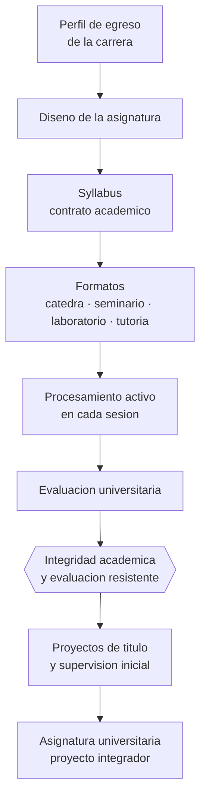

# Parte 14 — Docencia universitaria

> *Dominar la disciplina no basta: enseñarla es otra disciplina*

🟠 **Etapa D — Educación superior y liderazgo** · salida de la etapa: sostener la calidad del trabajo de otros, no solo del propio

**Clases:** 12 (169–180) · **Población de referencia:** pregrado y postgrado universitario y técnico superior · **Conceptos con definición operacional:** 48 
**Contenido central:** Aprendizaje en educación superior, diseño de asignaturas, syllabus, clase magistral, seminarios, laboratorios, tutorías, evaluación, integridad académica, proyectos de título y supervisión inicial

## 🎯 De qué trata esta parte

La docencia universitaria arrastra un supuesto que la evidencia desmiente: que quien sabe mucho de una disciplina enseña bien esa disciplina. La experiencia del especialista incluso estorba, porque su conocimiento está tan automatizado que olvida los pasos que el novato necesita. Ese fenómeno tiene nombre —el punto ciego del experto— y explica buena parte de las clases universitarias que son impecables en contenido e ininteligibles para quien aprende.

La segunda cuestión es la clase magistral. La evidencia no dice que sea inútil: dice que, comparada con métodos que exigen participación activa, produce menos aprendizaje y más reprobación en cursos de ciencias e ingeniería. Una síntesis muy citada de estudios en educación superior mostró exactamente eso. La conclusión operativa no es eliminar la exposición, sino intercalarla con actividades que obliguen a procesar, porque el problema no es hablar: es hablar cuarenta minutos sin que nadie tenga que hacer nada.

El tercer eje es institucional. En educación superior la calidad se juega también en el diseño de la asignatura dentro de un plan de estudios, en la coherencia con el perfil de egreso, en la carga académica real del estudiante y en los procesos de acreditación. Un buen profesor universitario sabe enseñar y además sabe justificar por escrito por qué su asignatura está diseñada así, que es lo que le pedirán en cualquier proceso de evaluación.

## 📚 Resultados de la parte

Al terminar esta parte podrás:

1. **Diseñar una asignatura universitaria completa con syllabus, carga y evaluación coherentes**.
2. **Transformar una exposición en una secuencia con procesamiento activo verificable**.
3. **Conducir seminarios, laboratorios y tutorías con criterios explícitos de calidad**.
4. **Sostener la integridad académica con reglas claras y evaluación resistente**.

## 🗺️ Mapa de la parte

## 🧠 Marco de referencia

- aprendizaje en educación superior y enfoques profundo y superficial
- evidencia sobre métodos activos frente a exposición continua
- evaluación para el aprendizaje y retroalimentación sostenible en cursos numerosos
- aseguramiento de la calidad y acreditación en educación superior chilena

**Autoras y autores que conviene conocer:** John Biggs y Catherine Tang, Paul Ramsden, Scott Freeman y colaboradores, David Boud, Ference Marton y Roger Säljö, especialistas de la Comisión Nacional de Acreditación

## 📋 Las 12 clases

| # | Clase | Decisión que habilita | Evidencia |
|---:|---|---|---|
| 169 | [Aprendizaje en educación superior](class-01-aprendizaje-en-educacion-superior/README.md) | determinar qué decisión tuya está empujando a tus estudiantes hacia el enfoque superficial | `CONSISTENTE` |
| 170 | [Diseño de asignaturas](class-02-diseno-de-asignaturas/README.md) | determinar qué aporta tu asignatura al perfil de egreso y qué se puede sacrificar de su temario | `CONSISTENTE` |
| 171 | [Syllabus universitario](class-03-syllabus-universitario/README.md) | determinar qué información necesita el estudiante para organizarse y tomar decisiones sobre tu curso | `PRACTICA-PROFESIONAL` |
| 172 | [Clase magistral efectiva](class-04-clase-magistral-efectiva/README.md) | determinar dónde intercalarás procesamiento activo en tu clase y cómo verificarás su efecto | `ROBUSTA` |
| 173 | [Seminarios](class-05-seminarios/README.md) | determinar qué preparación exigirás y cómo asegurarás que la discusión trabaje sobre el texto | `PRACTICA-PROFESIONAL` |
| 174 | [Laboratorios](class-06-laboratorios/README.md) | determinar qué debe decidir el estudiante en tu laboratorio para que aprenda algo más que el procedimiento | `CONSISTENTE` |
| 175 | [Tutorías y ayudantías](class-07-tutorias-y-ayudantias/README.md) | determinar cómo formarás a tus ayudantes para que no resuelvan el problema en lugar del estudiante | `ROBUSTA` |
| 176 | [Evaluación universitaria](class-08-evaluacion-universitaria/README.md) | determinar cómo distribuir la evaluación para que informe el aprendizaje sin volverse insostenible | `CONSISTENTE` |
| 177 | [Integridad académica](class-09-integridad-academica/README.md) | determinar qué evaluaciones de tu asignatura son insostenibles y con qué las reemplazas | `EN-DEBATE` |
| 178 | [Proyectos de título](class-10-proyectos-de-titulo/README.md) | determinar los hitos y criterios que harán posible detectar a tiempo un proyecto que se está atrasando | `PRACTICA-PROFESIONAL` |
| 179 | [Supervisión inicial de investigación](class-11-supervision-inicial-de-investigacion/README.md) | determinar qué acuerdos de supervisión establecerás y cómo traspasarás autonomía progresivamente | `PRACTICA-PROFESIONAL` |
| 180 | [Proyecto integrador: asignatura universitaria](class-12-proyecto-integrador-asignatura-universitaria/README.md) | determinar el diseño completo de la asignatura y qué evidencia mostrará que produjo aprendizaje | `CONSISTENTE` |

## ⚠️ Riesgos característicos

- Suponer que el dominio disciplinar se traduce solo en buena enseñanza.
- Diseñar la carga del estudiante sin calcular el tiempo real que exige.
- Evaluar únicamente con pruebas finales de alto peso.
- Responder a la IA generativa con prohibiciones que no se pueden verificar.

## 📕 Lecturas de referencia de la parte

- **Biggs, J. & Tang, C. (2011). *Teaching for Quality Learning at University*.** — el manual de referencia para diseñar asignaturas con alineamiento constructivo.
- **Freeman, S. et al. (2014). *Active Learning Increases Student Performance in Science, Engineering, and Mathematics*. PNAS, 111(23).** — metaanálisis con 225 estudios; el resultado que más ha cambiado la discusión sobre la cátedra.
- **Ramsden, P. (2003). *Learning to Teach in Higher Education*.** — conecta la investigación sobre enfoques de aprendizaje con decisiones concretas de docencia.
- **Boud, D. & Molloy, E. (2013). *Rethinking Models of Feedback for Learning*. Assessment & Evaluation in Higher Education, 38(6).** — propone retroalimentación como proceso que el estudiante debe poder usar, no como comentario entregado.

## ✅ Evidencia mínima para dar la parte por cerrada

- [ ] un syllabus completo con carga académica calculada y justificada;
- [ ] el rediseño de una cátedra con procesamiento activo y su evaluación;
- [ ] un protocolo de tutoría y de supervisión de proyectos de título;
- [ ] una política de integridad académica aplicable y verificable.

---

| Anterior | Índice | Siguiente |
|---|---|---|
| [← Parte 13 · Tecnología e IA educativa](../part-13-tecnologia-e-ia-educativa/README.md) | [Programa](../../README.md) · [Currículo](../../CURRICULUM.md) | [Parte 15 · Gestión y liderazgo educativo →](../part-15-gestion-y-liderazgo-educativo/README.md) |
