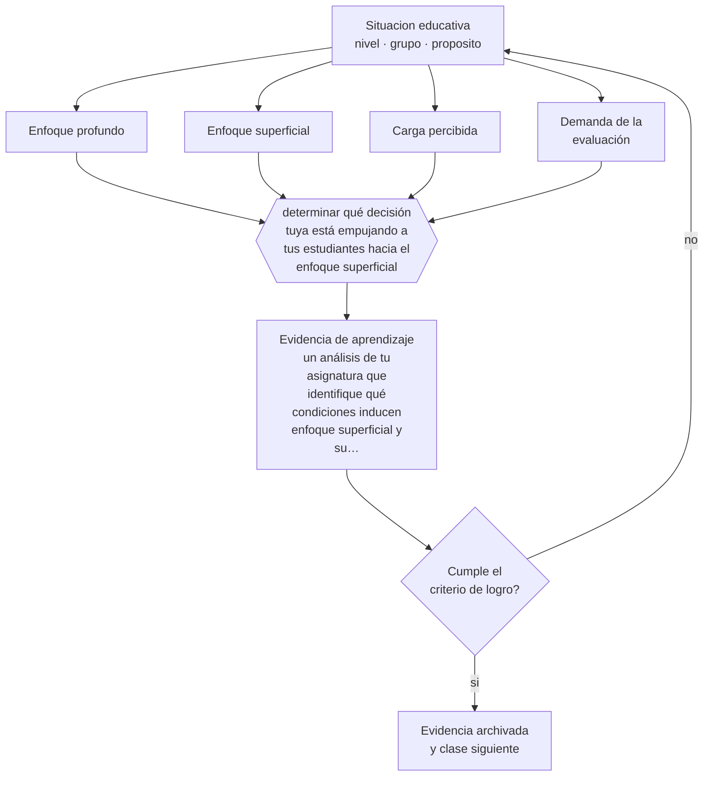

# Clase 169 — Aprendizaje en educación superior

> **Parte 14 · Docencia universitaria** — clase 1 de 12

**Estado de evidencia:** `CONSISTENTE` · **Etapa:** 🟠 Etapa D — Educación superior y liderazgo · **Población de referencia:** pregrado y postgrado universitario y técnico superior 
**Decisión que habilita:** determinar qué decisión tuya está empujando a tus estudiantes hacia el enfoque superficial 
**Evidencia de aprendizaje:** un análisis de tu asignatura que identifique qué condiciones inducen enfoque superficial y su corrección

## 🎯 Propósito

Comprender cómo se aprende en educación superior: enfoques profundo y superficial, su relación con la carga y la evaluación, y qué decisiones docentes empujan hacia uno u otro.

## 📚 Resultados de aprendizaje

Al finalizar esta clase podrás:

1. **Definir** con precisión los cuatro conceptos centrales de la clase y reconocerlos en una situación educativa real, no solo en su enunciado.
2. **Explicar** por qué el mismo estudiante estudia en profundidad una asignatura y memoriza otra.
3. **Decidir** —qué decisión tuya está empujando a tus estudiantes hacia el enfoque superficial— y sostener la decisión con un fundamento escrito.
4. **Producir** la evidencia de la clase —un análisis de tu asignatura que identifique qué condiciones inducen enfoque superficial y su corrección— y contrastarla contra el criterio de logro.
5. **Distinguir** lo que la evidencia sostiene de lo que es práctica instalada, preferencia personal o costumbre de la institución.

## 🧩 Conceptos centrales

| Concepto | Comprensión verificable |
|---|---|
| **Enfoque profundo** | intención de comprender, relacionar y aplicar; se asocia con mejores resultados de largo plazo |
| **Enfoque superficial** | intención de cumplir con el mínimo evaluado; es una respuesta racional a ciertas condiciones |
| **Carga percibida** | estimación del estudiante sobre el trabajo exigido; condiciona la estrategia que adopta |
| **Demanda de la evaluación** | nivel cognitivo que la evaluación exige realmente, más allá del declarado |

## 🗺️ Flujo de razonamiento

## 📖 Desarrollo

### 1. El fondo del asunto

El enfoque de estudio no es un rasgo del estudiante sino una respuesta a las condiciones del curso. Carga excesiva, evaluaciones que premian la reproducción y ausencia de retroalimentación empujan hacia el enfoque superficial, incluso a estudiantes capaces de trabajo profundo. Esa es la conclusión práctica más útil de la investigación sobre aprendizaje en educación superior: se diseña el enfoque, no se exige.

### 2. Cómo se traduce en decisiones de enseñanza

El análisis identifica las condiciones concretas: cuántas páginas por semana, cuántas evaluaciones simultáneas, qué exige realmente la prueba, cuándo llega la retroalimentación. Corregir una o dos suele bastar para cambiar la estrategia de estudio del grupo, y produce más efecto que cualquier exhortación a estudiar mejor.

### 3. Qué sostiene la evidencia y qué no

La distinción entre enfoques es una herramienta descriptiva y no una tipología de personas: el mismo estudiante varía entre asignaturas y a lo largo del semestre. Y los instrumentos que la miden son autorreportes, con sus limitaciones. Úsala para revisar el diseño, no para clasificar estudiantes.

> **Cómo leer el estado de evidencia `CONSISTENTE`.** La evidencia es amplia y coherente, pero proviene sobre todo de estudios correlacionales, de síntesis con heterogeneidad alta o de contextos distintos al tuyo. Sirve para orientar la decisión y exige que compruebes el efecto en tu propio grupo.

## 🧪 Taller guiado

Aplica la clase a **uno** de los contextos siguientes y repite después el ejercicio en un
contexto de exigencia distinta. Cambiar de contexto es parte del aprendizaje: lo que funciona
con un grupo no se traslada intacto a otro.

| Contexto | Rasgo que cambia la decisión |
|---|---|
| Curso masivo de primer año | heterogeneidad alta y riesgo de deserción temprana |
| Asignatura de especialidad con pocos estudiantes | el seminario es el formato natural |
| Laboratorio o clínica | el desempeño supervisado es la evidencia |
| Postgrado profesional | estudiantes que trabajan y exigen aplicabilidad |
| Asignatura en línea o híbrida | la evaluación debe rediseñarse por completo |
| Dirección de tesis o proyecto de título | la relación de supervisión es el método |

**Secuencia de trabajo:**

1. Delimita el contexto: nivel, edad, tamaño del grupo, asignatura o experiencia y tiempo real disponible.
2. Declara qué saben ya los estudiantes y **cómo lo comprobaste**, no cómo lo supones.
3. Formula la decisión pedagógica que esta clase habilita y escribe su fundamento.
4. Anticipa qué observarías si la decisión funciona y qué observarías si no funciona.
5. Diseña de antemano la alternativa que aplicarás si la primera estrategia falla.
6. Ejecuta o simula, y registra lo observado con fecha, contexto y evidencia concreta.
7. Produce la evidencia de aprendizaje de la clase.
8. Contrástala contra el criterio de logro, corrige y recién entonces avanza.

### 📦 Evidencia de aprendizaje

Un análisis de tu asignatura que identifique qué condiciones inducen enfoque superficial y su corrección.

Debe incluir contexto, decisión, fundamento, fuentes consultadas con su fecha, indicador de
logro observable, riesgos previstos y qué harías distinto en la siguiente iteración.

## 🏆 Reto verificable

Calcula la carga real de tu asignatura y analiza qué nivel cognitivo exige tu evaluación. Corrige una de las dos y observa el cambio en las entregas.

## ✅ Criterio de logro

- [ ] el análisis identifica condiciones concretas del curso y no características de los estudiantes;
- [ ] propone una corrección verificable en carga, evaluación o retroalimentación;
- [ ] cada afirmación sobre «lo que funciona» está atribuida a una fuente identificable, con autor y fecha;
- [ ] la decisión es ejecutable con el tiempo, el espacio, el número de estudiantes y los recursos que realmente tienes;
- [ ] la evidencia queda archivada de forma reproducible: otra persona podría revisarla sin que tú se la expliques.

## ⚠️ Errores frecuentes

**Propios de esta clase:**

- Atribuir el estudio memorístico a la actitud del estudiante sin revisar qué premia la evaluación.
- Aumentar la cantidad de contenido y esperar mayor profundidad.

**Característicos de la parte 14:**

- Suponer que el dominio disciplinar se traduce solo en buena enseñanza.
- Diseñar la carga del estudiante sin calcular el tiempo real que exige.

## ♿ Diversidad, accesibilidad y ética

Los estudiantes que trabajan, cuidan a otros o vienen con menor preparación previa son los primeros forzados al enfoque superficial por restricción de tiempo. Ajustar la carga real es una medida de equidad además de pedagógica.

Antes de aplicar cualquier decisión de esta clase con estudiantes reales, revisa el
[protocolo de práctica responsable](../../../docs/ETICA_Y_PRACTICA_RESPONSABLE.md):
consentimiento, resguardo de datos personales, proporcionalidad de la intervención y derecho
de cada estudiante a no ser objeto de un ensayo que no le reporta beneficio.

## ❓ Preguntas de comprobación

1. ¿Qué obtiene mejor nota en tu curso: comprender o reproducir?
2. ¿Cuántas horas semanales exige realmente tu asignatura?
3. ¿Cuándo llega tu retroalimentación en relación con la siguiente entrega?

## 📕 Lecturas base

**Marton, F. & Säljö, R. (1976). *On Qualitative Differences in Learning*.**  
*Qué aporta a esta clase:* el estudio que introduce la distinción entre enfoque profundo y superficial.

**Ramsden, P. (2003). *Learning to Teach in Higher Education*.**  
*Qué aporta a esta clase:* conecta la investigación sobre enfoques con decisiones concretas de diseño docente.

Catálogo completo: [bibliografía del programa](../../../docs/BIBLIOGRAFIA.md) ·
[glosario](../../../docs/GLOSARIO.md) ·
[fuentes oficiales y cómo leerlas](../../../docs/FUENTES.md).

## 🔗 Conexión con el resto del programa

Abre la parte 14 y se apoya en las clases 117 y 118.

> [!IMPORTANT]
> Material de formación profesional. No reemplaza un título de pedagogía, una habilitación
> legal para ejercer, ni el juicio de un equipo educativo que conoce a sus estudiantes.

---

| Anterior | Índice | Siguiente |
|---|---|---|
| [← Parte 14](../README.md) | [Parte 14](../README.md) · [Programa](../../../README.md) | [170 · Diseño de asignaturas →](../class-02-diseno-de-asignaturas/README.md) |
