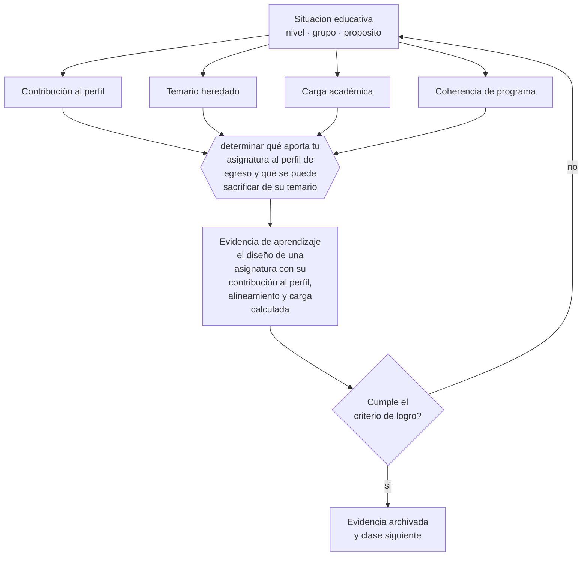

# Clase 170 — Diseño de asignaturas

> **Parte 14 · Docencia universitaria** — clase 2 de 12

**Estado de evidencia:** `CONSISTENTE` · **Etapa:** 🟠 Etapa D — Educación superior y liderazgo · **Población de referencia:** pregrado y postgrado universitario y técnico superior 
**Decisión que habilita:** determinar qué aporta tu asignatura al perfil de egreso y qué se puede sacrificar de su temario 
**Evidencia de aprendizaje:** el diseño de una asignatura con su contribución al perfil, alineamiento y carga calculada

## 🎯 Propósito

Diseñar asignaturas universitarias completas con alineamiento, carga realista, secuencia y contribución explícita al perfil de egreso de la carrera.

## 📚 Resultados de aprendizaje

Al finalizar esta clase podrás:

1. **Definir** con precisión los cuatro conceptos centrales de la clase y reconocerlos en una situación educativa real, no solo en su enunciado.
2. **Explicar** cómo se diseña una asignatura que aporte al perfil de egreso y no solo cubra su temario.
3. **Decidir** —qué aporta tu asignatura al perfil de egreso y qué se puede sacrificar de su temario— y sostener la decisión con un fundamento escrito.
4. **Producir** la evidencia de la clase —el diseño de una asignatura con su contribución al perfil, alineamiento y carga calculada— y contrastarla contra el criterio de logro.
5. **Distinguir** lo que la evidencia sostiene de lo que es práctica instalada, preferencia personal o costumbre de la institución.

## 🧩 Conceptos centrales

| Concepto | Comprensión verificable |
|---|---|
| **Contribución al perfil** | aporte específico de la asignatura a los desempeños del egresado |
| **Temario heredado** | conjunto de contenidos que se enseñan por tradición y no por su aporte al perfil |
| **Carga académica** | tiempo total del estudiante expresado en créditos y verificado contra la realidad |
| **Coherencia de programa** | articulación con las asignaturas previas y posteriores de la carrera |

## 🗺️ Flujo de razonamiento

## 📖 Desarrollo

### 1. El fondo del asunto

La mayoría de los programas universitarios acumula contenido: cada docente agrega lo que considera importante y nadie quita nada. El resultado son asignaturas imposibles de cubrir con profundidad, donde el estudiante recorre todo superficialmente. Diseñar bien exige la decisión más difícil: qué se saca. Y el criterio para sacar es la contribución al perfil, no el gusto disciplinar.

### 2. Cómo se traduce en decisiones de enseñanza

El diseño parte del perfil y del mapa curricular: qué debe aportar esta asignatura, qué traen los estudiantes de las previas y qué necesitan las posteriores. Con eso se decide el temario y no al revés. Después se calcula la carga y se ajusta hasta que sea realista, porque un programa que exige el doble del tiempo declarado produce enfoque superficial garantizado.

### 3. Qué sostiene la evidencia y qué no

La autonomía docente y la tradición disciplinar hacen que estas decisiones sean políticas además de técnicas: quitar contenido genera resistencia real. Un diseño bien fundamentado facilita la conversación pero no la evita, y en muchas instituciones la decisión requiere acuerdo colectivo.

> **Cómo leer el estado de evidencia `CONSISTENTE`.** La evidencia es amplia y coherente, pero proviene sobre todo de estudios correlacionales, de síntesis con heterogeneidad alta o de contextos distintos al tuyo. Sirve para orientar la decisión y exige que compruebes el efecto en tu propio grupo.

## 🧪 Taller guiado

Aplica la clase a **uno** de los contextos siguientes y repite después el ejercicio en un
contexto de exigencia distinta. Cambiar de contexto es parte del aprendizaje: lo que funciona
con un grupo no se traslada intacto a otro.

| Contexto | Rasgo que cambia la decisión |
|---|---|
| Curso masivo de primer año | heterogeneidad alta y riesgo de deserción temprana |
| Asignatura de especialidad con pocos estudiantes | el seminario es el formato natural |
| Laboratorio o clínica | el desempeño supervisado es la evidencia |
| Postgrado profesional | estudiantes que trabajan y exigen aplicabilidad |
| Asignatura en línea o híbrida | la evaluación debe rediseñarse por completo |
| Dirección de tesis o proyecto de título | la relación de supervisión es el método |

**Secuencia de trabajo:**

1. Delimita el contexto: nivel, edad, tamaño del grupo, asignatura o experiencia y tiempo real disponible.
2. Declara qué saben ya los estudiantes y **cómo lo comprobaste**, no cómo lo supones.
3. Formula la decisión pedagógica que esta clase habilita y escribe su fundamento.
4. Anticipa qué observarías si la decisión funciona y qué observarías si no funciona.
5. Diseña de antemano la alternativa que aplicarás si la primera estrategia falla.
6. Ejecuta o simula, y registra lo observado con fecha, contexto y evidencia concreta.
7. Produce la evidencia de aprendizaje de la clase.
8. Contrástala contra el criterio de logro, corrige y recién entonces avanza.

### 📦 Evidencia de aprendizaje

El diseño de una asignatura con su contribución al perfil, alineamiento y carga calculada.

Debe incluir contexto, decisión, fundamento, fuentes consultadas con su fecha, indicador de
logro observable, riesgos previstos y qué harías distinto en la siguiente iteración.

## 🏆 Reto verificable

Revisa tu asignatura contra el mapa curricular de la carrera. Elimina un contenido que no aporte al perfil y usa ese tiempo para profundizar otro.

## ✅ Criterio de logro

- [ ] el diseño declara la contribución específica al perfil de egreso;
- [ ] la carga está calculada en horas reales y es coherente con los créditos asignados;
- [ ] cada afirmación sobre «lo que funciona» está atribuida a una fuente identificable, con autor y fecha;
- [ ] la decisión es ejecutable con el tiempo, el espacio, el número de estudiantes y los recursos que realmente tienes;
- [ ] la evidencia queda archivada de forma reproducible: otra persona podría revisarla sin que tú se la expliques.

## ⚠️ Errores frecuentes

**Propios de esta clase:**

- Diseñar desde el temario heredado sin revisar su contribución al perfil.
- Declarar una carga en créditos que no corresponde al tiempo real exigido.

**Característicos de la parte 14:**

- Suponer que el dominio disciplinar se traduce solo en buena enseñanza.
- Diseñar la carga del estudiante sin calcular el tiempo real que exige.

## ♿ Diversidad, accesibilidad y ética

Una carga declarada correctamente permite a estudiantes que trabajan planificar su semestre. La sobrecarga oculta expulsa selectivamente a quienes tienen menos tiempo disponible, no a quienes tienen menos capacidad.

Antes de aplicar cualquier decisión de esta clase con estudiantes reales, revisa el
[protocolo de práctica responsable](../../../docs/ETICA_Y_PRACTICA_RESPONSABLE.md):
consentimiento, resguardo de datos personales, proporcionalidad de la intervención y derecho
de cada estudiante a no ser objeto de un ensayo que no le reporta beneficio.

## ❓ Preguntas de comprobación

1. ¿Qué contenido de tu asignatura no aporta al perfil y sigue ahí?
2. ¿Qué necesitan de tu asignatura las asignaturas posteriores?
3. ¿Cuántas horas reales exige tu programa frente a las declaradas?

## 📕 Lecturas base

**Biggs, J. & Tang, C. (2011). *Teaching for Quality Learning at University*.**  
*Qué aporta a esta clase:* modelo completo de diseño de asignaturas alineadas en educación superior.

**Sistema de Créditos Transferibles (SCT-Chile).**  
*Qué aporta a esta clase:* criterios para expresar y verificar la carga de trabajo del estudiante.

Catálogo completo: [bibliografía del programa](../../../docs/BIBLIOGRAFIA.md) ·
[glosario](../../../docs/GLOSARIO.md) ·
[fuentes oficiales y cómo leerlas](../../../docs/FUENTES.md).

## 🔗 Conexión con el resto del programa

Aplica las clases 110 y 115 al nivel universitario y prepara la clase 171.

> [!IMPORTANT]
> Material de formación profesional. No reemplaza un título de pedagogía, una habilitación
> legal para ejercer, ni el juicio de un equipo educativo que conoce a sus estudiantes.

---

| Anterior | Índice | Siguiente |
|---|---|---|
| [← 169 · Aprendizaje en educación superior](../class-01-aprendizaje-en-educacion-superior/README.md) | [Parte 14](../README.md) · [Programa](../../../README.md) | [171 · Syllabus universitario →](../class-03-syllabus-universitario/README.md) |
