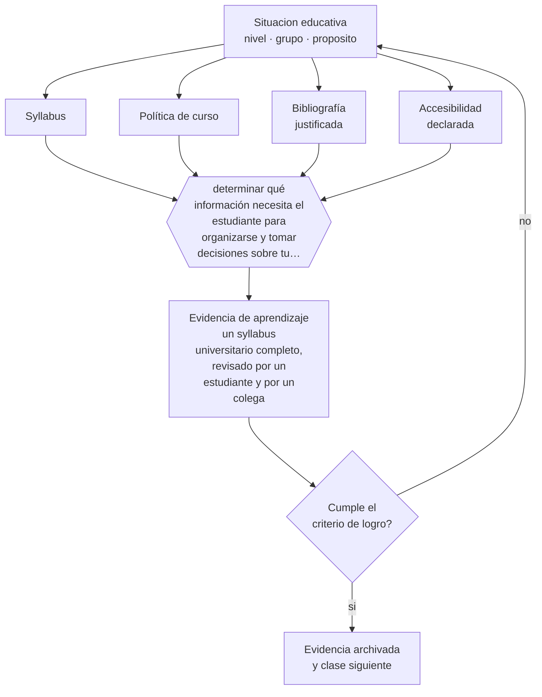

# Clase 171 — Syllabus universitario

> **Parte 14 · Docencia universitaria** — clase 3 de 12

**Estado de evidencia:** `PRACTICA-PROFESIONAL` · **Etapa:** 🟠 Etapa D — Educación superior y liderazgo · **Población de referencia:** pregrado y postgrado universitario y técnico superior 
**Decisión que habilita:** determinar qué información necesita el estudiante para organizarse y tomar decisiones sobre tu curso 
**Evidencia de aprendizaje:** un syllabus universitario completo, revisado por un estudiante y por un colega

## 🎯 Propósito

Construir syllabus universitarios completos y utilizables: resultados, secuencia, evaluación, criterios, carga, políticas, bibliografía y accesibilidad.

## 📚 Resultados de aprendizaje

Al finalizar esta clase podrás:

1. **Definir** con precisión los cuatro conceptos centrales de la clase y reconocerlos en una situación educativa real, no solo en su enunciado.
2. **Explicar** qué debe contener un programa de asignatura para que sirva al estudiante y no solo al archivo.
3. **Decidir** —qué información necesita el estudiante para organizarse y tomar decisiones sobre tu curso— y sostener la decisión con un fundamento escrito.
4. **Producir** la evidencia de la clase —un syllabus universitario completo, revisado por un estudiante y por un colega— y contrastarla contra el criterio de logro.
5. **Distinguir** lo que la evidencia sostiene de lo que es práctica instalada, preferencia personal o costumbre de la institución.

## 🧩 Conceptos centrales

| Concepto | Comprensión verificable |
|---|---|
| **Syllabus** | documento que establece el acuerdo académico y el plan de trabajo de la asignatura |
| **Política de curso** | reglas explícitas sobre entregas, atrasos, integridad y uso de herramientas |
| **Bibliografía justificada** | selección de lecturas con indicación de para qué sirve cada una |
| **Accesibilidad declarada** | información sobre ajustes disponibles y cómo solicitarlos |

## 🗺️ Flujo de razonamiento

## 📖 Desarrollo

### 1. El fondo del asunto

Un syllabus universitario cumple tres funciones: informar al estudiante para que decida y se organice, comprometer al docente con reglas explícitas y documentar la asignatura para la institución. La tercera suele desplazar a las dos primeras, y el resultado es un documento formalmente completo que ningún estudiante usa. La prueba de calidad es que un estudiante pueda planificar su semestre con él.

### 2. Cómo se traduce en decisiones de enseñanza

La revisión por un estudiante real es el mejor control de calidad: revela qué no se entiende, qué falta y qué sobra. Y la bibliografía debe indicar para qué sirve cada texto y qué se espera que se lea efectivamente, porque una lista extensa sin jerarquía comunica que nada es realmente obligatorio.

### 3. Qué sostiene la evidencia y qué no

El syllabus no reemplaza la comunicación durante el semestre ni impide ajustes justificados. Y su extensión tiene rendimientos decrecientes: los documentos muy largos se usan como defensa administrativa y no como herramienta para el estudiante.

> **Cómo leer el estado de evidencia `PRACTICA-PROFESIONAL`.** Es conocimiento práctico acumulado del oficio, útil y transferible, pero no probado con diseños de investigación. Trátalo como un buen punto de partida sujeto a comprobación en tu contexto.

## 🧪 Taller guiado

Aplica la clase a **uno** de los contextos siguientes y repite después el ejercicio en un
contexto de exigencia distinta. Cambiar de contexto es parte del aprendizaje: lo que funciona
con un grupo no se traslada intacto a otro.

| Contexto | Rasgo que cambia la decisión |
|---|---|
| Curso masivo de primer año | heterogeneidad alta y riesgo de deserción temprana |
| Asignatura de especialidad con pocos estudiantes | el seminario es el formato natural |
| Laboratorio o clínica | el desempeño supervisado es la evidencia |
| Postgrado profesional | estudiantes que trabajan y exigen aplicabilidad |
| Asignatura en línea o híbrida | la evaluación debe rediseñarse por completo |
| Dirección de tesis o proyecto de título | la relación de supervisión es el método |

**Secuencia de trabajo:**

1. Delimita el contexto: nivel, edad, tamaño del grupo, asignatura o experiencia y tiempo real disponible.
2. Declara qué saben ya los estudiantes y **cómo lo comprobaste**, no cómo lo supones.
3. Formula la decisión pedagógica que esta clase habilita y escribe su fundamento.
4. Anticipa qué observarías si la decisión funciona y qué observarías si no funciona.
5. Diseña de antemano la alternativa que aplicarás si la primera estrategia falla.
6. Ejecuta o simula, y registra lo observado con fecha, contexto y evidencia concreta.
7. Produce la evidencia de aprendizaje de la clase.
8. Contrástala contra el criterio de logro, corrige y recién entonces avanza.

### 📦 Evidencia de aprendizaje

Un syllabus universitario completo, revisado por un estudiante y por un colega.

Debe incluir contexto, decisión, fundamento, fuentes consultadas con su fecha, indicador de
logro observable, riesgos previstos y qué harías distinto en la siguiente iteración.

## 🏆 Reto verificable

Pide a un estudiante que planifique su semestre con tu syllabus y anote todo lo que no puede resolver. Corrige el documento con esa lista.

## ✅ Criterio de logro

- [ ] un estudiante puede planificar su semestre con el documento sin preguntar nada;
- [ ] declara políticas, criterios de evaluación y ajustes de accesibilidad disponibles;
- [ ] cada afirmación sobre «lo que funciona» está atribuida a una fuente identificable, con autor y fecha;
- [ ] la decisión es ejecutable con el tiempo, el espacio, el número de estudiantes y los recursos que realmente tienes;
- [ ] la evidencia queda archivada de forma reproducible: otra persona podría revisarla sin que tú se la expliques.

## ⚠️ Errores frecuentes

**Propios de esta clase:**

- Publicar una bibliografía extensa sin indicar qué se lee efectivamente y para qué.
- Omitir la información sobre ajustes de accesibilidad y cómo solicitarlos.

**Característicos de la parte 14:**

- Suponer que el dominio disciplinar se traduce solo en buena enseñanza.
- Diseñar la carga del estudiante sin calcular el tiempo real que exige.

## ♿ Diversidad, accesibilidad y ética

Declarar los ajustes disponibles y su procedimiento evita que el estudiante deba negociar caso a caso con cada docente, que es la principal barrera práctica que enfrentan quienes requieren apoyos en educación superior.

Antes de aplicar cualquier decisión de esta clase con estudiantes reales, revisa el
[protocolo de práctica responsable](../../../docs/ETICA_Y_PRACTICA_RESPONSABLE.md):
consentimiento, resguardo de datos personales, proporcionalidad de la intervención y derecho
de cada estudiante a no ser objeto de un ensayo que no le reporta beneficio.

## ❓ Preguntas de comprobación

1. ¿Qué pregunta te hacen todos los semestres que el syllabus debería responder?
2. ¿Qué textos de tu bibliografía se leen realmente?
3. ¿Sabe un estudiante con discapacidad cómo pedir un ajuste en tu curso?

## 📕 Lecturas base

**Biggs, J. & Tang, C. (2011). *Teaching for Quality Learning at University*.**  
*Qué aporta a esta clase:* estructura de syllabus alineado con resultados y evaluación.

**Comisión Nacional de Acreditación (Chile). *Criterios sobre programas de asignatura*.**  
*Qué aporta a esta clase:* requisitos formales esperados en el sistema chileno.

Catálogo completo: [bibliografía del programa](../../../docs/BIBLIOGRAFIA.md) ·
[glosario](../../../docs/GLOSARIO.md) ·
[fuentes oficiales y cómo leerlas](../../../docs/FUENTES.md).

## 🔗 Conexión con el resto del programa

Aplica la clase 118 al nivel universitario y organiza la ejecución de la clase 180.

> [!IMPORTANT]
> Material de formación profesional. No reemplaza un título de pedagogía, una habilitación
> legal para ejercer, ni el juicio de un equipo educativo que conoce a sus estudiantes.

---

| Anterior | Índice | Siguiente |
|---|---|---|
| [← 170 · Diseño de asignaturas](../class-02-diseno-de-asignaturas/README.md) | [Parte 14](../README.md) · [Programa](../../../README.md) | [172 · Clase magistral efectiva →](../class-04-clase-magistral-efectiva/README.md) |
