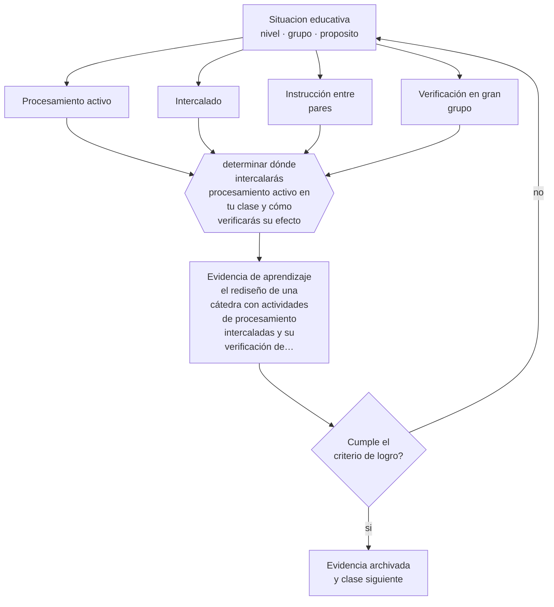

# Clase 172 — Clase magistral efectiva

> **Parte 14 · Docencia universitaria** — clase 4 de 12

**Estado de evidencia:** `ROBUSTA` · **Etapa:** 🟠 Etapa D — Educación superior y liderazgo · **Población de referencia:** pregrado y postgrado universitario y técnico superior 
**Decisión que habilita:** determinar dónde intercalarás procesamiento activo en tu clase y cómo verificarás su efecto 
**Evidencia de aprendizaje:** el rediseño de una cátedra con actividades de procesamiento intercaladas y su verificación de comprensión

## 🎯 Propósito

Rediseñar la clase expositiva incorporando procesamiento activo verificable, sin eliminar la exposición sino intercalándola con actividades que obliguen a pensar.

## 📚 Resultados de aprendizaje

Al finalizar esta clase podrás:

1. **Definir** con precisión los cuatro conceptos centrales de la clase y reconocerlos en una situación educativa real, no solo en su enunciado.
2. **Explicar** qué hacer con la clase expositiva sabiendo lo que muestra la evidencia sobre métodos activos.
3. **Decidir** —dónde intercalarás procesamiento activo en tu clase y cómo verificarás su efecto— y sostener la decisión con un fundamento escrito.
4. **Producir** la evidencia de la clase —el rediseño de una cátedra con actividades de procesamiento intercaladas y su verificación de comprensión— y contrastarla contra el criterio de logro.
5. **Distinguir** lo que la evidencia sostiene de lo que es práctica instalada, preferencia personal o costumbre de la institución.

## 🧩 Conceptos centrales

| Concepto | Comprensión verificable |
|---|---|
| **Procesamiento activo** | actividad que obliga al estudiante a recuperar, aplicar o explicar lo que se está enseñando |
| **Intercalado** | alternancia entre exposición breve y actividad, en vez de exposición continua |
| **Instrucción entre pares** | técnica en que los estudiantes discuten una pregunta conceptual y vuelven a responder |
| **Verificación en gran grupo** | técnica que revela el estado de comprensión de un curso numeroso en poco tiempo |

## 🗺️ Flujo de razonamiento

## 📖 Desarrollo

### 1. El fondo del asunto

Una síntesis muy citada de estudios en educación superior en ciencias e ingeniería mostró que el aprendizaje activo mejora el rendimiento y reduce la reprobación respecto de la exposición continua. La conclusión operativa no es eliminar la cátedra sino romperla: exponer diez o quince minutos, plantear una pregunta conceptual, hacer que los estudiantes la discutan y respondan, y continuar con la información que esa respuesta reveló.

### 2. Cómo se traduce en decisiones de enseñanza

El rediseño más simple y eficaz es la instrucción entre pares: pregunta conceptual con distractores diagnósticos, respuesta individual, discusión breve entre estudiantes, segunda respuesta. En cursos numerosos funciona con cualquier sistema de respuesta, incluidas tarjetas de papel. Y la segunda respuesta le dice al docente si puede avanzar o debe explicar de nuevo.

### 3. Qué sostiene la evidencia y qué no

Los efectos dependen de la calidad de las preguntas y de la implementación, no del formato en sí: preguntas triviales producen discusión vacía. Y la evidencia proviene sobre todo de ciencias e ingeniería; en disciplinas con otro tipo de contenido las técnicas deben adaptarse.

> **Cómo leer el estado de evidencia `ROBUSTA`.** Hay evidencia convergente de varios equipos, países y diseños de investigación, incluidos estudios experimentales o cuasiexperimentales, y el efecto se sostiene al replicarlo. Puedes apoyar una decisión profesional en ella, sin olvidar que ningún efecto promedio describe a un estudiante concreto.

## 🧪 Taller guiado

Aplica la clase a **uno** de los contextos siguientes y repite después el ejercicio en un
contexto de exigencia distinta. Cambiar de contexto es parte del aprendizaje: lo que funciona
con un grupo no se traslada intacto a otro.

| Contexto | Rasgo que cambia la decisión |
|---|---|
| Curso masivo de primer año | heterogeneidad alta y riesgo de deserción temprana |
| Asignatura de especialidad con pocos estudiantes | el seminario es el formato natural |
| Laboratorio o clínica | el desempeño supervisado es la evidencia |
| Postgrado profesional | estudiantes que trabajan y exigen aplicabilidad |
| Asignatura en línea o híbrida | la evaluación debe rediseñarse por completo |
| Dirección de tesis o proyecto de título | la relación de supervisión es el método |

**Secuencia de trabajo:**

1. Delimita el contexto: nivel, edad, tamaño del grupo, asignatura o experiencia y tiempo real disponible.
2. Declara qué saben ya los estudiantes y **cómo lo comprobaste**, no cómo lo supones.
3. Formula la decisión pedagógica que esta clase habilita y escribe su fundamento.
4. Anticipa qué observarías si la decisión funciona y qué observarías si no funciona.
5. Diseña de antemano la alternativa que aplicarás si la primera estrategia falla.
6. Ejecuta o simula, y registra lo observado con fecha, contexto y evidencia concreta.
7. Produce la evidencia de aprendizaje de la clase.
8. Contrástala contra el criterio de logro, corrige y recién entonces avanza.

### 📦 Evidencia de aprendizaje

El rediseño de una cátedra con actividades de procesamiento intercaladas y su verificación de comprensión.

Debe incluir contexto, decisión, fundamento, fuentes consultadas con su fecha, indicador de
logro observable, riesgos previstos y qué harías distinto en la siguiente iteración.

## 🏆 Reto verificable

Rediseña una cátedra con instrucción entre pares y aplícala. Registra la proporción de respuestas correctas antes y después de la discusión entre pares.

## ✅ Criterio de logro

- [ ] la clase intercala exposición breve con actividades de procesamiento verificables;
- [ ] las preguntas tienen distractores que revelan errores conceptuales conocidos;
- [ ] cada afirmación sobre «lo que funciona» está atribuida a una fuente identificable, con autor y fecha;
- [ ] la decisión es ejecutable con el tiempo, el espacio, el número de estudiantes y los recursos que realmente tienes;
- [ ] la evidencia queda archivada de forma reproducible: otra persona podría revisarla sin que tú se la expliques.

## ⚠️ Errores frecuentes

**Propios de esta clase:**

- Intercalar preguntas triviales que no revelan comprensión ni generan discusión.
- Mantener cuarenta minutos de exposición continua y agregar una actividad al final.

**Característicos de la parte 14:**

- Suponer que el dominio disciplinar se traduce solo en buena enseñanza.
- Diseñar la carga del estudiante sin calcular el tiempo real que exige.

## ♿ Diversidad, accesibilidad y ética

Las técnicas de respuesta simultánea permiten participar sin exponerse ante un auditorio numeroso, lo que amplía quiénes intervienen efectivamente, especialmente estudiantes de primer año o de grupos subrepresentados.

Antes de aplicar cualquier decisión de esta clase con estudiantes reales, revisa el
[protocolo de práctica responsable](../../../docs/ETICA_Y_PRACTICA_RESPONSABLE.md):
consentimiento, resguardo de datos personales, proporcionalidad de la intervención y derecho
de cada estudiante a no ser objeto de un ensayo que no le reporta beneficio.

## ❓ Preguntas de comprobación

1. ¿Cuánto tiempo hablas seguido sin que nadie tenga que hacer nada?
2. ¿Qué error conceptual revela tu pregunta intercalada?
3. ¿Qué haces si la mayoría responde mal en la segunda votación?

## 📕 Lecturas base

**Freeman, S. et al. (2014). *Active Learning Increases Student Performance*. PNAS, 111(23).**  
*Qué aporta a esta clase:* el metaanálisis que reordenó la discusión sobre la cátedra universitaria.

**Mazur, E. (1997). *Peer Instruction: A User's Manual*.**  
*Qué aporta a esta clase:* el método de instrucción entre pares con su implementación paso a paso.

Catálogo completo: [bibliografía del programa](../../../docs/BIBLIOGRAFIA.md) ·
[glosario](../../../docs/GLOSARIO.md) ·
[fuentes oficiales y cómo leerlas](../../../docs/FUENTES.md).

## 🔗 Conexión con el resto del programa

Aplica las clases 122 y 124 al contexto universitario y se articula con la clase 130.

> [!IMPORTANT]
> Material de formación profesional. No reemplaza un título de pedagogía, una habilitación
> legal para ejercer, ni el juicio de un equipo educativo que conoce a sus estudiantes.

---

| Anterior | Índice | Siguiente |
|---|---|---|
| [← 171 · Syllabus universitario](../class-03-syllabus-universitario/README.md) | [Parte 14](../README.md) · [Programa](../../../README.md) | [173 · Seminarios →](../class-05-seminarios/README.md) |
