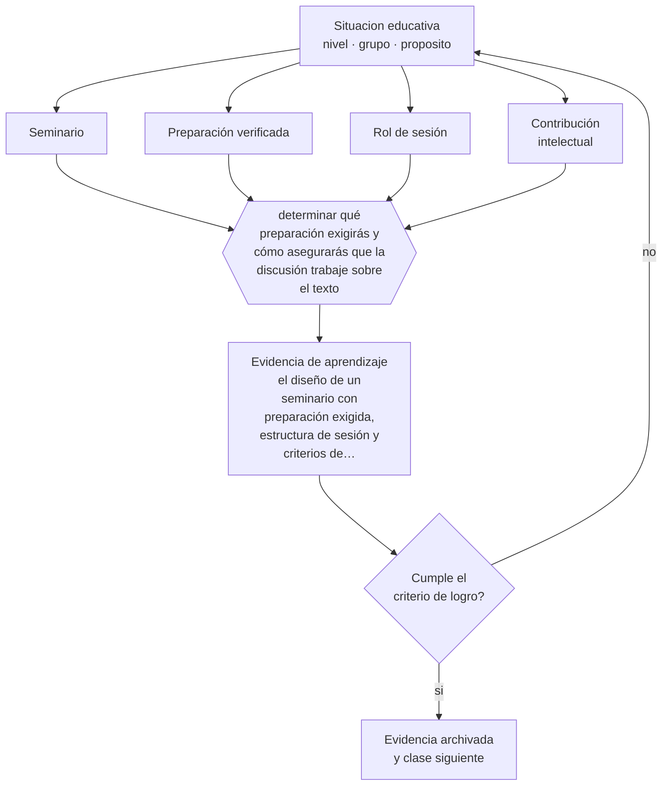

# Clase 173 — Seminarios

> **Parte 14 · Docencia universitaria** — clase 5 de 12

**Estado de evidencia:** `PRACTICA-PROFESIONAL` · **Etapa:** 🟠 Etapa D — Educación superior y liderazgo · **Población de referencia:** pregrado y postgrado universitario y técnico superior 
**Decisión que habilita:** determinar qué preparación exigirás y cómo asegurarás que la discusión trabaje sobre el texto 
**Evidencia de aprendizaje:** el diseño de un seminario con preparación exigida, estructura de sesión y criterios de evaluación de la participación

## 🎯 Propósito

Diseñar y conducir seminarios con preparación exigida, estructura de discusión, roles y evaluación de la contribución intelectual.

## 📚 Resultados de aprendizaje

Al finalizar esta clase podrás:

1. **Definir** con precisión los cuatro conceptos centrales de la clase y reconocerlos en una situación educativa real, no solo en su enunciado.
2. **Explicar** cómo conducir un seminario donde efectivamente se discuta el texto y no las impresiones sobre él.
3. **Decidir** —qué preparación exigirás y cómo asegurarás que la discusión trabaje sobre el texto— y sostener la decisión con un fundamento escrito.
4. **Producir** la evidencia de la clase —el diseño de un seminario con preparación exigida, estructura de sesión y criterios de evaluación de la participación— y contrastarla contra el criterio de logro.
5. **Distinguir** lo que la evidencia sostiene de lo que es práctica instalada, preferencia personal o costumbre de la institución.

## 🧩 Conceptos centrales

| Concepto | Comprensión verificable |
|---|---|
| **Seminario** | formato de discusión intensiva sobre textos o problemas, con participación exigida |
| **Preparación verificada** | mecanismo que asegura que el texto fue leído antes de la sesión |
| **Rol de sesión** | función asignada —presentar, objetar, moderar, sintetizar— que estructura la discusión |
| **Contribución intelectual** | aporte que hace avanzar la discusión, distinto de la cantidad de intervenciones |

## 🗺️ Flujo de razonamiento

## 📖 Desarrollo

### 1. El fondo del asunto

El seminario fracasa cuando el texto no se lee: la discusión se vuelve intercambio de opiniones generales y los pocos que leyeron dejan de prepararse. La solución no es exhortar sino diseñar: una entrega escrita breve antes de la sesión, roles asignados y una estructura que exija referirse al texto. Con esas tres condiciones el formato funciona incluso con grupos poco habituados.

### 2. Cómo se traduce en decisiones de enseñanza

Los roles rotativos —quien presenta, quien objeta, quien conecta con la sesión anterior, quien sintetiza— distribuyen la participación y evitan que dominen los mismos. Y la evaluación debe premiar la contribución intelectual y no el volumen de habla, lo que exige criterios explícitos y registro durante la sesión.

### 3. Qué sostiene la evidencia y qué no

No hay evidencia experimental sólida sobre formatos de seminario: es conocimiento profesional consolidado. Su eficacia depende del tamaño del grupo —sobre quince participantes la discusión real se vuelve difícil— y de la preparación previa, que es la variable crítica.

> **Cómo leer el estado de evidencia `PRACTICA-PROFESIONAL`.** Es conocimiento práctico acumulado del oficio, útil y transferible, pero no probado con diseños de investigación. Trátalo como un buen punto de partida sujeto a comprobación en tu contexto.

## 🧪 Taller guiado

Aplica la clase a **uno** de los contextos siguientes y repite después el ejercicio en un
contexto de exigencia distinta. Cambiar de contexto es parte del aprendizaje: lo que funciona
con un grupo no se traslada intacto a otro.

| Contexto | Rasgo que cambia la decisión |
|---|---|
| Curso masivo de primer año | heterogeneidad alta y riesgo de deserción temprana |
| Asignatura de especialidad con pocos estudiantes | el seminario es el formato natural |
| Laboratorio o clínica | el desempeño supervisado es la evidencia |
| Postgrado profesional | estudiantes que trabajan y exigen aplicabilidad |
| Asignatura en línea o híbrida | la evaluación debe rediseñarse por completo |
| Dirección de tesis o proyecto de título | la relación de supervisión es el método |

**Secuencia de trabajo:**

1. Delimita el contexto: nivel, edad, tamaño del grupo, asignatura o experiencia y tiempo real disponible.
2. Declara qué saben ya los estudiantes y **cómo lo comprobaste**, no cómo lo supones.
3. Formula la decisión pedagógica que esta clase habilita y escribe su fundamento.
4. Anticipa qué observarías si la decisión funciona y qué observarías si no funciona.
5. Diseña de antemano la alternativa que aplicarás si la primera estrategia falla.
6. Ejecuta o simula, y registra lo observado con fecha, contexto y evidencia concreta.
7. Produce la evidencia de aprendizaje de la clase.
8. Contrástala contra el criterio de logro, corrige y recién entonces avanza.

### 📦 Evidencia de aprendizaje

El diseño de un seminario con preparación exigida, estructura de sesión y criterios de evaluación de la participación.

Debe incluir contexto, decisión, fundamento, fuentes consultadas con su fecha, indicador de
logro observable, riesgos previstos y qué harías distinto en la siguiente iteración.

## 🏆 Reto verificable

Implementa entrega previa y roles rotativos durante cuatro sesiones. Registra la distribución de la participación antes y después.

## ✅ Criterio de logro

- [ ] existe una entrega previa breve que verifica la lectura;
- [ ] los criterios de evaluación de la participación son explícitos y se registran durante la sesión;
- [ ] cada afirmación sobre «lo que funciona» está atribuida a una fuente identificable, con autor y fecha;
- [ ] la decisión es ejecutable con el tiempo, el espacio, el número de estudiantes y los recursos que realmente tienes;
- [ ] la evidencia queda archivada de forma reproducible: otra persona podría revisarla sin que tú se la expliques.

## ⚠️ Errores frecuentes

**Propios de esta clase:**

- Conducir el seminario sin mecanismo de preparación verificada.
- Evaluar la participación por cantidad de intervenciones y no por su aporte.

**Característicos de la parte 14:**

- Suponer que el dominio disciplinar se traduce solo en buena enseñanza.
- Diseñar la carga del estudiante sin calcular el tiempo real que exige.

## ♿ Diversidad, accesibilidad y ética

La entrega escrita previa permite participar a estudiantes que no intervienen espontáneamente, y los roles asignados garantizan que todos tengan un espacio definido en la discusión.

Antes de aplicar cualquier decisión de esta clase con estudiantes reales, revisa el
[protocolo de práctica responsable](../../../docs/ETICA_Y_PRACTICA_RESPONSABLE.md):
consentimiento, resguardo de datos personales, proporcionalidad de la intervención y derecho
de cada estudiante a no ser objeto de un ensayo que no le reporta beneficio.

## ❓ Preguntas de comprobación

1. ¿Qué proporción de tu grupo llega con el texto leído?
2. ¿Quién habla siempre y quién nunca en tus seminarios?
3. ¿Qué distingue una buena intervención de una intervención frecuente?

## 📕 Lecturas base

**Brookfield, S. & Preskill, S. (2005). *Discussion as a Way of Teaching*.**  
*Qué aporta a esta clase:* repertorio de estructuras de discusión con criterios de conducción.

**Alexander, R. (2020). *A Dialogic Teaching Companion*.**  
*Qué aporta a esta clase:* principios de discusión productiva aplicables al formato de seminario.

Catálogo completo: [bibliografía del programa](../../../docs/BIBLIOGRAFIA.md) ·
[glosario](../../../docs/GLOSARIO.md) ·
[fuentes oficiales y cómo leerlas](../../../docs/FUENTES.md).

## 🔗 Conexión con el resto del programa

Se apoya en las clases 067 y 125 y complementa el formato de la clase 172.

> [!IMPORTANT]
> Material de formación profesional. No reemplaza un título de pedagogía, una habilitación
> legal para ejercer, ni el juicio de un equipo educativo que conoce a sus estudiantes.

---

| Anterior | Índice | Siguiente |
|---|---|---|
| [← 172 · Clase magistral efectiva](../class-04-clase-magistral-efectiva/README.md) | [Parte 14](../README.md) · [Programa](../../../README.md) | [174 · Laboratorios →](../class-06-laboratorios/README.md) |
