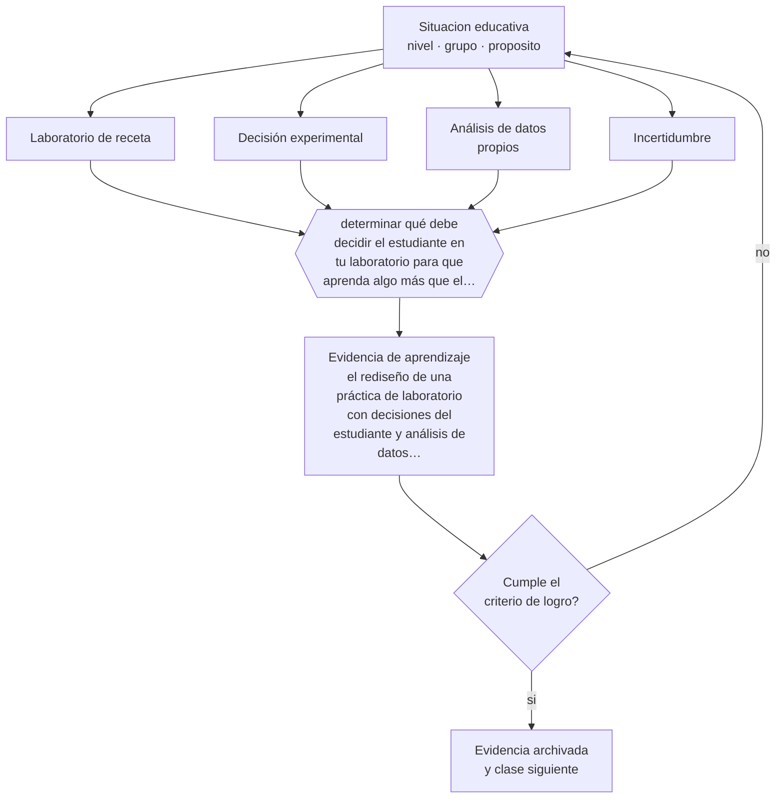

# Clase 174 — Laboratorios

> **Parte 14 · Docencia universitaria** — clase 6 de 12

**Estado de evidencia:** `CONSISTENTE` · **Etapa:** 🟠 Etapa D — Educación superior y liderazgo · **Población de referencia:** pregrado y postgrado universitario y técnico superior 
**Decisión que habilita:** determinar qué debe decidir el estudiante en tu laboratorio para que aprenda algo más que el procedimiento 
**Evidencia de aprendizaje:** el rediseño de una práctica de laboratorio con decisiones del estudiante y análisis de datos propios

## 🎯 Propósito

Diseñar laboratorios y prácticas con propósito de aprendizaje explícito: predicción, decisión experimental, análisis de datos e interpretación, en vez de seguimiento de recetas.

## 📚 Resultados de aprendizaje

Al finalizar esta clase podrás:

1. **Definir** con precisión los cuatro conceptos centrales de la clase y reconocerlos en una situación educativa real, no solo en su enunciado.
2. **Explicar** por qué un laboratorio puede enseñar procedimiento y no enseñar nada de ciencia.
3. **Decidir** —qué debe decidir el estudiante en tu laboratorio para que aprenda algo más que el procedimiento— y sostener la decisión con un fundamento escrito.
4. **Producir** la evidencia de la clase —el rediseño de una práctica de laboratorio con decisiones del estudiante y análisis de datos propios— y contrastarla contra el criterio de logro.
5. **Distinguir** lo que la evidencia sostiene de lo que es práctica instalada, preferencia personal o costumbre de la institución.

## 🧩 Conceptos centrales

| Concepto | Comprensión verificable |
|---|---|
| **Laboratorio de receta** | práctica en que el procedimiento está completamente prescrito y el resultado es conocido |
| **Decisión experimental** | elección que el estudiante debe tomar y justificar durante la práctica |
| **Análisis de datos propios** | interpretación de los datos efectivamente obtenidos, incluidos los inesperados |
| **Incertidumbre** | reconocimiento del error de medición y de sus consecuencias en la conclusión |

## 🗺️ Flujo de razonamiento

## 📖 Desarrollo

### 1. El fondo del asunto

Un laboratorio de receta enseña a seguir instrucciones. La evidencia sobre laboratorios universitarios sugiere que las prácticas prescritas aportan poco al aprendizaje conceptual, mientras que aquellas donde el estudiante debe tomar decisiones —qué medir, cómo controlar, cómo interpretar la discrepancia— desarrollan comprensión del razonamiento experimental, que es lo que la disciplina realmente exige.

### 2. Cómo se traduce en decisiones de enseñanza

El rediseño consiste en devolver decisiones: dar el objetivo y no el procedimiento completo, exigir predicción previa, pedir que analicen sus propios datos incluidos los anómalos, y evaluar el razonamiento y no la coincidencia con el valor esperado. Esa última decisión es decisiva: mientras se califique por acercarse al valor de tabla, los estudiantes ajustarán los datos.

### 3. Qué sostiene la evidencia y qué no

El rediseño consume más tiempo y exige más apoyo, lo que en cursos numerosos tiene un costo real. Y en fases iniciales, cierta prescripción es necesaria por seguridad y por dominio técnico. La progresión razonable va de procedimientos guiados a decisiones crecientes.

> **Cómo leer el estado de evidencia `CONSISTENTE`.** La evidencia es amplia y coherente, pero proviene sobre todo de estudios correlacionales, de síntesis con heterogeneidad alta o de contextos distintos al tuyo. Sirve para orientar la decisión y exige que compruebes el efecto en tu propio grupo.

## 🧪 Taller guiado

Aplica la clase a **uno** de los contextos siguientes y repite después el ejercicio en un
contexto de exigencia distinta. Cambiar de contexto es parte del aprendizaje: lo que funciona
con un grupo no se traslada intacto a otro.

| Contexto | Rasgo que cambia la decisión |
|---|---|
| Curso masivo de primer año | heterogeneidad alta y riesgo de deserción temprana |
| Asignatura de especialidad con pocos estudiantes | el seminario es el formato natural |
| Laboratorio o clínica | el desempeño supervisado es la evidencia |
| Postgrado profesional | estudiantes que trabajan y exigen aplicabilidad |
| Asignatura en línea o híbrida | la evaluación debe rediseñarse por completo |
| Dirección de tesis o proyecto de título | la relación de supervisión es el método |

**Secuencia de trabajo:**

1. Delimita el contexto: nivel, edad, tamaño del grupo, asignatura o experiencia y tiempo real disponible.
2. Declara qué saben ya los estudiantes y **cómo lo comprobaste**, no cómo lo supones.
3. Formula la decisión pedagógica que esta clase habilita y escribe su fundamento.
4. Anticipa qué observarías si la decisión funciona y qué observarías si no funciona.
5. Diseña de antemano la alternativa que aplicarás si la primera estrategia falla.
6. Ejecuta o simula, y registra lo observado con fecha, contexto y evidencia concreta.
7. Produce la evidencia de aprendizaje de la clase.
8. Contrástala contra el criterio de logro, corrige y recién entonces avanza.

### 📦 Evidencia de aprendizaje

El rediseño de una práctica de laboratorio con decisiones del estudiante y análisis de datos propios.

Debe incluir contexto, decisión, fundamento, fuentes consultadas con su fecha, indicador de
logro observable, riesgos previstos y qué harías distinto en la siguiente iteración.

## 🏆 Reto verificable

Rediseña una práctica devolviendo dos decisiones al estudiante. Evalúa el razonamiento y compara los informes con los de la versión prescrita.

## ✅ Criterio de logro

- [ ] el estudiante toma al menos dos decisiones experimentales y las justifica;
- [ ] la evaluación premia el razonamiento y el tratamiento de la incertidumbre;
- [ ] cada afirmación sobre «lo que funciona» está atribuida a una fuente identificable, con autor y fecha;
- [ ] la decisión es ejecutable con el tiempo, el espacio, el número de estudiantes y los recursos que realmente tienes;
- [ ] la evidencia queda archivada de forma reproducible: otra persona podría revisarla sin que tú se la expliques.

## ⚠️ Errores frecuentes

**Propios de esta clase:**

- Calificar por proximidad al valor esperado, lo que incentiva ajustar los datos.
- Prescribir todo el procedimiento y esperar que el estudiante comprenda el diseño experimental.

**Característicos de la parte 14:**

- Suponer que el dominio disciplinar se traduce solo en buena enseñanza.
- Diseñar la carga del estudiante sin calcular el tiempo real que exige.

## ♿ Diversidad, accesibilidad y ética

El trabajo en laboratorio distribuye roles de forma espontánea y suele reproducir sesgos: quién opera el instrumento y quién anota. Asignar y rotar roles explícitamente cambia la experiencia de aprendizaje de todo el grupo.

Antes de aplicar cualquier decisión de esta clase con estudiantes reales, revisa el
[protocolo de práctica responsable](../../../docs/ETICA_Y_PRACTICA_RESPONSABLE.md):
consentimiento, resguardo de datos personales, proporcionalidad de la intervención y derecho
de cada estudiante a no ser objeto de un ensayo que no le reporta beneficio.

## ❓ Preguntas de comprobación

1. ¿Qué decide realmente tu estudiante en el laboratorio?
2. ¿Qué pasa cuando sus datos no coinciden con lo esperado?
3. ¿Qué estás calificando: el razonamiento o el resultado?

## 📕 Lecturas base

**Holmes, N. G. & Wieman, C. (2018). *Introductory Physics Labs: We Can Do Better*. Physics Today.**  
*Qué aporta a esta clase:* evidencia sobre el bajo aporte conceptual de los laboratorios de receta y alternativas.

**Hofstein, A. & Lunetta, V. (2004). *The Laboratory in Science Education*.**  
*Qué aporta a esta clase:* revisión sobre qué aprende y qué no aprende el estudiante en el laboratorio.

Catálogo completo: [bibliografía del programa](../../../docs/BIBLIOGRAFIA.md) ·
[glosario](../../../docs/GLOSARIO.md) ·
[fuentes oficiales y cómo leerlas](../../../docs/FUENTES.md).

## 🔗 Conexión con el resto del programa

Aplica las clases 052 y 066 al nivel superior y comparte criterio con la clase 075.

> [!IMPORTANT]
> Material de formación profesional. No reemplaza un título de pedagogía, una habilitación
> legal para ejercer, ni el juicio de un equipo educativo que conoce a sus estudiantes.

---

| Anterior | Índice | Siguiente |
|---|---|---|
| [← 173 · Seminarios](../class-05-seminarios/README.md) | [Parte 14](../README.md) · [Programa](../../../README.md) | [175 · Tutorías y ayudantías →](../class-07-tutorias-y-ayudantias/README.md) |
