# Clase 175 — Tutorías y ayudantías

> **Parte 14 · Docencia universitaria** — clase 7 de 12

**Estado de evidencia:** `ROBUSTA` · **Etapa:** 🟠 Etapa D — Educación superior y liderazgo · **Población de referencia:** pregrado y postgrado universitario y técnico superior 
**Decisión que habilita:** determinar cómo formarás a tus ayudantes para que no resuelvan el problema en lugar del estudiante 
**Evidencia de aprendizaje:** un protocolo de tutoría con formación de ayudantes, estructura de sesión y evaluación de su efecto

## 🎯 Propósito

Diseñar sistemas de tutoría y ayudantía que aprovechen el efecto documentado de la enseñanza en grupos pequeños, con formación de los ayudantes y foco en el razonamiento del estudiante.

## 📚 Resultados de aprendizaje

Al finalizar esta clase podrás:

1. **Definir** con precisión los cuatro conceptos centrales de la clase y reconocerlos en una situación educativa real, no solo en su enunciado.
2. **Explicar** qué hace que una tutoría produzca aprendizaje y no solo resuelva la duda del momento.
3. **Decidir** —cómo formarás a tus ayudantes para que no resuelvan el problema en lugar del estudiante— y sostener la decisión con un fundamento escrito.
4. **Producir** la evidencia de la clase —un protocolo de tutoría con formación de ayudantes, estructura de sesión y evaluación de su efecto— y contrastarla contra el criterio de logro.
5. **Distinguir** lo que la evidencia sostiene de lo que es práctica instalada, preferencia personal o costumbre de la institución.

## 🧩 Conceptos centrales

| Concepto | Comprensión verificable |
|---|---|
| **Tutoría** | enseñanza individual o en grupo muy pequeño, con alta capacidad de ajuste al estudiante |
| **Ayudantía** | apoyo docente ejercido por estudiantes avanzados con formación específica |
| **Pregunta en vez de solución** | práctica de guiar el razonamiento en lugar de entregar la respuesta |
| **Formación del ayudante** | preparación pedagógica mínima para quien enseña sin ser docente |

## 🗺️ Flujo de razonamiento

```mermaid
flowchart TB
    C["Situacion educativa<br/>nivel · grupo · proposito"]
    C --> A1["Tutoría"]
    C --> A2["Ayudantía"]
    C --> A3["Pregunta en vez de<br/>solución"]
    C --> A4["Formación del ayudante"]
    A1 & A2 & A3 & A4 --> D{{"determinar cómo formarás<br/>a tus ayudantes para que<br/>no resuelvan el problema<br/>en lugar del…"}}
    D --> E["Evidencia de aprendizaje<br/>un protocolo de tutoría<br/>con formación de<br/>ayudantes, estructura de<br/>sesión y evaluación de<br/>su…"]
    E --> V{"Cumple el<br/>criterio de logro?"}
    V -->|si| S["Evidencia archivada<br/>y clase siguiente"]
    V -->|no| C
```

## 📖 Desarrollo

### 1. El fondo del asunto

La enseñanza en grupos muy pequeños está entre las intervenciones con mayor efecto documentado, precisamente por su capacidad de ajuste: el tutor puede detectar el error específico y trabajar sobre él. Ese potencial se desperdicia cuando el tutor resuelve el problema frente al estudiante, que es la conducta espontánea de quien domina la materia y no tiene formación pedagógica.

### 2. Cómo se traduce en decisiones de enseñanza

La formación mínima del ayudante enseña tres cosas: preguntar antes de explicar, hacer que el estudiante intente antes de mostrar, y detectar el punto exacto donde se rompe el razonamiento. Con dos sesiones de formación y un protocolo simple, la calidad de la ayudantía cambia de forma perceptible.

### 3. Qué sostiene la evidencia y qué no

El efecto documentado corresponde a tutoría bien implementada y sostenida; sesiones esporádicas y sin estructura rinden mucho menos. Y la ayudantía depende de la disponibilidad y la formación de estudiantes avanzados, que varía entre instituciones y semestres.

> **Cómo leer el estado de evidencia `ROBUSTA`.** Hay evidencia convergente de varios equipos, países y diseños de investigación, incluidos estudios experimentales o cuasiexperimentales, y el efecto se sostiene al replicarlo. Puedes apoyar una decisión profesional en ella, sin olvidar que ningún efecto promedio describe a un estudiante concreto.

## 🧪 Taller guiado

Aplica la clase a **uno** de los contextos siguientes y repite después el ejercicio en un
contexto de exigencia distinta. Cambiar de contexto es parte del aprendizaje: lo que funciona
con un grupo no se traslada intacto a otro.

| Contexto | Rasgo que cambia la decisión |
|---|---|
| Curso masivo de primer año | heterogeneidad alta y riesgo de deserción temprana |
| Asignatura de especialidad con pocos estudiantes | el seminario es el formato natural |
| Laboratorio o clínica | el desempeño supervisado es la evidencia |
| Postgrado profesional | estudiantes que trabajan y exigen aplicabilidad |
| Asignatura en línea o híbrida | la evaluación debe rediseñarse por completo |
| Dirección de tesis o proyecto de título | la relación de supervisión es el método |

**Secuencia de trabajo:**

1. Delimita el contexto: nivel, edad, tamaño del grupo, asignatura o experiencia y tiempo real disponible.
2. Declara qué saben ya los estudiantes y **cómo lo comprobaste**, no cómo lo supones.
3. Formula la decisión pedagógica que esta clase habilita y escribe su fundamento.
4. Anticipa qué observarías si la decisión funciona y qué observarías si no funciona.
5. Diseña de antemano la alternativa que aplicarás si la primera estrategia falla.
6. Ejecuta o simula, y registra lo observado con fecha, contexto y evidencia concreta.
7. Produce la evidencia de aprendizaje de la clase.
8. Contrástala contra el criterio de logro, corrige y recién entonces avanza.

### 📦 Evidencia de aprendizaje

Un protocolo de tutoría con formación de ayudantes, estructura de sesión y evaluación de su efecto.

Debe incluir contexto, decisión, fundamento, fuentes consultadas con su fecha, indicador de
logro observable, riesgos previstos y qué harías distinto en la siguiente iteración.

## 🏆 Reto verificable

Forma a tus ayudantes con un protocolo de dos horas y observa una sesión. Documenta cuántas veces resolvieron en lugar de preguntar.

## ✅ Criterio de logro

- [ ] los ayudantes reciben formación específica y disponen de un protocolo de sesión;
- [ ] existe alguna evaluación del efecto de la tutoría y no solo de su realización;
- [ ] cada afirmación sobre «lo que funciona» está atribuida a una fuente identificable, con autor y fecha;
- [ ] la decisión es ejecutable con el tiempo, el espacio, el número de estudiantes y los recursos que realmente tienes;
- [ ] la evidencia queda archivada de forma reproducible: otra persona podría revisarla sin que tú se la expliques.

## ⚠️ Errores frecuentes

**Propios de esta clase:**

- Asignar ayudantías por rendimiento académico sin ninguna formación pedagógica.
- Permitir que la sesión consista en resolver los ejercicios frente a los estudiantes.

**Característicos de la parte 14:**

- Suponer que el dominio disciplinar se traduce solo en buena enseñanza.
- Diseñar la carga del estudiante sin calcular el tiempo real que exige.

## ♿ Diversidad, accesibilidad y ética

La tutoría es una de las intervenciones más eficaces para estudiantes con menor preparación previa, y también una de las que menos usan por desconocimiento o por vergüenza. Convocar activamente y no esperar la solicitud espontánea cambia quién accede.

Antes de aplicar cualquier decisión de esta clase con estudiantes reales, revisa el
[protocolo de práctica responsable](../../../docs/ETICA_Y_PRACTICA_RESPONSABLE.md):
consentimiento, resguardo de datos personales, proporcionalidad de la intervención y derecho
de cada estudiante a no ser objeto de un ensayo que no le reporta beneficio.

## ❓ Preguntas de comprobación

1. ¿Qué hace tu ayudante cuando un estudiante no sabe empezar?
2. ¿Qué formación recibió antes de su primera sesión?
3. ¿Cómo sabes si tus ayudantías están sirviendo?

## 📕 Lecturas base

**Bloom, B. (1984). *The 2 Sigma Problem*.**  
*Qué aporta a esta clase:* el estudio que instaló la magnitud del efecto de la tutoría individual y el desafío que plantea.

**Chi, M. et al. (2001). *Learning from Human Tutoring*.**  
*Qué aporta a esta clase:* muestra qué hacen los buenos tutores y por qué preguntar rinde más que explicar.

Catálogo completo: [bibliografía del programa](../../../docs/BIBLIOGRAFIA.md) ·
[glosario](../../../docs/GLOSARIO.md) ·
[fuentes oficiales y cómo leerlas](../../../docs/FUENTES.md).

## 🔗 Conexión con el resto del programa

Se apoya en las clases 126 y 127 y se conecta con la clase 093 sobre acompañamiento.

> [!IMPORTANT]
> Material de formación profesional. No reemplaza un título de pedagogía, una habilitación
> legal para ejercer, ni el juicio de un equipo educativo que conoce a sus estudiantes.

---

| Anterior | Índice | Siguiente |
|---|---|---|
| [← 174 · Laboratorios](../class-06-laboratorios/README.md) | [Parte 14](../README.md) · [Programa](../../../README.md) | [176 · Evaluación universitaria →](../class-08-evaluacion-universitaria/README.md) |
