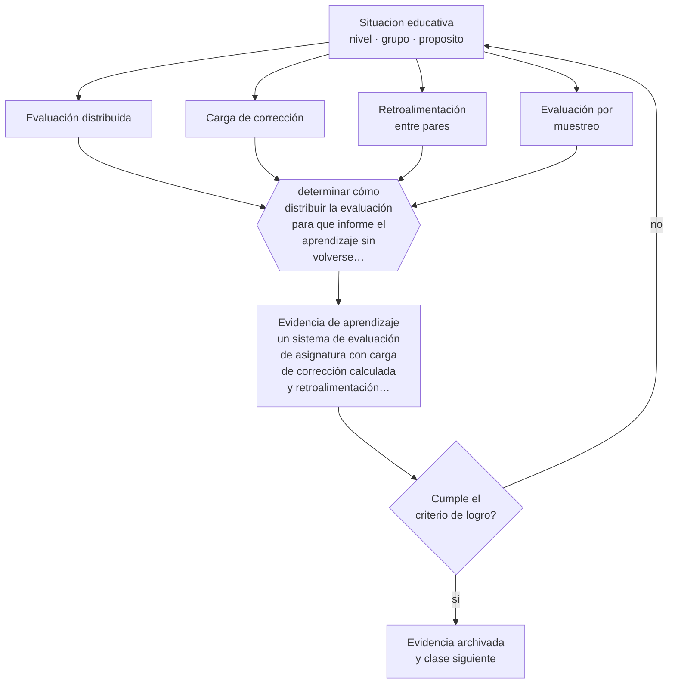

# Clase 176 — Evaluación universitaria

> **Parte 14 · Docencia universitaria** — clase 8 de 12

**Estado de evidencia:** `CONSISTENTE` · **Etapa:** 🟠 Etapa D — Educación superior y liderazgo · **Población de referencia:** pregrado y postgrado universitario y técnico superior 
**Decisión que habilita:** determinar cómo distribuir la evaluación para que informe el aprendizaje sin volverse insostenible 
**Evidencia de aprendizaje:** un sistema de evaluación de asignatura con carga de corrección calculada y retroalimentación planificada

## 🎯 Propósito

Diseñar sistemas de evaluación universitaria sostenibles: distribuidos en el tiempo, con retroalimentación utilizable y con carga de corrección viable para el docente.

## 📚 Resultados de aprendizaje

Al finalizar esta clase podrás:

1. **Definir** con precisión los cuatro conceptos centrales de la clase y reconocerlos en una situación educativa real, no solo en su enunciado.
2. **Explicar** cómo evaluar en educación superior sin concentrar todo en dos pruebas y sin ahogarse corrigiendo.
3. **Decidir** —cómo distribuir la evaluación para que informe el aprendizaje sin volverse insostenible— y sostener la decisión con un fundamento escrito.
4. **Producir** la evidencia de la clase —un sistema de evaluación de asignatura con carga de corrección calculada y retroalimentación planificada— y contrastarla contra el criterio de logro.
5. **Distinguir** lo que la evidencia sostiene de lo que es práctica instalada, preferencia personal o costumbre de la institución.

## 🧩 Conceptos centrales

| Concepto | Comprensión verificable |
|---|---|
| **Evaluación distribuida** | conjunto de instancias a lo largo del semestre, en vez de una o dos pruebas finales |
| **Carga de corrección** | tiempo docente que exige el sistema de evaluación; determina su sostenibilidad |
| **Retroalimentación entre pares** | revisión estructurada entre estudiantes con criterios, que amplía la retroalimentación disponible |
| **Evaluación por muestreo** | estrategia de revisar en profundidad una parte del trabajo y no todo |

## 🗺️ Flujo de razonamiento

## 📖 Desarrollo

### 1. El fondo del asunto

El sistema típico —dos pruebas y un examen— produce estudio concentrado, mala retención y retroalimentación inútil por tardía. La alternativa distribuida mejora el aprendizaje y colapsa al docente si no se diseña la carga de corrección. La combinación viable incluye instancias breves de baja consecuencia con corrección automática o entre pares, y pocas instancias extensas con retroalimentación docente en profundidad.

### 2. Cómo se traduce en decisiones de enseñanza

El cálculo de carga es la decisión central: multiplicar número de estudiantes por minutos de corrección da el número real de horas comprometidas. Con ese dato se diseña: qué se corrige en profundidad, qué se revisa por muestreo, qué se retroalimenta entre pares con rúbrica y qué se autocorrige con pauta.

### 3. Qué sostiene la evidencia y qué no

La retroalimentación entre pares tiene calidad variable y requiere formación y criterios; sin ellos produce comentarios vagos. Y la corrección automática solo sirve para ciertos desempeños. Ningún sistema elimina la necesidad de juicio docente en las evaluaciones con mayor consecuencia.

> **Cómo leer el estado de evidencia `CONSISTENTE`.** La evidencia es amplia y coherente, pero proviene sobre todo de estudios correlacionales, de síntesis con heterogeneidad alta o de contextos distintos al tuyo. Sirve para orientar la decisión y exige que compruebes el efecto en tu propio grupo.

## 🧪 Taller guiado

Aplica la clase a **uno** de los contextos siguientes y repite después el ejercicio en un
contexto de exigencia distinta. Cambiar de contexto es parte del aprendizaje: lo que funciona
con un grupo no se traslada intacto a otro.

| Contexto | Rasgo que cambia la decisión |
|---|---|
| Curso masivo de primer año | heterogeneidad alta y riesgo de deserción temprana |
| Asignatura de especialidad con pocos estudiantes | el seminario es el formato natural |
| Laboratorio o clínica | el desempeño supervisado es la evidencia |
| Postgrado profesional | estudiantes que trabajan y exigen aplicabilidad |
| Asignatura en línea o híbrida | la evaluación debe rediseñarse por completo |
| Dirección de tesis o proyecto de título | la relación de supervisión es el método |

**Secuencia de trabajo:**

1. Delimita el contexto: nivel, edad, tamaño del grupo, asignatura o experiencia y tiempo real disponible.
2. Declara qué saben ya los estudiantes y **cómo lo comprobaste**, no cómo lo supones.
3. Formula la decisión pedagógica que esta clase habilita y escribe su fundamento.
4. Anticipa qué observarías si la decisión funciona y qué observarías si no funciona.
5. Diseña de antemano la alternativa que aplicarás si la primera estrategia falla.
6. Ejecuta o simula, y registra lo observado con fecha, contexto y evidencia concreta.
7. Produce la evidencia de aprendizaje de la clase.
8. Contrástala contra el criterio de logro, corrige y recién entonces avanza.

### 📦 Evidencia de aprendizaje

Un sistema de evaluación de asignatura con carga de corrección calculada y retroalimentación planificada.

Debe incluir contexto, decisión, fundamento, fuentes consultadas con su fecha, indicador de
logro observable, riesgos previstos y qué harías distinto en la siguiente iteración.

## 🏆 Reto verificable

Calcula la carga de corrección de tu sistema actual y rediséñalo para distribuirlo sin aumentar tus horas. Verifica el efecto en las entregas.

## ✅ Criterio de logro

- [ ] la carga de corrección está calculada en horas y es sostenible;
- [ ] la retroalimentación llega a tiempo de ser usada en una entrega posterior;
- [ ] cada afirmación sobre «lo que funciona» está atribuida a una fuente identificable, con autor y fecha;
- [ ] la decisión es ejecutable con el tiempo, el espacio, el número de estudiantes y los recursos que realmente tienes;
- [ ] la evidencia queda archivada de forma reproducible: otra persona podría revisarla sin que tú se la expliques.

## ⚠️ Errores frecuentes

**Propios de esta clase:**

- Diseñar un sistema distribuido sin calcular la carga real de corrección.
- Implementar revisión entre pares sin rúbrica ni formación previa.

**Característicos de la parte 14:**

- Suponer que el dominio disciplinar se traduce solo en buena enseñanza.
- Diseñar la carga del estudiante sin calcular el tiempo real que exige.

## ♿ Diversidad, accesibilidad y ética

La evaluación concentrada penaliza a estudiantes que trabajan o tienen responsabilidades de cuidado, porque exige disponibilidad total en semanas específicas. La distribución reduce esa barrera estructural.

Antes de aplicar cualquier decisión de esta clase con estudiantes reales, revisa el
[protocolo de práctica responsable](../../../docs/ETICA_Y_PRACTICA_RESPONSABLE.md):
consentimiento, resguardo de datos personales, proporcionalidad de la intervención y derecho
de cada estudiante a no ser objeto de un ensayo que no le reporta beneficio.

## ❓ Preguntas de comprobación

1. ¿Cuántas horas de corrección comprometiste al diseñar tu evaluación?
2. ¿Cuándo llega tu retroalimentación en relación con la siguiente entrega?
3. ¿Qué instancias podrías corregir por muestreo sin perder información?

## 📕 Lecturas base

**Boud, D. & Molloy, E. (2013). *Rethinking Models of Feedback for Learning*.**  
*Qué aporta a esta clase:* propone sistemas de retroalimentación sostenibles y centrados en el uso del estudiante.

**Nicol, D. & Macfarlane-Dick (2006). *Formative Assessment and Self-Regulated Learning*.**  
*Qué aporta a esta clase:* principios de evaluación que fortalecen la autorregulación en educación superior.

Catálogo completo: [bibliografía del programa](../../../docs/BIBLIOGRAFIA.md) ·
[glosario](../../../docs/GLOSARIO.md) ·
[fuentes oficiales y cómo leerlas](../../../docs/FUENTES.md).

## 🔗 Conexión con el resto del programa

Aplica la parte 11 al contexto universitario y se apoya en la clase 169.

> [!IMPORTANT]
> Material de formación profesional. No reemplaza un título de pedagogía, una habilitación
> legal para ejercer, ni el juicio de un equipo educativo que conoce a sus estudiantes.

---

| Anterior | Índice | Siguiente |
|---|---|---|
| [← 175 · Tutorías y ayudantías](../class-07-tutorias-y-ayudantias/README.md) | [Parte 14](../README.md) · [Programa](../../../README.md) | [177 · Integridad académica →](../class-09-integridad-academica/README.md) |
