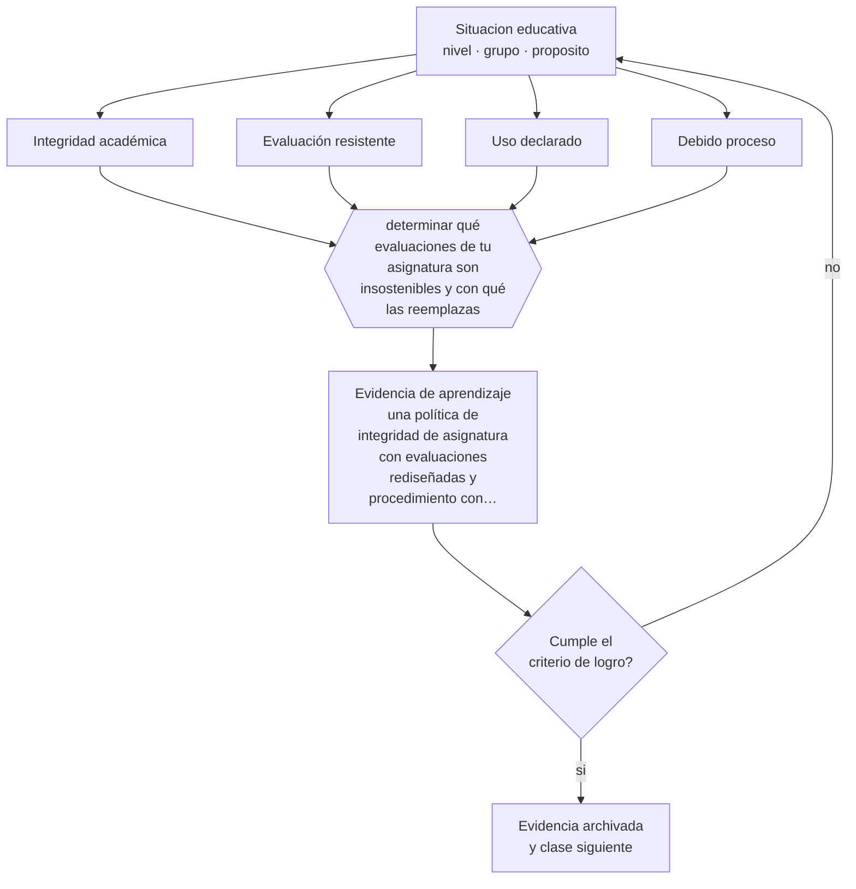

# Clase 177 — Integridad académica

> **Parte 14 · Docencia universitaria** — clase 9 de 12

**Estado de evidencia:** `EN-DEBATE` · **Etapa:** 🟠 Etapa D — Educación superior y liderazgo · **Población de referencia:** pregrado y postgrado universitario y técnico superior 
**Decisión que habilita:** determinar qué evaluaciones de tu asignatura son insostenibles y con qué las reemplazas 
**Evidencia de aprendizaje:** una política de integridad de asignatura con evaluaciones rediseñadas y procedimiento con debido proceso

## 🎯 Propósito

Diseñar políticas de integridad académica universitaria que combinen reglas claras, evaluación resistente, formación en criterio y debido proceso.

## 📚 Resultados de aprendizaje

Al finalizar esta clase podrás:

1. **Definir** con precisión los cuatro conceptos centrales de la clase y reconocerlos en una situación educativa real, no solo en su enunciado.
2. **Explicar** cómo sostener la integridad en un contexto donde la producción de texto dejó de ser evidencia de aprendizaje.
3. **Decidir** —qué evaluaciones de tu asignatura son insostenibles y con qué las reemplazas— y sostener la decisión con un fundamento escrito.
4. **Producir** la evidencia de la clase —una política de integridad de asignatura con evaluaciones rediseñadas y procedimiento con debido proceso— y contrastarla contra el criterio de logro.
5. **Distinguir** lo que la evidencia sostiene de lo que es práctica instalada, preferencia personal o costumbre de la institución.

## 🧩 Conceptos centrales

| Concepto | Comprensión verificable |
|---|---|
| **Integridad académica** | conjunto de normas sobre autoría, honestidad y atribución en el trabajo académico |
| **Evaluación resistente** | tarea que no puede resolverse sin el aprendizaje que declara evaluar |
| **Uso declarado** | exigencia de explicitar qué herramientas se usaron y cómo |
| **Debido proceso** | garantías de evidencia, defensa y proporcionalidad ante una acusación |

## 🗺️ Flujo de razonamiento

## 📖 Desarrollo

### 1. El fondo del asunto

En educación superior la integridad se sostenía en gran parte sobre la verificación de autoría del texto, y esa base se debilitó. Las respuestas viables combinan tres líneas: evaluaciones donde el producto exige aprendizaje verificable —defensa oral, trabajo sobre datos propios, producción supervisada—, políticas explícitas de uso declarado, y formación en las razones de la integridad, no solo en sus sanciones.

### 2. Cómo se traduce en decisiones de enseñanza

La política de asignatura debe declarar qué está permitido, qué debe declararse y qué está prohibido, con ejemplos. Y el procedimiento ante sospecha debe respetar debido proceso: los detectores automáticos no constituyen evidencia suficiente y su uso como prueba ha producido acusaciones injustas con consecuencias graves.

### 3. Qué sostiene la evidencia y qué no

El campo está en transición y no hay consenso sobre qué usos son legítimos. Además, la investigación disponible sobre deshonestidad académica muestra que las causas principales son estructurales —presión, carga, percepción de injusticia— y no solo morales, de modo que reducir la presión suele rendir más que aumentar la vigilancia.

> **Cómo leer el estado de evidencia `EN-DEBATE`.** Hay desacuerdo activo y publicado entre especialistas competentes. La clase presenta las posiciones y sus argumentos; tu tarea no es escoger un bando, sino saber qué evidencia te haría cambiar de posición.

## 🧪 Taller guiado

Aplica la clase a **uno** de los contextos siguientes y repite después el ejercicio en un
contexto de exigencia distinta. Cambiar de contexto es parte del aprendizaje: lo que funciona
con un grupo no se traslada intacto a otro.

| Contexto | Rasgo que cambia la decisión |
|---|---|
| Curso masivo de primer año | heterogeneidad alta y riesgo de deserción temprana |
| Asignatura de especialidad con pocos estudiantes | el seminario es el formato natural |
| Laboratorio o clínica | el desempeño supervisado es la evidencia |
| Postgrado profesional | estudiantes que trabajan y exigen aplicabilidad |
| Asignatura en línea o híbrida | la evaluación debe rediseñarse por completo |
| Dirección de tesis o proyecto de título | la relación de supervisión es el método |

**Secuencia de trabajo:**

1. Delimita el contexto: nivel, edad, tamaño del grupo, asignatura o experiencia y tiempo real disponible.
2. Declara qué saben ya los estudiantes y **cómo lo comprobaste**, no cómo lo supones.
3. Formula la decisión pedagógica que esta clase habilita y escribe su fundamento.
4. Anticipa qué observarías si la decisión funciona y qué observarías si no funciona.
5. Diseña de antemano la alternativa que aplicarás si la primera estrategia falla.
6. Ejecuta o simula, y registra lo observado con fecha, contexto y evidencia concreta.
7. Produce la evidencia de aprendizaje de la clase.
8. Contrástala contra el criterio de logro, corrige y recién entonces avanza.

### 📦 Evidencia de aprendizaje

Una política de integridad de asignatura con evaluaciones rediseñadas y procedimiento con debido proceso.

Debe incluir contexto, decisión, fundamento, fuentes consultadas con su fecha, indicador de
logro observable, riesgos previstos y qué harías distinto en la siguiente iteración.

## 🏆 Reto verificable

Rediseña tu evaluación más vulnerable y publica la política antes del semestre. Registra los casos y evalúa si el rediseño redujo el problema.

## ✅ Criterio de logro

- [ ] la política declara usos permitidos, condicionados y prohibidos con ejemplos;
- [ ] el procedimiento respeta debido proceso y proporcionalidad;
- [ ] cada afirmación sobre «lo que funciona» está atribuida a una fuente identificable, con autor y fecha;
- [ ] la decisión es ejecutable con el tiempo, el espacio, el número de estudiantes y los recursos que realmente tienes;
- [ ] la evidencia queda archivada de forma reproducible: otra persona podría revisarla sin que tú se la expliques.

## ⚠️ Errores frecuentes

**Propios de esta clase:**

- Usar detectores automáticos como evidencia de una acusación.
- Aumentar la vigilancia sin revisar las condiciones de presión y carga que empujan a la deshonestidad.

**Característicos de la parte 14:**

- Suponer que el dominio disciplinar se traduce solo en buena enseñanza.
- Diseñar la carga del estudiante sin calcular el tiempo real que exige.

## ♿ Diversidad, accesibilidad y ética

Las acusaciones basadas en detectores afectan de forma desproporcionada a estudiantes que escriben en segunda lengua. Y las políticas punitivas sin apoyo golpean más fuerte a quienes tienen menos margen para perder un semestre.

Antes de aplicar cualquier decisión de esta clase con estudiantes reales, revisa el
[protocolo de práctica responsable](../../../docs/ETICA_Y_PRACTICA_RESPONSABLE.md):
consentimiento, resguardo de datos personales, proporcionalidad de la intervención y derecho
de cada estudiante a no ser objeto de un ensayo que no le reporta beneficio.

## ❓ Preguntas de comprobación

1. ¿Qué evaluación tuya podría aprobarse sin haber aprendido nada?
2. ¿Qué condición de tu curso empuja a tus estudiantes a la deshonestidad?
3. ¿Qué evidencia sostendría una acusación en tu institución?

## 📕 Lecturas base

**Bretag, T. (ed.). *Handbook of Academic Integrity*.**  
*Qué aporta a esta clase:* tratamiento sistemático del campo, sus causas y sus políticas.

**UNESCO (2023). *Guidance for Generative AI in Education and Research*.**  
*Qué aporta a esta clase:* orientaciones institucionales para políticas de uso y evaluación.

Catálogo completo: [bibliografía del programa](../../../docs/BIBLIOGRAFIA.md) ·
[glosario](../../../docs/GLOSARIO.md) ·
[fuentes oficiales y cómo leerlas](../../../docs/FUENTES.md).

## 🔗 Conexión con el resto del programa

Profundiza la clase 152 en el contexto universitario y se apoya en las clases 136 y 164.

> [!IMPORTANT]
> Material de formación profesional. No reemplaza un título de pedagogía, una habilitación
> legal para ejercer, ni el juicio de un equipo educativo que conoce a sus estudiantes.

---

| Anterior | Índice | Siguiente |
|---|---|---|
| [← 176 · Evaluación universitaria](../class-08-evaluacion-universitaria/README.md) | [Parte 14](../README.md) · [Programa](../../../README.md) | [178 · Proyectos de título →](../class-10-proyectos-de-titulo/README.md) |
