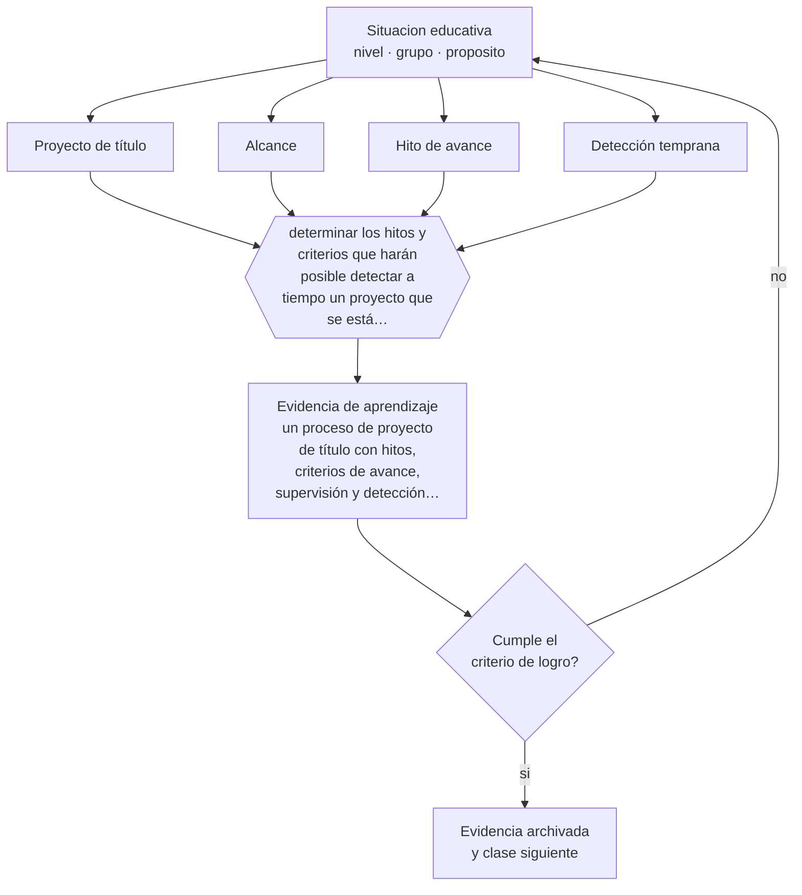

# Clase 178 — Proyectos de título

> **Parte 14 · Docencia universitaria** — clase 10 de 12

**Estado de evidencia:** `PRACTICA-PROFESIONAL` · **Etapa:** 🟠 Etapa D — Educación superior y liderazgo · **Población de referencia:** pregrado y postgrado universitario y técnico superior 
**Decisión que habilita:** determinar los hitos y criterios que harán posible detectar a tiempo un proyecto que se está atrasando 
**Evidencia de aprendizaje:** un proceso de proyecto de título con hitos, criterios de avance, supervisión y detección temprana de riesgo

## 🎯 Propósito

Diseñar procesos de proyecto de título con hitos, criterios explícitos, supervisión regular y alcance realista, para reducir el atraso y el abandono en la etapa final.

## 📚 Resultados de aprendizaje

Al finalizar esta clase podrás:

1. **Definir** con precisión los cuatro conceptos centrales de la clase y reconocerlos en una situación educativa real, no solo en su enunciado.
2. **Explicar** por qué tantos proyectos de título se atrasan y qué del diseño lo explica.
3. **Decidir** —los hitos y criterios que harán posible detectar a tiempo un proyecto que se está atrasando— y sostener la decisión con un fundamento escrito.
4. **Producir** la evidencia de la clase —un proceso de proyecto de título con hitos, criterios de avance, supervisión y detección temprana de riesgo— y contrastarla contra el criterio de logro.
5. **Distinguir** lo que la evidencia sostiene de lo que es práctica instalada, preferencia personal o costumbre de la institución.

## 🧩 Conceptos centrales

| Concepto | Comprensión verificable |
|---|---|
| **Proyecto de título** | trabajo final que integra y demuestra los desempeños del perfil de egreso |
| **Alcance** | extensión y ambición del proyecto; su mala definición es la causa principal de atraso |
| **Hito de avance** | punto de control con entrega y retroalimentación en fecha definida |
| **Detección temprana** | identificación del atraso cuando todavía es corregible |

## 🗺️ Flujo de razonamiento

## 📖 Desarrollo

### 1. El fondo del asunto

El atraso en la etapa de titulación tiene causas conocidas y en gran medida evitables: alcance sobredimensionado, ausencia de hitos intermedios, supervisión irregular y criterios de aprobación implícitos. Los tres primeros dependen del diseño del proceso y no del estudiante; el cuarto produce reescrituras interminables porque el estándar se descubre solo al final.

### 2. Cómo se traduce en decisiones de enseñanza

Un proceso bien diseñado acota el alcance por escrito al inicio, fija hitos con entregas y fechas, exige regularidad en la supervisión y publica los criterios de aprobación desde el primer día. Y define una señal de alerta: dos hitos incumplidos activan una conversación formal, no un silencio de tres meses.

### 3. Qué sostiene la evidencia y qué no

El diseño reduce el atraso evitable y no elimina las causas externas: trabajo, salud, situación económica. Además, la calidad de la supervisión varía mucho entre docentes, y ese es un problema de gestión institucional más que de proceso.

> **Cómo leer el estado de evidencia `PRACTICA-PROFESIONAL`.** Es conocimiento práctico acumulado del oficio, útil y transferible, pero no probado con diseños de investigación. Trátalo como un buen punto de partida sujeto a comprobación en tu contexto.

## 🧪 Taller guiado

Aplica la clase a **uno** de los contextos siguientes y repite después el ejercicio en un
contexto de exigencia distinta. Cambiar de contexto es parte del aprendizaje: lo que funciona
con un grupo no se traslada intacto a otro.

| Contexto | Rasgo que cambia la decisión |
|---|---|
| Curso masivo de primer año | heterogeneidad alta y riesgo de deserción temprana |
| Asignatura de especialidad con pocos estudiantes | el seminario es el formato natural |
| Laboratorio o clínica | el desempeño supervisado es la evidencia |
| Postgrado profesional | estudiantes que trabajan y exigen aplicabilidad |
| Asignatura en línea o híbrida | la evaluación debe rediseñarse por completo |
| Dirección de tesis o proyecto de título | la relación de supervisión es el método |

**Secuencia de trabajo:**

1. Delimita el contexto: nivel, edad, tamaño del grupo, asignatura o experiencia y tiempo real disponible.
2. Declara qué saben ya los estudiantes y **cómo lo comprobaste**, no cómo lo supones.
3. Formula la decisión pedagógica que esta clase habilita y escribe su fundamento.
4. Anticipa qué observarías si la decisión funciona y qué observarías si no funciona.
5. Diseña de antemano la alternativa que aplicarás si la primera estrategia falla.
6. Ejecuta o simula, y registra lo observado con fecha, contexto y evidencia concreta.
7. Produce la evidencia de aprendizaje de la clase.
8. Contrástala contra el criterio de logro, corrige y recién entonces avanza.

### 📦 Evidencia de aprendizaje

Un proceso de proyecto de título con hitos, criterios de avance, supervisión y detección temprana de riesgo.

Debe incluir contexto, decisión, fundamento, fuentes consultadas con su fecha, indicador de
logro observable, riesgos previstos y qué harías distinto en la siguiente iteración.

## 🏆 Reto verificable

Rediseña el proceso con hitos y criterios públicos. Aplícalo a una cohorte y compara las tasas de atraso con la anterior.

## ✅ Criterio de logro

- [ ] el alcance está acotado por escrito y es realista en el tiempo disponible;
- [ ] existen hitos con fecha y una señal de alerta definida ante el incumplimiento;
- [ ] cada afirmación sobre «lo que funciona» está atribuida a una fuente identificable, con autor y fecha;
- [ ] la decisión es ejecutable con el tiempo, el espacio, el número de estudiantes y los recursos que realmente tienes;
- [ ] la evidencia queda archivada de forma reproducible: otra persona podría revisarla sin que tú se la expliques.

## ⚠️ Errores frecuentes

**Propios de esta clase:**

- Aceptar alcances sobredimensionados por entusiasmo del estudiante o del supervisor.
- Mantener implícitos los criterios de aprobación hasta la entrega final.

**Característicos de la parte 14:**

- Suponer que el dominio disciplinar se traduce solo en buena enseñanza.
- Diseñar la carga del estudiante sin calcular el tiempo real que exige.

## ♿ Diversidad, accesibilidad y ética

Los estudiantes que trabajan o son primera generación suelen tener menos claridad sobre el estándar esperado y menos redes para resolver problemas. Criterios públicos y supervisión regular reducen esa desventaja de información.

Antes de aplicar cualquier decisión de esta clase con estudiantes reales, revisa el
[protocolo de práctica responsable](../../../docs/ETICA_Y_PRACTICA_RESPONSABLE.md):
consentimiento, resguardo de datos personales, proporcionalidad de la intervención y derecho
de cada estudiante a no ser objeto de un ensayo que no le reporta beneficio.

## ❓ Preguntas de comprobación

1. ¿Cuántos de tus estudiantes se atrasan y en qué etapa exactamente?
2. ¿Cuándo detectas que un proyecto se está cayendo?
3. ¿Conoce el estudiante los criterios con que será evaluado desde el inicio?

## 📕 Lecturas base

**Delamont, S., Atkinson, P. & Parry, O. (2004). *Supervising the Doctorate*.**  
*Qué aporta a esta clase:* principios de supervisión aplicables también a proyectos de pregrado y magíster.

**Comisión Nacional de Acreditación (Chile). *Criterios sobre procesos de titulación*.**  
*Qué aporta a esta clase:* requisitos institucionales sobre la etapa final de los programas.

Catálogo completo: [bibliografía del programa](../../../docs/BIBLIOGRAFIA.md) ·
[glosario](../../../docs/GLOSARIO.md) ·
[fuentes oficiales y cómo leerlas](../../../docs/FUENTES.md).

## 🔗 Conexión con el resto del programa

Prepara la clase 179 y se conecta con las partes 16 y 17.

> [!IMPORTANT]
> Material de formación profesional. No reemplaza un título de pedagogía, una habilitación
> legal para ejercer, ni el juicio de un equipo educativo que conoce a sus estudiantes.

---

| Anterior | Índice | Siguiente |
|---|---|---|
| [← 177 · Integridad académica](../class-09-integridad-academica/README.md) | [Parte 14](../README.md) · [Programa](../../../README.md) | [179 · Supervisión inicial de investigación →](../class-11-supervision-inicial-de-investigacion/README.md) |
