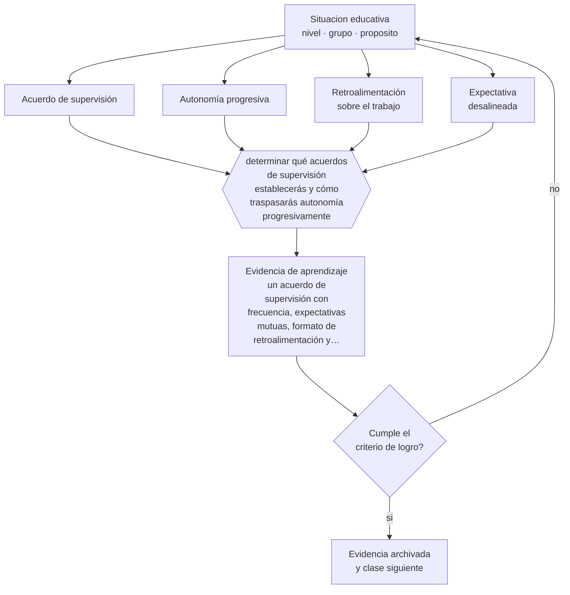

# Clase 179 — Supervisión inicial de investigación

> **Parte 14 · Docencia universitaria** — clase 11 de 12

**Estado de evidencia:** `PRACTICA-PROFESIONAL` · **Etapa:** 🟠 Etapa D — Educación superior y liderazgo · **Población de referencia:** pregrado y postgrado universitario y técnico superior 
**Decisión que habilita:** determinar qué acuerdos de supervisión establecerás y cómo traspasarás autonomía progresivamente 
**Evidencia de aprendizaje:** un acuerdo de supervisión con frecuencia, expectativas mutuas, formato de retroalimentación y criterios de avance

## 🎯 Propósito

Ejercer supervisión inicial de investigación con estructura: acuerdos explícitos, regularidad, retroalimentación sobre el trabajo y traspaso progresivo de la autonomía.

## 📚 Resultados de aprendizaje

Al finalizar esta clase podrás:

1. **Definir** con precisión los cuatro conceptos centrales de la clase y reconocerlos en una situación educativa real, no solo en su enunciado.
2. **Explicar** cómo se dirige a alguien que está aprendiendo a investigar sin hacerle la investigación.
3. **Decidir** —qué acuerdos de supervisión establecerás y cómo traspasarás autonomía progresivamente— y sostener la decisión con un fundamento escrito.
4. **Producir** la evidencia de la clase —un acuerdo de supervisión con frecuencia, expectativas mutuas, formato de retroalimentación y criterios de avance— y contrastarla contra el criterio de logro.
5. **Distinguir** lo que la evidencia sostiene de lo que es práctica instalada, preferencia personal o costumbre de la institución.

## 🧩 Conceptos centrales

| Concepto | Comprensión verificable |
|---|---|
| **Acuerdo de supervisión** | documento breve con expectativas, frecuencia y responsabilidades de ambas partes |
| **Autonomía progresiva** | traspaso gradual de decisiones al estudiante conforme avanza su competencia |
| **Retroalimentación sobre el trabajo** | comentario centrado en el texto o el diseño, no en la persona |
| **Expectativa desalineada** | desencuentro entre lo que el supervisor asume y lo que el estudiante espera |

## 🗺️ Flujo de razonamiento

## 📖 Desarrollo

### 1. El fondo del asunto

La mayor parte de los conflictos de supervisión proviene de expectativas no declaradas: cuánto se reúnen, quién propone, cuánto demora la retroalimentación, qué nivel de autonomía se espera. Un acuerdo breve al inicio previene la mayoría de esos conflictos y hace posible corregir a tiempo cuando la relación no funciona.

### 2. Cómo se traduce en decisiones de enseñanza

El acuerdo declara frecuencia de reuniones, qué lleva el estudiante a cada una, en qué plazo responde el supervisor, y cómo se evaluará el avance. La autonomía se traspasa por etapas explícitas: al inicio el supervisor propone la estructura, después la revisa, más tarde solo comenta el resultado. Nombrar la etapa evita la frustración de ambos lados.

### 3. Qué sostiene la evidencia y qué no

No hay evidencia experimental sobre modelos de supervisión: es conocimiento profesional acumulado, con fuerte variación disciplinar y cultural. Lo que sí está documentado es que la calidad de la supervisión es uno de los predictores más importantes de la finalización y de la experiencia del estudiante.

> **Cómo leer el estado de evidencia `PRACTICA-PROFESIONAL`.** Es conocimiento práctico acumulado del oficio, útil y transferible, pero no probado con diseños de investigación. Trátalo como un buen punto de partida sujeto a comprobación en tu contexto.

## 🧪 Taller guiado

Aplica la clase a **uno** de los contextos siguientes y repite después el ejercicio en un
contexto de exigencia distinta. Cambiar de contexto es parte del aprendizaje: lo que funciona
con un grupo no se traslada intacto a otro.

| Contexto | Rasgo que cambia la decisión |
|---|---|
| Curso masivo de primer año | heterogeneidad alta y riesgo de deserción temprana |
| Asignatura de especialidad con pocos estudiantes | el seminario es el formato natural |
| Laboratorio o clínica | el desempeño supervisado es la evidencia |
| Postgrado profesional | estudiantes que trabajan y exigen aplicabilidad |
| Asignatura en línea o híbrida | la evaluación debe rediseñarse por completo |
| Dirección de tesis o proyecto de título | la relación de supervisión es el método |

**Secuencia de trabajo:**

1. Delimita el contexto: nivel, edad, tamaño del grupo, asignatura o experiencia y tiempo real disponible.
2. Declara qué saben ya los estudiantes y **cómo lo comprobaste**, no cómo lo supones.
3. Formula la decisión pedagógica que esta clase habilita y escribe su fundamento.
4. Anticipa qué observarías si la decisión funciona y qué observarías si no funciona.
5. Diseña de antemano la alternativa que aplicarás si la primera estrategia falla.
6. Ejecuta o simula, y registra lo observado con fecha, contexto y evidencia concreta.
7. Produce la evidencia de aprendizaje de la clase.
8. Contrástala contra el criterio de logro, corrige y recién entonces avanza.

### 📦 Evidencia de aprendizaje

Un acuerdo de supervisión con frecuencia, expectativas mutuas, formato de retroalimentación y criterios de avance.

Debe incluir contexto, decisión, fundamento, fuentes consultadas con su fecha, indicador de
logro observable, riesgos previstos y qué harías distinto en la siguiente iteración.

## 🏆 Reto verificable

Establece un acuerdo escrito con un estudiante que supervisas y revísalo a los dos meses. Documenta qué expectativa estaba desalineada.

## ✅ Criterio de logro

- [ ] el acuerdo declara frecuencia, plazos de respuesta y expectativas de ambas partes;
- [ ] define etapas explícitas de traspaso de autonomía;
- [ ] cada afirmación sobre «lo que funciona» está atribuida a una fuente identificable, con autor y fecha;
- [ ] la decisión es ejecutable con el tiempo, el espacio, el número de estudiantes y los recursos que realmente tienes;
- [ ] la evidencia queda archivada de forma reproducible: otra persona podría revisarla sin que tú se la expliques.

## ⚠️ Errores frecuentes

**Propios de esta clase:**

- Iniciar la supervisión sin acuerdo sobre frecuencia, plazos y expectativas mutuas.
- Reescribir el trabajo del estudiante en vez de retroalimentarlo para que lo corrija.

**Característicos de la parte 14:**

- Suponer que el dominio disciplinar se traduce solo en buena enseñanza.
- Diseñar la carga del estudiante sin calcular el tiempo real que exige.

## ♿ Diversidad, accesibilidad y ética

Los estudiantes sin capital académico familiar desconocen las reglas implícitas de la relación de supervisión. Hacerlas explícitas en un acuerdo escrito es una medida concreta de equidad en el acceso al posgrado.

Antes de aplicar cualquier decisión de esta clase con estudiantes reales, revisa el
[protocolo de práctica responsable](../../../docs/ETICA_Y_PRACTICA_RESPONSABLE.md):
consentimiento, resguardo de datos personales, proporcionalidad de la intervención y derecho
de cada estudiante a no ser objeto de un ensayo que no le reporta beneficio.

## ❓ Preguntas de comprobación

1. ¿Cada cuánto se reúnen realmente y quién propone la agenda?
2. ¿Cuánto demoras en devolver un texto y lo dijiste al inicio?
3. ¿En qué etapa de autonomía está tu estudiante y lo sabe?

## 📕 Lecturas base

**Delamont, S., Atkinson, P. & Parry, O. (2004). *Supervising the Doctorate*.**  
*Qué aporta a esta clase:* modelo de supervisión con acuerdos y etapas de autonomía.

**Lee, A. (2008). *How Are Doctoral Students Supervised?* Studies in Higher Education, 33(3).**  
*Qué aporta a esta clase:* tipifica estilos de supervisión y sus consecuencias.

Catálogo completo: [bibliografía del programa](../../../docs/BIBLIOGRAFIA.md) ·
[glosario](../../../docs/GLOSARIO.md) ·
[fuentes oficiales y cómo leerlas](../../../docs/FUENTES.md).

## 🔗 Conexión con el resto del programa

Prepara la parte 17 y se apoya en la clase 093 sobre acompañamiento estructurado.

> [!IMPORTANT]
> Material de formación profesional. No reemplaza un título de pedagogía, una habilitación
> legal para ejercer, ni el juicio de un equipo educativo que conoce a sus estudiantes.

---

| Anterior | Índice | Siguiente |
|---|---|---|
| [← 178 · Proyectos de título](../class-10-proyectos-de-titulo/README.md) | [Parte 14](../README.md) · [Programa](../../../README.md) | [180 · Proyecto integrador: asignatura universitaria →](../class-12-proyecto-integrador-asignatura-universitaria/README.md) |
